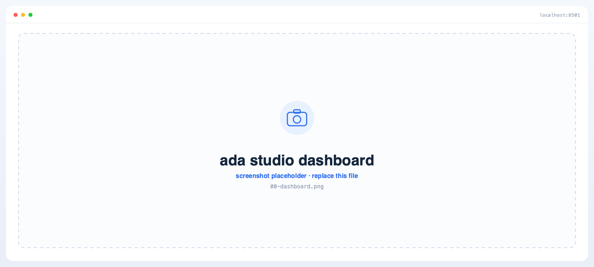
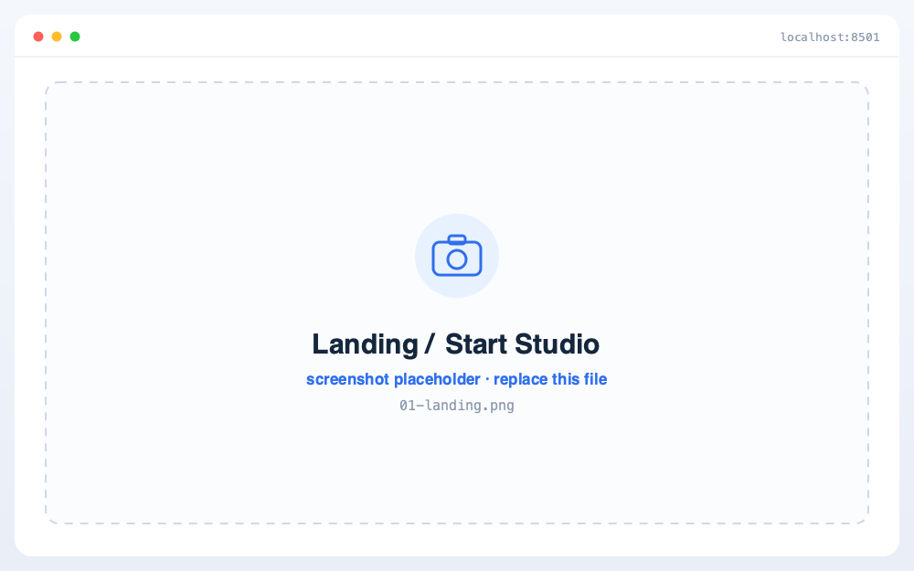
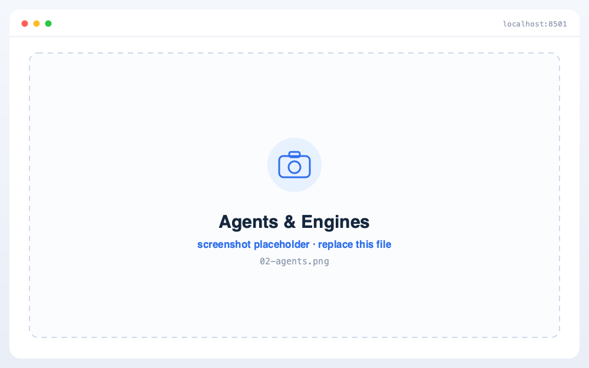
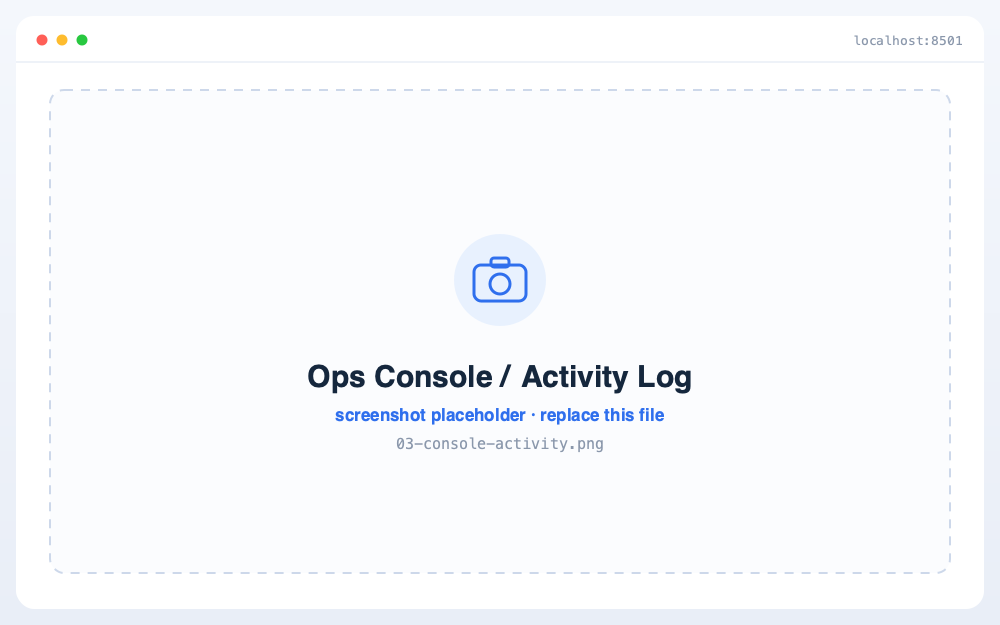
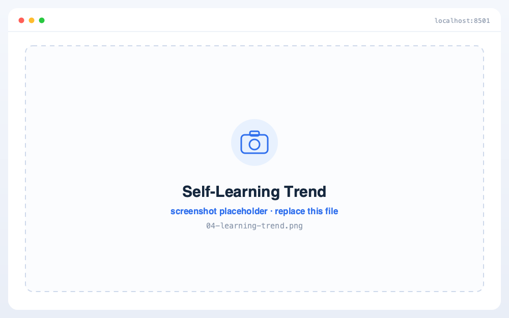
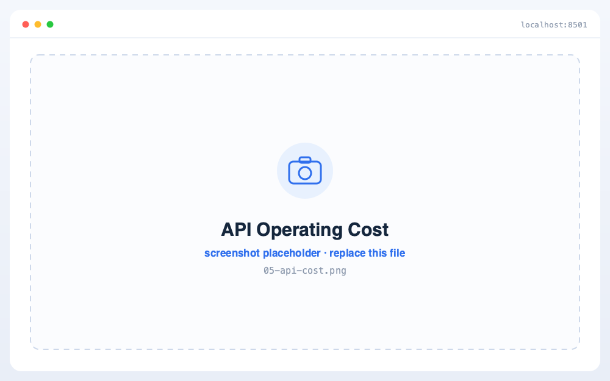
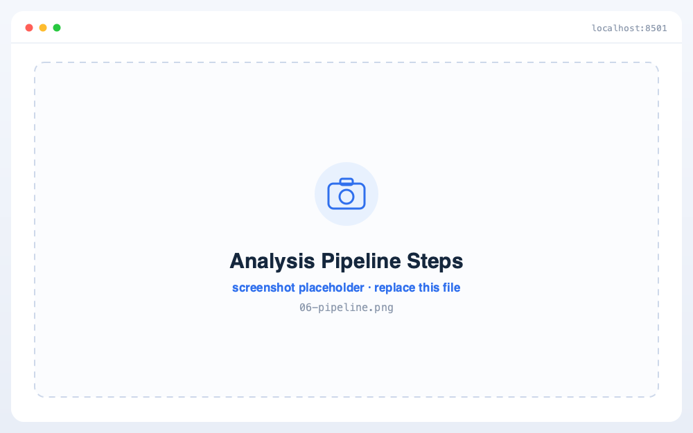

# ADA — Adaptive AutoAI Pipeline Agent v2

> **Conversational AutoAI Studio** — 사용자가 정형 데이터를 던지면, **몇 번의 가벼운 선택만으로** 의도에 맞게 자동 분석·튜닝·해석을 수행하고, **원하는 형태(5종)** 로 산출물을 뽑아주는 대화형 AutoAI 스튜디오.
> 시간이 지날수록 똑똑해지고, 스스로 오류를 고치며, 외부 위협으로부터 안전하다.
>
> **스코프**: 정형 ML / 정형 DL / 시계열 / 이상탐지 4개 카테고리 (이미지·NLP 제외)
> **버전**: v2.6.0 · Python 3.10 (`>=3.10,<3.11`)

<p align="center">
  <a href="http://localhost:8501"></a>
</p>
<p align="center"><sub>⚠️ 본인 컴퓨터에서 서버를 먼저 실행한 뒤 클릭 → 각자의 로컬 대시보드가 열립니다 · <a href="#개발-환경-설정">실행 방법 보기</a><br>
프로젝트 폴더에서 <code>cd docker &amp;&amp; docker compose --profile core up -d</code> 실행 후 <code>localhost:8501</code> 접속</sub></p>

<p align="center">
  
</p>

---

## 팀 구성

| 역할 | 담당자 | 영역 |
|---|---|---|
| 시스템·메타·인프라 (HJ) | youandi3535 | core / API / orchestrator / outputs / 보안 / KB / 인프라 / 운영 콘솔 |
| 에이전트 로직 — timeseries (CS) | chang-seon | `agents/handlers/timeseries/` · `pipelines/timeseries/` |
| 에이전트 로직 — anomaly (NY) | NY | `agents/handlers/anomaly/` · `pipelines/anomaly/` |
| 에이전트 로직 — tabular (jh) | jh | `agents/handlers/tabular/` · `pipelines/tabular_ml,tabular_dl/` |

> 영역 경계는 [.github/CODEOWNERS](.github/CODEOWNERS) · [CLAUDE.md](CLAUDE.md) · [docs/PARALLEL_WORK_GUARDS.md](docs/PARALLEL_WORK_GUARDS.md) 로 강제됩니다 (pre-commit 훅 → CODEOWNERS → CI 3중 방어).

---

## 핵심 특징

| # | 특징 | 설명 |
|---|---|---|
| 1 | **28 에이전트** | 슈퍼바이저·입력·게이트·전처리·모델링·평가·산출물·메타·회복 9개 카테고리 ([agents/personas.py](agents/personas.py) 단일 권위, `assert len(PERSONAS) == 28`) |
| 2 | **5 HITL 게이트 + G0_PII** | LangGraph interrupt + PostgresSaver 기반, 24h 무응답 시 기본값 자동 처리 |
| 3 | **3-Stack 자가학습** | PostgreSQL KB + MinIO 아티팩트 + pgvector RAG (768d). 신규 작업이 과거 학습(KB)을 인용해 시작 |
| 4 | **5종 산출물** | PPT / PDF / 발표대본 / 정적 웹 대시보드 / 인사이트 정리 (carrier + architect 파이프라인) |
| 5 | **Guardian v2 자동 오류 처리** | 5-Tier 체계 (Static → ErrorKB → 검증 패치 재사용 → Ollama → Claude CLI), AES-GCM 암호화 원본 보관. **멈춤(hang)·미완료 작업도 watchdog 가 오류로 자동 기록**해 학습 입력 누락 방지 |
| 6 | **팀 집단지성 KB** | 모든 Claude Code·Cowork Q&A 자동 수집 → 벡터 KB → UserPromptSubmit 훅으로 Claude API 비용 절감 |
| 7 | **보안 풀스택** | JWT · Google OAuth 로그인 · RBAC · RLS · PII · 프롬프트 인젝션 방어 · Vault · 감사로그 |
| 8 | **대화형 분석 스튜디오** | ada studio 랜딩 → OAuth 로그인 → 5단계 게이트 진행바 → 산출물. WebSocket 실시간 진행률 |
| 9 | **운영 콘솔 (관리자)** | 실시간 데이터 저장 감시 — 스토리지 신호등 · 30테이블 카테고리 · 적재 트렌드(7일·24h) · **자가치유 활용 현황** · 영구 백업 ([아래](#운영-콘솔--관리자-전용-실시간-데이터-저장-감시)) |

---

## 🖥️ 데모 & 스크린샷

> 📸 로컬 서버(<code>localhost:8501</code>)에서 실제 캡처한 화면입니다.
> <sub>아래는 자리표시(placeholder) 이미지입니다 — <code>docs/screenshots/</code> 의 같은 파일명에 실제 캡처 PNG를 덮어쓰면 README 수정 없이 그대로 반영됩니다.</sub>

<table>
  <tr>
    <th width="50%">랜딩 · 스튜디오 시작</th>
    <th width="50%">에이전트 소개 · 엔진</th>
  </tr>
  <tr>
    <td align="center"></td>
    <td align="center"></td>
  </tr>
  <tr>
    <td align="center">원본 데이터 → “전문가 인사이트” · 분석 시작</td>
    <td align="center">28 에이전트 협력 현황판 (<code>?board=1</code>)</td>
  </tr>
  <tr>
    <th>운영 콘솔 · 실시간 활동 로그</th>
    <th>학습 효과 추이 (자가학습 KB)</th>
  </tr>
  <tr>
    <td align="center"></td>
    <td align="center"></td>
  </tr>
  <tr>
    <td align="center">학습·백업·KB 검색 등 운영 활동을 실시간 노출 (<code>?admin=1</code>)</td>
    <td align="center">자가치유·자기학습 재사용이 시간에 따라 쌓이는 추이</td>
  </tr>
  <tr>
    <th>API 운영 비용</th>
    <th>분석 단계 (5 HITL 게이트 진행)</th>
  </tr>
  <tr>
    <td align="center"></td>
    <td align="center"></td>
  </tr>
  <tr>
    <td align="center">LLM 호출 비용을 운영 콘솔에서 집계·가시화</td>
    <td align="center">G1 의도 → G2 전략 → … → G6 산출물, WebSocket 실시간 진행률</td>
  </tr>
</table>

---

## 사용자 경험 흐름

```
ada studio 랜딩 (정적 히어로 + 분석 예시 카드)
   │  ├─ ✦ 에이전트 소개  → 28 에이전트 협력 현황판 (?board=1)
   │  └─ 운영 콘솔(관리자만) → 데이터 저장 실시간 현황 (?admin=1)
   ▼  분석 시작하기
Google OAuth 로그인 / 회원가입  (처음이면 자동 가입, 비밀번호 없음)
   ▼
분석 스튜디오 (단계 진행바 · 타이핑 애니메이션 · 정지/재진행)
   G1 의도 → G2 전략 → G3 방법론 → G4 모델전략 → G5 모델선택 → G6 산출물
   ▼
산출물 다운로드 (PPT·PDF·대본·HTML·Markdown 중 선택)
```

> 로그인은 **JWT를 브라우저 localStorage 에 보관·복원**해 강력 새로고침(F5/Ctrl+Shift+R)에도 유지됩니다(어떤 화면에서 새로고침해도 세션 복원). 모든 화면(랜딩·에이전트 소개·운영 콘솔·분석 단계) 우측 상단에 **공통 프로필 메뉴**(내 계정·로그아웃)가 떠 있고, 로그아웃은 어디서든 시작화면(로그인 전)으로 전환합니다. 프론트는 라이브 마운트라 `frontend/app.py`·HTML 수정은 새로고침으로 반영되고, 백엔드(`agents`·`orchestrator`·`api`) 변경은 워커/컨테이너 재기동이 필요합니다.

---

## 운영 콘솔 — 관리자 전용 실시간 데이터 저장 감시

관리자(`admin` 역할)만 진입하는 탭으로, **어떤 데이터가 얼마나 어디에 저장되는지** 한눈에 실시간 감시합니다. 백엔드 `GET /admin/storage/overview` 한 번의 호출로 전부 집계하며, 대시보드는 **15초마다 자동 갱신**됩니다.

| 패널 | 내용 |
|---|---|
| **스토리지 연결 신호등** | PostgreSQL · MinIO · Redis · MLflow · 로컬 백업 서버의 연결 상태를 🟢정상 / 🟡경고 / 🔴위험 동그라미로 표시 (용량·객체수·키수·응답시간 포함) |
| **데이터 카테고리 분류** | 30개 DB 테이블을 **8개 카테고리**로 자동 분류 — 📥원본·업로드 / ⚙️분석작업 / 📦산출물·모델 / 🛠️오류 자동수정 / 🧠자기학습 KB / 💬Q&A 수집 / 🔐보안·감사 / 💾백업. 카테고리별 레코드수·용량·24h 신규·저장 위치 |
| **저장 토폴로지** | VPS 원본(`/opt/ada` · `autoai-artifacts`) ⇒ 로컬 백업 서버(`/srv/backup/ada`, 1일 3회) 흐름 |
| **DB 전수 인벤토리** | 30개 테이블을 용량순으로 — 카테고리 배지 · 레코드수 · 용량 · 용량비중 막대 · 24h 신규 |
| **적재 트렌드 (7일 + 24h)** | 분석작업 / 오류 / Q&A / 산출물의 **7일 일별** + **최근 24시간 시간별** 적재량 막대 차트 |
| **자가치유·자기학습 활용 현황** | 저장·학습이 *실제로* 활용·자동수정에 쓰인 수치 — 오류 자동수정(누적·24h) · 자기학습 재사용(누적·24h) + **최근 자동수정 이벤트**(언제·어떤 단계/오류·누가·commit·결과) |
| **백업 운영 현황** | 스케줄(03·12·18시) · Pull 방식 · **영구 저장(로컬 · 자동 삭제 없음)** · 최근 백업 신선도(≤20h🟢 / ≤30h🟡 / 초과🔴) |

> 각 스토리지 점검은 `try/except` + 타임아웃으로 격리돼, 하나가 죽어도 나머지는 정상 표시됩니다.
> 구현: [api/routes/admin.py](api/routes/admin.py) (`/admin/storage/overview`) · [frontend/admin_dashboard.html](frontend/admin_dashboard.html) · 진입 [frontend/app.py](frontend/app.py) `_admin_screen()`.

---

## Guardian v2 — 팀 집단지성 자가학습 시스템

팀원들이 Claude Code / Cowork에서 나누는 모든 Q&A를 자동으로 수집·임베딩하여,
다음 질문부터는 Claude API 호출 없이 팀 KB(또는 로컬 Ollama)에서 먼저 답변합니다.

### 전체 흐름

```
┌─────────────────────────────────────────────────────────┐
│  개발자 PC                                              │
│  VS Code Claude Code                                    │
│   ├─ UserPromptSubmit 훅 → KB 히트 시 exit 2           │
│   │   (Claude API 비용 0, 응답 즉시 반환)               │
│   └─ Stop 훅 → collect_qa.py → Q&A 실시간 전송         │
│      + collect_tool_use.py (PostToolUse, 코드 변경)     │
│  Cowork (Claude Desktop App)                            │
│   └─ 훅 없음 → ingest_history.py 30분 폴링             │
└──────────────────┬──────────────────────────────────────┘
                   │ HTTPS
                   ▼
┌─────────────────────────────────────────────────────────┐
│  VPS (웹 서버, Docker)                                  │
│  FastAPI  --workers 1  (임베딩 일관성 보장)             │
│   /kb/search       → 3-gate KB 검색                    │
│   /kb/conversation → Q&A 수신 + 품질 게이트 저장        │
│  PostgreSQL + pgvector                                  │
│   self_learning_kb · conversation_logs · pending_patches│
└──────────────────┬──────────────────────────────────────┘
                   │ 동기화 (작업 스케줄러, 하루 3회)
                   ▼
┌─────────────────────────────────────────────────────────┐
│  로컬/리눅스 서버                                        │
│  linux_kb_sync.py (크로스팀 풀) · Ollama qwen2.5:7b      │
└─────────────────────────────────────────────────────────┘
```

### 3-Tier Q&A 응답 체계

| Tier | 조건 | 응답 시간 | API 비용 |
|---|---|---|---|
| **1 — 팀 KB** | pgvector 코사인 유사도 ≥ 임계치 + 단어 겹침 게이트 | < 100ms | **0원** |
| **2 — Ollama** | KB 미스 (qwen2.5:7b 로컬) | 2~5s | 0원 |
| **3 — Claude** | Ollama 실패 시 폴백 | 3~10s | 과금 |

> KB 저장 전 품질 게이트(0.0~1.0)로 거절·오답·빈 답변을 차단(점수 < 0.45 저장 거부).

### Guardian v2 5-Tier 자동 오류 수정

| Tier | 방식 | LLM | 속도 |
|---|---|---|---|
| **0 — Static fixers** | 결정론적 패턴 다수 (relative import / NoneType slicing / NameError typo 등) | ❌ | < 100ms |
| **1 — Error KB** | 과거 검증 패치 벡터 검색 (confidence ≥ 0.7) | ❌ | < 200ms |
| **1.5 — 검증 패치 재사용** | `pending_patches` 중 `review_status='approved'` 재활용 | ❌ | < 50ms |
| **2 — Ollama** | qwen2.5-coder:7b 로컬 LLM | ✅ Local | 5~15s |
| **3 — Claude CLI** | 최후 폴백 (사이드카) | ✅ Cloud | 10~30s |

> 주기 작업은 Celery Beat(`orchestrator/runner.py`)가 트리거: 에러 스캔(30초) · KB decay/retract/fixer-promote(각 24시간). 오류 원본은 AES-GCM 암호화(`failure_logs.raw_error_encrypted`)로 보관하고, 평문 컬럼엔 redactor 통과분만 저장합니다.

### KB 관련 스크립트

| 파일 | 역할 |
|---|---|
| [scripts/query_kb_hook.py](scripts/query_kb_hook.py) | UserPromptSubmit 훅 — KB 히트 시 Claude 차단, exit 2 |
| [scripts/collect_qa.py](scripts/collect_qa.py) | Stop 훅 — 매 응답 후 Q&A 실시간 전송 |
| [scripts/collect_tool_use.py](scripts/collect_tool_use.py) | PostToolUse 훅 — 코드 변경(Edit/Write 등) 실시간 전송 |
| [scripts/collect_error_fix.py](scripts/collect_error_fix.py) | Stop 훅 — 에러+수정 diff 수집 |
| [scripts/ingest_history.py](scripts/ingest_history.py) | Claude Code + Cowork 세션 이력 수집 (Cowork 30분 폴링) |
| [scripts/kb_mcp_server.py](scripts/kb_mcp_server.py) | MCP 서버 — Claude 내에서 직접 KB 조회 |
| [scripts/linux_kb_sync.py](scripts/linux_kb_sync.py) | 크로스팀 KB 동기화 (Q&A + failure_lesson) |

> 팀원 셋업: [scripts/dev/setup_team_kb.ps1](scripts/dev/setup_team_kb.ps1) — `.env` 3줄 설정 + `ADA-IngestHistory`(30분) + `ADA-KB-Sync`(하루 3회) 작업 스케줄러 등록.

---

## 분석 카테고리 — 4종

CPU 친화적이고 GTX 1060 3GB VRAM 환경에서도 안정 동작하는 정형 데이터 중심으로 한정.

| 카테고리 | 코드명 | 핸들러 | GPU |
|---|---|---|---|
| **정형 ML** | `tabular_ml` | `agents/handlers/tabular/` (jh) | ❌ CPU |
| **정형 DL** | `tabular_dl` | `agents/handlers/tabular/` (jh) | ⚠️ 소형만 |
| **시계열** | `timeseries` | `agents/handlers/timeseries/` (CS) | ❌ CPU(통계) / ⚠️ 트랜스포머 |
| **이상탐지** | `anomaly` | `agents/handlers/anomaly/` (NY) | ❌ CPU 위주 |

---

## 아키텍처

<p align="center">
  
</p>

### 컨테이너 토폴로지

`docker/docker-compose.yml` 의 프로파일(`core` / `ml` / `sec`)로 기동 범위를 제어합니다.

```
ada-net (bridge)
├── postgres         (pgvector/pgvector:pg16 :5433→5432)
├── redis            (:6379 — broker + cache + pubsub + rate limit)
├── minio            (:9100/:9101 — 버킷 autoai-artifacts)
├── mlflow           (:5000 — 아티팩트 s3://autoai-artifacts/mlflow)
├── api              (FastAPI :8000, --workers 1, alembic upgrade head 부팅 시)
├── frontend         (Streamlit :8501, 라이브 마운트)
├── worker-pipeline  (Celery, pipeline 큐)
├── worker-harness   (Celery, harness 큐 — 자가학습 + 에러 KB)
├── beat             (Celery Beat — 주기 작업 트리거 전용)
└── nginx            (리버스 프록시 :80/:443)

ml 프로파일 추가:
├── worker-training  (Celery, training 큐, GPU 가능)
├── worker-output    (Celery, output 큐)
└── serving          (:8081→8080 — 모델 추론 + 자동 오류 핸들러)

sec 프로파일 추가:
├── vault            (HashiCorp Vault :8200)
└── claude-cli-sidecar (read-only 마운트, --cap-drop ALL)
```

> `api` 컨테이너는 **반드시 `--workers 1`** — sentence-transformers 싱글톤이 단일 프로세스에서만 일관된 임베딩을 생성함. `../api`·`../ada`·`../agents` 등 소스를 라이브 마운트하므로 백엔드 수정은 해당 컨테이너 **재시작**으로 반영(`--reload` 미사용).

### 5 HITL 게이트 + G0_PII 미니게이트

| 게이트 | 시점 | 사용자 입력 | 자동 처리 정책 | 담당 에이전트 |
|---|---|---|---|---|
| **G1** | 데이터 업로드 직후 | 자유 텍스트 (의도) | 즉시 | IntentElicitor |
| **G0_PII** | PII 감지 시 (조건부) | 컬럼별 마스킹/제외/유지 | 24h → 기본=마스킹 | SecurityGuard |
| **G2** | 데이터 프로파일링 후 | 3안 중 1안 선택 | 24h → 1순위 자동 채택 | AnalysisProposer |
| **G3** | EDA 후 | 방법론 1개 선택 (4 카테고리) | 24h → 자동 | MethodologyProposer |
| **G4** | 전처리 + FE 후 | 모델 전략 1개 선택 | 24h → 자동 | ModelStrategyProposer |
| **G5** | Top-3 학습 후 | 비교표에서 최적 모델 선택 | 24h → 자동 | ModelComparisonReporter |
| **G6** | 평가 완료 후 | 산출물 5종 중 다중 선택 (체크박스) | 24h → 기본 [OUT-01, OUT-02] | OutputTypeSelector |

### 28 에이전트 카탈로그

> 출처: [agents/personas.py](agents/personas.py) (`assert len(PERSONAS) == 28`). LLM 컬럼은 설계상 티어이며, 비용 절감 모드에서는 분석용 호출이 로컬 Ollama(qwen2.5:7b)로 대체됩니다.

| # | 카테고리 | 에이전트 | LLM | 역할 |
|---|---|---|---|---|
| 01 | 슈퍼바이저 | SupervisorAgent | Sonnet | 입출항 관제사 |
| 02 | 입력·검증 | IntentElicitorAgent | Sonnet | 비즈니스 분석 인터뷰어 |
| 03 | | DataProfilerAgent | none | 데이터 검수관 |
| 04 | | SchemaValidatorAgent | none | 데이터 품질 감사관 |
| 05 | 의사결정 게이트 | AnalysisProposerAgent | Opus | 데이터 전략 컨설턴트 (G2) |
| 06 | | MethodologyProposerAgent | Sonnet | AutoML 자문가 (G3) |
| 07 | | ModelStrategyProposerAgent | Opus | 모델링 아키텍트 (G4) |
| 08 | | ModelComparisonReporterAgent | none | 모델 평가 리포터 (G5) |
| 09 | | OutputTypeSelectorAgent | Sonnet | 리서치 디자인 큐레이터 (G6) |
| 10 | 전처리·EDA | PreprocessingStrategistAgent | Sonnet | 시니어 데이터 엔지니어 |
| 11 | | FeatureEngineerAgent | none | 피처 빌더 |
| 12 | | EDAAgent | none | EDA 분석가 |
| 13 | | PreprocessingChoiceAgent | Sonnet | 전처리 큐레이터 (미니 게이트) |
| 14 | 모델링·튜닝 | ModelSelectionAgent | Sonnet | AutoML 큐레이터 |
| 15 | | HyperparameterTunerAgent | none | 하이퍼파라미터 튜너 (Optuna warm-start) |
| 16 | | TrainingExecutorAgent | none | ML 트레이닝 엔지니어 |
| 17 | | TrainingMonitorAgent | none | 학습 안전 감독관 |
| 18 | | MetricsAggregatorAgent | none | 메트릭 심판관 |
| 19 | | FineTuneExecutorAgent | none | 미세조정 전문가 (정형 트랜스포머) |
| 20 | 평가·해석 | EvalAgent | Opus | 모델 QA 평가관 |
| 21 | | ExplainabilityAgent | none | 해석성 분석가 (SHAP·Attention) |
| 22 | | InsightAgent | Opus | 분석 스토리텔러 (한국어·수치 인용 강제) |
| 23 | 산출물 | ReportArchitectAgent | Sonnet | 보고서 설계자 (Skeleton 동적 목차) |
| 24 | | ReportComposerAgent | none | 산출물 PM (병렬 fan-out, 5종) |
| 25 | 메타 | SelfLearningAgent | none | 지식 큐레이터 (3-Stack KB) |
| 26 | | AutoErrorHandlerAgent | CLI | 자동 오류 정비공 (5-Tier) |
| 27 | | SecurityGuardAgent | none | 보안 가드 (PII + 프롬프트 인젝션) |
| 28 | 회복 | ErrorRecoveryAgent | Opus | 회복 코디네이터 (최후 폴백) |

> 게이트 5종은 [agents/gates/](agents/gates/), 카테고리 핸들러는 [agents/handlers/](agents/handlers/) 에 위치. 모든 에이전트는 `BaseAgent`(페르소나 자동 주입, `_call_llm` 단일 진입점)를 상속합니다. 실행 기록은 `agent_runs`·`models`·`outputs` 테이블에 감사 저장됩니다.

### 5종 산출물 패밀리

| 코드 | 산출물 | 형식 | carrier | 비고 |
|---|---|---|---|---|
| **OUT-01** | PPT 발표자료 (기본) | .pptx | [outputs/carriers/pptx_carrier.py](outputs/carriers/pptx_carrier.py) | python-pptx |
| **OUT-02** | PDF 리포트 (기본) | .pdf | [outputs/carriers/pdf_carrier.py](outputs/carriers/pdf_carrier.py) | WeasyPrint + Jinja2 |
| **OUT-03** | 발표 대본 | .txt | [outputs/carriers/script_carrier.py](outputs/carriers/script_carrier.py) | 슬라이드별 발표 노트 |
| **OUT-04** | 정적 웹 대시보드 (단일 HTML) | .html | [outputs/carriers/html_carrier.py](outputs/carriers/html_carrier.py) | Chart.js + 인라인 자산 |
| **OUT-07** | 인사이트 정리 (Markdown) | .md | [outputs/carriers/md_carrier.py](outputs/carriers/md_carrier.py) | SHAP top10 · 차트 · 한계점 |

> `ReportArchitectAgent`가 카테고리·청중·의도에 맞는 Skeleton(`outputs/architect/skeletons/`)으로 동적 목차를 설계하고, `ReportComposerAgent`가 `ThreadPoolExecutor`로 병렬 fan-out 생성합니다. 산출물 파이프라인은 architect(설계) → content(본문) → visuals(차트/표) → qa(수치 일관성 검증) 단계로 구성됩니다. 재진행 시 기존 `Output` 행을 삭제해 산출물 교체를 보장합니다.

---

## 모델 카탈로그

> 출처: `pipelines/{카테고리}/` 실제 등록 모델. baseline 포함.

### 정형 ML — `pipelines/tabular_ml/`
- 부스팅/트리: RandomForest · XGBoost · LightGBM · CatBoost
- 선형 baseline: LogisticRegression(분류) · Ridge(회귀)

### 정형 DL — `pipelines/tabular_dl/`
- TabTransformer · FT-Transformer · TabPFN
- baseline: MLP

### 시계열 — `pipelines/timeseries/`
- 통계: ARIMA · SARIMA · ETS · Prophet
- 신경망: TCN · N-BEATS · LSTM · GRU
- 트랜스포머: TFT (Temporal Fusion Transformer)
- 모델 자동 선택/검증: `models_auto.py` · `pipeline.py`

### 이상탐지 — `pipelines/anomaly/`
- 통계/거리: IsolationForest · LOF · OneClassSVM · COPOD · ECOD · HBOS
- 딥러닝: AutoEncoder · TranAD · AnomalyTransformer

---

## 데이터 저장·백업 인프라

### 저장소 (VPS 원본)

| 저장소 | 용도 | 위치 |
|---|---|---|
| **PostgreSQL 16 + pgvector** | 30개 테이블 (원본 메타·작업·KB·오류·감사·임베딩 768d) | `ada-postgres` (127.0.0.1:5433) |
| **MinIO** | 업로드 원본·산출물·모델 아티팩트 | 버킷 `autoai-artifacts` |
| **MLflow** | 실험·모델 추적 (아티팩트는 MinIO) | `s3://autoai-artifacts/mlflow` |
| **Redis** | 브로커·캐시·진행률 pubsub·rate limit | `ada-redis` |
| **데이터셋 디렉터리** | VPS 원본 데이터 | `/opt/ada/data` |

### 백업 (Pull 방식, 1일 3회)

```
[학원 Linux 서버] --SSH--> [VPS ada-postgres] --pg_dump|gzip--> [로컬 /srv/backup/ada/postgres]
```

- **스케줄**: `cron 0 3,12,18` (03·12·18시, 1일 3회) · **보존**: 영구 저장(로컬 백업 · 자동 삭제 없음, 필요시 수동 삭제)
- **방식**: 로컬 백업 서버가 VPS에서 끌어오는 Pull (VPS엔 push 백업 없음)
- **경로**: `/srv/backup/ada/{postgres,datasets}` ← VPS `/opt/ada/data`
- 백업 성공 시 `backup_postgres.sh`가 VPS DB의 `backup_catalog` 에 기록 → **운영 콘솔 백업 카드가 🟢 정상**으로 표시
- 스크립트: [scripts/backup_postgres.sh](scripts/backup_postgres.sh) · 설정 예시 [scripts/backup.conf.example](scripts/backup.conf.example) · 문서 [docs/server/backup.md](docs/server/backup.md)

---

## 기술 스택

| 레이어 | 기술 |
|---|---|
| 언어 | **Python 3.10** (`>=3.10,<3.11`) |
| 컨테이너 | Docker / Docker Compose (profile: core / ml / sec) |
| 오케스트레이션 | LangGraph (interrupt 기반 그래프) + Celery (큐 4종: pipeline/harness/training/output) + Celery Beat |
| API | FastAPI (라우터 11종), uvicorn **--workers 1** |
| 프론트엔드 | Streamlit (랜딩·OAuth·분석 스튜디오·운영 콘솔) |
| DB | PostgreSQL 16 + pgvector (IVFFlat, 768d), 30 테이블 |
| 캐시/브로커 | Redis 7 |
| 아티팩트 스토어 | MinIO (버킷 autoai-artifacts) |
| 실험 추적 | MLflow |
| 시크릿 관리 | HashiCorp Vault (KV v2) |
| 리버스 프록시 | nginx (TLS) |
| 인증 | JWT + Google OAuth 로그인/회원가입 · RBAC · RLS |
| LLM (Cloud) | Claude (Opus / Sonnet) · Claude CLI 사이드카 |
| LLM (Local) | Ollama — qwen2.5:7b (분석 1~3단계·Q&A 폴백) · qwen2.5-coder:7b (에러 수정) |
| 임베딩 | sentence-transformers/**paraphrase-multilingual-mpnet-base-v2** (768d, 한국어 포함 다국어) |
| 팀 KB | pgvector + UserPromptSubmit/Stop/PostToolUse 훅 + Cowork 폴링 + MCP 서버 |
| 관측성 | Langfuse · 자체 KPI 측정(`ada/observability/kpi.py`) · 운영 콘솔 |
| OS (개발) | Windows 11 + WSL2 / Ubuntu 22.04 LTS Server |

> LLM 백엔드 분담: **분석 1~3단계 = Ollama / 4~6단계 + 산출물 = Claude** 고정.

---

## 지원 데이터 형식

| 형식 | 확장자 | 활용 |
|---|---|---|
| CSV | .csv | 전체 카테고리 (한국어 cp949/euc-kr 강건 로딩) |
| Excel | .xlsx, .xls | 전체 카테고리 |
| Parquet | .parquet | 전체 카테고리 |
| JSON | .json | 전체 카테고리 |
| ZIP | .zip | 다중 파일 묶음 |
| PDF | .pdf | 표 추출 (정형) |
| Text | .txt | 시계열 로그 |
| HTML | .html | 표 추출 |

> ❌ 이미지(jpg/png) · 오디오(wav) 는 본 스코프에서 제외 · 업로드 상한 30MB (`MAX_UPLOAD_SIZE_MB`)

---

## 프로젝트 구조

```
ADA/
├── agents/                    # 28 에이전트
│   ├── personas.py            # 28 페르소나 단일 권위 모듈 (자가 검증)
│   ├── base.py                # BaseAgent (페르소나 자동 주입, _call_llm 단일 진입점)
│   ├── supervisor.py · intent_elicitor.py · data_profiler.py · schema_validator.py
│   ├── preprocessing_strategist.py · preprocessing_choice.py · feature_engineer.py · eda_agent.py
│   ├── model_selection.py · hyperparameter_tuner.py · training_executor.py · training_monitor.py
│   ├── metrics_aggregator.py · fine_tune_executor.py · eval_agent.py · explainability.py · insight.py
│   ├── report_architect.py · report_composer.py
│   ├── self_learning.py · auto_error_handler.py · security_guard.py · error_recovery.py
│   ├── gates/                 # 5 의사결정 게이트 에이전트 (G2~G6)
│   └── handlers/
│       ├── timeseries/        # CS 담당 (profiler·selector·proposer·preprocessor·eda·evaluator·insight)
│       ├── anomaly/           # NY 담당
│       ├── tabular/           # jh 담당 (+ calibration·diagnostics·threshold_optimizer·explainability)
│       └── common/            # 공유 게이트/shared 유틸
├── ada/
│   ├── core/                  # config · state(PipelineState) · logger · lang_guard · breaker · langfuse
│   ├── db/                    # models(30 테이블) · session · seeds (agent_registry 시드)
│   ├── error_handler/         # auto_handler · static_fixers · classifier · patcher · daemon · circuit_breaker
│   ├── security/              # jwt · rbac · vault · pii · audit · backup · guardrails · raw_error_crypto
│   ├── observability/         # kpi · metrics
│   └── harness/               # distiller · rag (자가학습 하니스)
├── api/                       # FastAPI 앱 (라우터 11종)
│   └── routes/                # auth · upload · pipeline · stream · kb · kb_search · conversation_kb
│                              #  · metrics · observability · admin(운영콘솔) · error_dashboard
├── pipelines/                 # 4 카테고리 파이프라인 + factory(PIPELINE_REGISTRY)
│   └── tabular_ml/ · tabular_dl/ · timeseries/ · anomaly/
├── outputs/                   # 5종 산출물 생성 (carrier + architect 파이프라인)
│   ├── carriers/              # pptx · pdf · html · md · script carrier
│   ├── architect/             # skeleton 기반 동적 목차 설계
│   └── content/ · visuals/ · context/ · qa/ · governance/ · layouts/ · localization/ · style/
├── orchestrator/              # graph(LangGraph) · runner(Celery+Beat) · checkpoint · harness_tasks · training_tasks
├── serving/                   # 모델 추론 + 자동 오류 핸들러 (ml 프로파일)
├── frontend/                  # app.py(랜딩·OAuth·스튜디오) · admin_dashboard.html(운영 콘솔) · agent_*.html
├── scripts/                   # KB 훅·수집·동기화·백업·데모·dev 유틸
│   ├── backup_postgres.sh     # Pull 백업 + backup_catalog 기록
│   ├── demo/                  # timeseries_demo · anomaly_demo · tabular_demo (E2E)
│   └── dev/                   # setup_team_kb.ps1 · end_of_day.sh · check_scope.sh · verify_frontend.sh
├── migrations/versions/       # Alembic (001 초기 → 005 oauth_login)
├── docker/                    # Dockerfile + docker-compose.yml (+ gpu override)
├── tests/                     # 통합·핸들러·침투·인수 테스트
├── .claude/settings.json      # UserPromptSubmit + Stop + PostToolUse 훅 + MCP 서버
├── .github/                   # CI/CD 워크플로우 + CODEOWNERS
└── .env.example
```

---

## 개발 환경 설정

### 초기 설정 (최초 1회)

```bash
# 1. 저장소 클론
git clone <repo-url> && cd ADA

# 2. 환경 변수 (.env 는 gitignore — HJ에게 값 공유 요청)
cp .env.example .env
# DATABASE_URL · MINIO_* · GOOGLE_CLIENT_ID/SECRET · KB_COLLECT_SECRET 등 입력

# 3. 컨테이너 기동
cd docker
docker compose --profile core up -d                # 평소 작업
docker compose --profile core --profile ml up -d   # 학습 + serving

# 4. DB 마이그레이션 (api 부팅 시 alembic upgrade head 자동 실행)
docker compose exec api alembic upgrade head
```

### 팀 KB + Cowork 폴링 등록 (Windows, 1회)

```powershell
.\scripts\dev\setup_team_kb.ps1 -Secret "팀에서_받은_KB_COLLECT_SECRET"
#  → ADA-IngestHistory (Cowork 30분 폴링) + ADA-KB-Sync (하루 3회 크로스팀 동기화)
```

### 수정 반영 규칙

| 수정 대상 | 반영 방법 |
|---|---|
| `frontend/app.py` · `frontend/*.html` | 라이브 마운트 + Streamlit 폴링 → **F5 한 번** |
| `api/` · `ada/` · `agents/` · `orchestrator/` (백엔드) | 해당 컨테이너 **재시작** (`docker compose restart api`) |
| 프론트 전수 점검 | `bash scripts/dev/verify_frontend.sh "<영문 마커>"` (py_compile·SHA·health 자동) |

### 일일 작업 흐름

```bash
git checkout main && git pull origin main
git checkout -b feat/{본인이니셜}
# ... 작업 ...
bash scripts/dev/end_of_day.sh   # 영역검증 → pytest → rebase → push 자동화
```

> 본인 영역만 검사: `ruff check agents/handlers/{카테고리}/` · `pytest tests/handlers/{카테고리}/ -q`
> 하드웨어 권장: 16GB RAM 이상, GTX 1060 3GB 이상(또는 CPU-only), 100GB+ SSD.

---

## KPI v2

| KPI | 기준 |
|---|---|
| KP1 | E2E 성공률 ≥ 85% |
| KP2 | 응답 속도 ≤ 120s (게이트 시간 제외) |
| KP3 | 자동 재루프 성공률 ≥ 75% |
| KP4 | 분석 카테고리 커버 **4/4** |
| KP5 | API p95 < 400ms |
| KP6 | AGENTS.md 자동 룰 ≥ 15 |
| KP7 | 자가학습 효과: 2회차 메트릭 +5%p, Optuna trial -30% |
| KP8 | 자동 오류 해결률 ≥ 60% (Guardian v2 5-Tier) |
| KP9 | 트랜스포머 채택률 ≥ 25% (G5) |
| KP10 | 보안 침투 0건 통과 |
| KP11 | 사용자 1순위 채택률 ≥ 60% (G2) |

> 측정: `python scripts/kpi_measure.py --since 24 --json` (`ada/observability/kpi.py` 위임) · 가이드 [docs/KPI_MEASUREMENT.md](docs/KPI_MEASUREMENT.md)

---

## 브랜치 전략

| 브랜치 | 용도 |
|---|---|
| `main` | 안정 버전 (직접 push 금지, PR 머지만) |
| `feat/hj` | HJ (시스템·인프라·운영 콘솔) |
| `feat/cs` | CS (timeseries) |
| `feat/NY` | NY (anomaly) |
| `feat/jh` | jh (tabular) |

> PR은 [.github/CODEOWNERS](.github/CODEOWNERS) 가 영역 소유자를 자동 지정하며, CI(ruff·pytest·docker build) 통과 후 머지됩니다. 커밋 첫 줄은 역할 접두사(`hj :`/`CS :`/`NY :`/`jh :`).

---

## 관련 문서

| 문서 | 위치 |
|---|---|
| 에이전트 룰 카탈로그 (R-001~) | [AGENTS.md](AGENTS.md) |
| 역할 & 작업 규칙 (Claude 세션 자동 로드) | [CLAUDE.md](CLAUDE.md) |
| 병렬 작업 가드 구조 | [docs/PARALLEL_WORK_GUARDS.md](docs/PARALLEL_WORK_GUARDS.md) |
| 10일 병렬 일정 + 단독 수정 파일 매트릭스 | [TEAM_10DAY_SCHEDULE.md](TEAM_10DAY_SCHEDULE.md) |
| KPI 측정 가이드 / ADR | [docs/KPI_MEASUREMENT.md](docs/KPI_MEASUREMENT.md) |
| 산출물 carrier 인벤토리 | [docs/carrier_inventory.md](docs/carrier_inventory.md) |
| 로그인 / DB 연동 가이드 | [LOGIN_DB_GUIDE.md](LOGIN_DB_GUIDE.md) |
| 서버 운영 매뉴얼 / 백업 | [docs/server/_서버관리메뉴얼.md](docs/server/_서버관리메뉴얼.md) · [docs/server/backup.md](docs/server/backup.md) |
| 구현 현황 리포트 | [IMPLEMENTATION_REPORT.md](IMPLEMENTATION_REPORT.md) · [AUDIT_REPORT.md](AUDIT_REPORT.md) |
| tabular 핸들러 가이드 | [agents/handlers/tabular/README.md](agents/handlers/tabular/README.md) |

---

> **현재 상태**: v2.0 골격(28 에이전트 · 5게이트 · 4 카테고리 · 5 산출물 · Guardian v2 · 보안 풀스택) 완성 후, 4 카테고리 분석 깊이 고도화 · OAuth 스튜디오 흐름 · 운영 콘솔 · 산출물 품질 개선을 진행하는 운영·고도화 단계 (2026-06).
>
> **변경 이력**
> - v1.0 — 기초 파이프라인
> - v2.0 — 5게이트 · 3-Stack 자가학습 · AutoError · 보안 풀스택 · 27 에이전트
> - v2.1 (2026-05-18) — 정형 데이터 중심 스코프 축소 (카테고리 6→4, 산출물 13→5)
> - v2.2 (2026-05-25) — Guardian v2 · 팀 집단지성 KB · 3-Tier Q&A · Cowork 지원 · 5-Tier 자동 오류 수정
> - v2.3 (2026-06-01) — KPI 자동 측정 · Streamlit 대시보드 · hook 3-tier 배지 · E2E 데모 3종
> - v2.4 (2026-06) — ReportArchitectAgent 추가(28 에이전트) · OAuth 로그인(migration 005) · 시계열 모델 확장(통계+신경망+TFT) · 이상탐지 COPOD/ECOD/HBOS · 다국어 임베딩 · Celery Beat 주기작업 · Cowork 폴링 30분 전환
> - **v2.5 (2026-06-17)** — **운영 콘솔(관리자 실시간 데이터 저장 감시) 신규**: 스토리지 신호등(PostgreSQL/MinIO/Redis/MLflow/백업) · 30테이블 8카테고리 분류 · DB 전수 인벤토리 · 7일 트렌드 · `/admin/storage/overview` · **백업 카탈로그 기록**(Pull 1일 3회 → 콘솔 🟢) · **serving 부활**(모델 추론+자동 오류) · **DB 감사기록 활성화**(agent_runs/models/outputs) · 자가학습 레이어 활성화 · 산출물 재진행 교체 보장 · 진행바 UI·타이핑 속도 개선 · 전 카테고리 분석 깊이 보완(입력 견고화·튜닝·자동 피처선택·EDA) · 로그인 유지(토큰 재주입·replaceState) 다수 수정
> - **v2.6 (2026-06-19)** — **자가치유 가시화 · 신뢰성 · 무중단 운영**: 운영 콘솔에 **자가치유·자기학습 활용 현황 신설**(저장→학습→자동수정이 실제로 활용·자동수정에 쓰인 누적·24h 수치 + 최근 자동수정 이벤트: 언제·어떤 단계/오류·누가·commit·결과) · **24시간 적재 트렌드** 신설(`trends_24h`) · 헤더(탭 총제목) 분리·강조 · 섹션 설명·항목별 저장경로 · 30테이블 "어떤 데이터" 설명 · **멈춤(hang)·미완료 작업 watchdog + soft-timeout 캐치**(멈춤도 `failure_logs` 자동 기록 → 자가치유 루프 입력 복구) · **로그인 유지(JWT localStorage 보관·복원)** — 강력 새로고침에도 세션 유지 + 우측 상단 **공통 프로필 메뉴·로그아웃** · **무중단 배포**(deploy.yml: nginx 강제재시작 제거→graceful `-s reload` · frontend 무재생성(라이브 마운트 핫리로드) · `--wait` 헬스 게이팅 · beat 재기동) · **로컬 백업 영구 저장**(자동 삭제 제거, 필요시 수동) · **워커 Ollama 접근**(`extra_hosts`/`OLLAMA_BASE_URL`) — 도메인 G1 멈춤 수정 · serving 빌드 내성(`--timeout`/`--retries`) · 분석 3단계(G3) 진행 버튼 수정
