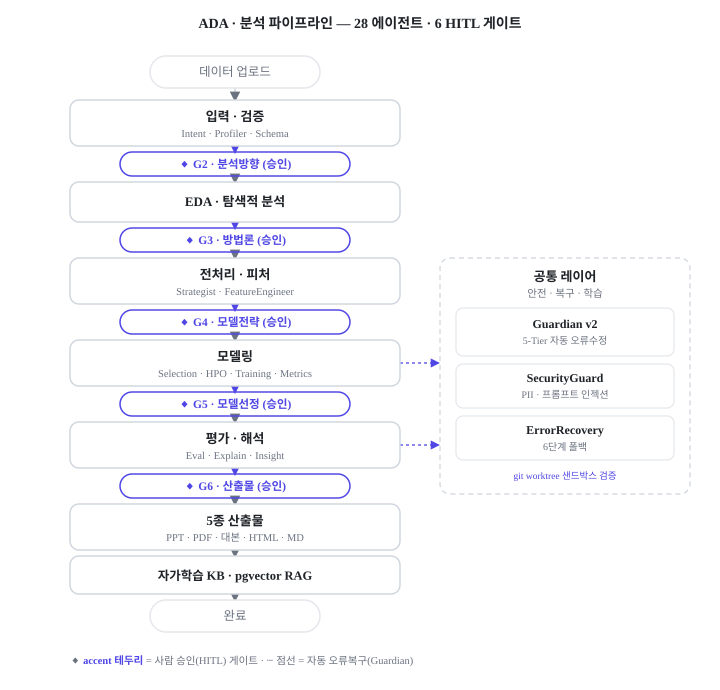
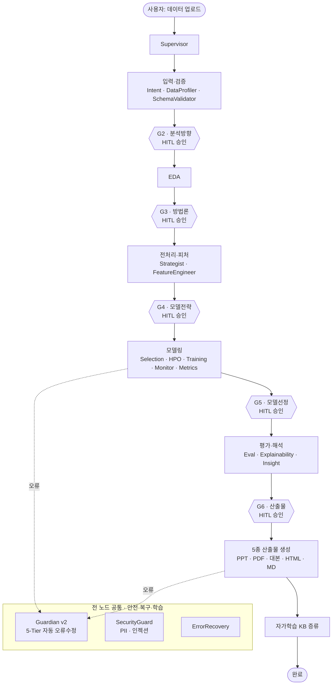
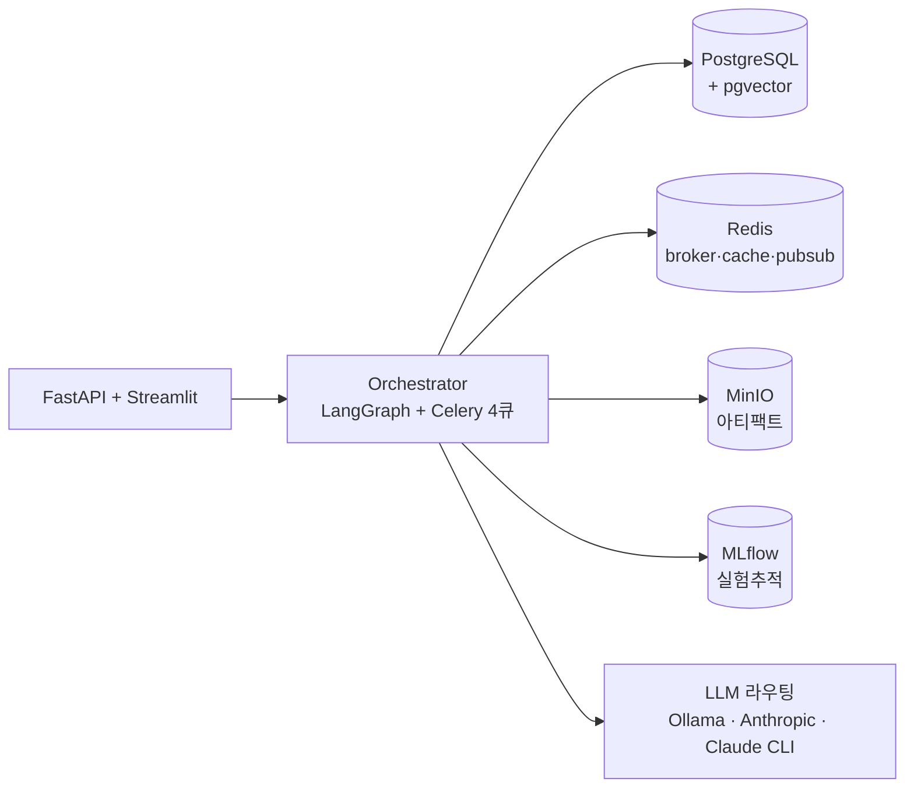

# ADA — Adaptive AutoAI Pipeline Agent · 결과 & 증명

> **대화형 AutoAI 스튜디오** — 정형 데이터를 올리면 28개 에이전트가 LangGraph로 협업해, 6단계 HITL 게이트를 거쳐 분석·튜닝·해석을 자동 수행하고 **5종 산출물**(PPT·PDF·발표대본·HTML 대시보드·인사이트 MD)을 생성합니다.
>
> 스코프: 정형 ML / 정형 DL / 시계열 / 이상탐지 · Python 3.10 · v2.6.0

| 항목 | 값 |
|---|---|
| 에이전트 | **28개** (9 카테고리, `agents/personas.py`에서 `assert len(PERSONAS)==28` 자가검증) |
| 코드 규모 | Python **116,682 LOC** / 398 파일 |
| 테스트 | **1,446개** 테스트 함수 · 89 파일 · 24,025 LOC |
| CI/CD | GitHub Actions — postgres(pgvector)+redis 서비스 위 `ruff` + `pytest --cov`, GHCR→VPS 무중단 배포 |
| 핵심 인프라 | LangGraph · Celery(4큐)+Beat · PostgreSQL+pgvector · Redis · MinIO · MLflow · Vault · FastAPI · Streamlit |
| 보안 | JWT(RS256/Vault) · Google OAuth · RBAC · PII 익명화 · 프롬프트 인젝션 가드 |

> ℹ️ 본 저장소는 4인 팀 프로젝트입니다. **내 담당(HJ / youandi3535)**: core · API · 오케스트레이터 · outputs · 보안 · KB · 인프라 · 운영 콘솔 (최다 기여 394 커밋). 카테고리 핸들러 본문은 팀원(시계열/이상탐지/정형) 담당.

---

## 1. 아키텍처

### 분석 파이프라인 (LangGraph + 6 HITL 게이트)



<details>
<summary>다이어그램 소스 (Mermaid)</summary>



</details>

### 런타임 토폴로지



### 28 에이전트 (9 카테고리)

| 카테고리 | 에이전트 |
|---|---|
| 슈퍼바이저 (1) | Supervisor |
| 입력·검증 (3) | IntentElicitor · DataProfiler · SchemaValidator |
| 게이트 (5) | AnalysisProposer(G2) · MethodologyProposer(G3) · ModelStrategyProposer(G4) · ModelComparisonReporter(G5) · OutputTypeSelector(G6) |
| 전처리·EDA (4) | PreprocessingStrategist · FeatureEngineer · EDAAgent · PreprocessingChoice |
| 모델링 (6) | ModelSelection · HyperparameterTuner · TrainingExecutor · TrainingMonitor · MetricsAggregator · FineTuneExecutor |
| 평가·해석 (3) | Eval · Explainability · Insight |
| 산출물 (2) | ReportArchitect · ReportComposer |
| 메타 (3) | SelfLearning · AutoErrorHandler · SecurityGuard |
| 회복 (1) | ErrorRecovery |

---

## 2. 에이전트 엔지니어링 하이라이트 (코드 근거)

비결정적·외부의존적인 LLM을 **프로덕션에서 길들이는** 데 집중했습니다.

- **멀티백엔드 LLM 추상화 + 신뢰성 패턴** — `agents/base.py`
  단일 진입점 `_call_llm`이 Ollama / Anthropic API / Claude CLI 3-백엔드를 라우팅(단계별 강제: G1–3 로컬, G4–6 Claude). 회로차단기(pybreaker), **30초 타임아웃 강제**(SDK 기본 10분 hang 방지), 스트리밍 부분응답 복구, **재시도 회차별 시드(`reloop_seed`)로 비결정성 제어**.
- **Guardian v2 — 5-Tier 자동 오류수정** — `ada/error_handler/`
  분류 short-circuit → Tier0 정적 fixer(6종, AST) → Tier1 KB → Tier2 Ollama → Tier3 Claude CLI. **git worktree 격리 + scope/금지파일 검증 + ruff + pytest 샌드박스를 통과한 패치만 적용**. 비용 예산·회로차단 포함. 반복 패턴은 `fixer_promoter`가 **새 Tier0 fixer로 자동 승격**(자가개선 루프).
- **자가학습 KB(RAG)** — `ada/harness/`
  pgvector 코사인 검색 + **인용 강제**(유사도 ≥0.7), `record_outcome()`으로 성공/실패가 confidence에 반영, 60일 미사용 decay·저신뢰 retract.
- **데이터 누수 방지 — 4개 카테고리 전반 일관**
  split-first → train에만 fit → val/test는 transform-only(`agents/handlers/*/preprocessor.py`, `evaluator.py`). 시계열은 horizon-aware lag + embargo, 학습 실행은 fail-closed(무작위 셔플 거부).
- **통계적 엄밀성** — 확률 캘리브레이션(Platt/Isotonic, K-fold honest CV + ECE), 비용민감 임계값 4전략, 상대 유의성 게이트(baseline 2σ), 시계열 Diebold-Mariano 검정, 이상탐지 rank 앙상블.

---

## 3. 평가 · 관측성

- **KPI 단일 원천** — `ada/observability/kpi.py` (각 지표 `data_source`·신뢰도 경고 포함)
  - **KP1** E2E 성공률 · **KP2** 평균 종단 시간(분) · **KP5** API p95(ms, Prometheus) · **KP9** KB 적용률
- **테스트 1,446개 / 89파일** — 스모크가 아니라 **운영 사고 기반 회귀**(데이터 누수·서킷브레이커 상태전이·예산 수치·PII 익명화→복원 등). DB는 목, 무거운 ML deps는 `importorskip`.
- **CI** — `.github/workflows/ci.yml`: postgres(pgvector pg16)+redis 서비스 위 `ruff check .` + `pytest --cov` (Python 3.10).
- **CD** — `deploy.yml`: GHCR 이미지 빌드 → VPS SSH → `docker compose up --wait` + nginx graceful reload + 헬스체크.

---

## 4. 실행 증거 (런타임 캡처 — 여기에 첨부)

> 아래 항목은 실제 운영 환경(PostgreSQL/MLflow/MinIO)에서 생성됩니다. 캡처/파일을 이 자리에 넣으면 리뷰어가 "실제로 돌아간다"를 바로 확인할 수 있습니다.

- 📸 **KPI 스냅샷** — `/admin/observability/kpi` 화면 캡처를 여기에
- 📸 **테스트 통과** — `pytest -q` 출력(통과 수/커버리지) 캡처를 여기에
- 📎 **생성 산출물 샘플** — 실제 만든 PPT/PDF/대시보드 파일(또는 스크린샷)을 `docs/samples/`에 넣고 링크
- 🎬 **데모** — 업로드→게이트 진행→산출물까지 30~60초 GIF/영상 링크
- 🛠 **Guardian 자가수정 사례 1건** — 오류 발생 → 자동 패치 → 통과까지의 로그/diff(before→after)

---

## 5. 보안 · 한계 (정직 기록)

신뢰를 위해 알려진 갭을 명시합니다(개선 백로그).

- 🔴 **데이터플레인 인증 미배선** — RBAC/JWT 인프라는 구현됐으나 `api/routes/pipeline.py`·`upload.py`에 미적용. → 적용 예정.
- 🟡 **체크포인트** — 문서상 PostgresSaver지만 실제는 MemorySaver+Redis(pickle). → 표기 수정/영속화 검토.
- 🟡 일부 검증 코드(`qa/` 7축 채점)·`_rules_lint`가 파이프라인에 미배선. → 연결 예정.

---

## 6. 빠른 재현

```bash
cp .env.example .env   # 값 채우기 (CHANGE_ME)
docker compose up -d   # postgres·redis·minio·api·worker
# CI 동일 검증:
ruff check . && pytest -q
```

> 데이터셋·모델·MLflow run 등 런타임 산출물은 `.gitignore`로 제외됩니다(설계상 로컬/서버 보관).
