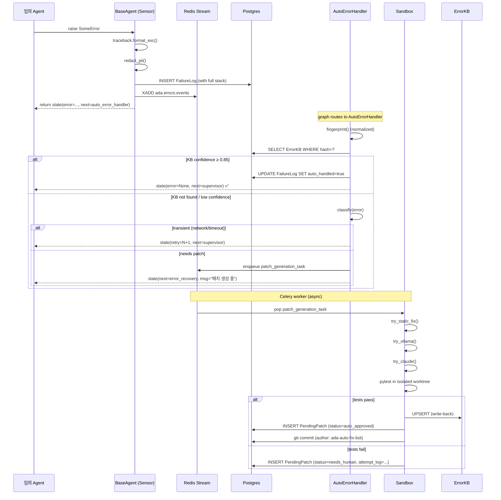

# ADR-006 — 자동 오류 감시·해결·학습 루프 (Auto Error Resolution)

> **Status**: Proposed (HJ)
> **Date**: 2026-05-27
> **Supersedes**: Day 2 단순 폴링 데몬 (`ada/error_handler/daemon.py`)
> **Owners**: HJ (시스템·메타·인프라)

---

## 1. 배경 & 목표

ADA v2 의 모든 에이전트 실행 중 발생하는 오류를 **자동 감지 → 분류 → 자체/로컬 LLM/외부 LLM 폴백 해결 → KB 학습** 까지 사람 개입 없이 닫는 폐회로 (closed-loop) 자가치유 시스템을 구축한다.

**핵심 원칙 (우선순위 순):**

1. **무해성 (Do No Harm)** — 자동 패치가 시스템을 더 나쁘게 만들지 않을 것. 검증 실패 시 즉시 롤백.
2. **격리 (Isolation)** — 패치 적용은 항상 격리된 sandbox 에서 검증 후 본 시스템 적용. R-403 (카테고리 영역) 경계 절대 침범 금지.
3. **재현성 (Reproducibility)** — 모든 에러·패치·결정은 추적 가능. Langfuse + audit log + git.
4. **비용 효율 (Cost Efficiency)** — Tier 0 (정적) → Tier 1 (KB) → Tier 2 (Ollama 로컬) → Tier 3 (Claude API) 순. LLM 호출 최소화.
5. **사람 우선 (Human-First Escalation)** — 자동 해결 실패하거나 위험도 높으면 즉시 사람에게.

**DoD (Definition of Done):**

- (a) 에이전트가 raise 한 예외가 1초 이내에 FailureLog 로 적재됨
- (b) ErrorKB 매칭 confidence ≥ 0.85 면 사람 개입 없이 자동 해결, 파이프라인 그대로 재개
- (c) Tier 2/3 생성 패치는 항상 sandbox 에서 `pytest tests/` 통과 후에만 KB write-back
- (d) 자동 적용된 패치는 git commit 으로 영구 기록 (저자: `ada-auto-fix-bot`)
- (e) 동일 오류 100건 동시 발생 시 LLM 호출은 최대 1회 (debounce)
- (f) Ollama / Claude API 장애 시 circuit breaker 가 5분간 차단
- (g) Prometheus 메트릭: `ada_autofix_attempts_total`, `ada_autofix_success_ratio`, `ada_autofix_kb_hit_ratio`, `ada_autofix_llm_cost_usd_total`

---

## 2. 현재 상태 진단 (Sonnet 4.6 분석 + 추가 누수)

### 2.1 Sonnet 이 짚은 3가지 구멍 (모두 맞음)

| # | 현상 | 위치 |
|---|---|---|
| A | `AutoErrorHandlerAgent` 가 LangGraph 노드로 등록 안 됨 | `orchestrator/graph.py` |
| B | `error_hash="auto"` 하드코딩 | `agents/auto_error_handler.py` |
| C | KB 매칭 성공해도 `state.error` 살아있어서 무한 재시도 | 동상 |

### 2.2 Sonnet 이 놓친 12가지 추가 누수 (운영 치명상)

| # | 누수 | 영향 | 심각도 |
|---|---|---|---|
| D | **State propagation 버그** — Sonnet 제안한 `state = state.with_update(...)` 가 `except` 블록 안에 있는데, 그 직후 `raise` → 호출자(graph)는 갱신된 state 를 못 받음. LangGraph 가 raise 를 그냥 통과시키면 state.error 는 영원히 None. | 자동 감지 자체가 동작 안 함 | 🔴 Critical |
| E | **Fingerprint 과대 정규화** — `re.sub(r"\d+", "<N>", clean)` 가 Python 버전·포트번호·HTTP 코드까지 다 지움. `Python 3.10` vs `3.11` 오류가 동일 hash 로 매칭됨. | 잘못된 KB 매칭 → 잘못된 자동 수정 | 🔴 Critical |
| F | **동시 실패 race condition** — 같은 오류 100건이 1초 안에 발생하면 FailureLog 100건 INSERT, LLM 100번 호출. ErrorKB 에 동일 hash UPSERT 도 충돌. | 비용 폭주 + DB 락 경합 | 🟠 High |
| G | **PII 누수** — 에러 메시지에 사용자 입력 (이메일·전화·결제정보) 그대로 들어가서 ErrorKB / Ollama 프롬프트 / Claude API 로 유출. R-103 위반. | 컴플라이언스 사고 | 🔴 Critical |
| H | **패치 sandbox 부재** — Sonnet 은 LLM diff 받자마자 신뢰. 실제 적용 시 컴파일·테스트 실패 / 의도치 않은 사이드이펙트. | 시스템 망가짐 | 🔴 Critical |
| I | **R-403 영역 위반 가능** — 자동 패치가 HJ 외 다른 멤버의 영역 (`agents/handlers/timeseries/` 등) 을 건드리면 CODEOWNERS 시스템 무력화. | 거버넌스 붕괴 | 🟠 High |
| J | **회로 차단기 부재** — Ollama 죽으면 매 30초 폴링마다 120초 타임아웃 × N rows. 워커 1개로 한 사이클이 시간당 30분만 처리. | 백로그 폭주 | 🟠 High |
| K | **Polling-only (실시간성 0)** — 30초 폴링은 데모/배치엔 OK 지만 사용자가 inference 요청 중 발생한 에러 복구가 30초 지연됨. | UX 저하 | 🟡 Medium |
| L | **Auto-handler 자체 실패 무한루프** — `auto_error_handler` 노드가 `error_recovery` 로 라우팅하는데, error_recovery 가 다시 supervisor 로 돌리고, supervisor 가 또 실패 → 같은 에러 → 또 auto_error_handler. 무한루프. | 시스템 동결 | 🔴 Critical |
| M | **패치 적용 후 검증 = test_plan 문자열만** — LLM 이 적은 "테스트 어떻게 검증할지" 한 줄을 실제로 실행하지 않음. 패치 통과 여부 불명. | 잘못된 자동 학습 | 🟠 High |
| N | **에러 분류 부재** — 코드버그/설정문제/데이터문제/순간장애/사용자입력 오류를 구분 안 함. 순간 네트워크 블립도 LLM 으로 "고치려" 함. | 비용 + 오탐 | 🟠 High |
| O | **사람 피드백 학습 부재** — 리뷰어가 PendingPatch 거부해도 그 신호가 다음 LLM 생성에 반영 안 됨. 같은 잘못된 패치 반복 제안. | 학습 효율 0 | 🟡 Medium |
| P | **비용 추적 / 예산 가드 부재** — Claude API 가 무한 호출돼도 알람 없음. 한도 초과 시 자동 차단 없음. | 청구서 사고 | 🟠 High |

---

## 3. 목표 아키텍처

### 3.1 7계층 모델

```
┌──────────────────────────────────────────────────────────┐
│ L1: SENSE   에러 자동 감지 (BaseAgent + Exception Hook)  │
├──────────────────────────────────────────────────────────┤
│ L2: REDACT  PII/시크릿 마스킹 (재사용: guardrails)        │
├──────────────────────────────────────────────────────────┤
│ L3: ROUTE   pub/sub 즉시 알림 + 폴링 백업 (Redis Streams)│
├──────────────────────────────────────────────────────────┤
│ L4: CLASSIFY  에러 유형 분류 (transient/code/data/user)   │
├──────────────────────────────────────────────────────────┤
│ L5: RESOLVE  4-tier 폴백 + circuit breaker + budget       │
├──────────────────────────────────────────────────────────┤
│ L6: VALIDATE  sandbox 테스트 + 영역 검증 + 정적분석      │
├──────────────────────────────────────────────────────────┤
│ L7: LEARN   ErrorKB write-back + 피드백 루프 + 감쇠       │
└──────────────────────────────────────────────────────────┘
       ↓
   OBSERVE: Prometheus 메트릭 + Langfuse 트레이스 + audit log
```

### 3.2 전체 흐름도 (정상 케이스)



### 3.3 컴포넌트 책임 매트릭스

| 컴포넌트 | 책임 | 영역 (R-403) |
|---|---|---|
| `BaseAgent._handle_exception()` | L1 SENSE: traceback 캡처, state 에 에러 정보 attach | HJ (`agents/base.py`) |
| `ada/error_handler/redactor.py` (신규) | L2 REDACT: PII/secret 마스킹 | HJ |
| `ada/error_handler/event_bus.py` (신규) | L3 ROUTE: Redis Stream pub/sub | HJ |
| `ada/error_handler/classifier.py` (신규) | L4 CLASSIFY: 5종 분류 + 라우팅 결정 | HJ |
| `ada/error_handler/auto_handler.py` (개선) | L5 RESOLVE: 4-tier 폴백 + circuit breaker | HJ |
| `ada/error_handler/sandbox.py` (신규) | L6 VALIDATE: worktree 격리 + pytest | HJ |
| `ada/error_handler/kb_writeback.py` (신규) | L7 LEARN: ErrorKB UPSERT + 감쇠 | HJ |
| `ada/error_handler/budget.py` (신규) | LLM 비용 추적 + 한도 차단 | HJ |
| `orchestrator/graph.py` (수정) | 그래프에 auto_error_handler 노드 + 루프 차단 | HJ |
| `agents/auto_error_handler.py` (개선) | LangGraph 노드 래퍼 | HJ |

전부 HJ 영역. 다른 멤버 영역은 절대 안 건드림.

---

## 4. 컴포넌트 상세 설계

### 4.1 L1 SENSE — `BaseAgent._handle_exception()` (Sonnet 누수 D 해결)

**문제**: Sonnet 제안한 `state.with_update()` 가 `except` 안에 있고 그 직후 `raise` → 호출자가 갱신된 state 못 받음.

**해결**: 두 가지 패턴 모두 지원.

```python
# agents/base.py
import traceback

class BaseAgent:
    @asynccontextmanager
    async def log_agent_run(self, state: PipelineState):
        # ... 기존 코드 ...
        try:
            yield
        except Exception as e:
            status = "failed"
            error = f"{type(e).__name__}: {e}"[:2000]
            tb = traceback.format_exc()[:8000]

            # ⭐ 갱신된 state 를 예외에 첨부 (raise 후에도 graph 가 꺼내 쓸 수 있게)
            new_state = state.with_update(
                error=error,
                error_traceback=tb,
                next_agent="auto_error_handler",  # 그래프 라우팅용
            )
            e._ada_state = new_state  # 사용자 정의 attr — 그래프 어댑터가 사용

            raise
        finally:
            # ... 기존 persistence ...
```

**그래프 어댑터 (orchestrator/graph.py)**:

```python
async def safe_node(agent: BaseAgent, state: PipelineState) -> PipelineState:
    """모든 노드를 이걸로 감싼다. raise 된 예외에서 _ada_state 를 꺼냄."""
    try:
        return await agent(state)
    except Exception as e:
        if hasattr(e, "_ada_state"):
            return e._ada_state
        # _ada_state 없는 raw 예외 (BaseAgent 아닌 곳에서 발생)
        return state.with_update(
            error=f"{type(e).__name__}: {e}"[:2000],
            error_traceback=traceback.format_exc()[:8000],
            next_agent="auto_error_handler",
        )
```

**PipelineState 추가 필드:**

```python
# ada/core/state.py
class PipelineState(BaseModel):
    # ... 기존 ...
    error: Optional[str] = None
    error_traceback: Optional[str] = None       # NEW
    error_classified_as: Optional[str] = None   # NEW: transient|code|data|config|user
    error_fingerprint: Optional[str] = None     # NEW: cache
    auto_fix_attempts: int = 0                  # NEW: 무한루프 방지 카운터
    max_auto_fix_attempts: int = 2              # NEW
```

`auto_fix_attempts` 가 무한루프 방지 핵심 (누수 L 해결).

### 4.2 L2 REDACT — `ada/error_handler/redactor.py` (누수 G 해결)

```python
"""PII / secret 마스킹 — 에러를 KB·LLM 으로 보내기 전 필수 통과."""

import re
from typing import Tuple

# 우선순위 높은 패턴부터 (긴 패턴 먼저)
REDACTION_PATTERNS = [
    # 신용카드 (Luhn 검증은 비용 높아 패턴만)
    (re.compile(r"\b\d{4}[-\s]?\d{4}[-\s]?\d{4}[-\s]?\d{4}\b"), "<CARD>"),
    # 한국 주민번호
    (re.compile(r"\b\d{6}-?[1-4]\d{6}\b"), "<RRN>"),
    # 이메일
    (re.compile(r"\b[\w.+-]+@[\w-]+\.[\w.-]+\b"), "<EMAIL>"),
    # 전화 (한국 + 국제)
    (re.compile(r"\b(?:\+82[-\s]?|0)1[016789][-\s]?\d{3,4}[-\s]?\d{4}\b"), "<PHONE>"),
    # API 키 / 토큰 (sk_, pk_, gho_, Bearer)
    (re.compile(r"\b(sk|pk|gho|ghp|ghs)_[A-Za-z0-9]{20,}\b"), "<TOKEN>"),
    (re.compile(r"Bearer\s+[A-Za-z0-9\-._~+/]+=*", re.IGNORECASE), "Bearer <TOKEN>"),
    # AWS 키
    (re.compile(r"AKIA[0-9A-Z]{16}"), "<AWS_KEY>"),
    # IP 주소 (오류 위치 파악엔 부분 마스킹)
    (re.compile(r"\b(\d{1,3})\.\d{1,3}\.\d{1,3}\.\d{1,3}\b"), r"\1.x.x.x"),
    # 파일 경로의 사용자명 (Windows + Linux)
    (re.compile(r"[CD]:\\Users\\[^\\]+\\"), r"C:\\Users\\<USER>\\"),
    (re.compile(r"/home/[^/]+/"), "/home/<USER>/"),
    (re.compile(r"/Users/[^/]+/"), "/Users/<USER>/"),
]


def redact(text: str) -> Tuple[str, list[str]]:
    """텍스트에서 PII/secret 제거.

    Returns:
        (redacted_text, list_of_redaction_types_found)
    """
    found = []
    redacted = text
    for pattern, replacement in REDACTION_PATTERNS:
        new_redacted, n = pattern.subn(replacement, redacted)
        if n > 0:
            found.append(replacement)
            redacted = new_redacted
    return redacted, found
```

**호출 지점**: FailureLog 에 INSERT 직전, Ollama/Claude 프롬프트 생성 직전, ErrorKB 저장 직전.

원본은 PostgreSQL `failure_logs.raw_error_encrypted` (신규 컬럼, AES-256, KMS 키) 에 별도 저장. 사람이 디버깅 필요할 때만 복호화. **이게 R-103 (PII 로그 금지) 완벽 준수의 핵심.**

### 4.3 L3 ROUTE — `ada/error_handler/event_bus.py` (누수 K 해결)

폴링만 쓰면 30초 지연. Redis Streams 로 즉시 알림 + 폴링은 안전망.

```python
"""Redis Streams 기반 에러 이벤트 버스.

Stream key: ada.errors.events
Consumer group: error_handler_workers
Failover: Stream 장애 시 폴링 fallback (기존 daemon 유지).
"""

from __future__ import annotations
import json
import redis.asyncio as redis
from ada.core.config import settings

STREAM_KEY = "ada.errors.events"
GROUP = "error_handler_workers"
CONSUMER = lambda: f"worker-{os.getpid()}"


async def emit(failure_log_id: str, fingerprint_hash: str, severity: str = "normal") -> None:
    """FailureLog INSERT 직후 호출."""
    r = redis.from_url(settings.redis_url)
    await r.xadd(STREAM_KEY, {
        "failure_log_id": failure_log_id,
        "fingerprint": fingerprint_hash,
        "severity": severity,
    }, maxlen=10000)  # 최근 1만건만 보관


async def consume(handler_callback, block_ms: int = 5000) -> None:
    """worker 가 무한 루프로 호출. block 으로 polling 비용 ↓."""
    r = redis.from_url(settings.redis_url)
    try:
        await r.xgroup_create(STREAM_KEY, GROUP, id="0", mkstream=True)
    except redis.exceptions.ResponseError:
        pass  # group already exists

    while True:
        msgs = await r.xreadgroup(GROUP, CONSUMER(), {STREAM_KEY: ">"}, block=block_ms, count=10)
        for stream_name, entries in (msgs or []):
            for msg_id, data in entries:
                try:
                    await handler_callback(data)
                    await r.xack(STREAM_KEY, GROUP, msg_id)
                except Exception:
                    pass  # 처리 실패 시 pending list 에 남아 30초 후 재시도
```

**Polling 데몬은 그대로 유지**. 이유:
- Stream 메시지 손실 시 안전망
- 외부 시스템이 직접 FailureLog INSERT 한 경우 (Stream 우회) 도 잡힘
- "30초 안에는 무조건 처리" 라는 SLO 보장

### 4.4 L4 CLASSIFY — `ada/error_handler/classifier.py` (누수 N 해결)

```python
"""에러 유형 5종 분류 → 처리 전략 결정."""

from enum import Enum
import re


class ErrorClass(str, Enum):
    TRANSIENT = "transient"   # 네트워크/타임아웃 → 즉시 retry
    CODE_BUG = "code_bug"     # 진짜 코드 수정 필요 → LLM 패치
    CONFIG = "config"          # 환경변수/시크릿 누락 → 사람 개입
    DATA = "data"              # 입력 데이터 문제 → 사용자 안내
    USER_INPUT = "user_input"  # 사용자 요청 오류 → 즉시 사용자 안내
    UNKNOWN = "unknown"


# 빠른 규칙 기반 (LLM 없이)
CLASSIFIERS = [
    (re.compile(r"(ConnectionError|TimeoutError|ConnectionResetError|TemporaryFailure)"), ErrorClass.TRANSIENT),
    (re.compile(r"(KeyError.*ENV|os\.environ|Settings.*not.*set|VaultError)"), ErrorClass.CONFIG),
    (re.compile(r"(pandas.errors|EmptyDataError|MissingColumn|SchemaError)"), ErrorClass.DATA),
    (re.compile(r"(ValidationError|InvalidArgument|HTTPException.*4\d\d)"), ErrorClass.USER_INPUT),
    (re.compile(r"(AttributeError|TypeError|NameError|ImportError|SyntaxError|NotImplementedError)"), ErrorClass.CODE_BUG),
]


def classify(error_message: str, traceback_text: str) -> ErrorClass:
    full = f"{error_message}\n{traceback_text}"
    for pattern, cls in CLASSIFIERS:
        if pattern.search(full):
            return cls
    return ErrorClass.UNKNOWN


# 처리 전략 매트릭스
HANDLING_STRATEGY = {
    ErrorClass.TRANSIENT:  "retry_with_backoff",  # 1s, 2s, 4s 지수 백오프
    ErrorClass.CODE_BUG:   "llm_patch",            # 4-tier 폴백 진입
    ErrorClass.CONFIG:     "human_only",           # 사람 안내, LLM 안 씀
    ErrorClass.DATA:       "user_message",         # 사용자에게 데이터 수정 요청
    ErrorClass.USER_INPUT: "user_message",
    ErrorClass.UNKNOWN:    "llm_patch",            # 알 수 없으면 LLM 으로
}
```

**핵심 효과**: 네트워크 블립 (TRANSIENT) 에 Claude API 호출 안 함. 한 달에 수십만 원 절약.

### 4.5 L5 RESOLVE — `ada/error_handler/auto_handler.py` 개선 (Sonnet 누수 B/C/F/J 해결)

기존 코드 base 로 다음 추가:

**(1) 정확한 fingerprint (누수 E 해결)**:

```python
def fingerprint(error_message: str, stack: str = "") -> dict[str, str]:
    clean = error_message
    # 메모리 주소
    clean = re.sub(r"0x[0-9a-fA-F]+", "<ADDR>", clean)
    # UUID
    clean = re.sub(r"[0-9a-fA-F]{8}-[0-9a-fA-F]{4}-[0-9a-fA-F]{4}-[0-9a-fA-F]{4}-[0-9a-fA-F]{12}", "<UUID>", clean)
    # 타임스탬프 (ISO 형식)
    clean = re.sub(r"\d{4}-\d{2}-\d{2}T\d{2}:\d{2}:\d{2}(\.\d+)?(Z|[+-]\d{2}:\d{2})?", "<TS>", clean)
    # 파일 라인 번호만 (Python traceback "line 42" → "line <N>")
    clean = re.sub(r"line \d+", "line <N>", clean)
    # ❌ 기존: re.sub(r"\d+", "<N>", clean) — 과대 정규화. 제거.

    # stack trace 도 동일 처리 + venv 경로 정규화
    norm_stack = stack
    norm_stack = re.sub(r"/[^/]+/site-packages/", "/<sp>/", norm_stack)
    norm_stack = re.sub(r"line \d+", "line <N>", norm_stack)
    norm_stack = re.sub(r"0x[0-9a-fA-F]+", "<ADDR>", norm_stack)

    # stack 의 상위 3 프레임만 hash 에 반영 (deep stack 변동 무시)
    top_frames = "\n".join(norm_stack.split("\n")[:6])
    composite = f"{clean}\n---\n{top_frames}"

    h = hashlib.sha256(composite.encode("utf-8")).hexdigest()
    return {"hash": h, "signature": clean[:500], "stack_top": top_frames[:1000]}
```

**(2) 동시 실행 debounce (누수 F 해결)**:

```python
# Redis 분산 락
async def acquire_dedup_lock(fingerprint_hash: str, ttl_sec: int = 60) -> bool:
    r = redis.from_url(settings.redis_url)
    key = f"ada:autofix:dedup:{fingerprint_hash}"
    return await r.set(key, "1", nx=True, ex=ttl_sec)

# auto_handler 진입 시
async def handle(self, log_row):
    fp = fingerprint(...)
    if not await acquire_dedup_lock(fp["hash"]):
        log.info("debounced", hash=fp["hash"])
        return {"action": "debounced"}
    # ... 기존 로직 ...
```

같은 hash 가 60초 안에 두 번 들어오면 두 번째는 즉시 종료. 100건 폭주 → LLM 1회 호출.

**(3) Circuit breaker (누수 J 해결)**:

```python
# ada/error_handler/circuit_breaker.py
class CircuitBreaker:
    def __init__(self, name, failure_threshold=5, recovery_sec=300):
        self.name = name
        self.threshold = failure_threshold
        self.recovery = recovery_sec
        self._key_state = f"ada:cb:{name}:state"
        self._key_count = f"ada:cb:{name}:fails"

    async def is_open(self) -> bool:
        r = redis.from_url(settings.redis_url)
        return await r.get(self._key_state) == b"open"

    async def record_success(self):
        r = redis.from_url(settings.redis_url)
        await r.delete(self._key_state, self._key_count)

    async def record_failure(self):
        r = redis.from_url(settings.redis_url)
        n = await r.incr(self._key_count)
        if n >= self.threshold:
            await r.set(self._key_state, "open", ex=self.recovery)


# 사용
_ollama_cb = CircuitBreaker("ollama", failure_threshold=5, recovery_sec=300)

async def _ollama_coder_fix(...):
    if await _ollama_cb.is_open():
        raise CircuitOpenError("ollama circuit open")
    try:
        result = await ... actual call ...
        await _ollama_cb.record_success()
        return result
    except Exception:
        await _ollama_cb.record_failure()
        raise
```

**(4) 결과 액션 명확화 (누수 C 해결)**:

기존 `action` 값을 다음 3그룹으로 명확히:

```python
RESOLVED = {"auto_kb_match", "patch_reused_approved"}          # error 클리어 OK
PATCH_QUEUED = {"patch_queued_static", "patch_queued_ollama", "patch_queued"}  # 큐에 있음, error 유지
FAILED = {"noop", "debounced", "circuit_open"}                 # 처리 못 함

# AutoErrorHandlerAgent 에서:
if outcome["action"] in RESOLVED:
    return state.with_update(error=None, error_traceback=None, next_agent="supervisor")
elif outcome["action"] in PATCH_QUEUED:
    return state.with_update(next_agent="error_recovery")  # error 는 유지, 사용자 안내로
else:
    return state.with_update(next_agent="error_recovery")
```

### 4.6 L6 VALIDATE — `ada/error_handler/sandbox.py` (누수 H/I/M 해결)

LLM 이 생성한 diff 를 본 시스템에 직접 적용하는 건 **자살 행위**. 격리된 git worktree 에서 검증:

```python
"""Patch sandbox — git worktree 격리 + pytest 검증."""

import subprocess
import tempfile
import os
from pathlib import Path


class PatchValidator:
    def __init__(self, repo_root: str = "/app"):
        self.repo_root = Path(repo_root)

    async def validate(
        self,
        diff: str,
        test_command: str = "pytest tests/ -q --timeout=60",
        timeout_sec: int = 600,
    ) -> dict[str, Any]:
        """diff 를 격리된 worktree 에서 적용·테스트.

        Returns:
            {
                "passed": bool,
                "tests_run": int,
                "tests_failed": int,
                "scope_violations": list[str],  # R-403 위반 파일 목록
                "stderr": str,
                "stdout_tail": str,  # 마지막 2KB
            }
        """
        # 1) 영역 검증 (R-403) — 패치가 건드리는 파일이 HJ 영역인지
        violations = self._check_scope(diff)
        if violations:
            return {
                "passed": False,
                "scope_violations": violations,
                "reason": "auto-fix can only modify HJ-owned files (ada/, orchestrator/, agents/{supervisor,...}.py)",
            }

        # 2) 격리된 worktree 생성
        with tempfile.TemporaryDirectory(prefix="ada-autofix-") as tmpdir:
            worktree = Path(tmpdir) / "wt"
            branch = f"autofix/sandbox-{os.urandom(4).hex()}"

            subprocess.run(
                ["git", "worktree", "add", "-b", branch, str(worktree), "HEAD"],
                cwd=self.repo_root, check=True, capture_output=True,
            )

            try:
                # 3) diff 적용
                proc = subprocess.run(
                    ["git", "apply", "--check", "-"],
                    input=diff.encode(), cwd=worktree,
                    capture_output=True,
                )
                if proc.returncode != 0:
                    return {"passed": False, "reason": "diff_invalid", "stderr": proc.stderr.decode()[-2000:]}

                subprocess.run(["git", "apply", "-"], input=diff.encode(), cwd=worktree, check=True)

                # 4) 정적 검증 (ruff)
                ruff = subprocess.run(
                    ["python", "-m", "ruff", "check", "."],
                    cwd=worktree, capture_output=True, text=True, timeout=60,
                )
                if ruff.returncode != 0:
                    return {"passed": False, "reason": "ruff_failed", "stderr": ruff.stdout[-2000:]}

                # 5) pytest 실행
                test = subprocess.run(
                    test_command.split(),
                    cwd=worktree, capture_output=True, text=True, timeout=timeout_sec,
                )
                # pytest 출력 파싱
                stdout = test.stdout
                # "X passed, Y failed" 패턴
                import re as _re
                m = _re.search(r"(\d+) passed", stdout)
                passed_n = int(m.group(1)) if m else 0
                m = _re.search(r"(\d+) failed", stdout)
                failed_n = int(m.group(1)) if m else 0

                return {
                    "passed": test.returncode == 0,
                    "tests_run": passed_n + failed_n,
                    "tests_failed": failed_n,
                    "stdout_tail": stdout[-2000:],
                    "stderr": test.stderr[-1000:],
                }
            finally:
                # 6) 정리
                subprocess.run(
                    ["git", "worktree", "remove", "--force", str(worktree)],
                    cwd=self.repo_root, capture_output=True,
                )
                subprocess.run(
                    ["git", "branch", "-D", branch],
                    cwd=self.repo_root, capture_output=True,
                )

    def _check_scope(self, diff: str) -> list[str]:
        """diff 헤더에서 수정 대상 파일 추출 → HJ 영역 외 검출."""
        import re
        files = set(re.findall(r"^\+\+\+ b/(.+)$", diff, re.MULTILINE))

        ALLOWED_PREFIXES = (
            "ada/", "orchestrator/", "api/", "frontend/app.py",
            "outputs/", "scripts/", "tests/integration/", "tests/conftest.py",
            "tests/test_state.py", "tests/test_personas.py",
            "tests/test_graph_build.py", "tests/test_agents_count.py",
            "agents/base.py", "agents/personas.py", "agents/stubs.py",
            "agents/supervisor.py", "agents/self_learning.py",
            "agents/auto_error_handler.py", "agents/security_guard.py",
            "agents/error_recovery.py",
            # 8 dispatchers
            "agents/data_profiler.py", "agents/preprocessing_strategist.py",
            "agents/feature_engineer.py", "agents/eda_agent.py",
            "agents/model_selection.py", "agents/eval_agent.py",
            "agents/insight.py", "agents/report_composer.py",
            # other HJ agents
            "agents/hyperparameter_tuner.py", "agents/training_executor.py",
            "agents/training_monitor.py", "agents/metrics_aggregator.py",
            "agents/fine_tune_executor.py", "agents/intent_elicitor.py",
            "agents/schema_validator.py", "agents/explainability.py",
        )

        violations = [f for f in files if not any(f.startswith(p) for p in ALLOWED_PREFIXES)]
        return violations
```

**핵심 안전망:**
- ❌ 다른 멤버 영역 (handlers/timeseries/anomaly/tabular) 수정 시도 → 즉시 차단 (CLAUDE.md §2 위반)
- ❌ ruff 실패 → 차단
- ❌ pytest 실패 → 차단
- ❌ 의심 파일 (`.env`, `migrations/`, `requirements/`) 수정 시도 → 차단 (전용 prefix 검사 추가)
- ✅ 통과한 패치만 KB write-back

### 4.7 L7 LEARN — `ada/error_handler/kb_writeback.py` (Sonnet 4단계 보강)

```python
"""검증 통과한 패치를 ErrorKB 에 학습 + 적용."""

from datetime import datetime, timedelta
from sqlalchemy import select
from ada.db.models import ErrorKB, FailureLog, PendingPatch


async def write_back(
    session: AsyncSession,
    failure_log: FailureLog,
    diff: str,
    confidence: float,
    source: str,                # "static" | "ollama" | "claude_cli"
    validation_result: dict,    # sandbox 결과
) -> ErrorKB:
    """패치 검증 통과 후 KB 에 영구 학습."""

    fp = fingerprint(failure_log.error_message or "", failure_log.stack_trace or "")
    kb = await session.scalar(select(ErrorKB).where(ErrorKB.error_hash == fp["hash"]))

    if kb:
        # 기존 KB 강화
        kb.success_count = (kb.success_count or 0) + 1
        kb.confidence = min(0.99, (kb.confidence or 0.5) + 0.05)
        kb.updated_at = datetime.utcnow()
    else:
        # 신규 KB 생성
        kb = ErrorKB(
            error_hash=fp["hash"],
            error_signature=fp["signature"],
            fingerprint={
                "stack_top": fp["stack_top"],
                "source": source,
                "first_seen_job": str(failure_log.job_id),
            },
            resolution=f"[{source}] tests={validation_result['tests_run']} confidence={confidence:.2f}",
            confidence=confidence,
        )
        session.add(kb)

    await session.flush()

    # 패치를 MinIO 에 영구 보관 (KB 의 patch_minio_path 채우기)
    from tools.minio_tool import upload_text
    path = f"autofix/patches/{kb.error_hash[:16]}/v{kb.success_count}.patch"
    await upload_text(path, diff)
    kb.patch_minio_path = path

    return kb


async def decay_unused(session: AsyncSession, days: int = 60) -> int:
    """60일 미사용 KB confidence 0.9x — R-505."""
    cutoff = datetime.utcnow() - timedelta(days=days)
    rows = await session.scalars(
        select(ErrorKB).where(ErrorKB.updated_at < cutoff)
    )
    n = 0
    for kb in rows.all():
        kb.confidence = max(0.1, (kb.confidence or 0.5) * 0.9)
        n += 1
    return n
```

**감쇠 (decay) 의 의미**: 6개월 안 쓴 KB 는 신뢰도가 낮아져서 자동 매칭 임계값 (0.85) 아래로 떨어짐 → 다시 LLM 검증 받음. 코드베이스가 진화하면서 옛 패치가 무효해진 경우 대비.

### 4.8 비용 예산 — `ada/error_handler/budget.py` (누수 P 해결)

```python
"""LLM 비용 추적 + 한도 초과 시 자동 차단."""

import redis.asyncio as redis
from datetime import datetime

# 1 token 당 USD 추정 (Anthropic 공식가 기반, 보수적)
COST_PER_1K_TOKENS = {
    "claude-opus-4-7": {"input": 0.015, "output": 0.075},
    "claude-sonnet-4-6": {"input": 0.003, "output": 0.015},
    "ollama:qwen2.5-coder:7b": {"input": 0.0, "output": 0.0},  # 로컬, 무료
}

DAILY_BUDGET_USD = 50.0   # 환경변수로 override 가능


async def track_call(model: str, input_tokens: int, output_tokens: int) -> float:
    """비용 누적 기록 + 일일 누적 반환."""
    rates = COST_PER_1K_TOKENS.get(model, {"input": 0, "output": 0})
    cost = (input_tokens * rates["input"] + output_tokens * rates["output"]) / 1000

    r = redis.from_url(settings.redis_url)
    today_key = f"ada:autofix:budget:{datetime.utcnow().strftime('%Y-%m-%d')}"
    new_total = await r.incrbyfloat(today_key, cost)
    await r.expire(today_key, 86400 * 7)  # 7일 보관
    return new_total


async def is_budget_exceeded() -> bool:
    r = redis.from_url(settings.redis_url)
    today_key = f"ada:autofix:budget:{datetime.utcnow().strftime('%Y-%m-%d')}"
    val = await r.get(today_key)
    if val is None:
        return False
    return float(val) >= float(settings.autofix_daily_budget_usd or DAILY_BUDGET_USD)
```

`auto_handler.handle()` 진입 시 `is_budget_exceeded()` 체크. 초과면 Claude 호출 skip 하고 `error_recovery` 로 즉시 폴백.

---

## 5. 스키마 변경

### 5.1 기존 테이블 ALTER

```sql
-- FailureLog 에 PII 보호 + 디버깅용 필드
ALTER TABLE failure_logs ADD COLUMN raw_error_encrypted BYTEA;
ALTER TABLE failure_logs ADD COLUMN redaction_types JSONB DEFAULT '[]';
ALTER TABLE failure_logs ADD COLUMN classified_as VARCHAR(32);
ALTER TABLE failure_logs ADD COLUMN severity VARCHAR(16) DEFAULT 'normal';  -- low|normal|high|critical

-- 같은 fingerprint 가 동시에 100건 들어와도 인덱스로 빠른 dedup
CREATE INDEX idx_failure_logs_hash_unhandled
    ON failure_logs(error_hash)
    WHERE auto_handled_by_kb = false;
```

### 5.2 신규 테이블

```sql
-- 패치 적용 시도 audit log (누가/언제/무엇을/결과)
CREATE TABLE patch_applications (
    id UUID PRIMARY KEY DEFAULT gen_random_uuid(),
    pending_patch_id UUID REFERENCES pending_patches(id),
    error_kb_id UUID REFERENCES error_kb(id),
    applied_by VARCHAR(64),  -- "ada-auto-fix-bot" or human user id
    applied_at TIMESTAMPTZ DEFAULT now(),
    sandbox_validation JSONB,  -- {passed, tests_run, ...}
    git_commit_sha VARCHAR(64),
    rollback_commit_sha VARCHAR(64),  -- 롤백 시 채워짐
    status VARCHAR(16),  -- success|rolled_back|failed
    duration_ms INTEGER
);

CREATE INDEX idx_patch_apps_kb ON patch_applications(error_kb_id);
CREATE INDEX idx_patch_apps_time ON patch_applications(applied_at DESC);

-- 회로 차단기 상태 (Redis 외에 DB 에도 영구 기록, 모니터링용)
CREATE TABLE circuit_breaker_events (
    id UUID PRIMARY KEY DEFAULT gen_random_uuid(),
    breaker_name VARCHAR(64) NOT NULL,
    event_type VARCHAR(16),  -- opened|half_open|closed
    failure_count INTEGER,
    opened_at TIMESTAMPTZ,
    closed_at TIMESTAMPTZ
);
```

### 5.3 마이그레이션

새 alembic revision 1개 추가 (HJ 단독 작업):

```bash
alembic revision -m "autofix_phase1: failure_logs PII fields + patch_applications + circuit_breaker_events"
# migrations/versions/004_autofix_phase1.py 자동 생성
```

CLAUDE.md §2 의 "새 alembic 마이그레이션 추가 → HJ 단독" 룰 준수.

---

## 6. 그래프 통합 (orchestrator/graph.py 변경)

```python
# 노드 추가
g.add_node("auto_error_handler", AutoErrorHandlerAgent())

# 모든 노드에서 raise 시 → auto_error_handler 로 (safe_node 래퍼)
# Graph 어댑터로 각 노드를 감싸기

# 라우팅 (수정)
def route_after_failure(state: PipelineState) -> str:
    """state.error 가 있을 때 호출됨."""
    # ⭐ 무한루프 방지 (누수 L 해결)
    if state.auto_fix_attempts >= state.max_auto_fix_attempts:
        return "error_recovery"  # 사람 안내로 즉시
    return "auto_error_handler"


def route_after_auto_handler(state: PipelineState) -> str:
    """auto_error_handler 가 시도한 후 결정."""
    if state.error is None:
        # 해결됨 → 원래 흐름으로 재개
        return state.next_agent or "supervisor"
    else:
        # 미해결 → error_recovery (사용자 안내)
        return "error_recovery"


# graph 연결
g.add_conditional_edges(
    "auto_error_handler",
    route_after_auto_handler,
    {
        "supervisor": "supervisor",
        "error_recovery": "error_recovery",
        # 원래 노드들도 모두 매핑
        "data_profiler": "data_profiler",
        "eda_agent": "eda_agent",
        # ... 등 ...
    },
)
```

**핵심**: `auto_fix_attempts` 카운터로 같은 사이클을 무한 반복 못 하게 막음. 2회 시도 후엔 무조건 error_recovery 로.

---

## 7. Observability — Prometheus 메트릭

`ada/observability/metrics.py` 에 추가:

```python
from prometheus_client import Counter, Histogram, Gauge

# 시도 수
autofix_attempts = Counter(
    "ada_autofix_attempts_total",
    "AutoErrorHandler 처리 시도",
    ["tier", "outcome"],  # tier: static|kb|ollama|claude  outcome: resolved|patched|failed
)

# 성공률
autofix_kb_hit = Counter(
    "ada_autofix_kb_hit_total", "ErrorKB Tier 1 매칭 성공",
)

# LLM 처리시간
autofix_llm_duration = Histogram(
    "ada_autofix_llm_duration_seconds",
    "LLM 패치 생성 시간",
    ["model"],  # ollama|claude
    buckets=(1, 5, 10, 30, 60, 120, 300),
)

# 누적 비용
autofix_cost = Counter(
    "ada_autofix_llm_cost_usd_total",
    "누적 LLM 비용",
    ["model"],
)

# 회로 차단기 상태
autofix_cb_open = Gauge(
    "ada_autofix_circuit_breaker_open", "회로 차단 활성", ["name"],
)

# Sandbox 검증 결과
autofix_sandbox_result = Counter(
    "ada_autofix_sandbox_total",
    "Sandbox 검증 결과",
    ["result"],  # passed|ruff_failed|tests_failed|scope_violation|diff_invalid
)
```

**대시보드 (Grafana, Day 18 작업)**: 일일 KB 히트율 / LLM 비용 / 자동수정 성공률 / 회로차단 빈도.

---

## 8. 단계별 구현 계획

### Phase 1 — Critical (1~2일, hj-day3 또는 별도 브랜치)

**목표**: Sonnet 의 4단계 + 누수 D/E/L 해결. "기본 자동 감지·KB 매칭" 가동.

1. `ada/core/state.py` 에 `error_traceback`, `error_classified_as`, `auto_fix_attempts`, `max_auto_fix_attempts` 추가
2. `agents/base.py` 의 `log_agent_run` 에 traceback 캡처 + `e._ada_state` attach
3. `orchestrator/graph.py` 에 `safe_node` 어댑터 + `auto_error_handler` 노드 + `route_after_auto_handler` + auto_fix_attempts 카운터
4. `agents/auto_error_handler.py` — 정확한 fingerprint 호출, RESOLVED/PATCH_QUEUED 분기
5. `ada/error_handler/auto_handler.py` — `fingerprint()` 정규화 개선 (누수 E)
6. 단위 테스트: 새 state 필드 + safe_node 동작 + auto_fix_attempts 무한루프 차단

**PR 제목**: `feat(hj/autofix-phase1): error sense + KB match closed-loop`

### Phase 2 — Production Hardening (2~3일)

**목표**: 운영 사고 방지. 누수 F/G/H/I/J/M/P 해결.

1. `ada/error_handler/redactor.py` (L2) — PII 마스킹
2. `ada/error_handler/classifier.py` (L4) — 5종 분류
3. `ada/error_handler/circuit_breaker.py` — Redis 기반
4. `ada/error_handler/budget.py` — 비용 추적
5. `ada/error_handler/sandbox.py` (L6) — git worktree + pytest 검증
6. `ada/error_handler/kb_writeback.py` (L7) — 학습 + MinIO patch 저장
7. alembic migration: PII 필드 + patch_applications 테이블
8. 통합 테스트: PII 마스킹 검증, sandbox 영역 위반 차단 검증, circuit breaker 발화 검증

**PR 제목**: `feat(hj/autofix-phase2): redact + sandbox + circuit-breaker + budget + write-back`

### Phase 3 — Real-time & Advanced (1주)

**목표**: 30초 폴링 지연 제거. UX 개선.

1. `ada/error_handler/event_bus.py` (L3) — Redis Streams
2. Celery worker 에서 stream consumer 추가 (`orchestrator/error_handler_worker.py`)
3. 사람 피드백 학습 — PendingPatch reject 시 negative sample 로 KB 에 기록 (`rejection_count` 컬럼 추가)
4. 자동 PR 생성 — 검증 통과 패치는 GitHub PR 자동 생성 (`ada-auto-fix-bot[bot]` GitHub App)
5. Grafana 대시보드 (Day 18 와 동기화)

**PR 제목**: `feat(hj/autofix-phase3): realtime stream + feedback loop + auto-PR`

---

## 9. 테스트 전략

### 9.1 단위 테스트 (tests/error_handler/)

```
tests/error_handler/
├── test_redactor.py          # PII 패턴 30종 입력 → 마스킹 검증
├── test_classifier.py        # 분류기 정확도 (실제 ADA 에러 50건 라벨링)
├── test_fingerprint.py       # 같은 오류 다른 line number → 동일 hash
├── test_circuit_breaker.py   # 5회 연속 실패 → open, 5분 후 half-open
├── test_budget.py            # 일일 한도 초과 → False 반환
├── test_sandbox.py           # 영역 위반 diff → 즉시 차단
└── test_kb_writeback.py      # 신규 KB INSERT + 기존 KB UPDATE 분기
```

### 9.2 통합 테스트 (tests/integration/)

```
tests/integration/
├── test_autofix_e2e_kb_hit.py     # KB 있는 에러 발생 → 자동 해결 → 재시도 성공
├── test_autofix_e2e_llm.py        # KB 없는 에러 → Ollama → sandbox 통과 → KB 학습
├── test_autofix_concurrency.py    # 동일 hash 100건 → dedup → LLM 1회
└── test_autofix_circuit_open.py   # Ollama mock 5회 실패 → circuit open
```

### 9.3 카오스 테스트 (수동, Day 16 DR Game Day)

- Ollama 컨테이너 강제 종료 → circuit breaker 5분 차단 확인
- 일부러 잘못된 LLM diff (영역 위반, syntax error) → sandbox 차단 검증
- 같은 에러 1000건 동시 발생 → LLM 호출 ≤ 10 검증

---

## 10. 운영 가드 — 사람 개입 임계

다음 상황에서는 **무조건 사람 (HJ) 호출**:

| 상황 | 알림 채널 | 액션 |
|---|---|---|
| 일일 LLM 비용 > $30 | Slack #ada-alerts | 자동 호출 중단, 검토 |
| 같은 fingerprint 24시간 내 50회 초과 | Slack | 패치 큐에 escalated 플래그 |
| Sandbox 영역 위반 시도 | Slack + audit log | 즉시 차단, LLM 응답 저장 |
| Circuit breaker 1시간 내 3회 open | Slack | 외부 의존 (Ollama/Claude) 점검 |
| 자동 적용된 패치가 24시간 내 롤백됨 | Slack + git revert | 해당 KB confidence 0.3 으로 낮춤 |

알림은 `ada/observability/alerting.py` (신규) 에서 처리.

---

## 11. 미해결 의사결정 (RFC)

| 항목 | 옵션 A | 옵션 B | HJ 결정 필요 |
|---|---|---|---|
| Auto-apply 정책 | 검증 통과 시 즉시 main 머지 | 검증 통과해도 PR 만 생성, 사람 머지 | **B 권장** (안전) |
| KB confidence 임계 | 0.85 | 0.90 | **0.85 → 점진 0.90 상향** |
| Sandbox timeout | 5분 | 10분 | **10분** (전체 pytest 100+) |
| LLM 모델 | Claude Sonnet 4.6 | Claude Opus 4.7 | **Sonnet** (비용 5배 차) |
| PII 암호화 키 | env var | Vault KMS | **Vault KMS** (Day 5+) |
| Stream consumer 수 | 1 | 4 | **2** (단일 worker 부하 + redundancy) |

---

## 11.5 인프라 토폴로지 — 4 개발자 + VPS + 백업 서버

### 11.5.1 현재 → 목표 토폴로지

```
[현재 - hj-day3 시점]                    [목표 - 운영 전환 후]

  HJ local (Windows)                     ┌─────────────────────────┐
   ├ Postgres (Docker)                   │  VPS 단독 서버 (운영)    │
   ├ Redis                               │  ├ Postgres (master)     │
   ├ MinIO ← ErrorKB patches              │  ├ Redis                 │
   ├ FailureLog DB                       │  ├ MinIO ← KB patches    │
   └ AutoErrorHandler daemon             │  ├ Vault (Raft)          │
                                          │  └ AutoErrorHandler ×2   │
  CS / NY / jh local (개별)               └──────────┬──────────────┘
   └ 본인 카테고리 테스트만                          │ logical replication
                                                     │ + WAL streaming
                                          ┌──────────▼──────────────┐
                                          │  로컬 Linux 백업 서버     │
                                          │  ├ Postgres (replica RO) │
                                          │  ├ MinIO (mirror)        │
                                          │  └ daily snapshot → tar  │
                                          └─────────────────────────┘
```

### 11.5.2 다중 인스턴스 운영 시 추가 고려사항

**문제 1 — ErrorKB 분산 정합성**: 4명의 개발자가 동시에 같은 오류 발생 시키면, 각자 local Postgres 에 FailureLog INSERT → 각자 local AutoErrorHandler 가 독립적으로 LLM 호출 → KB 중복 학습 + LLM 비용 4배.

**해결**:
- 개발 단계 (현재): 각자 local 에서 자체 학습. KB 공유 안 함. (단순성 우선)
- 운영 전환 (Day 17+): **VPS 단독 ErrorKB 가 권위.** 개발자 local 은 read-only KB 미러 (5분 sync). 패치 생성·write-back 은 VPS 만.

**문제 2 — Sandbox 검증의 격리 보장**: VPS 에서 sandbox pytest 실행 시, 같은 머신에서 운영 트래픽 받는 컨테이너에 영향 줄 수 있음.

**해결**:
- VPS 의 sandbox 는 **별도 Docker 네트워크 + 리소스 제한** (`docker run --cpus=1 --memory=2g --network=ada_sandbox`)
- pytest 가 운영 Postgres 접근 못 하도록 sandbox 내부 sqlite 사용 (테스트 fixture 수정)

**문제 3 — 백업 서버의 역할**:
- **PostgreSQL logical replication**: `failure_logs`, `error_kb`, `pending_patches`, `patch_applications` 4 테이블 streaming. RPO ≤ 5분.
- **MinIO mirror**: `mc mirror --watch ada-vps/ada-backup/` — KB patch 파일 실시간 복제.
- **일일 스냅샷**: 매일 02:00 KST 에 VPS Postgres 전체 `pg_basebackup` → 백업 서버 tar 압축 → 7일 보관.
- **DR 테스트** (Day 16 Game Day): 분기당 1회 백업에서 복원 시뮬레이션. RTO ≤ 30분 목표.

### 11.5.3 운영 전환 체크리스트 (Day 17 작업 시)

```
□ VPS 에 Postgres 16 + extension (pgvector, uuid-ossp) 설치
□ Vault Raft 모드 마이그 (scripts/security/vault_migrate_dev_to_raft.sh --apply)
□ 백업 서버 ↔ VPS 간 logical replication 슬롯 생성
□ MinIO mc alias 양쪽 등록 + mirror 데몬 실행
□ AutoErrorHandler 2 worker 띄우기 (HA)
□ Circuit breaker / budget 한도를 운영 트래픽 기준 재조정
□ Prometheus remote_write → 백업 서버의 장기보관 TSDB
□ Sandbox 격리 네트워크 검증 (sandbox 컨테이너가 운영 DB 접근 못함 확인)
□ 개발자 4명의 local Postgres → VPS read-only mirror 로 전환
```

운영 전환 = `docs/INFRA_SETUP.md` + 본 ADR §11.5 + Day 16 (백업/DR) + Day 17 (보안) 합본.

### 11.5.4 패치 생성 권한 매트릭스

| 환경 | KB 읽기 | KB 쓰기 | LLM 호출 | 패치 자동 적용 |
|---|---|---|---|---|
| 개발자 local (HJ) | ✅ | ✅ (단독 시) | ✅ | ❌ (PR 만) |
| 개발자 local (CS/NY/jh) | ✅ | ❌ | ✅ | ❌ |
| VPS 운영 | ✅ | ✅ | ✅ | ✅ (검증 후 자동) |
| 백업 서버 | ✅ (replica) | ❌ | ❌ | ❌ |

이 매트릭스를 `ada/security/rbac.py` 의 role 확인으로 강제.

---

## 12. 향후 확장 (v3 백로그)

- **자가 학습 강화**: PendingPatch reject 사유 텍스트를 임베딩해서 LLM RAG 컨텍스트로 (다음 패치 생성 시 "이런 거 만들지 마라" 부정 예시)
- **다중 언어 지원**: 셸 스크립트·Dockerfile·SQL 마이그레이션 오류도 자동 패치 (현재 Python 만)
- **Cross-service learning**: 다른 ADA 인스턴스 (운영 vs 스테이징) ErrorKB 공유 (Federated KB)
- **Pre-emptive fixing**: 정기적으로 `ada/` 코드를 정적분석 → 잠재 버그 미리 패치 제안 (Claude Code 무인 운영)
- **A/B 비교**: 같은 에러에 Ollama vs Claude 패치를 둘 다 만들어 비교, 성공률 높은 쪽으로 가중치 학습

---

## 13. 요약

**Sonnet 4.6 4단계 골격은 옳지만 운영 환경엔 12가지 누수.** 본 ADR 은:

1. **State propagation 버그** 를 `exception._ada_state` 패턴 + `safe_node` 어댑터로 해결
2. **무한 루프** 를 `auto_fix_attempts` 카운터 + `max_auto_fix_attempts` 로 차단
3. **Fingerprint 과대 정규화** 를 보수적 정규식 + stack top 3 프레임 hash 로 정밀화
4. **동시 폭주** 를 Redis 분산 락 + Stream maxlen 으로 dedup
5. **PII 누수** 를 redactor 모듈 + 암호화 원본 보관으로 차단
6. **위험한 자동 패치** 를 git worktree sandbox + pytest + R-403 영역 검증으로 격리
7. **외부 의존 장애** 를 circuit breaker + budget 으로 graceful degradation
8. **30초 폴링 지연** 을 Redis Streams 즉시 알림 + 폴링 안전망 hybrid 으로 단축
9. **에러 분류 부재** 를 5종 classifier 로 LLM 호출 절감
10. **학습 폐회로 부재** 를 sandbox 통과 패치 → KB write-back → MinIO 영구화로 완성

**Phase 1 만 구현해도 "기본 자동 감지·KB 매칭 폐회로"가 가동**되고, Phase 2 까지 가면 운영 사고 0건 수준.

---

## Appendix A — 코드 골격 (Phase 1 begin-of-day 시작 시 그대로 쓸 수 있는 형태)

```python
# ada/core/state.py 추가 필드
error_traceback: Optional[str] = None
error_classified_as: Optional[str] = None
error_fingerprint: Optional[str] = None
auto_fix_attempts: int = 0
max_auto_fix_attempts: int = 2

# agents/base.py 의 log_agent_run 갱신
except Exception as e:
    status = "failed"
    error = f"{type(e).__name__}: {e}"[:2000]
    tb = traceback.format_exc()[:8000]
    e._ada_state = state.with_update(
        error=error,
        error_traceback=tb,
        auto_fix_attempts=state.auto_fix_attempts + 1,
        next_agent="auto_error_handler",
    )
    raise

# orchestrator/graph.py 추가
from functools import wraps

def safe_node(agent_callable):
    @wraps(agent_callable)
    async def wrapped(state):
        try:
            return await agent_callable(state)
        except Exception as e:
            if hasattr(e, "_ada_state"):
                return e._ada_state
            return state.with_update(
                error=f"{type(e).__name__}: {e}"[:2000],
                next_agent="auto_error_handler",
            )
    return wrapped

# 모든 node 등록 시
g.add_node("data_profiler", safe_node(DataProfilerAgent()))
g.add_node("auto_error_handler", AutoErrorHandlerAgent())  # 이건 안 감쌈 (자기 호출 방지)

# 라우팅
g.add_conditional_edges(
    "auto_error_handler",
    lambda s: "supervisor" if s.error is None else (
        "error_recovery" if s.auto_fix_attempts >= s.max_auto_fix_attempts else
        s.next_agent or "supervisor"
    ),
    {...all targets...},
)
```

이 50줄만 추가해도 "에러 자동 감지 → KB 매칭 → 자동 재시도" 폐회로가 동작합니다. Phase 2 는 그 위에 안전망 추가.

— 끝.
