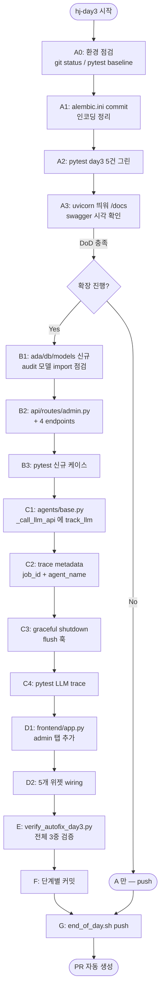
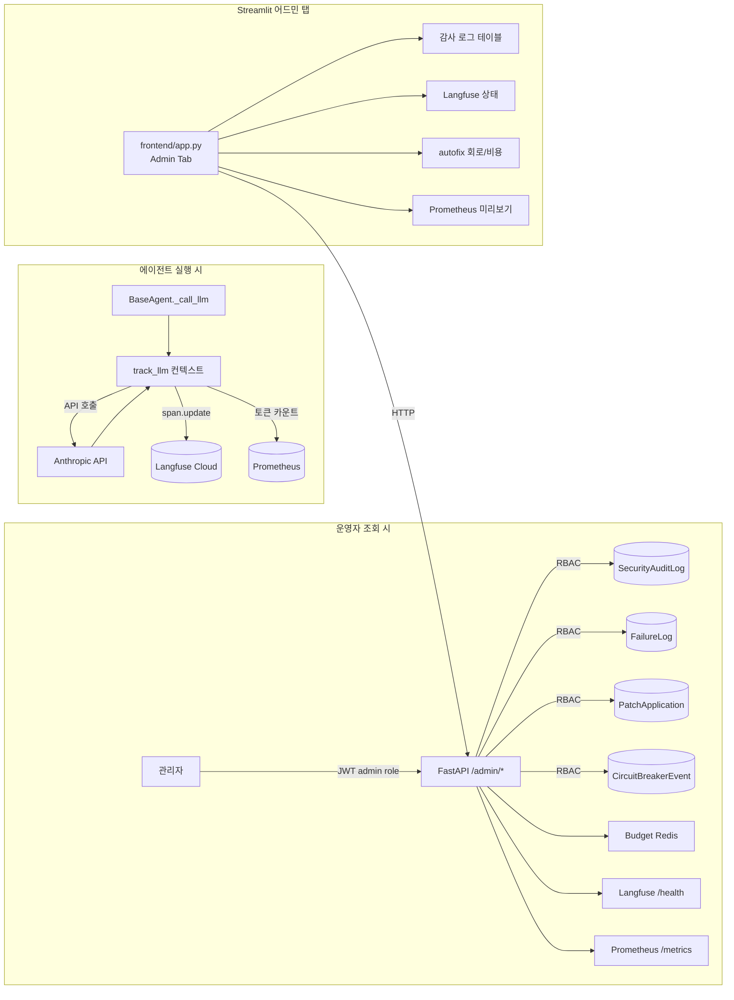
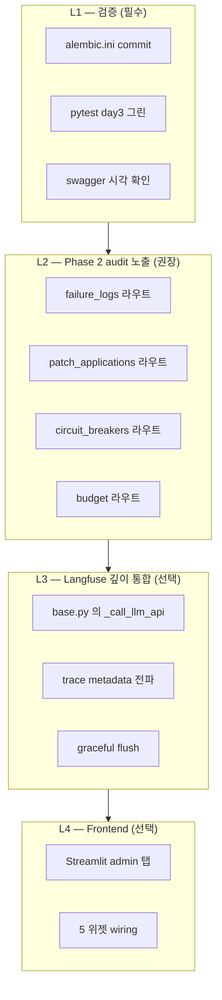
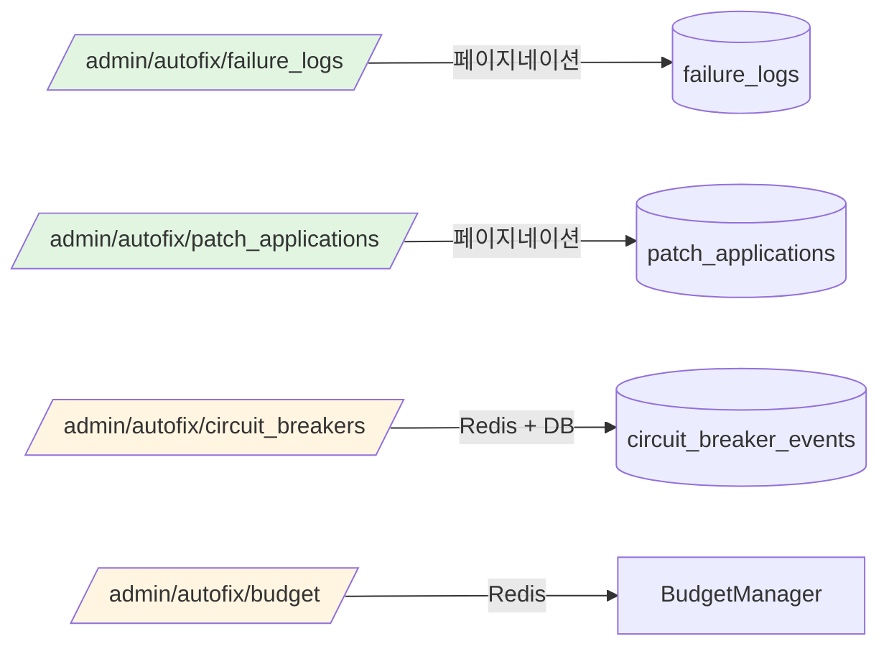
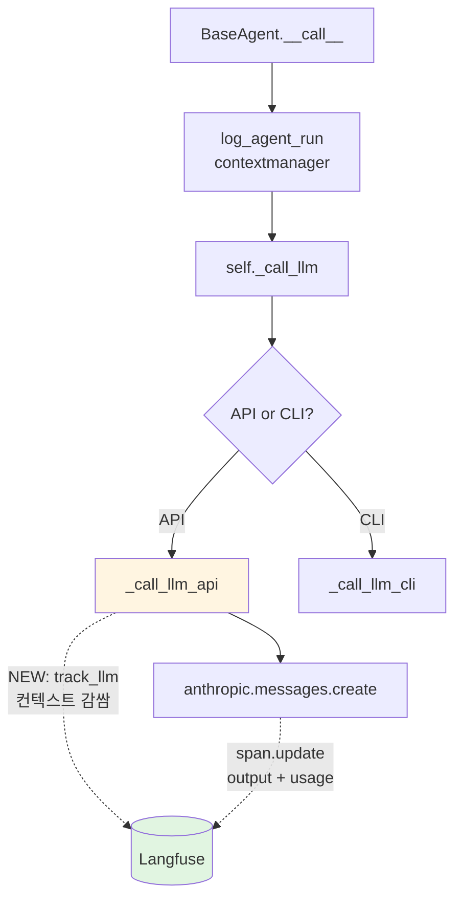
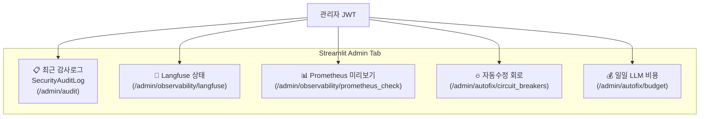
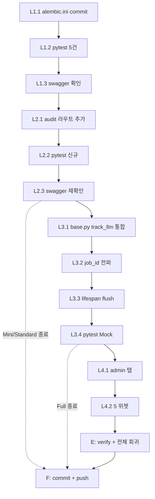

# ADR-007 — Day 3: Langfuse 깊이 통합 + 관리자 Audit Dashboard

> **Status**: Proposed (HJ)
> **Date**: 2026-05-28 (hj-day3)
> **Owners**: HJ
> **Related**: ADR-006 (Auto Error Resolution Phase 1+2)
> **TEAM_10DAY_SCHEDULE 매핑**: Day 3 HJ — `Langfuse 연동 검증 + audit 대시보드 라우터 /admin/audit (admin RBAC)`

---

## 0. 한눈에 보는 흐름도

### 0.1 작업 순서 (작업자 입장)



### 0.2 런타임 데이터 흐름 (시스템 입장)



### 0.3 책임 매트릭스



---

## 1. 배경 & 목표

### 1.1 공식 Day 3 DoD
- Swagger UI 에서 `GET /admin/audit` 엔드포인트 등장

### 1.2 실제 현재 상태
이전 hj-day 통합 커밋에서 골격은 이미 작성되어 있음:
- `ada/core/langfuse_client.py` (106줄) — verify_connection / track_llm / flush / trace
- `api/routes/admin.py` (152줄) — 4개 엔드포인트 (audit, audit/summary, observability/langfuse, observability/prometheus_check)
- `api/main.py` — admin router 등록 완료 (line 116-118)
- `ada/security/rbac.py` (31줄) — require_perm + admin/service/analyst/viewer
- `tests/test_day3_admin_langfuse.py` (104줄) — 5개 테스트

→ **공식 DoD 만 보면 사실상 끝.** 하지만 ADR-006 Phase 2 의 신규 audit 테이블 (`patch_applications`, `circuit_breaker_events`, `failure_logs` 신규 컬럼) 이 dashboard 에 노출 안 됨. 운영 모니터링 관점에서 공백.

### 1.3 본 ADR 의 목표
Day 3 의 실질적 완성 = **공식 DoD + Phase 2 audit 통합 + Langfuse 실호출 trace + Frontend 어드민 탭**.

총 4 레이어 (L1 ~ L4) 로 점층적으로 구축. L1 만 해도 DoD 충족, L4 까지 가면 운영 가능 수준.

### 1.4 누수 방지 원칙
1. **순서 보장**: L1 통과 안 한 채 L2+ 진행 금지 (기존 코드 회귀 위험)
2. **3중 검증**: 단계별 정적 분석 + 단위 테스트 + 통합 영향 평가
3. **R-403 영역 준수**: 모든 변경은 HJ 영역 (`ada/`, `api/`, `frontend/app.py`, `agents/base.py`, `docs/`, `tests/test_day3_*`, `tests/test_autofix_*`)
4. **Phase 2 모듈과의 결합도 최소화**: Day 3 라우트가 Phase 2 코드를 import 하는 단방향 의존성만 허용
5. **에러 격리**: 새 라우트의 예외가 기존 라우트에 전파 안 되게 — `try/except + 500 JSON` 패턴

---

## 2. L1 — 마무리/검증 (필수, 30분)

### 2.1 작업 단위

| # | 작업 | 파일 | 검증 |
|---|---|---|---|
| L1.1 | `alembic.ini` 커밋 | `alembic.ini` | `git status` clean |
| L1.2 | Day 3 pytest 5건 그린 | `tests/test_day3_admin_langfuse.py` | `pytest -v` 5 passed |
| L1.3 | Swagger 시각 확인 | (런타임) | `http://localhost:8000/docs` Admin 섹션 4개 노출 |

### 2.2 L1.3 수동 검증 절차

```bash
# 1) DB 연결 가능한지 (Phase 2-F 마이그레이션 적용 여부와 별개)
docker compose -f docker/docker-compose.yml ps postgres

# 2) uvicorn 띄우기
.venv\Scripts\Activate.ps1
uvicorn api.main:app --reload --port 8000

# 3) 브라우저: http://localhost:8000/docs
# 확인:
#   - "Admin" 태그 아래 4개 엔드포인트
#       GET /admin/audit
#       GET /admin/audit/summary
#       GET /admin/observability/langfuse
#       GET /admin/observability/prometheus_check
#   - 각 엔드포인트 클릭 → "Authorize" 버튼 → JWT (admin role) 입력
#   - "Try it out" 으로 호출 → 200 응답
```

### 2.3 L1 통과 기준
- pytest 5건 모두 passed
- swagger 의 Admin 섹션에 4개 엔드포인트 노출
- analyst JWT 로 호출 시 403 (RBAC 작동)

---

## 3. L2 — Phase 2 audit 라우트 확장 (권장, 1.5시간)

### 3.1 신규 엔드포인트 4개



### 3.2 엔드포인트 명세

#### `GET /admin/autofix/failure_logs`
필터: `classified_as`, `severity`, `since_hours`, `auto_handled_by_kb`
페이지네이션: `page`, `page_size`
응답:
```json
{
  "items": [
    {
      "id": "...",
      "job_id": "...",
      "error_hash": "abc123...",
      "error_category": "auto",
      "classified_as": "code_bug",
      "severity": "normal",
      "redaction_types": ["EMAIL", "IP"],
      "auto_handled_by_kb": false,
      "created_at": "2026-05-28T13:30:00Z"
    }
  ],
  "total": 1234,
  "page": 1,
  "page_size": 50
}
```

#### `GET /admin/autofix/patch_applications`
필터: `status`, `applied_by`, `since_hours`
응답: PatchApplication 목록 + status 분포 (success/rolled_back/failed)

#### `GET /admin/autofix/circuit_breakers`
응답:
```json
{
  "current_state": {
    "ollama": {"state": "closed", "fails": 0},
    "claude_cli": {"state": "open", "fails": 3, "opened_at": "..."}
  },
  "recent_events": [...]
}
```

#### `GET /admin/autofix/budget`
응답:
```json
{
  "today_spend_usd": 12.34,
  "today_calls": 567,
  "daily_limit_usd": 50.0,
  "remaining_usd": 37.66,
  "is_exceeded": false,
  "model_breakdown": {...}
}
```

### 3.3 구현 패턴 (기존 `/admin/audit` 와 동일)

```python
# api/routes/admin.py 에 추가

@router.get("/admin/autofix/failure_logs", tags=["Admin", "AutoFix"])
async def get_failure_logs(
    page: int = Query(1, ge=1),
    page_size: int = Query(50, ge=1, le=500),
    classified_as: Optional[str] = None,
    severity: Optional[str] = None,
    auto_handled_by_kb: Optional[bool] = None,
    since_hours: Optional[int] = Query(None, ge=1, le=24 * 30),
    db: AsyncSession = Depends(get_db),
    _user: dict = Depends(_admin_only),
) -> dict[str, Any]:
    """ADR-006 Phase 2-F audit — FailureLog 페이지네이션."""
    from ada.db.models import FailureLog
    # ... 기존 get_audit_log 패턴 그대로 ...
```

### 3.4 검증 추가

`tests/test_day3_admin_langfuse.py` 에 4개 케이스 추가:
- `test_admin_failure_logs_returns_pagination`
- `test_admin_patch_applications_filter_by_status`
- `test_admin_circuit_breakers_returns_current_state`
- `test_admin_budget_returns_today_spend`

---

## 4. L3 — Langfuse 깊이 통합 (선택, 2시간)

### 4.1 문제: 현재 langfuse_client 가 dead code

`langfuse_client.py` 의 `track_llm()` 컨텍스트는 정의돼 있지만 **실제 호출처 0건**. 그래서 Langfuse 대시보드에 trace 0건.

### 4.2 통합 지점



### 4.3 구현

```python
# agents/base.py 의 _call_llm_api 수정

async def _call_llm_api(self, ...):
    import anthropic
    from ada.core.langfuse_client import track_llm

    if self._anthropic is None:
        self._anthropic = anthropic.AsyncAnthropic(api_key=settings.anthropic_api_key)

    breaker = get_breaker("anthropic", fail_max=3, reset_timeout=30)
    actual_model = model_name or self.model_name

    # ADR-007 L3: Langfuse trace 컨텍스트
    with track_llm(
        name=self.__class__.__name__,
        model=actual_model,
        job_id=getattr(self, "_current_job_id", None),  # 옵션
        agent=self.__class__.__name__,
    ) as span:
        try:
            resp = await breaker.call(_do_call) if ... else await _do_call()
        except Exception as e:
            if span and hasattr(span, "update"):
                span.update(level="ERROR", status_message=str(e)[:200])
            raise

        # span 에 결과 기록
        if span and hasattr(span, "update"):
            usage = getattr(resp, "usage", None)
            span.update(
                output={"first_block_type": getattr(resp.content[0], "type", None) if resp.content else None},
                metadata={
                    "input_tokens": getattr(usage, "input_tokens", 0) if usage else 0,
                    "output_tokens": getattr(usage, "output_tokens", 0) if usage else 0,
                },
            )
        # ... 기존 토큰 카운트 / Prometheus 코드 ...
        return text
```

### 4.4 job_id 전파 (선택적 보강)

현재 `BaseAgent` 는 `state.job_id` 를 `log_agent_run` 컨텍스트에서만 받음. `track_llm` 도 받으려면:

**옵션 A (간단, 권장)**: `BaseAgent.__init__` 에 `_current_job_id` 인스턴스 변수 추가, `log_agent_run` 진입 시 세팅.

**옵션 B (정석)**: contextvars 로 thread-local job_id 전파 (langfuse SDK 기본 패턴).

Phase 3 (Redis Streams) 까지 가면 옵션 B 가 자연스럽지만, Day 3 범위에선 A 로 시작.

### 4.5 graceful shutdown

`api/main.py` 의 lifespan 에서 종료 시 `flush()` 호출:

```python
# api/main.py

from contextlib import asynccontextmanager

@asynccontextmanager
async def lifespan(app):
    yield  # 가동 중
    # shutdown
    from ada.core.langfuse_client import flush
    flush(timeout_sec=5.0)

app = FastAPI(lifespan=lifespan, ...)
```

### 4.6 검증

`tests/test_day3_admin_langfuse.py` 에 추가:
- `test_base_agent_calls_track_llm_when_langfuse_configured` (mock)
- `test_track_llm_span_records_token_usage`
- `test_lifespan_calls_flush_on_shutdown`

---

## 5. L4 — Streamlit 어드민 탭 (선택, 1시간)

### 5.1 5 위젯 구성



### 5.2 구현 위치
`frontend/app.py` 에 `with tabs[N]:` 블록 추가. 이미 `prometheus_check` 호출하는 기존 코드 (line 177) 가 있으니 그 부근에 통합.

---

## 6. 단계별 작업 로직 (구현자 체크리스트)

### Phase L1 — 검증 (30분)

```
[ ] L1.1.a  git status — alembic.ini 만 변경됐는지 확인
[ ] L1.1.b  git add alembic.ini && git commit -m "hj-day3: alembic.ini 영문화"
[ ] L1.2.a  PYTHONUTF8=1 python -m pytest tests/test_day3_admin_langfuse.py -v
[ ] L1.2.b  5 passed 확인
[ ] L1.3.a  uvicorn api.main:app --reload --port 8000  (별도 PowerShell)
[ ] L1.3.b  http://localhost:8000/docs 열기
[ ] L1.3.c  Admin 섹션 4개 엔드포인트 확인
[ ] L1.3.d  uvicorn Ctrl+C
```

### Phase L2 — Audit 확장 (1.5시간)

```
[ ] L2.1.a  api/routes/admin.py 백업 (git diff 로 충분)
[ ] L2.1.b  AuditEntry/AuditPage 패턴 학습 (이미 있음)
[ ] L2.2.a  /admin/autofix/failure_logs 구현 (~40줄)
[ ] L2.2.b  /admin/autofix/patch_applications 구현 (~40줄)
[ ] L2.2.c  /admin/autofix/circuit_breakers 구현 (~30줄)
[ ] L2.2.d  /admin/autofix/budget 구현 (~25줄)
[ ] L2.3.a  pytest 신규 4건 작성 (test_admin_*_phase2)
[ ] L2.3.b  pytest -v 9 passed (기존 5 + 신규 4)
[ ] L2.3.c  uvicorn 다시 띄워 swagger 확인
```

### Phase L3 — Langfuse 통합 (2시간)

```
[ ] L3.1.a  agents/base.py 의 _call_llm_api 백업
[ ] L3.1.b  track_llm 컨텍스트 wrap
[ ] L3.1.c  span.update 로 토큰/메타 전송
[ ] L3.1.d  예외 시 span.update(level="ERROR") 추가
[ ] L3.2.a  BaseAgent._current_job_id 인스턴스 변수 추가
[ ] L3.2.b  log_agent_run 진입 시 세팅
[ ] L3.2.c  track_llm 호출 시 job_id 전파
[ ] L3.3.a  api/main.py 에 lifespan + flush
[ ] L3.4.a  pytest 신규 3건 (test_langfuse_*)
[ ] L3.4.b  Mock 으로 track_llm 호출 검증
[ ] L3.4.c  실제 LANGFUSE_* env var 셋업 시 Langfuse cloud 에 1건 trace 보이는지 (수동)
```

### Phase L4 — Frontend (1시간)

```
[ ] L4.1.a  frontend/app.py 에 admin 탭 추가
[ ] L4.2.a  위젯 1: 감사로그 테이블 (st.dataframe)
[ ] L4.2.b  위젯 2: Langfuse 상태 (st.metric)
[ ] L4.2.c  위젯 3: Prometheus 미리보기 (st.code)
[ ] L4.2.d  위젯 4: autofix 회로 (st.columns + st.metric)
[ ] L4.2.e  위젯 5: 일일 비용 (st.progress + st.metric)
[ ] L4.3.a  streamlit run frontend/app.py 로 시각 확인
```

### Phase E — 검증 스크립트

```
[ ] E.1  scripts/dev/verify_day3.py 작성 (40+ assertion)
[ ] E.2  python scripts/dev/verify_day3.py
[ ] E.3  pytest tests/ -q (전체 회귀)
```

### Phase F+G — 커밋 + Push

```
[ ] F.1  L1 끝나면 commit (작은 단위)
[ ] F.2  L2 끝나면 commit
[ ] F.3  L3 끝나면 commit
[ ] F.4  L4 끝나면 commit
[ ] G.1  bash scripts/dev/end_of_day.sh
[ ] G.2  PR URL 확인, auto-pr.yml 이 제목/본문 채움
```

---

## 7. 위험 & 완화

| 위험 | 영향 | 완화책 |
|---|---|---|
| `_call_llm_api` 수정이 기존 동작 깨트림 | 모든 agent LLM 호출 영향 | track_llm 이 None 반환 시 no-op (이미 보장됨) + pytest 회귀 |
| Langfuse cloud 다운 → trace 실패 → agent 실패 | 운영 사고 | track_llm 의 try/except 가 이미 모든 예외 흡수 (코드 검증됨) |
| 신규 audit 라우트가 admin.py 비대화 | 유지보수성 | 200줄 미만 유지, 넘으면 `api/routes/admin_autofix.py` 분리 |
| Streamlit 위젯이 백엔드 미준비 상태에서 호출 | 사용자 혼란 | 위젯마다 try/except + "조회 실패" 메시지 (기존 패턴) |
| PR 비대 (L1~L4 한 번에) | 리뷰 어려움 | 단계별 commit, 필요시 별도 PR 분리 가능 |

---

## 8. 의사결정 — 진행 범위

| 옵션 | 포함 | 소요 | 효과 |
|---|---|---|---|
| **Mini** | L1 만 | 30분 | 공식 DoD 충족, 가장 빠른 PR |
| **Standard** | L1 + L2 | 2시간 | Phase 2 audit 도 노출, 운영 모니터링 ↑ |
| **Full** | L1 + L2 + L3 | 4시간 | Langfuse 실 trace 까지 — Day 3 완성도 100% |
| **Maxi** | L1 + L2 + L3 + L4 | 5시간 | Streamlit UX 완성 |

**권장**: **Standard (L1 + L2)** — 공식 DoD + Phase 2 통합. L3/L4 는 시간 여유 있으면 추가.

---

## 9. 작업 순서 의존성 (DAG)



핵심 의존성:
- **L2 는 L1 필수 선행** (admin.py 가 작동 안 하면 의미 없음)
- **L3 는 L2 선행 권장** (트레이스가 audit 라우트와 짝)
- **L4 는 L2+L3 모두 선행** (위젯이 백엔드 호출)

---

## 10. 부록 A — 파일 영향 매트릭스

| 파일 | L1 | L2 | L3 | L4 | 줄수 변동 |
|---|---|---|---|---|---|
| `alembic.ini` | ✏️ | - | - | - | 0 (이미 변경됨) |
| `api/routes/admin.py` | - | ✏️ | - | - | +130 |
| `agents/base.py` | - | - | ✏️ | - | +35 |
| `api/main.py` | - | - | ✏️ | - | +12 (lifespan) |
| `frontend/app.py` | - | - | - | ✏️ | +80 |
| `tests/test_day3_admin_langfuse.py` | - | ✏️ | ✏️ | - | +120 |
| `scripts/dev/verify_day3.py` | - | - | - | - | +180 (신규) |
| `docs/ADR-007-DAY3-LANGFUSE-ADMIN.md` | - | - | - | - | 본 문서 |

전부 HJ 영역. 다른 멤버 영역 0건.

---

## 11. 부록 B — Mini 옵션 명령 (가장 빠른 PR)

```powershell
cd C:\IT\workspace_python\ADA
.\venv\Scripts\Activate.ps1

# L1.1
git add alembic.ini
git commit -m "hj-day3: alembic.ini 한글 주석 영문화 (cp949 인코딩 회피)"

# L1.2
python -m pytest tests/test_day3_admin_langfuse.py -v
# → 5 passed 확인

# L1.3 (선택, 시각 검증)
$env:PYTHONUTF8="1"
uvicorn api.main:app --reload --port 8000
# 브라우저: http://localhost:8000/docs (Admin 섹션 4개 확인 후 Ctrl+C)

# G
bash scripts/dev/end_of_day.sh
```

이 5줄로 Day 3 공식 DoD 완료.

— 끝.
