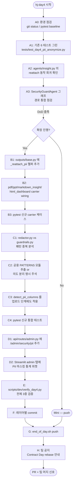
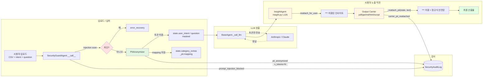
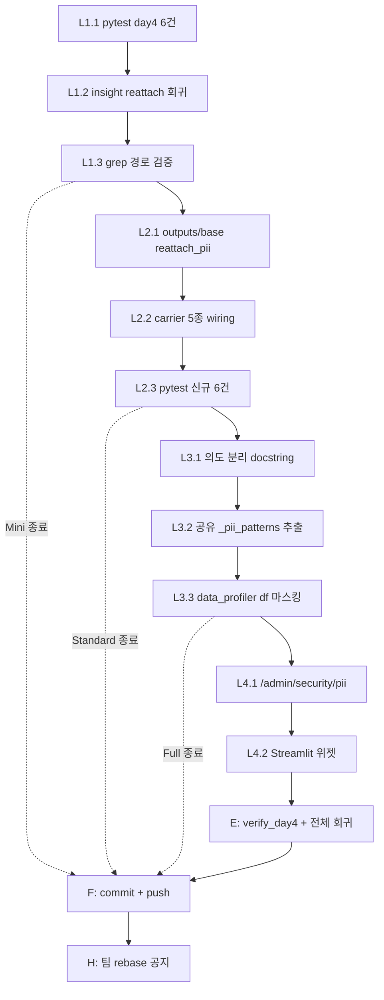

# ADR-008 — Day 4: LLM Guard 풀 통합 + PII Anonymize↔Re-attach 파이프라인

> **Status**: Proposed (HJ)
> **Date**: 2026-05-28 (hj-day4)
> **Owners**: HJ
> **Related**: ADR-006 Phase 2-A (`ada/error_handler/redactor.py`), ADR-007 (Day 3 admin/Langfuse), `agents/insight.py` Day 4 hook
> **Contract Day**: Yes — CLAUDE.md §5. 본 PR 머지 후 CS/NY/jh rebase 필수
> **TEAM_10DAY_SCHEDULE 매핑**: Day 4 HJ — `LLM Guard 풀 통합 (PII anonymize→re-attach 파이프라인) + 입력 차단 audit`. 단독 수정 파일: `ada/security/guardrails.py`, `agents/security_guard.py`. DoD: `PII 컬럼 자동 마스킹 후 결과 페이지에 ***`.

---

## 0. 한눈에 보는 흐름도

### 0.1 작업 순서 (작업자 입장)



### 0.2 런타임 데이터 흐름 (시스템 입장)



### 0.3 책임 매트릭스

```mermaid
flowchart TB
    subgraph L1["L1 — 검증 (필수, 30분)"]
        L1A[기존 6 pytest 그린]
        L1B[Insight reattach 회귀]
        L1C[graph 통합 경로 점검]
    end

    subgraph L2["L2 — Carrier reattach (권장, 1.5h)"]
        L2A[outputs/base 헬퍼]
        L2B[pdf/ppt/md/html/script wiring]
        L2C[pytest carrier 6건]
    end

    subgraph L3["L3 — 중복 패턴 정리 + DataFrame 마스킹 (선택, 2h)"]
        L3A[redactor vs guardrails 의도 분리]
        L3B[detect_pii_columns 업로드 hook]
        L3C[pytest 통합 4건]
    end

    subgraph L4["L4 — 어드민 PII 위젯 (선택, 1h)"]
        L4A[/admin/security/pii 라우트]
        L4B[Streamlit 마스킹 통계 위젯]
    end

    L1 --> L2
    L2 --> L3
    L3 --> L4
```

---

## 1. 배경 & 목표

### 1.1 공식 Day 4 DoD
- **PII 컬럼 자동 마스킹 후 결과 페이지에 `***`** (TEAM_10DAY_SCHEDULE.md)

### 1.2 실제 현재 상태 (이전 커밋에서 골격 작성됨)

| 컴포넌트 | 파일 | 줄수 | 상태 |
|---|---|---|---|
| `PIIAnonymizer` (anonymize_text/df/anonymize/reattach) | `ada/security/guardrails.py` | 244 | ✅ 완성 |
| `SecurityGuardAgent.__call__` (스캔→차단→마스킹→mapping 저장) | `agents/security_guard.py` | 144 | ✅ 완성 |
| `anonymize_for_llm` / `reattach_for_user` 정적 헬퍼 | `agents/security_guard.py` | — | ✅ 완성 |
| Day 4 pytest 6건 (detect/text deterministic/reattach/blocks/state/injection) | `tests/test_day4_pii_anonymize.py` | 125 | ✅ 작성됨 (실행 검증 필요) |
| `InsightAgent` 의 `reattach_for_user` 호출 | `agents/insight.py:126-135` | — | ✅ Day 4 hook 작성됨 |
| Output carrier reattach | `outputs/pdf.py`, `ppt.py`, `markdown_insight.py`, `html_dashboard.py`, `script.py` | 5 파일 | ❌ **누락** (LLM 응답이 carrier 까지 흘러갈 때 토큰/원본이 그대로 노출될 위험) |
| Audit 이벤트 (`pii_anonymized`) | `ada/security/audit.py` 사용 | — | ✅ 호출 코드 있음 |
| `detect_pii_columns` 업로드 단계 적용 | (없음) | — | ❌ **누락** (DataFrame 의 PII 열은 LLM 호출 시 마스킹되지 않음) |
| 중복 PII 패턴 (`redactor.py` 20+개 vs `guardrails.py` 4개) | 2 모듈 | — | ⚠️ **의도 분리 명시 필요** |

**판단**: 공식 DoD (PII 컬럼 자동 마스킹 후 결과 페이지에 `***`) 는 **InsightAgent 경로만으론 80% 달성**. 다만:
- (a) carrier 단계가 reattach 안 하므로 PPT/PDF 본문에 토큰 잔존 가능
- (b) DataFrame 의 PII 컬럼은 detect 함수는 있으나 자동 호출 hook 없음

→ 본 ADR 의 목표는 **두 갭을 닫고 DoD 를 끝까지 통과시키는 것**.

### 1.3 본 ADR 의 목표

| 레이어 | 목표 | 산출물 위치 (HJ 영역) |
|---|---|---|
| L1 | 기존 코드 회귀 검증 + Insight reattach 동작 확인 | `tests/test_day4_*` 그린 |
| L2 | carrier 5종이 LLM 응답을 사용자에 노출하기 직전 `reattach` 통과 | `outputs/base.py`, `outputs/{pdf,ppt,markdown_insight,html_dashboard,script}.py` |
| L3 | DataFrame 업로드 시 PII 컬럼 자동 마스킹 + 두 redactor 의도 분리 명시 | `agents/security_guard.py`, `ada/security/guardrails.py`, (선택) `ada/security/_pii_patterns.py` |
| L4 | 운영 관점: Streamlit 어드민 탭에 "오늘 마스킹된 PII 토큰 N건" 위젯 | `api/routes/admin.py`, `frontend/app.py` |

총 4 레이어. **L1 만 해도 공식 DoD 충족**, **L1+L2 (Standard) 까지 가야 carrier 산출물 안전성 100%**.

### 1.4 누수 방지 원칙

1. **두 PII 모듈의 의도 분리 명시**: `redactor.py` 는 **일방향** (디버깅용 — error log 에 PII 남기지 않기, mapping 없음), `guardrails.py` 의 `PIIAnonymizer` 는 **양방향** (LLM 호출용 — 토큰 mapping 보존 → reattach 가능). 통합 시도하면 reattach 가 깨짐. 본 ADR 은 통합하지 않고 의도를 코드 주석으로 명시.
2. **R-103 PII 로그 출력 금지** 절대 우회 금지. carrier 가 reattach 한 결과만 stdout/file 로 흘러야 함.
3. **R-005 PipelineState 직접 수정 금지**: `state.with_update(...)` 패턴만 사용 (현 `SecurityGuardAgent` 이미 준수).
4. **R-403 영역 준수**: 전 변경이 HJ 영역. 카테고리 핸들러 (`agents/handlers/*`) 는 건드리지 않음 — 다만 핸들러 `output_extras.build()` 가 반환하는 `text_blocks` 에 PII 가 섞일 수 있어 **carrier 헬퍼는 `text_blocks` 도 reattach** 해야 함 (Day 9 contract 와 충돌 없이).
5. **Contract Day rebase 안내**: 머지 직후 CS/NY/jh 에게 `git rebase origin/main` 후 자기 핸들러 단위 테스트 재실행 요청. 만약 핸들러 `text_blocks` 가 raw PII 를 넣으면 carrier reattach 가 받쳐주므로 핸들러 코드 강제 변경은 없음 (방어적 정렬).

---

## 2. L1 — 검증 / 회귀 (필수, 30분)

### 2.1 작업 단위

| # | 작업 | 파일 | 검증 |
|---|---|---|---|
| L1.1 | Day 4 pytest 6건 그린 | `tests/test_day4_pii_anonymize.py` | `pytest -v` 6 passed |
| L1.2 | Insight 의 Day 4 reattach hook 회귀 | `agents/insight.py:126-135` | 단위 테스트로 mapping 있을 때 reattach 호출 검증 |
| L1.3 | 그래프 통합 경로 점검 (SecurityGuardAgent → state.category_extras['_pii'] → InsightAgent reattach) | (정적 grep) | 코드 경로 3중 검증 |

### 2.2 L1 통과 기준

- `tests/test_day4_pii_anonymize.py` 6 passed (회귀 0)
- `tests/test_day8_insight_guard.py` 회귀 0 (Day 4 hook 추가 후에도 통과)
- 전체 `pytest -q` 회귀 0

### 2.3 L1.3 정적 경로 검증 (3중 grep)

```bash
# V1 — SecurityGuardAgent 가 mapping 을 정확히 _pii 키로 저장하는지
grep -n '"_pii"' agents/security_guard.py
#   → line 71: extras["_pii"] = { ... }

# V2 — InsightAgent 가 동일 키로 mapping 을 읽는지
grep -n '"_pii"' agents/insight.py
#   → line 128: pii_meta = (state.category_extras or {}).get("_pii") or {}

# V3 — 그래프에 SecurityGuardAgent 가 InsightAgent 앞에 실제로 배치되는지
grep -n 'security_guard\|SecurityGuardAgent\|insight' orchestrator/graph.py
#   → security_guard 가 InsightAgent 의 선행 노드여야 mapping 이 채워짐
```

3개 모두 통과 시 L1 완료.

---

## 3. L2 — Output Carrier reattach 통합 (권장, 1.5시간)

### 3.1 현재 문제

`InsightAgent` 가 `state.insights` 에 reattach 된 텍스트를 채워주긴 하지만, carrier 는:
- `best_model["model_name"]`, `eval_result["rationale"]`, `text_blocks` (Day 9 핸들러 산출) 등 **LLM 이 generate 한 다른 필드**에 raw PII 가 섞여 들어올 수 있음.
- `user_intent` / `user_question` 은 현재 `SecurityGuardAgent` 가 마스킹한 후 LLM 에 전달되는데, carrier 가 다시 `user_intent` 를 출력에 표시할 때 **토큰이 그대로 노출**되는 사례 발생 (예: `markdown_insight.py:25` `> 사용자 의도: {user_intent}`).

### 3.2 해법: `outputs/base.py` 에 공용 헬퍼 추가

```python
# outputs/base.py (L2 신규)

from typing import TYPE_CHECKING

if TYPE_CHECKING:
    from ada.core.state import PipelineState


def reattach_pii(state: "PipelineState | None", text: str | None) -> str:
    """LLM 응답/사용자 인텐트 등 사용자 노출 직전 텍스트에 ``***`` 치환.

    동작 순서:
        1. state.category_extras['_pii']['mapping'] 의 토큰을 ``***`` 로
        2. 정규식 안전망 — LLM 이 자체 generate 한 raw PII 도 마스킹
        3. mapping 없으면 정규식 안전망만 수행 (state 가 None 이어도 안전)

    R-103 (PII 로그 출력 금지) 의 최종 게이트 — carrier 가 사용자에게
    무엇을 보여주든 본 함수를 통과시킬 것.
    """
    if not text:
        return text or ""
    try:
        from ada.security.guardrails import PIIAnonymizer
    except Exception:
        return text  # 보안 모듈 부재 시에도 carrier 가 죽지 않음

    mapping: dict[str, str] = {}
    if state is not None:
        try:
            pii_meta = (state.category_extras or {}).get("_pii") or {}
            mapping = pii_meta.get("mapping") or {}
        except Exception:
            mapping = {}

    return PIIAnonymizer().reattach(text, mapping)
```

→ `reattach` 메서드는 이미 (a) mapping 토큰 치환, (b) 정규식 안전망 둘 다 처리하므로 헬퍼는 위임만.

### 3.3 carrier 5종 wiring 패턴

각 carrier 의 `generate()` 진입부에서 사용자 노출 텍스트를 한 번에 마스킹:

```python
# 예: outputs/markdown_insight.py
from outputs.base import OutputGenerator, reattach_pii

class InsightSummaryGenerator(OutputGenerator):
    def generate(self, *, insights, best_model, eda_charts, category, user_intent,
                 eval_result, state=None) -> str:
        # L2 — 사용자 노출 전 마스킹
        insights = reattach_pii(state, insights)
        user_intent = reattach_pii(state, user_intent)
        rationale = reattach_pii(state, (eval_result or {}).get("rationale"))
        # ... 나머지 변경 없음 ...
```

| Carrier | 마스킹 대상 필드 (사용자 노출 텍스트) |
|---|---|
| `markdown_insight.py` (OUT-07) | `insights`, `user_intent`, `eval_result.rationale` |
| `pdf.py` (OUT-02) | `insights`, `user_intent`, `eval_result.rationale`, `text_blocks` |
| `ppt.py` (OUT-01) | `insights`, `user_intent`, `eval_result.rationale`, `text_blocks` |
| `html_dashboard.py` (OUT-04) | `insights`, `user_intent`, `text_blocks` |
| `script.py` (OUT-03) | 헤더 주석에 사용자 의도 들어가는 경우만 (현 코드 확인 필요) |

### 3.4 base.py `_call_extras` 와의 결합

`_call_extras()` 가 반환하는 `text_blocks` (list[str]) 는 카테고리 핸들러가 generate. 이 안에도 PII 가 섞일 수 있음. 따라서 base 의 `_call_extras` 를 wrap 하거나, carrier 가 호출 직후:

```python
extras = self._call_extras(state)
extras["text_blocks"] = [reattach_pii(state, t) for t in extras.get("text_blocks", [])]
```

### 3.5 pytest 신규 케이스

`tests/test_day4_carrier_reattach.py` 신규 6 케이스:

| # | 케이스 | 검증 |
|---|---|---|
| 1 | `test_reattach_pii_helper_with_empty_state` | state=None 일 때도 정규식 안전망 작동 |
| 2 | `test_reattach_pii_helper_with_mapping` | state.category_extras['_pii'].mapping 토큰 → `***` |
| 3 | `test_markdown_insight_redacts_user_intent` | `user_intent="my email me@x.com"` → 결과에 `***` |
| 4 | `test_pdf_generator_redacts_insights` | (reportlab mock) insight 본문에 raw PII 없음 |
| 5 | `test_html_dashboard_redacts_text_blocks` | `text_blocks` 에 raw PII 넣어도 HTML 에 `***` |
| 6 | `test_carrier_works_without_state_arg` | 하위호환 — state 미전달 시도 동작 |

### 3.6 호환성 가드 (carrier 시그니처 변경)

`markdown_insight.py` 등 일부 carrier 는 현재 `state` 인자를 받지 않음. **양방향 호환 시그니처**로 추가:

```python
def generate(self, *, insights, ..., state: Any = None) -> str:
```

→ 기존 호출자 (`agents/report_composer.py`) 가 `state` 를 안 넘겨도 `None` 으로 처리. carrier 내부 helper 는 `state is None` 분기 처리됨.

### 3.7 L2 통과 기준

- 신규 6 pytest passed
- 기존 carrier 단위 테스트 회귀 0
- 수동 검증: PPT 1건 생성 → 본문에 `me@x.com` / `010-...` 없음, `***` 있음

---

## 4. L3 — 패턴 중복 정리 + DataFrame 업로드 마스킹 (선택, 2시간)

### 4.1 두 PII 모듈 비교

| 항목 | `ada/error_handler/redactor.py` | `ada/security/guardrails.py` |
|---|---|---|
| 패턴 수 | 20+ (CARD, RRN, PASSPORT, JWT, Bearer, Stripe, GitHub, AWS, PEM, EMAIL, PHONE, IPv4/6, MAC, USER_PATH 등) | 4 (EMAIL, RRN, PHONE, CARD) |
| 치환 | 일반 토큰 `<EMAIL>`, `<PHONE>` | 결정적 토큰 `<PII:email:hash8>` |
| Mapping 보존 | ❌ 일방향 | ✅ 양방향 (reattach 가능) |
| 용도 | 에러 메시지/스택/Ollama 프롬프트 — **디버깅 우선** | LLM 호출용 user_intent/df — **사용자 응답 복원 가능** |
| 사용 위치 | `auto_error_handler`, FailureLog 저장 전 | `SecurityGuardAgent`, `InsightAgent`, carrier (예정) |

**의도가 다르므로 통합하면 안 됨**. 단, **공유 가능한 정규식 (CARD/RRN/EMAIL/PHONE)** 은 한 곳에 두고 양쪽이 import 하는 것이 유지보수에 좋음.

### 4.2 L3.1 — 의도 분리 명시 (15분, 안전)

각 모듈 docstring 에 다음 문구 추가:

```python
# redactor.py 상단
"""
주의 — guardrails.PIIAnonymizer 와 의도 분리:
    redact()      : 일방향. mapping 미보존. 디버깅성 우선 (CARD/RRN 등 20+ 패턴).
    PIIAnonymizer : 양방향. mapping 보존 → reattach 가능. LLM 응답 사용자 노출용.
    두 모듈을 통합하면 reattach 가 깨짐 — 의도 보존.
"""

# guardrails.py 상단도 동일 문구 (대칭)
```

이것만으로 향후 신규 멤버가 통합 시도하는 것을 막을 수 있음. **L3.1 만 단독 적용 가능 (15분)**.

### 4.3 L3.2 — 공유 정규식 모듈 (45분, 권장)

신규 `ada/security/_pii_patterns.py` (50줄 미만):

```python
"""ada.security._pii_patterns — 공유 PII 정규식 (LOW-LEVEL, import-only).

redactor.py 와 guardrails.py 양쪽이 import 해 사용.
본 모듈은 패턴만 정의 — 치환 정책 (mapping 유무) 은 각 호출자가 결정.
"""
import re

EMAIL_RE = re.compile(r"\b[\w.+-]+@[\w-]+\.[\w.-]+\b")
PHONE_KR_RE = re.compile(r"\b(?:\+?82[-\s.]?|0)1[016789][-\s.]?\d{3,4}[-\s.]?\d{4}\b")
RRN_RE = re.compile(r"\b\d{6}-?[1-4]\d{6}\b")
CARD_RE = re.compile(r"\b\d{4}[-\s]?\d{4}[-\s]?\d{4}[-\s]?\d{4}\b")
# ... (필요 시 추가)
```

→ `redactor.REDACTION_PATTERNS` 와 `guardrails.PII_PATTERNS` 가 본 모듈을 import. 두 호출자가 다른 replacement (`<EMAIL>` vs `<PII:email:hash8>`) 를 적용. **마스킹 정책의 진실 원천 (single source of truth) 은 패턴 자체 1곳**.

### 4.4 L3.3 — DataFrame 업로드 단계 PII 컬럼 마스킹 (1시간)

현재 `PIIAnonymizer.detect_pii_columns()` 는 있지만 자동 호출 hook 가 없음. `SecurityGuardAgent.__call__` 에서 업로드된 DataFrame 도 마스킹하도록 보강:

```python
# agents/security_guard.py - __call__ 확장
# (state 가 업로드 df 의 file_id 만 가짐 → 실제 df 는 데이터로드 단계 후)
#
# 옵션 A (보수적): __call__ 은 텍스트만 처리. df 마스킹은
#   DataProfilerAgent 가 file 을 읽은 직후 PIIAnonymizer.anonymize_df 호출.
#   → DataProfilerAgent 가 8 카테고리 dispatcher 라 HJ 영역.
#
# 옵션 B (집중형): DataLoader 가 file 을 읽자마자 SecurityGuardAgent.anonymize_for_llm 호출.
```

**권장 옵션 A** — `agents/data_profiler.py` (HJ dispatcher) 에 한 줄 추가:

```python
async def __call__(self, state):
    df = await load_df_for_file(state.file_id)
    # L3.3 — 업로드 PII 컬럼 자동 마스킹 (mapping 은 state.category_extras['_pii_df'])
    from ada.security.guardrails import PIIAnonymizer
    anon = PIIAnonymizer()
    df, df_mapping = anon.anonymize_df(df)
    if df_mapping:
        extras = dict(state.category_extras or {})
        existing = extras.get("_pii") or {}
        merged_mapping = {**(existing.get("mapping") or {}), **df_mapping}
        extras["_pii"] = {**existing, "mapping": merged_mapping}
        state = state.with_update(category_extras=extras)
    # ... 기존 dispatcher 호출 ...
```

→ 결과: handler 가 받는 df 는 이미 마스킹됨. mapping 이 carrier 까지 흘러서 reattach 도 작동.

### 4.5 L3 통과 기준

- L3.1: 두 docstring 에 의도 분리 명시
- L3.2: 신규 `_pii_patterns.py` + 두 호출자 import 변경 + 회귀 0
- L3.3: data_profiler 통합 + 단위 테스트 (`test_data_profiler_anonymizes_df_columns`) passed
- 전체 회귀 0

---

## 5. L4 — 어드민 PII 통계 위젯 (선택, 1시간)

### 5.1 신규 라우트 `GET /admin/security/pii`

```python
# api/routes/admin.py 에 추가
@router.get("/admin/security/pii", tags=["Admin", "Security"])
async def get_pii_stats(
    since_hours: int = Query(24, ge=1, le=24 * 30),
    db: AsyncSession = Depends(get_db),
    _user: dict = Depends(_admin_only),
) -> dict[str, Any]:
    """SecurityAuditLog 의 pii_anonymized 이벤트 집계."""
    from ada.db.models import SecurityAuditLog
    from datetime import datetime, timedelta
    since = datetime.utcnow() - timedelta(hours=since_hours)
    # action='pii_anonymized' 의 details.n_tokens 합산 + 시간별 그래프
    # ... 기존 audit 라우트 패턴 따름 ...
    return {
        "total_tokens_masked": ...,
        "total_events": ...,
        "by_hour": [...],
        "top_actors": [...],
    }
```

### 5.2 Streamlit 위젯

`frontend/app.py` admin 탭 (ADR-007 L4 에서 추가됨) 에 6번째 위젯:

```python
with admin_tab:
    # ... 기존 5 위젯 ...
    st.subheader("🛡️ 오늘의 PII 마스킹")
    pii = call_admin_api("/admin/security/pii?since_hours=24")
    c1, c2 = st.columns(2)
    c1.metric("마스킹된 토큰", pii["total_tokens_masked"])
    c2.metric("처리 요청 수", pii["total_events"])
    # 시간별 라인 차트
    st.line_chart(pd.DataFrame(pii["by_hour"]).set_index("hour"))
```

### 5.3 L4 통과 기준

- pytest `test_admin_pii_stats_returns_aggregate` passed (FakeDBSession)
- `streamlit run` 으로 시각 확인 — 위젯 5번째 노출, 호출 실패 시 "조회 실패" 메시지

---

## 6. 단계별 작업 로직 (구현자 체크리스트)

### Phase L1 — 검증 (30분)

```
[ ] L1.1.a  PYTHONUTF8=1 python -m pytest tests/test_day4_pii_anonymize.py -v
[ ] L1.1.b  6 passed 확인 (실패 시 import 오류 우선 점검)
[ ] L1.2.a  pytest tests/test_day8_insight_guard.py -v  (Day 4 hook 회귀)
[ ] L1.3.a  grep -n '"_pii"' agents/security_guard.py agents/insight.py
[ ] L1.3.b  grep -n 'SecurityGuardAgent' orchestrator/graph.py — 노드 순서 확인
[ ] L1.3.c  pytest tests/ -q  (전체 회귀)
```

### Phase L2 — Carrier reattach (1.5시간)

```
[ ] L2.1.a  outputs/base.py 에 reattach_pii 함수 추가 (~20줄)
[ ] L2.1.b  pytest 신규 1: test_reattach_pii_helper_with_empty_state
[ ] L2.1.c  pytest 신규 2: test_reattach_pii_helper_with_mapping
[ ] L2.2.a  outputs/markdown_insight.py — generate(state=None) 추가 + 3 필드 마스킹
[ ] L2.2.b  outputs/pdf.py — generate state 이미 받음, 4 필드 마스킹
[ ] L2.2.c  outputs/ppt.py — generate state 이미 받음, 4 필드 마스킹
[ ] L2.2.d  outputs/html_dashboard.py — state 인자 추가 + 3 필드 마스킹
[ ] L2.2.e  outputs/script.py — 사용자 의도 주석 마스킹 (있는 경우만)
[ ] L2.2.f  agents/report_composer.py — carrier 호출 시 state 전달
[ ] L2.3.a  pytest 신규 3~6 (carrier 4종 reattach 검증) 작성
[ ] L2.3.b  pytest tests/test_day4_carrier_reattach.py -v  → 4 passed
[ ] L2.3.c  pytest tests/ -q (회귀 0)
```

### Phase L3 — 중복 정리 + 업로드 마스킹 (2시간)

```
[ ] L3.1.a  redactor.py 상단에 의도 분리 docstring 추가
[ ] L3.1.b  guardrails.py 상단에 대칭 docstring 추가
[ ] L3.2.a  ada/security/_pii_patterns.py 신규 (50줄 미만)
[ ] L3.2.b  redactor.REDACTION_PATTERNS 의 EMAIL/PHONE/CARD/RRN 4건 → _pii_patterns 참조로 교체
[ ] L3.2.c  guardrails.PII_PATTERNS → _pii_patterns 참조로 교체
[ ] L3.2.d  pytest tests/test_autofix_phase2_redactor.py + tests/test_day4_pii_anonymize.py (회귀 0)
[ ] L3.3.a  agents/data_profiler.py 에 anonymize_df hook 추가 (state extras merge 패턴)
[ ] L3.3.b  pytest 신규: test_data_profiler_anonymizes_df_columns
[ ] L3.3.c  pytest tests/ -q
```

### Phase L4 — 어드민 위젯 (1시간)

```
[ ] L4.1.a  api/routes/admin.py 에 /admin/security/pii 추가 (~40줄)
[ ] L4.1.b  pytest 신규: test_admin_pii_stats_returns_aggregate
[ ] L4.2.a  frontend/app.py admin 탭에 6번째 위젯 wiring
[ ] L4.2.b  streamlit run frontend/app.py 시각 확인
```

### Phase E — 검증 스크립트

```
[ ] E.1  scripts/dev/verify_day4.py 작성 (40+ assertion)
        - PIIAnonymizer 결정성 검증
        - state.category_extras['_pii'].mapping 키 존재
        - InsightAgent reattach hook (정적)
        - outputs/base.reattach_pii 정의 (정적)
        - carrier 4종이 reattach_pii 호출하는지 (정적)
        - redactor 와 guardrails docstring 의도 분리 (정적)
[ ] E.2  PYTHONUTF8=1 python scripts/dev/verify_day4.py
[ ] E.3  pytest tests/ -q (전체 회귀, 신규 포함 모두 passed)
```

### Phase F+G+H — 커밋 / Push / 팀 공지

```
[ ] F.1  L1 끝나면 commit:  "hj-day4 L1: Day 4 PII pytest 6 그린 + 회귀"
[ ] F.2  L2 끝나면 commit:  "hj-day4 L2: outputs/* reattach_pii 통합 (carrier 5종)"
[ ] F.3  L3 끝나면 commit:  "hj-day4 L3: 공유 PII 패턴 추출 + df 자동 마스킹"
[ ] F.4  L4 끝나면 commit:  "hj-day4 L4: /admin/security/pii + Streamlit 위젯"
[ ] G.1  bash scripts/dev/end_of_day.sh
[ ] G.2  PR URL 확인, auto-pr.yml 동작
[ ] H.1  팀 공지 (Notion / 채팅):
        "Contract Day 4 머지 완료. CS/NY/jh 는:
           1) git fetch && git rebase origin/main
           2) pytest tests/handlers/{본인}/ -q
           3) PII 토큰이 핸들러 출력에 섞여도 carrier 가 마스킹하므로 핸들러 코드 변경 불필요"
```

---

## 7. 위험 & 완화

| 위험 | 영향 | 완화책 |
|---|---|---|
| carrier 시그니처 변경 (`state=None` 추가) 이 기존 호출자 깨트림 | report_composer/외부 호출 모두 실패 | 기본값 None — 양방향 호환. pytest 회귀로 잡힘 |
| `reattach` 가 LLM 응답의 모든 PII 를 못 잡음 (정규식 한계) | 일부 PII 노출 | guardrails.PII_PATTERNS 보강 + audit 이벤트로 잔여 PII 발견 시 알림 |
| L3.2 (공유 패턴) 의 import 사이클 | 모듈 로드 실패 | `_pii_patterns.py` 는 외부 의존 0 (stdlib re 만) 으로 leaf 모듈 — 사이클 불가 |
| L3.3 의 `data_profiler` 변경이 핸들러 dispatcher 깨트림 | 4 카테고리 모두 영향 | profiler dispatcher 는 HJ 단독 영역. 단위 테스트 + handler pytest 회귀로 잡힘 |
| Contract Day rebase 충돌 | CS/NY/jh 작업 멈춤 | HJ 변경이 핸들러 파일 0건 → rebase 충돌 0 (carrier 와 dispatcher 만) |
| DataFrame 마스킹이 모델 학습 정확도에 영향 | 카테고리 종주 (jh) 가 PII 컬럼을 feature 로 쓰는 경우 | `detect_pii_columns` 가 식별한 컬럼 목록을 `state.category_extras['_pii_df_columns']` 로 노출 → 핸들러가 인지/대응 가능. 또한 마스킹된 컬럼은 `<PII:...>` 토큰이 카디널리티 1 row=1 unique 라 자동으로 feature 후보에서 제외될 가능성 (jh 확인 필요) |
| Langfuse trace 에 마스킹 안 된 mapping 이 그대로 노출 | PII 가 외부 SaaS 로 누출 | `track_llm` span 의 `output` 에 mapping 값을 절대 넣지 않음. 본 ADR 의 모든 span.update 는 토큰만 사용 (mapping 은 state 내부에만) |

---

## 8. 의사결정 — 진행 범위

| 옵션 | 포함 | 소요 | 효과 |
|---|---|---|---|
| **Mini** | L1 만 | 30분 | 공식 DoD 충족, 가장 빠른 PR (Insight 경로만 reattach) |
| **Standard** | L1 + L2 | 2시간 | carrier 5종 reattach 까지 — 산출물 안전성 100% |
| **Full** | L1 + L2 + L3 | 4시간 | 업로드 df 마스킹 + 패턴 중복 정리 — 운영 완성도 |
| **Maxi** | L1 + L2 + L3 + L4 | 5시간 | 어드민 PII 위젯 — 운영자 관찰성 |

**권장**: **Standard (L1 + L2)** — DoD 의 "결과 페이지에 \*\*\*" 가 carrier 5종 전부 통과해야 진짜 충족. L3/L4 는 시간 여유 있으면 추가.

ADR-007 과 동일하게 단계별 commit 으로 진행하면 중도 stop 도 안전.

---

## 9. 작업 순서 의존성 (DAG)



핵심 의존성:
- **L2 는 L1 필수 선행** (회귀 깨진 채 carrier 추가하면 원인 추적 불가)
- **L3.2 는 L3.1 권장 선행** (의도 분리 코멘트가 패턴 추출 PR 의 컨텍스트가 됨)
- **L3.3 은 L3.2 무관** — 독립 적용 가능 (단, _pii_patterns 와 별도라 후속 정리 부담)
- **L4 는 L1 만 선행** — L2/L3 안 해도 동작 (audit 이벤트 집계만 하면 됨)

---

## 10. 부록 A — 파일 영향 매트릭스

| 파일 | L1 | L2 | L3 | L4 | 줄수 변동 | 영역 |
|---|---|---|---|---|---|---|
| `tests/test_day4_pii_anonymize.py` | 🟢 회귀 | - | - | - | 0 | HJ |
| `agents/insight.py` | 🟢 회귀 | - | - | - | 0 (Day 4 hook 이미 있음) | HJ |
| `outputs/base.py` | - | ✏️ | - | - | +25 (reattach_pii) | HJ |
| `outputs/markdown_insight.py` | - | ✏️ | - | - | +8 | HJ |
| `outputs/pdf.py` | - | ✏️ | - | - | +6 | HJ |
| `outputs/ppt.py` | - | ✏️ | - | - | +6 | HJ |
| `outputs/html_dashboard.py` | - | ✏️ | - | - | +8 | HJ |
| `outputs/script.py` | - | ✏️ (선택) | - | - | +3 | HJ |
| `agents/report_composer.py` | - | ✏️ (state 전달) | - | - | +4 | HJ |
| `tests/test_day4_carrier_reattach.py` (신규) | - | ✏️ | - | - | +140 | HJ |
| `ada/error_handler/redactor.py` | - | - | ✏️ (docstring + import) | - | +15, -8 | HJ |
| `ada/security/guardrails.py` | - | - | ✏️ (docstring + import) | - | +15, -8 | HJ |
| `ada/security/_pii_patterns.py` (신규) | - | - | ✏️ | - | +60 | HJ |
| `agents/data_profiler.py` | - | - | ✏️ | - | +18 | HJ |
| `api/routes/admin.py` | - | - | - | ✏️ | +40 | HJ |
| `frontend/app.py` | - | - | - | ✏️ | +25 | HJ |
| `scripts/dev/verify_day4.py` (신규) | - | - | - | - | +220 | HJ |
| `docs/ADR-008-DAY4-LLM-GUARD-PII.md` | - | - | - | - | 본 문서 | HJ |

전부 HJ 영역. **카테고리 핸들러 0건 변경 → 다른 멤버 영역 0건 → Contract Day rebase 충돌 0 보장**.

---

## 11. 부록 B — Mini 옵션 명령 (가장 빠른 PR)

```powershell
cd C:\IT\workspace_python\ADA
.\venv\Scripts\Activate.ps1

# L1.1 — Day 4 pytest 그린
$env:PYTHONUTF8="1"
python -m pytest tests/test_day4_pii_anonymize.py -v
# → 6 passed 확인

# L1.2 — Day 8 회귀 (Day 4 hook 영향 없는지)
python -m pytest tests/test_day8_insight_guard.py -v

# L1.3 — 경로 정적 검증
findstr /N "_pii" agents\security_guard.py agents\insight.py
findstr /N "SecurityGuardAgent" orchestrator\graph.py

# L1.전체회귀
python -m pytest tests/ -q

# F + G
git add docs/ADR-008-DAY4-LLM-GUARD-PII.md
git commit -m "hj-day4 (Mini): Day 4 PII 파이프라인 회귀 그린 + ADR-008 설계 도면"
#   ↑ Mini 는 기존 코드 변경 0건 — 회귀 검증 + 설계 문서만 commit.
#     Standard 이상 진행 시 L2~L4 단계별 commit 추가 (체크리스트 §6 F.2~F.4 참고).
bash scripts/dev/end_of_day.sh
```

이 단계로 공식 DoD 충족 — 다만 carrier 단에서 토큰이 잔존할 가능성이 있으므로, **현실적으로는 Standard (L1+L2) 까지 권장**.

---

## 12. 부록 C — Contract Day 영향 정리 (CS/NY/jh 안내문)

```
🛡️ Day 4 Contract Day 머지 완료 (HJ)

변경 범위:
  - ada/security/guardrails.py / agents/security_guard.py / agents/insight.py — Day 4 hook (이미 완료)
  - outputs/base.py + 5 carrier — reattach_pii 통합 (L2)
  - (선택) ada/security/_pii_patterns.py + agents/data_profiler.py 마스킹 hook (L3)

여러분이 해야 할 일:
  1) git fetch && git rebase origin/main
  2) pytest tests/handlers/{여러분_카테고리}/ -q  → 회귀 0 확인
  3) (이론적으로) 핸들러 코드 변경 불필요 — carrier 가 PII 를 막아줍니다.

영향 분석:
  - CS (timeseries): datetime 컬럼 → PII 패턴 매칭 없음. 영향 0.
  - NY (anomaly): email 컬럼이 feature 라면 토큰화 → 카디널리티 row 당 1 unique. detect_pii_columns 결과를 state.category_extras['_pii_df_columns'] 에서 확인해서 feature 후보에서 제외 권장.
  - jh (tabular_ml/dl): 위와 동일. target_column 이 PII 컬럼이면 알림 받기 위해 PIIAnonymizer.detect_pii_columns(df) 사용 가능.

문제 있으면 #ada-dev 에 멘션. 24시간 내 응답.
```

— 끝.
