# ADR-009 hj-day5 — 상세 구현 가이드 (Step-by-Step Implementation Guide)

> **본 문서 사용법**: ADR-009 (high-level 결정·SOP) 의 각 작업을 sub-step 단위로 쪼개서
> "복사 → 실행 → 검증 (3중)" 순으로 진행하면 누수 없이 완성되도록 작성.
> 각 sub-step 마다 **사전조건 / 입력 / 실행 / 예상출력 / 검증 3중 (V1 정적+V2 단위+V3 통합) / 에러 대응 / 다음 단계 진입 조건** 포함.
>
> **읽는 법**: `[L1.1.a]` 같은 식별자가 모든 단계에 부여됨. 진행 중 막히면 식별자 알려주시면 그 단계만 디버깅 가능.
>
> **Contract Day 여부**: Day 5 는 Contract Day **아님**. 토큰 발급/검증 측의 내부 구현만 바꿈. 클라이언트 (Authorization Bearer header) 계약은 동일. CS/NY/jh rebase 의무 없음.
>
> **현재 상태**: 본 구현(`ada/security/jwt.py`, `scripts/security/jwt_keygen.sh`, `tests/test_day5_rs256_jwt.py`) 은 이미 main 에 머지된 상태. Day 5 의 작업 중심은 **검증 + 보강(verify_day5/ADR-009/vault_seed 빈자리) + 운영 전환 리허설**.

---

## ⭐ 검증 3중 (Three-Fold Verification) — 모든 sub-step 의무 적용

> **원칙**: 어떤 변경이든 다음 3종을 **모두 통과**해야 다음 sub-step 으로 진입.
> 하나라도 실패하면 → 에러 대응 → 픽스 → 실패한 V 부터 V3 까지 재검증.

### V1 — 정적 검증 (Static)
- `python -m py_compile <file>` — Python AST 파싱
- `bash -n <file>` — shell syntax 점검
- `grep` 으로 핵심 심볼/패턴 존재 확인
- diff 검토 — 의도한 변경 외 다른 변경 없는지

**언제 통과**: 0 syntax error, 0 import error, 의도한 문자열 변경 모두 존재.

### V2 — 단위 검증 (Unit)
- `pytest tests/test_day5_rs256_jwt.py::test_xxx -v` — 단일 테스트
- 또는 인터프리터 직접 호출: `python -c "from ada.security.jwt import decode_token; ..."`
- 입력 케이스 최소 3종: 정상 / 경계 / 에러
- 토큰 헤더 `alg` 필드 검증, 페이로드 round-trip 검증

**언제 통과**: 의도한 출력 = 실제 출력 (assertion 통과).

### V3 — 통합 검증 (Integration)
- `pytest tests/ -q` — 전체 회귀
- `verify_day5.py` 정적 검증 스크립트 13 체크
- 실제 API 라우트로 로그인 → 토큰 발급 → 보호 라우트 호출까지 end-to-end
- Vault 컨테이너 정상 기동 상태에서 키 로드 통과 확인

**언제 통과**: 회귀 0건 AND end-to-end 401 0건.

---

## 📑 목차

- [Part A — 시스템 설계도 (Architectural Blueprint)](#part-a--시스템-설계도-architectural-blueprint)
  - [A1. 컨텍스트 다이어그램](#a1-컨텍스트-다이어그램)
  - [A2. 컴포넌트 분해 + 책임](#a2-컴포넌트-분해--책임)
  - [A3. 핵심 플로우 4종 (Sequence Diagrams)](#a3-핵심-플로우-4종-sequence-diagrams)
  - [A4. 알고리즘 선택 의사결정 트리](#a4-알고리즘-선택-의사결정-트리)
  - [A5. 키 라이프사이클 상태기계](#a5-키-라이프사이클-상태기계)
  - [A6. 인터페이스 명세 (Contract)](#a6-인터페이스-명세-contract)
- [Part B — 단계별 시공 절차 (Phased Implementation)](#part-b--단계별-시공-절차-phased-implementation)
  - **Phase L0 — 사전점검 (15분)** · L0.1 디렉토리·브랜치 / L0.2 venv·Python / L0.3 핵심 패키지 / L0.4 외부 도구 / L0.5 종료 게이트
  - **Phase L1 — 본 구현 회귀 검증 (25분)** · L1.1 jwt.py 정적 / L1.2 jwt_keygen.sh 정적 / L1.3 단위 테스트 5건 / L1.4 보안 통합 / L1.5 전체 baseline / L1.6 종료 게이트
  - **Phase L2 — 코드 보강 C3·C4 (30분)** · L2.1 C4 사전점검 / L2.2 C4 실행 / L2.3 C4 검증 / L2.4 C3 사전점검 / L2.5 C3 실행 / L2.6 C3 검증 / L2.7 종료 게이트
  - **Phase L3 — 문서·검증 스크립트 C1·C2 (45분)** · L3.1 ADR-009 검증 / L3.2 verify_day5.py / L3.3 본 가이드 / L3.4 교차 검증 / L3.5 종료 게이트
  - **Phase L4 — 통합 검증 (30분)** · L4.1 전체 회귀 / L4.2 verify_day5 최종 / L4.3 import 그래프 / L4.4 e2e (선택) / L4.5 종료 게이트
  - **Phase L5 — 운영 전환 리허설 (선택, 60분)** · L5.1 사전준비 / L5.2 Vault 시드 / L5.3 키 발급 / L5.4 설정 전환 / L5.5 재기동·검증 / L5.6 호환성 / L5.7 로테이션 리허설 / L5.8 정리
  - **Phase L6 — 커밋·푸시·PR** · 사용자 직접 처리 (인계 노트만)
- [부록 A — 디버깅 체크리스트 (의사결정 트리)](#부록-a--디버깅-체크리스트-의사결정-트리)
- [부록 B — 빠른 명령 참조 (Cheat Sheet)](#부록-b--빠른-명령-참조-cheat-sheet)
- [부록 C — 작업 시간 추적 + 우선순위](#부록-c--작업-시간-추적--우선순위)
- [부록 D — Mermaid 다이어그램 인덱스](#부록-d--mermaid-다이어그램-인덱스)
- [부록 E — 변경 영향도 분석 (Blast Radius)](#부록-e--변경-영향도-분석-blast-radius)
- [부록 F — 회고용 메모 자리](#부록-f--회고용-메모-자리)
- [부록 G — 최종 점검 ("누수 없이" 체크리스트)](#부록-g--최종-점검-누수-없이-체크리스트)
- [부록 H — 의도적 비포함 (Out of Scope)](#부록-h--의도적-비포함--미해결-out-of-scope)

---

# Part A — 시스템 설계도 (Architectural Blueprint)

## A1. 컨텍스트 다이어그램

**JWT 모듈이 시스템 어디에 위치하나 — C4 Level 1 시점.**

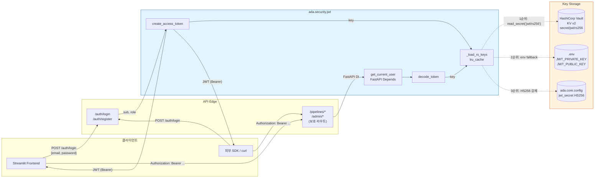

**핵심 invariant**:
- 클라이언트가 보는 인터페이스(Bearer 토큰 형태)는 RS256/HS256 모두 동일 — 전환은 *서버 내부* 변경
- 키 로드는 모든 호출에서 `lru_cache(1)` 로 1회만 일어남 — Vault 호출 최소화
- 3단 폴백으로 인해 `create_access_token` 은 **절대 503 안 남** (최악 HS256)

---

## A2. 컴포넌트 분해 + 책임

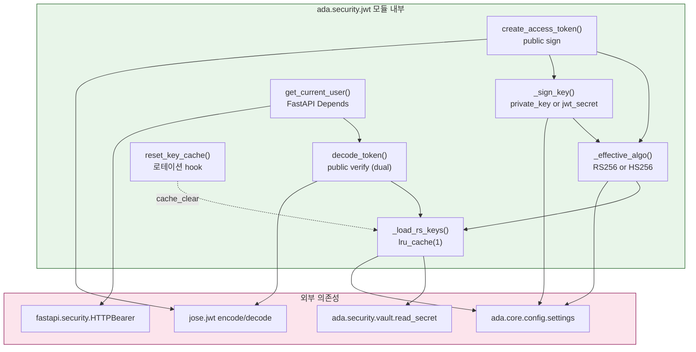

### 책임 표

| 심볼 | 책임 | 호출 빈도 | 캐시 |
|---|---|---|---|
| `_load_rs_keys()` | Vault→env 순으로 RS PEM 로드. 빈 dict 도 OK (HS256 fallback 신호) | 토큰당 1회, 캐시 hit | lru_cache(1) |
| `_effective_algo()` | settings + 키존재 → "RS256" or "HS256" 결정 | 발급·검증마다 호출 | 캐시 없음 (`_load_rs_keys` 만 캐시) |
| `_sign_key()` | private_key or jwt_secret | 발급마다 | 없음 |
| `create_access_token()` | payload 빌드 + jose.jwt.encode | 로그인·register 시 | 없음 |
| `decode_token()` | `(key, algo)` pairs 순회 시도, 모두 실패 시 JWTError | 보호 라우트 매 호출 | 없음 |
| `get_current_user()` | HTTPBearer → decode_token → user dict | FastAPI DI 마다 | 없음 |
| `reset_key_cache()` | 로테이션 시 lru_cache.cache_clear() | 수동 호출 | — |

### 책임 경계 (그어선 안 되는 선)

- ❌ `_load_rs_keys()` 가 `settings.jwt_algo` 를 보지 않음 — 알고리즘 선택은 `_effective_algo` 만의 책임
- ❌ `decode_token` 이 `_effective_algo` 를 호출하지 않음 — 검증 측은 *받은 토큰이 어떻게 서명됐는지 모름* → 둘 다 시도하는 것이 옳음
- ❌ `create_access_token` 이 키 로드 실패를 노출하지 않음 — 항상 HS256 fallback 으로 발급 성공

---

## A3. 핵심 플로우 4종 (Sequence Diagrams)

### A3.1 — 토큰 발급 (Sign Flow)

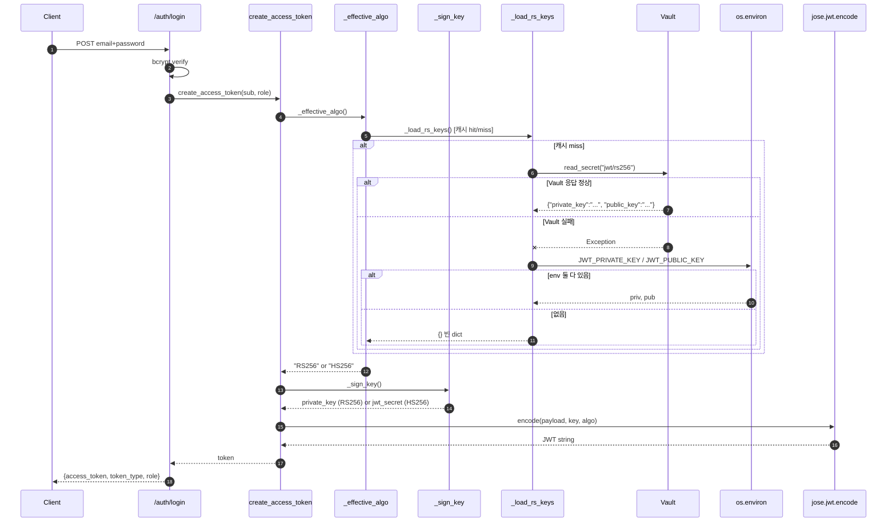

**불변식**:
- (5)~(15) 의 어떤 분기를 타도 (16) 에서 `key` 는 반드시 비지 않은 문자열
- payload 의 `exp`, `iat`, `iss` 는 항상 채워짐 (`create_access_token` 내부)
- `lru_cache` 때문에 같은 프로세스 안에서 (8)~(11) 은 사실상 1회

### A3.2 — 토큰 검증 (Verify Flow)

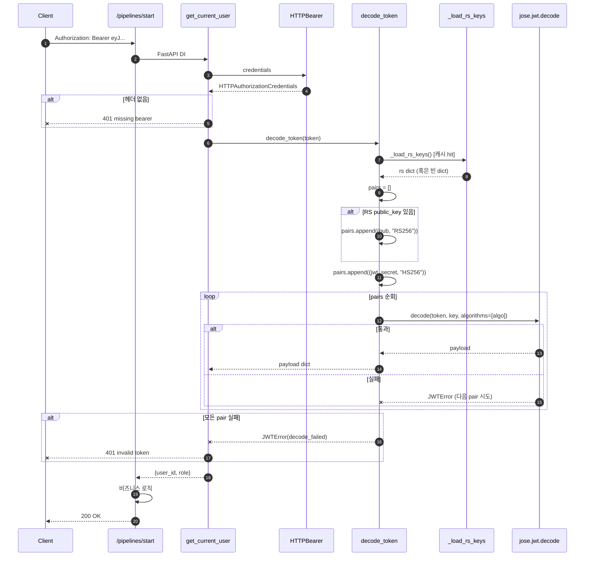

**불변식**:
- (10)~(12) pairs 순서가 곧 **시도 우선순위** — RS256 이 먼저, HS256 이 나중
- HS256 토큰을 받은 RS 환경에서도 (12) 에서 두 번째 시도로 통과 → 호환성 보장
- 두 pair 모두 실패하면 마지막 예외만 메시지에 담겨 401 로 변환

### A3.3 — 키 로드 폴백 (Key Load Fallback)

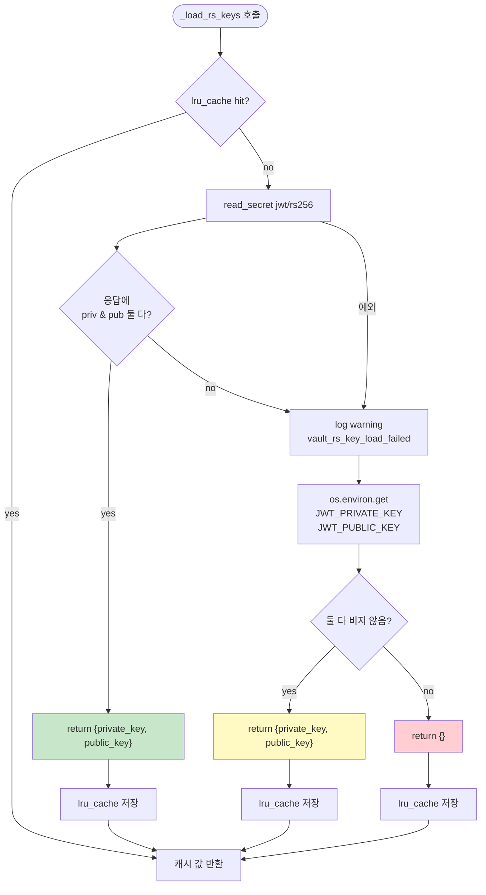

**의도**:
- 녹색(Vault) > 노란색(env) > 빨강(빈 dict) 순으로 운영 친화 단계
- 빨강은 **에러가 아님** — `_effective_algo()` 가 HS256 으로 떨어지는 신호
- 따라서 본 함수는 **예외를 절대 raise 하지 않음** (Vault 예외도 흡수)

### A3.4 — 키 로테이션 (Rotation Flow)

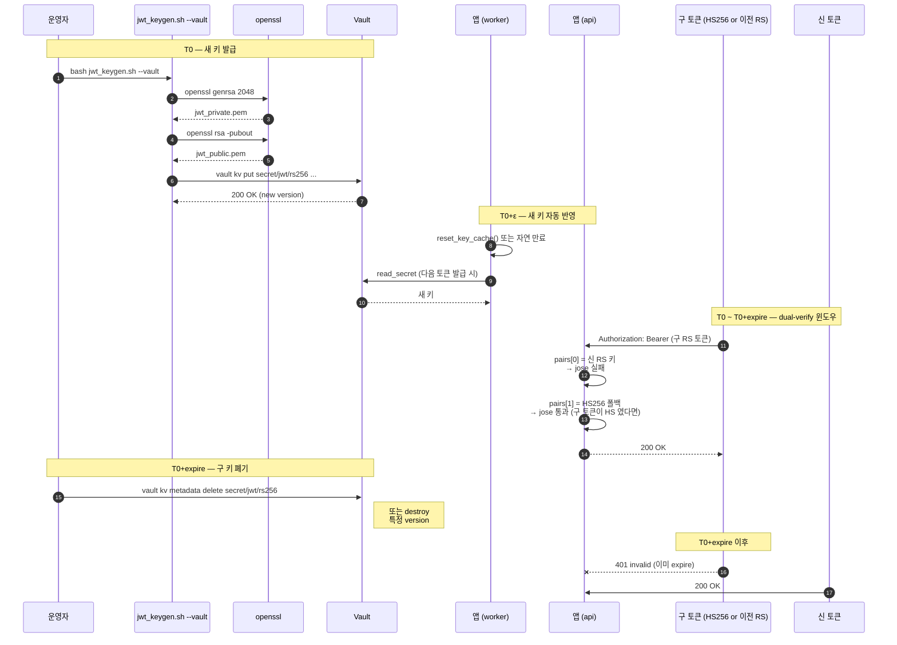

**불변식**:
- `JWT_EXPIRE_MIN` 분(기본 60) 동안은 구·신 토큰이 공존 → 절대 일괄 401 안 남
- `reset_key_cache()` 를 안 부르면 캐시 때문에 새 키 반영이 늦어짐 → 운영 매뉴얼에 명시
- 키 폐기는 dual-verify 윈도우 종료 후에만 (선행 시 떠다니는 토큰 401)

---

## A4. 알고리즘 선택 의사결정 트리

`_effective_algo()` 가 실제로 결정하는 트리:

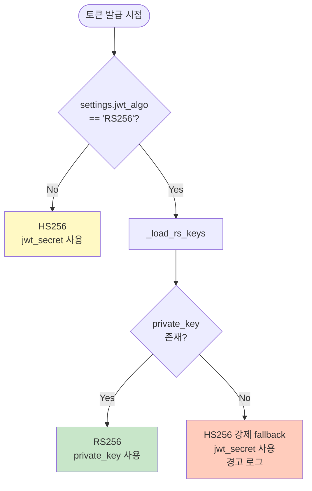

| 환경 | settings.jwt_algo | RS 키 로드 | 결과 알고리즘 |
|---|---|---|---|
| dev 기본 | HS256 (default) | 시도 안 함 | **HS256** |
| dev 의도 RS256 (테스트) | RS256 | Vault/env 성공 | **RS256** |
| dev 의도 RS256 (키 없음) | RS256 | 둘 다 빈값 | **HS256 fallback** |
| 운영 (Vault 정상) | RS256 | Vault 성공 | **RS256** |
| 운영 (Vault 일시 장애) | RS256 | Vault 실패→env 성공 | **RS256** |
| 운영 (Vault·env 모두 장애) | RS256 | 모두 실패 | **HS256 fallback** ⚠️ 운영팀 알림 필요 |

---

## A5. 키 라이프사이클 상태기계

운영 환경의 RS 키쌍이 거치는 상태:

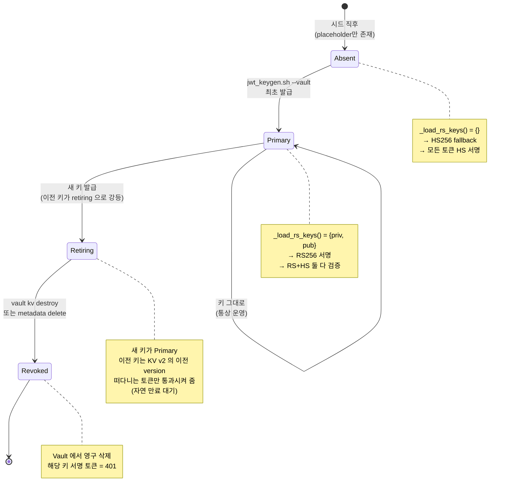

---

## A6. 인터페이스 명세 (Contract)

### 공개 API 시그니처

```python
# ada.security.jwt

def create_access_token(
    *,
    sub: str,
    role: str = "analyst",
    expires_minutes: int | None = None,
) -> str:
    """
    Returns: JWT 문자열 (always non-empty)
    Raises: 절대 raise 안 함 — 최악의 경우 HS256 fallback 으로 발급
    부작용: lru_cache miss 시 Vault HTTP 호출 1회
    """

def decode_token(token: str) -> dict[str, Any]:
    """
    Returns: payload dict (최소 sub, role, exp, iat, iss 키 포함)
    Raises: jose.JWTError — 모든 (key, algo) 쌍 실패 시
    부작용: lru_cache miss 시 Vault HTTP 호출 1회
    """

async def get_current_user(
    request: Request,
    creds: HTTPAuthorizationCredentials | None = Depends(security),
) -> dict[str, Any]:
    """
    Returns: {"user_id": str, "role": str}
    Raises: HTTPException(401) — missing/invalid 둘 다
    """

def reset_key_cache() -> None:
    """
    부작용: _load_rs_keys.cache_clear()
    호출 후 다음 토큰 발급/검증 시 Vault 재호출
    """
```

### 페이로드 스키마 (양방향)

```json
{
  "sub": "<user_id 문자열>",
  "role": "admin | analyst | viewer",
  "exp": <unix timestamp>,
  "iat": <unix timestamp>,
  "iss": "ada"
}
```

### HTTP 헤더 계약 (불변)

```
Authorization: Bearer eyJhbGciOi...
```

- `alg` 헤더 값이 `RS256` 인지 `HS256` 인지는 **서버 내부 결정** — 클라이언트는 신경쓰지 않음
- `typ`, `kid` 헤더는 jose 가 자동 부착 (현재는 `typ:"JWT"` 만)
- 향후 JWKS endpoint 추가 시 `kid` 활성화 예정 (Day 9+)

### 설정 키 (.env)

| 키 | 기본값 | 의미 |
|---|---|---|
| `JWT_ALGO` | `HS256` | `RS256` 설정 시에만 RS 키 로드 시도 |
| `JWT_SECRET` | `dev-jwt` | HS256 키 (운영은 강한 랜덤 secret) |
| `JWT_EXPIRE_MIN` | `60` | 토큰 유효기간 — 키 로테이션 윈도우 |
| `JWT_PRIVATE_KEY` | (빈값) | env 폴백용 RS private PEM |
| `JWT_PUBLIC_KEY` | (빈값) | env 폴백용 RS public PEM |
| `VAULT_ADDR` | `http://vault:8200` | Vault HTTP endpoint |
| `VAULT_DEV_TOKEN` | (빈값) | dev 토큰 (운영은 K8s SA 또는 AppRole) |

---

# Part B — 단계별 시공 절차 (Phased Implementation)

## Phase L0 — 사전점검 (15분)

> **Phase 목표**: Day 5 작업의 *모든* 외부 전제 (디렉토리·브랜치·Python·패키지·CLI 도구) 가 갖춰졌음을 보증. 한 단계라도 빠뜨리면 후속 Phase 에서 원인 불명의 실패가 발생.
>
> **세부 단계 트리**:
> - L0.1 작업 디렉토리·브랜치 (4 micro-step)
> - L0.2 venv·Python 버전 (3 micro-step)
> - L0.3 핵심 Python 패키지 (4 micro-step)
> - L0.4 외부 CLI 도구 (4 micro-step)
> - L0.5 Phase 종료 게이트

---

### L0.1 — 작업 디렉토리 + Git 상태

#### [L0.1.a] PowerShell 열고 프로젝트 루트로 진입 (1분)

**사전조건**: 사용자 계정에 `C:\IT\workspace_python\ADA` 읽기·쓰기 권한.

**실행**:
```powershell
# 새 PowerShell 창 또는 VS Code 통합 터미널
cd C:\IT\workspace_python\ADA
Get-Location
```

**예상 출력**:
```
Path
----
C:\IT\workspace_python\ADA
```

**진단 명령** (예상과 다를 때):
- `Test-Path .` — 디렉토리 존재 확인
- `Test-Path CLAUDE.md` — 진짜 프로젝트 루트인지 확인 (CLAUDE.md 가 있어야 함)

**실패 분기**:
- `cd : Cannot find path ...` → 경로 오타. 정확히 `C:\IT\workspace_python\ADA` 인지 점검
- `Test-Path CLAUDE.md` = False → 한 단계 위 또는 아래일 가능성. `Get-ChildItem -Recurse -Filter CLAUDE.md -Depth 2` 로 위치 추적

**진입 조건**: `Test-Path .git` + `Test-Path CLAUDE.md` 모두 True.

---

#### [L0.1.b] 현재 브랜치 검증 (1분)

**실행**:
```powershell
git branch --show-current
```

**예상 출력**: `feat/hj-day5`

**실패 분기**:
| 출력 | 의미 | 복구 |
|---|---|---|
| `main` | 브랜치 미생성 | `git checkout -b feat/hj-day5` |
| `feat/hj-day4` 등 다른 브랜치 | 어제 작업 잔류 | `git checkout feat/hj-day5` (이미 존재 시) 또는 `git checkout -b feat/hj-day5 origin/main` |
| (빈 출력) | detached HEAD | `git checkout feat/hj-day5` |
| `fatal: not a git repo` | 루트 위치 오류 | [L0.1.a] 로 복귀 |

**진입 조건**: 정확히 `feat/hj-day5` 출력.

---

#### [L0.1.c] 워킹트리 청결 검증 (2분)

**실행**:
```powershell
git status
```

**예상 출력 (이상적)**:
```
On branch feat/hj-day5
Your branch is up to date with 'origin/feat/hj-day5'.

nothing to commit, working tree clean
```

**허용 가능한 변형**:
- `Your branch is ahead of 'origin/feat/hj-day5' by N commits.` — 로컬에만 있는 커밋. Phase L6 에서 push 예정. **OK**.
- `Untracked files: docs/ADR-009-*.md, scripts/dev/verify_day5.py` — 본 가이드 작성 중. **OK** (오늘 작업물).

**불허 출력**:
- `modified: ada/...` 또는 `modified: agents/...` — 미커밋 변경. 처리 필요 (`L0.1.d` 로).
- `Untracked files:` 에 알 수 없는 파일 — 진단 필요.

**진입 조건**: clean 또는 알려진 Day 5 산출물만 untracked.

---

#### [L0.1.d] 원격 동기화 상태 검증 + uncommitted 처리 (3분)

**실행**:
```powershell
git fetch origin
git log --oneline HEAD..origin/feat/hj-day5
git log --oneline origin/feat/hj-day5..HEAD
```

**해석**:
- 첫 명령: 원격에만 있는 커밋 (로컬이 뒤처짐)
- 두번째: 로컬에만 있는 커밋 (push 필요)

**예상 (정상)**:
- 양쪽 모두 빈 출력 → 완전 동기화

**실패 분기**:

| 상황 | 명령 | 결과 |
|---|---|---|
| 로컬 뒤처짐 | `git pull --ff-only origin feat/hj-day5` | fast-forward 됨 |
| pull 실패 (non-ff) | `git status` 로 conflict 확인 | 수동 해결 |
| 로컬에만 미커밋 변경 (이전 [L0.1.c] 에서 발견) | `git diff > $env:TEMP\local.patch ; git stash push -m "L0.1.d backup"` | 백업 후 stash |
| 알 수 없는 untracked 파일 | `git status --short` 로 목록 확인 후 `git clean -nd` (dry-run) → `git clean -fd` (실행) | 삭제 |

**민감 케이스** — `agents/handlers/anomaly/` 또는 `pipelines/anomaly/` 가 modified:
- CLAUDE.md §1 위반 (NY 영역). HJ 가 손대면 안 됨.
- 즉시 `git checkout -- agents/handlers/anomaly/ pipelines/anomaly/` 로 원복.
- 별도 메시지로 NY 에게 "이 변경 본인 PR 에서 처리 부탁" 안내.

**진입 조건**: `git status` 가 clean + `git log --oneline HEAD..origin/feat/hj-day5` 빈 출력.

---

### L0.2 — venv + Python 버전

#### [L0.2.a] venv 존재 확인 + Python 실행 (1분)

**실행**:
```powershell
Test-Path venv\Scripts\python.exe
venv\Scripts\python.exe --version
```

**예상 출력**:
```
True
Python 3.10.11   # 또는 3.10.x
```

**실패 분기**:
| 출력 | 의미 | 복구 |
|---|---|---|
| `Test-Path` = False | venv 미생성 | `py -3.10 -m venv venv` (Windows Python launcher) |
| `Python 3.11.x` | 잘못된 버전 (R-001 위반) | venv 삭제 후 3.10 으로 재생성 |
| `Python 3.9.x` | 너무 옛날 | 동상 |
| 실행 불가 | venv 손상 | `Remove-Item -Recurse -Force venv` 후 재생성 |

**venv 재생성 절차** (필요 시):
```powershell
Remove-Item -Recurse -Force venv
py -3.10 -m venv venv
venv\Scripts\Activate.ps1
python -m pip install --upgrade pip
pip install -r requirements\test.txt
```

**진입 조건**: Python 3.10.x 정상 응답.

---

#### [L0.2.b] sys.path 검증 — ada 패키지 import 가능성 (1분)

**실행**:
```powershell
venv\Scripts\python.exe -c "import sys; print(sys.executable); import ada; print(ada.__file__)"
```

**예상 출력**:
```
C:\IT\workspace_python\ADA\venv\Scripts\python.exe
C:\IT\workspace_python\ADA\ada\__init__.py
```

**실패 분기**:
- `ModuleNotFoundError: No module named 'ada'` → cwd 잘못됨. PowerShell 에서 `Get-Location` 확인 후 [L0.1.a] 재실행
- 다른 venv 의 ada 경로 → PATH 오염. 항상 `venv\Scripts\python.exe` 명시적 호출 권장

**진입 조건**: `ada.__file__` 이 프로젝트 루트의 `ada\__init__.py` 가리킴.

---

#### [L0.2.c] 테스트 의존성 동기화 (3분)

**실행**:
```powershell
$env:PYTHONUTF8=1
venv\Scripts\python.exe -m pip install -q -r requirements\test.txt
```

**예상 출력**: (대부분 "Requirement already satisfied", 새로 설치되는 게 있다면 그 항목만 출력)

**검증**:
```powershell
venv\Scripts\python.exe -m pip check
```
→ "No broken requirements found." 이어야 함.

**실패 분기**:
- `pip check` 가 호환성 에러 출력 → 메시지의 패키지 명시적으로 `pip install <pkg>==<version>` 으로 픽스
- 네트워크 오류 → 사내 mirror 사용 시 `--index-url <mirror>` 추가

**진입 조건**: `pip check` 통과.

---

### L0.3 — 핵심 Python 패키지 import 검증

> 각 import 가 실제로 동작하는지 + 버전 확인. 한 줄짜리 sanity check.

#### [L0.3.a] python-jose 검증 (30초)

**실행**:
```powershell
venv\Scripts\python.exe -c "import jose; from jose import jwt, JWTError; print(f'jose {jose.__version__}')"
```

**예상**: `jose 3.3.0` (또는 그 이상)

**실패 분기**:
- `ModuleNotFoundError: jose` → `pip install 'python-jose[cryptography]==3.3.0'`
- 버전이 3.2 이하 → RS256 일부 기능 미흡. `pip install -U 'python-jose[cryptography]'`

---

#### [L0.3.b] cryptography 검증 (RS256 핵심 의존) (30초)

**실행**:
```powershell
venv\Scripts\python.exe -c "from cryptography.hazmat.primitives.asymmetric import rsa; from cryptography.hazmat.primitives import serialization; print('cryptography OK')"
```

**예상**: `cryptography OK`

**중요**: 이게 없으면 `tests/test_day5_rs256_jwt.py::test_rs256_*` 가 `pytest.importorskip("Crypto")` 로 자동 SKIP 됨. DoD 충족 표면적으로는 가능하나 실제 검증 안 됨.

**실패 분기**:
- `ModuleNotFoundError: cryptography` → `pip install 'cryptography>=41.0'`
- DLL 로드 실패 (Windows) → Visual C++ Redistributable 2015-2022 설치 필요

---

#### [L0.3.c] hvac (Vault 클라이언트) 검증 (30초)

**실행**:
```powershell
venv\Scripts\python.exe -c "import hvac; print(f'hvac {hvac.__version__}')"
```

**예상**: `hvac 1.x` 또는 `2.x`

**비중요**: 본 Phase 의 ada.security.vault 모듈이 hvac 를 lazy import 함. 미설치여도 `_load_rs_keys` 가 예외 흡수 후 env 폴백.

**그러나** Phase L5 (운영 리허설) 에는 필수.

**실패 분기**:
- `ModuleNotFoundError: hvac` → `pip install hvac`
- 무시하고 Phase L5 만 건너뛰는 것도 OK

---

#### [L0.3.d] ada.security.jwt 자체 import (30초)

**실행**:
```powershell
venv\Scripts\python.exe -c @"
from ada.security.jwt import (
    create_access_token,
    decode_token,
    get_current_user,
    reset_key_cache,
    _load_rs_keys,
    _effective_algo,
    _sign_key,
)
print('all 7 symbols loadable')
"@
```

**예상**: `all 7 symbols loadable`

**실패 분기**:
- `ImportError: cannot import name 'X'` → 누군가 jwt.py 의 API 를 깼음. `git log -p ada/security/jwt.py` 로 추적
- 다른 ImportError → 모듈 의존성 깨짐. `pip check` 재실행

**진입 조건**: 7 심볼 모두 import 가능.

---

### L0.4 — 외부 CLI 도구

#### [L0.4.a] openssl 가용성 (1분)

**필수**: Phase L5 의 `jwt_keygen.sh` 가 openssl 호출.

**실행** (Git Bash 또는 PowerShell):
```bash
openssl version
```
또는 PowerShell:
```powershell
& openssl version 2>&1
```

**예상**: `OpenSSL 3.x.x` 또는 `OpenSSL 1.1.1x`

**실패 분기**:
- `'openssl' is not recognized` (Windows) → Git for Windows 설치 시 자동 포함됨. PATH 에 `C:\Program Files\Git\usr\bin` 추가 또는 Git Bash 사용
- 명령은 되는데 1.0.x → 너무 옛날. 업그레이드 권장하나 RS256 키 생성은 가능

**중요도**: Phase L1 의 `test_keygen_script_exists` 는 syntax check 만 하므로 openssl 없어도 통과. 실제 키 생성 (Phase L5) 에만 필요.

---

#### [L0.4.b] bash 가용성 + Git Bash 우선 (1분)

**필수**: 모든 `.sh` 스크립트 실행에 사용.

**실행** (PowerShell):
```powershell
Get-Command bash | Format-Table Source
```

**기대 결과**:
- `C:\Program Files\Git\bin\bash.exe` ← **선호**
- 또는 `C:\Program Files\Git\usr\bin\bash.exe`

**불허**:
- `C:\Windows\System32\bash.exe` (WSL) — Windows 경로 자동 변환 안 됨. `tests/test_day5_rs256_jwt.py` 의 `_bash_exe()` 가 이미 회피 로직 보유하나, 직접 호출 시 문제 발생

**해결책** (WSL bash 가 먼저 잡힐 때):
```powershell
# 항상 Git Bash 명시
& "C:\Program Files\Git\bin\bash.exe" scripts/dev/end_of_day.sh
```

---

#### [L0.4.c] docker (Phase L5 선택) (1분)

**선택적**: Phase L5 의 Vault 컨테이너 띄우기에만 필요.

**실행**:
```powershell
docker version
docker compose version
```

**예상**:
- Docker Engine 24.x+
- Docker Compose v2.x+

**미설치 시**: Phase L5 통째로 건너뛰고 Phase L4 의 e2e 도 skip. DoD 충족에는 영향 없음.

---

#### [L0.4.d] vault CLI (Phase L5 선택) (30초)

**선택적**: 컨테이너 안에서 자동 실행되지만 호스트에서 검증할 때 편함.

**실행**:
```powershell
vault --version
```

**예상**: `Vault v1.15.x` 또는 그 이상.

**미설치 시**: 컨테이너 안에서 `docker compose exec vault vault status` 로 우회.

---

### L0.5 — Phase L0 종료 게이트

**모든 micro-step 통과 후 최종 체크**:

```powershell
# 1) 모두 한 번에 검증하는 one-liner
$ok = (
    (Test-Path venv\Scripts\python.exe) -and
    ((git branch --show-current) -eq "feat/hj-day5") -and
    (((git status --porcelain).Count) -eq 0)
)
if ($ok) { Write-Host "L0 GATE: PASS" -ForegroundColor Green }
else { Write-Host "L0 GATE: FAIL" -ForegroundColor Red }
```

**기대**: `L0 GATE: PASS` 출력 + Python·jose·cryptography·ada import 모두 OK.

**불통과 시**: 위 L0.1~L0.4 의 실패한 micro-step 으로 복귀.

**다음 Phase 진입 조건**:
- L0.1.a~d 모두 PASS
- L0.2.a~c 모두 PASS
- L0.3.a, b, d 필수 PASS (L0.3.c hvac 는 선택)
- L0.4.a, b 필수 PASS (L0.4.c, d 는 선택)
- L0.5 게이트 출력 = PASS

---

## Phase L1 — 본 구현 회귀 검증 (25분)

> **Phase 목표**: Day 5 의 핵심 코드(`jwt.py`, `jwt_keygen.sh`, `test_day5_rs256_jwt.py`)는 이전 통합 커밋에 이미 반영됨. 본 Phase 는 *추가 작업 전*에 현재 상태가 멀쩡한지 baseline 확보.
>
> **왜 baseline 이 중요한가**: Phase L2 의 `_verify_keys` 제거 같은 작은 변경도 회귀 가능. baseline 이 그린이어야 "내가 만든 변경이 깨뜨렸다" 를 즉시 알 수 있음.
>
> **세부 단계 트리**:
> - L1.1 jwt.py 정적 검증 (6 micro-step)
> - L1.2 jwt_keygen.sh 정적 검증 (3 micro-step)
> - L1.3 단위 테스트 5건 (5 micro-step)
> - L1.4 보안 통합 회귀 (2 micro-step)
> - L1.5 전체 회귀 baseline (2 micro-step)
> - L1.6 Phase L1 종료 게이트

---

### L1.1 — jwt.py 정적 검증

#### [L1.1.a] 파일 인코딩 검증 — UTF-8, no BOM (1분)

**왜**: Windows 환경에서 자주 발생하는 BOM/CRLF 이슈가 py_compile 을 깨뜨림.

**실행** (Git Bash 또는 WSL):
```bash
file ada/security/jwt.py
head -c 3 ada/security/jwt.py | xxd
```

또는 PowerShell:
```powershell
$bytes = [System.IO.File]::ReadAllBytes("ada\security\jwt.py")
"First 3 bytes (hex): $($bytes[0..2] | ForEach-Object { '{0:X2}' -f $_ })"
"Encoding test:"
[System.Text.Encoding]::UTF8.GetString($bytes[0..50])
```

**예상**:
- `file` 출력: `Python script, Unicode text, UTF-8 text executable, with CRLF line terminators`
- 첫 3바이트: `22 22 22` (= `"""` Python docstring 시작)

**불허**:
- 첫 3바이트: `EF BB BF` → UTF-8 BOM 있음. py_compile 깨짐
- `UTF-16` 으로 file 인식 → 인코딩 오염. 복구 필요

**복구** (BOM 있을 때):
```powershell
$content = Get-Content ada\security\jwt.py -Raw -Encoding UTF8
[System.IO.File]::WriteAllText("$PWD\ada\security\jwt.py", $content, [System.Text.UTF8Encoding]::new($false))
```

**진입 조건**: BOM 없음 + UTF-8.

---

#### [L1.1.b] Python AST 파싱 + py_compile (1분)

**실행**:
```powershell
venv\Scripts\python.exe -m py_compile ada\security\jwt.py
```

**예상**: (출력 없음, exit 0)

**실패 분기**:
- `SyntaxError: ...` → 파일 깨짐. `git diff HEAD -- ada/security/jwt.py` 로 차이 확인
- `ValueError: source code string cannot contain null bytes` → UTF-16 인코딩. [L1.1.a] 의 복구 절차로

---

#### [L1.1.c] 공개 API 7 심볼 import 가능성 (1분)

**실행**:
```powershell
venv\Scripts\python.exe -c @"
from ada.security.jwt import (
    create_access_token,
    decode_token,
    get_current_user,
    reset_key_cache,
)
print('public API: 4 symbols OK')
"@
```

**예상**: `public API: 4 symbols OK`

**실패 분기**:
| 에러 | 원인 | 복구 |
|---|---|---|
| `cannot import name 'create_access_token'` | 함수 시그니처 깨짐 | `git log -p ada/security/jwt.py | head -100` |
| `ModuleNotFoundError: ada` | cwd 잘못 | [L0.1.a] 로 복귀 |
| `ImportError: ... jose` | python-jose 미설치 | [L0.3.a] |

---

#### [L1.1.d] 내부 헬퍼 심볼 검증 (1분)

> 내부 함수도 export 되어야 테스트가 monkeypatch 가능.

**실행**:
```powershell
venv\Scripts\python.exe -c @"
from ada.security.jwt import _load_rs_keys, _effective_algo, _sign_key
import inspect
for fn in (_load_rs_keys, _effective_algo, _sign_key):
    sig = inspect.signature(fn)
    print(f'{fn.__name__}{sig}')
"@
```

**예상 출력**:
```
_load_rs_keys() -> dict[str, str]
_effective_algo() -> str
_sign_key() -> str
```

**실패 분기**:
- 시그니처가 다르면 → 누군가 함수 시그니처 변경. 테스트가 깨질 수 있으므로 즉시 본 PR 영역인지 확인 후 복원

---

#### [L1.1.e] 데드코드 부재 확인 — `_verify_keys` (30초)

> Day 5 의 변경 항목. baseline 단계에서는 *이미 제거됐는지* 확인. Phase L2 에서 제거 작업 자체를 함.

**실행**:
```powershell
Select-String -Path ada\security\jwt.py -Pattern "def _verify_keys" | Measure-Object | Select-Object Count
```

또는 PowerShell:
```powershell
(Get-Content ada\security\jwt.py | Select-String "def _verify_keys").Count
```

**예상 (Day 5 작업 후)**: `0`

**Day 5 작업 전 (baseline)**: `1` 일 수 있음 — 그러면 Phase L2 의 L2.1 단계에서 제거 작업 수행.

**판단**:
- 0 출력 → 이미 제거됨. L2.1 은 "검증만" 단계로 진입
- 1 출력 → 정상 baseline. L2.1 에서 실제 제거 수행

**참고**: 호출처도 grep:
```powershell
Select-String -Path . -Pattern "_verify_keys" -Include *.py -Recurse | Where-Object { $_.Path -notlike "*\venv\*" }
```
→ 호출처 0 이어야 (정의처만 매치돼야 함). 호출처 있으면 제거 시 import 에러 발생 가능.

---

#### [L1.1.f] 폴백 로직 grep 검증 (1분)

> `_load_rs_keys` 가 Vault → env → 빈 dict 순으로 시도하는 핵심 분기가 있는지.

**실행**:
```powershell
Select-String -Path ada\security\jwt.py -Pattern 'read_secret\("jwt/rs256"\)|JWT_PRIVATE_KEY|JWT_PUBLIC_KEY|return \{\}' | Format-Table LineNumber, Line
```

**예상 라인 4종 모두 hit**:
- `v = read_secret("jwt/rs256")` (Vault 시도)
- `priv = os.environ.get("JWT_PRIVATE_KEY", "")` (env 시도)
- `pub = os.environ.get("JWT_PUBLIC_KEY", "")` (env 시도)
- `return {}` (최종 폴백)

**실패 분기**:
- Vault 분기 없음 → 누군가 단순화함. 본 가이드의 A3.3 다이어그램 위반. 복구 필요
- 빈 dict 폴백 없음 → 예외 raise 됨. `_effective_algo` 가 try/except 처리 안 하므로 사용자에게 500 노출 위험

---

### L1.2 — jwt_keygen.sh 정적 검증

#### [L1.2.a] 파일 존재 + 실행 비트 (30초)

**실행**:
```powershell
Test-Path scripts\security\jwt_keygen.sh
```

**예상**: `True`

**Git 트래킹 비트 확인** (Linux/Mac CI 에서 실행 가능한지):
```powershell
git ls-files --stage scripts/security/jwt_keygen.sh
```

**예상**: `100755 ...` (755 = 실행 비트 ON)

**실패 분기**:
- `100644 ...` → 실행 비트 OFF. 복구:
  ```powershell
  git update-index --chmod=+x scripts/security/jwt_keygen.sh
  git status   # mode change 가 보여야 함
  ```

---

#### [L1.2.b] bash syntax check (30초)

**실행** (Git Bash):
```bash
bash -n scripts/security/jwt_keygen.sh && echo "syntax OK"
```

또는 PowerShell:
```powershell
& "C:\Program Files\Git\bin\bash.exe" -n scripts/security/jwt_keygen.sh
if ($LASTEXITCODE -eq 0) { "syntax OK" } else { "syntax FAIL" }
```

**예상**: `syntax OK`

**실패 분기**:
- `unexpected EOF` → heredoc 미닫힘. `<<EOF` ... `EOF` 매치 확인
- `bad substitution` → bash 4.x+ 전용 문법을 sh 모드로 실행. shebang `#!/usr/bin/env bash` 확인

---

#### [L1.2.c] 핵심 명령 grep — openssl + vault (30초)

**실행**:
```powershell
Select-String -Path scripts\security\jwt_keygen.sh -Pattern "openssl genrsa|openssl rsa -in|vault kv put secret/jwt/rs256"
```

**예상**: 3 라인 모두 hit.

**실패 분기**:
- openssl 명령 없음 → 다른 도구로 키 생성 의도. 본 가이드 ADR-009 와 불일치
- vault 명령 없음 → Vault 저장 모드 제거됨. `--vault` 플래그 안 먹힘

---

### L1.3 — 단위 테스트 5건 (개별 실행)

> 5건 한꺼번에 돌리지 말고 *하나씩* 돌려서 어느 케이스가 실패했는지 즉시 파악.

#### [L1.3.a] test_keygen_script_exists (30초)

**실행**:
```powershell
$env:PYTHONUTF8=1
venv\Scripts\python.exe -m pytest tests\test_day5_rs256_jwt.py::test_keygen_script_exists -v
```

**예상 출력 마지막**:
```
tests/test_day5_rs256_jwt.py::test_keygen_script_exists PASSED  [100%]
1 passed in 0.XXs
```

**실패 분기**:
- `AssertionError: os.access(p, os.X_OK)` → 실행 비트 OFF. [L1.2.a] 복구
- `subprocess returncode != 0` → bash -n 실패. [L1.2.b] 로

---

#### [L1.3.b] test_hs256_roundtrip (30초)

**실행**:
```powershell
venv\Scripts\python.exe -m pytest tests\test_day5_rs256_jwt.py::test_hs256_roundtrip -v
```

**예상**: `PASSED`

**실패 분기**:
- `assert decoded["sub"] == "user-1"` 실패 → payload 인코딩 깨짐. `create_access_token` 의 dict 키 변경 확인
- 빈 토큰 반환 → `_sign_key()` 가 빈 문자열 반환. `settings.jwt_secret` 비어있는지 (.env 누락) 확인

---

#### [L1.3.c] test_rs256_roundtrip_via_env (1분) ⭐ **DoD 핵심**

**실행**:
```powershell
venv\Scripts\python.exe -m pytest tests\test_day5_rs256_jwt.py::test_rs256_roundtrip_via_env -v
```

**예상**:
- `PASSED` (이상적)
- 또는 `SKIPPED [Crypto]` (cryptography 미설치 — DoD 미충족, [L0.3.b] 로 복귀)

**실패 분기**:

| 실패 메시지 | 원인 | 복구 |
|---|---|---|
| `subprocess.CalledProcessError` (keygen) | openssl 없음 또는 bash 호환 | [L0.4.a], [L1.2.b] |
| `FileNotFoundError: jwt_private.pem` | keygen 이 키 안 만듦 | tempfile cwd 권한 확인 |
| `header["alg"] != "RS256"` | `_effective_algo` 가 HS256 으로 떨어짐 | `monkeypatch.setattr(settings, "jwt_algo", "RS256")` 가 안 먹힘. `reset_key_cache` 호출 누락 의심 |
| `jose.JWTError: decode_failed` | RS 검증 실패 | public_key PEM 형식 깨짐. openssl 버전 mismatch 가능 |

**중요한 어설션** (이 테스트의 DoD 핵심):
```python
header = _json.loads(base64.urlsafe_b64decode(tok.split(".")[0] + "=="))
assert header["alg"] == "RS256"
```

이게 통과해야 "RS256 으로 진짜 서명됐다" 가 보증됨.

---

#### [L1.3.d] test_decode_accepts_both_when_rs_available (1분)

**실행**:
```powershell
venv\Scripts\python.exe -m pytest tests\test_day5_rs256_jwt.py::test_decode_accepts_both_when_rs_available -v
```

**예상**: `PASSED`

**이 테스트가 검증하는 것**: RS 환경에서 받은 *HS256 토큰* 이 거부되지 않음 (dual-verify 윈도우).

**실패 분기**:
- `decoded["sub"] == "old"` 어설션 실패 → `decode_token` 의 pairs 빌더가 HS256 폴백을 안 함. jwt.py 의 decode_token 함수 본문 재점검:
  ```python
  pairs.append((settings.jwt_secret, "HS256"))   # 이 라인이 있어야 함
  ```

---

#### [L1.3.e] test_vault_priority_over_env (1분)

**실행**:
```powershell
venv\Scripts\python.exe -m pytest tests\test_day5_rs256_jwt.py::test_vault_priority_over_env -v
```

**예상**: `PASSED`

**이 테스트가 검증하는 것**: Vault 응답이 정상이면 env 무시.

**실패 분기**:
- `keys["private_key"] == "env-priv"` (env 가 이김) → `_load_rs_keys` 가 Vault 먼저 시도하지 않음. 함수 순서 확인:
  ```python
  # Vault 가 priority — 함수 본문 시작 부분이어야 함
  try:
      from ada.security.vault import read_secret
      v = read_secret("jwt/rs256")
      if v and v.get("private_key") and v.get("public_key"):
          return {...}
  except Exception: ...
  # env 는 그 다음
  priv = os.environ.get("JWT_PRIVATE_KEY", "")
  ```
- `keys` 가 빈 dict → monkeypatch 한 `read_secret` 가 못 잡힘. `from ada.security import jwt as jwt_mod, vault as vault_mod` import 순서 확인

---

#### [L1.3.f] 5건 한꺼번에 — 종합 (30초)

**실행**:
```powershell
venv\Scripts\python.exe -m pytest tests\test_day5_rs256_jwt.py -v --tb=short
```

**예상**:
```
tests/test_day5_rs256_jwt.py::test_keygen_script_exists PASSED  [ 20%]
tests/test_day5_rs256_jwt.py::test_hs256_roundtrip PASSED        [ 40%]
tests/test_day5_rs256_jwt.py::test_rs256_roundtrip_via_env PASSED [ 60%]
tests/test_day5_rs256_jwt.py::test_decode_accepts_both_when_rs_available PASSED [ 80%]
tests/test_day5_rs256_jwt.py::test_vault_priority_over_env PASSED [100%]
========= 5 passed in X.XXs =========
```

**허용 가능한 변형**:
- 2 SKIPPED + 3 PASSED (cryptography 없음) → DoD 미충족이지만 진행은 가능. [L0.3.b] 로 복귀 권장.

**진입 조건**: 5/5 PASSED 또는 (3/5 PASSED + 2 SKIPPED).

---

### L1.4 — 보안 통합 회귀

#### [L1.4.a] test_security.py 3건 (30초)

**실행**:
```powershell
venv\Scripts\python.exe -m pytest tests\integration\test_security.py -v
```

**예상**:
```
test_prompt_injection_blocked PASSED
test_jwt_roundtrip PASSED
test_rbac_perm_matrix PASSED
```

**중요**: `test_jwt_roundtrip` 이 통합 레이어에서 HS256/RS256 라우트 통과를 검증.

**실패 분기**:
- `test_jwt_roundtrip` 만 실패 → 본 Phase 의 변경이 보안 통합을 깸. [L1.3] 의 baseline 으로 즉시 복귀
- `test_prompt_injection_blocked` 실패 → Day 4 가드레일 회귀. 본 PR 영역 외 — NY/HJ 확인 필요

---

#### [L1.4.b] /auth/login 라우트 import 가능성 (30초)

> jwt.py 변경이 라우트를 깨뜨리지 않는지.

**실행**:
```powershell
venv\Scripts\python.exe -c "from api.routes.auth import router, login, register; print('auth route OK')"
```

**예상**: `auth route OK`

**실패 분기**: ImportError → jwt.py 의 어떤 심볼이 사라졌음. 위 [L1.1.c] 의 4 심볼 + `api.routes.auth` 가 쓰는 심볼 (`create_access_token` 만) 재확인

---

### L1.5 — 전체 회귀 baseline

#### [L1.5.a] 전체 pytest 실행 + 결과 기록 (5분)

**실행**:
```powershell
$env:PYTHONUTF8=1
venv\Scripts\python.exe -m pytest tests\ -q --tb=no 2>&1 | Tee-Object -FilePath $env:TEMP\day5_baseline.txt
```

**예상 마지막 라인 (예시 — 실제 수는 환경에 따라 다름)**:
```
35 passed, 2 skipped in 12.34s
```

**기록**: `$env:TEMP\day5_baseline.txt` 가 baseline. Phase L2 후 비교용.

**실패 분기**:
- `5 failed` 등 → 본 PR 작업 전에 깨진 테스트. 어느 PR 머지 시점부터인지 `git bisect` 또는 마지막 그린 커밋 찾기
- 새 failure 가 Day 5 영역 (jwt, security) → 즉시 Phase L1.1~L1.4 재점검

**baseline 보존 명령**:
```powershell
Copy-Item $env:TEMP\day5_baseline.txt $env:TEMP\day5_baseline_$(Get-Date -Format yyyyMMdd_HHmmss).txt
```

---

#### [L1.5.b] passed 수·skipped 수 추출 (30초)

**실행**:
```powershell
Get-Content $env:TEMP\day5_baseline.txt | Select-String -Pattern "passed|failed|skipped" | Select-Object -Last 1
```

**기억할 숫자**: `<N>` passed, `<M>` skipped — Phase L4 의 비교 기준.

---

### L1.6 — Phase L1 종료 게이트

**최종 체크**:
- [ ] L1.1.a~f 모두 PASS
- [ ] L1.2.a~c 모두 PASS
- [ ] L1.3.a~f 모두 PASS (RS 2건이 SKIPPED 이어도 진행은 가능)
- [ ] L1.4.a, b 모두 PASS
- [ ] L1.5 baseline 의 passed 수가 N ≥ 30 (대략)
- [ ] baseline 텍스트 파일 보존 완료

**불통과 시**: 어느 micro-step 이 깨졌는지 식별자(`L1.3.c` 등) 명시하고 그 분기로 복귀.

**다음 Phase 진입 조건**: 위 6개 체크박스 모두 ✓.

---

## Phase L2 — 코드 보강 C3·C4 (30분)

> **Phase 목표**: 두 가지 작은 보강 — `_verify_keys` 데드코드 제거(C4), `vault_seed.sh` 에 `secret/jwt/rs256` placeholder 추가(C3). 둘 다 functionality 추가가 아닌 *정리·예방* 작업.
>
> **순서가 중요한가**: C4 가 C3 보다 먼저. C4 가 `ada/security/jwt.py` 만 건드림 — 회귀 영향 가장 좁음. C3 는 운영 스크립트라 dev 환경 동작에 영향 거의 없음. 둘 사이 의존성 없음.
>
> **세부 단계 트리**:
> - L2.1 C4 사전 점검 (3 micro-step)
> - L2.2 C4 실행 — 데드코드 제거 (2 micro-step)
> - L2.3 C4 검증 (3 micro-step)
> - L2.4 C3 사전 점검 (2 micro-step)
> - L2.5 C3 실행 — placeholder 추가 (2 micro-step)
> - L2.6 C3 검증 (3 micro-step)
> - L2.7 Phase L2 종료 게이트

---

### L2.1 — C4 사전 점검: 정말 데드코드인가

#### [L2.1.a] 정의 위치 확인 (30초)

**실행**:
```powershell
Select-String -Path ada\security\jwt.py -Pattern "def _verify_keys" | Format-Table LineNumber, Line
```

**예상**: 1 hit (보통 라인 67 근처)

**상황 분기**:
- 1 hit → 정상. L2.1.b 진행
- 0 hit → 이미 제거됨. L2.3 검증 단계로 직접 점프
- 2+ hit → 중복 정의 (이상함). 모두 제거

---

#### [L2.1.b] 호출처 전수 grep (1분)

**필수**: 호출처가 있다면 제거 후 ImportError 발생.

**실행** (PowerShell):
```powershell
Get-ChildItem -Recurse -Include *.py -Exclude __pycache__ |
  Where-Object { $_.FullName -notlike "*\venv\*" -and $_.FullName -notlike "*\.git\*" } |
  Select-String -Pattern "_verify_keys" |
  Format-Table Path, LineNumber, Line
```

또는 Git Bash:
```bash
grep -rn "_verify_keys" --include="*.py" --exclude-dir=venv --exclude-dir=.git .
```

**예상 출력**: **단 1줄** — 정의처 (`ada/security/jwt.py:67:def _verify_keys`).

**다른 hit 있으면**:
- 호출처 — 그 파일도 함께 수정 필요. 그 호출처가 어떤 책임을 했는지 분석 후 인라인으로 옮기거나 다른 헬퍼로 대체
- 주석에서 언급 — 주석 그대로 두거나 함께 정리
- 테스트에서 호출 — 테스트도 함께 제거 또는 `decode_token` 사용으로 변경

---

#### [L2.1.c] decode_token 이 _verify_keys 책임을 대체하는지 재확인 (30초)

**왜**: `_verify_keys` 가 했던 일(allowed_algos + keys) 을 `decode_token` 이 인라인으로 하고 있는지 확인. 안 그러면 단순 제거가 아니라 *대체* 작업.

**실행**:
```powershell
Get-Content ada\security\jwt.py | Select-String -Pattern "pairs.append" -Context 0,0
```

**예상 출력 (2 라인)**:
```
        pairs.append((rs["public_key"], "RS256"))
    pairs.append((settings.jwt_secret, "HS256"))
```

→ `decode_token` 본문 안에 동일 책임이 인라인으로 존재. 제거 안전.

**없으면**: `decode_token` 본문 점검. pairs 빌더가 다른 형태일 수 있음.

---

### L2.2 — C4 실행: 데드코드 제거

#### [L2.2.a] 정확한 라인 범위 식별 (30초)

**실행**:
```powershell
Get-Content ada\security\jwt.py | Select-Object -Index 65..78 |
  ForEach-Object -Begin { $i=66 } -Process { "{0,3} | {1}" -f $i++, $_ }
```

**예상 출력 (예시)**:
```
 66 |
 67 | def _verify_keys() -> tuple[list[str], list[str]]:
 68 |     """(허용 알고리즘 목록, 검증 키 후보 목록).
 69 |
 70 |     RS256 가 가능하면 RS256+HS256 모두 허용 (운영 전환 기간 호환).
 71 |     """
 72 |     rs = _load_rs_keys()
 73 |     if rs.get("public_key"):
 74 |         return ["RS256", "HS256"], [rs["public_key"], settings.jwt_secret]
 75 |     return ["HS256"], [settings.jwt_secret]
 76 |
 77 |
 78 | # ----- public API ---------
```

**확인 사항**: 라인 67~75 가 함수 본체. 라인 76 (빈 줄), 77 (빈 줄), 78 (다음 섹션 주석) 은 유지.

---

#### [L2.2.b] Edit 적용 (1분)

**입력 (정확한 old_string)**:
```python
def _sign_key() -> str:
    if _effective_algo() == "RS256":
        return _load_rs_keys()["private_key"]
    return settings.jwt_secret


def _verify_keys() -> tuple[list[str], list[str]]:
    """(허용 알고리즘 목록, 검증 키 후보 목록).

    RS256 가 가능하면 RS256+HS256 모두 허용 (운영 전환 기간 호환).
    """
    rs = _load_rs_keys()
    if rs.get("public_key"):
        return ["RS256", "HS256"], [rs["public_key"], settings.jwt_secret]
    return ["HS256"], [settings.jwt_secret]


# ----- public API -------------------------------------------------------------
```

**대체 (정확한 new_string)**:
```python
def _sign_key() -> str:
    if _effective_algo() == "RS256":
        return _load_rs_keys()["private_key"]
    return settings.jwt_secret


# 운영 전환 기간에는 RS256·HS256 두 알고리즘 모두 허용한다.
# decode_token() 이 (key, algo) 쌍 리스트를 직접 만들어 시도하므로
# 별도의 _verify_keys() 헬퍼는 두지 않는다 (호출처 없는 데드코드 제거 — Day 5).


# ----- public API -------------------------------------------------------------
```

**적용 방법** (수동 에디터):
1. VS Code 에서 `ada/security/jwt.py` 열기
2. Ctrl+G → 67 (라인 67 점프)
3. 67~75 라인 선택 후 위 주석 3줄로 대체
4. 저장 (UTF-8 명시)

**적용 방법** (Python 스크립트):
```python
from pathlib import Path
p = Path("ada/security/jwt.py")
src = p.read_text(encoding="utf-8")
old = '''def _verify_keys() -> tuple[list[str], list[str]]:
    """(허용 알고리즘 목록, 검증 키 후보 목록).

    RS256 가 가능하면 RS256+HS256 모두 허용 (운영 전환 기간 호환).
    """
    rs = _load_rs_keys()
    if rs.get("public_key"):
        return ["RS256", "HS256"], [rs["public_key"], settings.jwt_secret]
    return ["HS256"], [settings.jwt_secret]'''
new = '''# 운영 전환 기간에는 RS256·HS256 두 알고리즘 모두 허용한다.
# decode_token() 이 (key, algo) 쌍 리스트를 직접 만들어 시도하므로
# 별도의 _verify_keys() 헬퍼는 두지 않는다 (호출처 없는 데드코드 제거 — Day 5).'''
assert src.count(old) == 1, "old_string 이 정확히 1번 매치되지 않음"
p.write_text(src.replace(old, new), encoding="utf-8")
print("OK — _verify_keys removed")
```

---

### L2.3 — C4 검증

#### [L2.3.a] V1 정적 — 함수 정의 사라짐 확인 (30초)

```powershell
(Select-String -Path ada\security\jwt.py -Pattern "def _verify_keys").Count
```

**예상**: `0`

---

#### [L2.3.b] V1 정적 — 호출처 0 재확인 (30초)

```bash
grep -rn "_verify_keys" --include="*.py" --exclude-dir=venv --exclude-dir=.git .
```

**예상**: 빈 출력 (어디서도 매치 없음).

---

#### [L2.3.c] V2 단위 — 5 테스트 재실행 (1분)

```powershell
$env:PYTHONUTF8=1
venv\Scripts\python.exe -m pytest tests\test_day5_rs256_jwt.py -v
```

**예상**: 5 passed (baseline 과 동일).

**실패 시 즉시 복귀**: `git diff ada/security/jwt.py` 로 변경 확인. 의도치 않은 라인까지 지운 거 있으면 `git checkout -- ada/security/jwt.py` 후 [L2.2.b] 재실행.

---

### L2.4 — C3 사전 점검: vault_seed.sh 상태

#### [L2.4.a] 현재 vault_seed.sh 내용 확인 (30초)

**실행**:
```powershell
Get-Content scripts\vault_seed.sh
```

**확인 포인트**:
- `vault kv put ada/jwt ...` 블록 존재 — placeholder 를 그 *직후*에 추가할 것
- `secret/jwt/rs256` 가 이미 있는지 (있으면 L2.5 skip 후 L2.6 로)

---

#### [L2.4.b] mount 경로 호환성 확인 (30초)

> 본 스크립트는 `ada/jwt` (mount `ada`) 에 시드. 우리는 `secret/jwt/rs256` (mount `secret`) 에 추가하려 함. 두 mount 가 공존 가능한지.

**실행** (선택, Vault 컨테이너 떠있을 때):
```bash
vault secrets list
```

**예상**:
```
Path     Type    Description
----     ----    -----------
ada/     kv      ada KV v2
secret/  kv      generic
```

**미존재 시**: `vault secrets enable -path=secret kv-v2` 가 필요. 본 vault_seed.sh 의 자매 스크립트에서 이미 처리되어 있어야 정상. 안 그럼 dev 환경 부팅 절차에 누락 있음 (별도 PR 대상).

**중요**: jwt.py 의 `_load_rs_keys` 가 `read_secret("jwt/rs256")` 호출 시 `read_secret(path, mount="secret")` 기본값을 씀. 즉 jwt.py 는 `secret/` mount 사용. 우리 시드도 동일 mount.

---

### L2.5 — C3 실행: placeholder 추가

#### [L2.5.a] Edit 대상 위치 식별 (30초)

**실행**:
```powershell
(Get-Content scripts\vault_seed.sh | Select-String "vault kv put ada/jwt").LineNumber
```

**예상**: 라인 번호 (보통 38). 추가는 그 블록(3 라인) 직후.

---

#### [L2.5.b] Edit 적용 (1분)

**입력 (정확한 old_string)**:
```bash
vault kv put ada/jwt \
  jwt_secret="${JWT_SECRET:-}" \
  secret_key="${SECRET_KEY:-}"

echo "[done] Vault seeded:"
vault kv list ada/
```

**대체 (정확한 new_string)**:
```bash
vault kv put ada/jwt \
  jwt_secret="${JWT_SECRET:-}" \
  secret_key="${SECRET_KEY:-}"

# Day 5 — RS256 키쌍을 위한 빈 placeholder. 실제 키는
# scripts/security/jwt_keygen.sh --vault 로 덮어 쓴다.
# 이 placeholder 가 있어야 jwt._load_rs_keys() 가 read_secret 시
# Vault 404 가 아니라 빈 dict → HS256 fallback 으로 깨끗히 떨어진다.
vault kv put secret/jwt/rs256 \
  private_key="" \
  public_key="" \
  || echo "[skip] secret/jwt/rs256 placeholder (mount 'secret' may not exist yet)"

echo "[done] Vault seeded:"
vault kv list ada/
```

**핵심 설계 포인트**:
- `|| echo` 로 mount 미존재 에러 silent 처리 — vault_seed.sh 가 *깨지지 않음* (개발자 친화)
- `private_key=""`, `public_key=""` 빈값 — `_load_rs_keys` 의 `if v.get("private_key") and v.get("public_key")` 분기에서 False 로 떨어져 env/HS256 폴백
- 키 실제 발급은 `jwt_keygen.sh --vault` 가 같은 path 에 덮어쓰기 (KV v2 의 버전 관리 활용)

---

### L2.6 — C3 검증

#### [L2.6.a] V1 정적 — bash syntax (30초)

```powershell
& "C:\Program Files\Git\bin\bash.exe" -n scripts/vault_seed.sh
if ($LASTEXITCODE -eq 0) { "OK" } else { "FAIL" }
```

**예상**: `OK`

---

#### [L2.6.b] V1 정적 — placeholder 라인 grep (30초)

```powershell
Select-String -Path scripts\vault_seed.sh -Pattern "secret/jwt/rs256" |
  Format-Table LineNumber, Line
```

**예상**: 정확히 2 hit (vault kv put 명령 1줄 + `|| echo` 안내 1줄).

---

#### [L2.6.c] V3 통합 (선택) — dev Vault 에서 실제 실행 (2분)

> 시간 있을 때만. DoD 에는 직접 영향 없음.

**실행**:
```bash
# Vault 컨테이너 띄우고
docker compose --profile sec up -d vault
sleep 5
docker compose --profile sec exec vault sh /scripts/vault_seed.sh
```

**검증**:
```bash
docker compose exec vault vault kv get secret/jwt/rs256
```

**예상**: `private_key=""`, `public_key=""` 가 출력됨.

**실패 분기**:
- "no secrets engine mounted at secret/" → mount 미생성. `vault secrets enable -path=secret kv-v2` 가 부팅 스크립트에 있는지 확인
- 인증 실패 → `VAULT_DEV_TOKEN` env 미설정

---

### L2.7 — Phase L2 종료 게이트

**최종 체크**:
- [ ] L2.1.a, b, c 모두 PASS (호출처 0 확인 포함)
- [ ] L2.2.b Edit 적용 완료
- [ ] L2.3.a, b, c 모두 PASS (5 테스트 그린)
- [ ] L2.4.a, b PASS
- [ ] L2.5.b Edit 적용 완료
- [ ] L2.6.a, b PASS (L2.6.c 선택)
- [ ] `git diff --stat` 가 정확히 2 파일 (`ada/security/jwt.py`, `scripts/vault_seed.sh`) 변경 표시

**git diff 정합성 체크**:
```powershell
git diff --stat ada\security\jwt.py scripts\vault_seed.sh
```

**예상 (대략)**:
```
ada/security/jwt.py    |  10 ++-------
scripts/vault_seed.sh  |  10 +++++++++
2 files changed, 13 insertions(+), 7 deletions(-)
```

**불통과 시**: 어느 micro-step 이 실패했는지 식별. `_verify_keys` 가 남아있으면 [L2.2.b] 재실행. vault_seed 변경이 안 보이면 저장 안 됐을 가능성 — VS Code 의 "Save All" 확인.

**다음 Phase 진입 조건**: 7개 체크박스 모두 ✓.

---

## Phase L3 — 문서·검증 스크립트 C1·C2 (45분)

> **Phase 목표**: 코드 변경이 없는 PR 산출물 4종 작성·검증.
> - C1: `scripts/dev/verify_day5.py` — Day 3·4 패턴의 정적 검증
> - C2: `docs/ADR-009-DAY5-JWT-RS256.md` — 결정 기록 (이미 작성)
> - C3: 본 가이드 (`docs/ADR-009-DAY5-IMPLEMENTATION-GUIDE.md`) — 시공 도면 (이 문서)
> - C4: PR 본문 템플릿 (Phase L6 에서 사용)
>
> **순서**: C2 (결정) → C1 (검증 스크립트) → C3 (가이드) — 결정이 기준, 검증과 가이드가 그것을 따라감.
>
> **세부 단계 트리**:
> - L3.1 ADR-009 결정 문서 검증 (4 micro-step)
> - L3.2 verify_day5.py 작성·검증 (5 micro-step)
> - L3.3 본 가이드 검증 (3 micro-step)
> - L3.4 4 문서 간 교차 검증 (2 micro-step)
> - L3.5 Phase L3 종료 게이트

---

### L3.1 — ADR-009 결정 문서 검증

#### [L3.1.a] 파일 존재 + h1 헤더 1개 (30초)

**실행**:
```powershell
Test-Path docs\ADR-009-DAY5-JWT-RS256.md
(Get-Content docs\ADR-009-DAY5-JWT-RS256.md | Select-String "^# ").Count
```

**예상**:
```
True
1
```

**실패 분기**:
- False → 파일 미작성. 본 PR 의 C2 산출물 누락
- h1 = 0 → 헤더 오타. 첫 줄이 `# ADR-009 — Day 5: ...` 인지 확인
- h1 > 1 → markdown 구조 오류. h1 하나만, 나머지는 h2 이하

---

#### [L3.1.b] 필수 메타데이터 9 항목 검증 (1분)

**실행**:
```powershell
$pattern = '\*\*Status\*\*|\*\*Date\*\*|\*\*Owners\*\*|\*\*Related\*\*|\*\*Contract Day\*\*|\*\*TEAM_10DAY_SCHEDULE'
(Select-String -Path docs\ADR-009-DAY5-JWT-RS256.md -Pattern $pattern).Count
```

**예상**: `6` (6 메타데이터 항목 hit)

**필수 메타데이터**:
1. Status (Accepted/Proposed)
2. Date (2026-05-28 hj-day5)
3. Owners (HJ)
4. Related (ADR-004, jwt.py, jwt_keygen.sh)
5. Contract Day (No)
6. TEAM_10DAY_SCHEDULE 매핑 (Day 5 HJ ...)

**실패 분기**: 일부 누락 → 누락된 항목 보강

---

#### [L3.1.c] 핵심 섹션 7종 존재 (1분)

**실행**:
```powershell
$sections = @(
    "## 1. 배경",
    "## 2. 결정",
    "## 3. 실행 절차",
    "## 4. 키 로테이션 SOP",
    "## 5. 위험",
    "## 6. 단위 테스트",
    "## 7. 미해결"
)
foreach ($s in $sections) {
    $hit = (Select-String -Path docs\ADR-009-DAY5-JWT-RS256.md -Pattern ([regex]::Escape($s))).Count
    if ($hit -ge 1) { Write-Host "  OK  $s" -ForegroundColor Green }
    else { Write-Host "  MISS $s" -ForegroundColor Red }
}
```

**예상**: 7개 모두 OK.

**실패 분기**: MISS 섹션 → 추가 작성

---

#### [L3.1.d] 결정 사항 핵심 키워드 grep (1분)

**왜**: ADR 본문이 본 가이드와 모순되지 않게 핵심 결정이 명시되었는지.

**실행**:
```powershell
$keywords = @(
    "RS256.*HS256",
    "_load_rs_keys",
    "Vault.*우선|Vault.*먼저",
    "JWT_EXPIRE_MIN",
    "lru_cache",
    "reset_key_cache",
    "dual-verify"
)
foreach ($k in $keywords) {
    $hit = (Select-String -Path docs\ADR-009-DAY5-JWT-RS256.md -Pattern $k).Count
    Write-Host "  $($hit) — $k"
}
```

**예상**: 모든 키워드 1+ hit.

---

### L3.2 — verify_day5.py 작성·검증

#### [L3.2.a] 파일 존재 + Python AST 파싱 (30초)

**실행**:
```powershell
Test-Path scripts\dev\verify_day5.py
venv\Scripts\python.exe -m py_compile scripts\dev\verify_day5.py
```

**예상**:
- `True`
- (출력 없음, exit 0)

---

#### [L3.2.b] @check 데코레이터 함수 수 (1분)

**왜**: 가이드에서 "13 체크" 라고 명시했으므로 실제 13개 있는지 확인.

**실행**:
```powershell
(Get-Content scripts\dev\verify_day5.py | Select-String '@check\(').Count
```

**예상**: `13`

**실패 분기**:
- < 13 → 일부 체크 누락. 본 가이드의 L1~L5 항목과 비교
- > 13 → 가이드 본문 갱신 필요 ("13" → 실제 수)

---

#### [L3.2.c] 실제 실행 — 13/13 통과 (2분)

**실행**:
```powershell
$env:PYTHONUTF8=1
venv\Scripts\python.exe scripts\dev\verify_day5.py
```

**예상 출력 (꼬리 부분)**:
```
======================================================================
결과: 13/13 통과
✅ Day 5 정적 검증 모두 통과
```

**실패 분기 (구체 매핑)**:

| 실패한 체크 | 원인 추정 | 복구 |
|---|---|---|
| `L1.1` jwt.py 공개 API | [L1.1.c] import 실패 와 동일 | jwt.py 의 함수 시그니처 복구 |
| `L1.2` Vault 우선 로직 | `read_secret("jwt/rs256")` 문자열 변경됨 | 원본 복구 |
| `L1.3` `_effective_algo` 분기 | settings 참조 패턴 변경 | `settings.jwt_algo` 확인 |
| `L1.4` decode pairs | pairs.append 패턴 변경 | decode_token 본문 복구 |
| `L1.5` `_verify_keys` 부재 | 데드코드 다시 추가됨 | Phase L2.2.b 재실행 |
| `L2.1` keygen 실행비트 | 실행 비트 OFF | `git update-index --chmod=+x scripts/security/jwt_keygen.sh` |
| `L2.2` keygen 명령 grep | openssl/vault 명령 사라짐 | jwt_keygen.sh 본문 복구 |
| `L3.1` vault_seed placeholder | secret/jwt/rs256 누락 | Phase L2.5.b 재실행 |
| `L4.1` 테스트 케이스 5종 | 테스트 함수 이름 변경 | test_day5_rs256_jwt.py 복구 |
| `L4.2` alg=RS256 어설션 | 어설션 라인 변경 | 테스트 복구 |
| `L5.1` settings 필드 | config.py 의 jwt_algo 필드 변경 | 본 가이드 A6 의 설정 키 표 참조 |
| `L5.2` settings.jwt_algo 값 | env 설정 오류 | .env 확인 |

---

#### [L3.2.d] V3 통합 — 의도적 실패 감지 작동 검증 (3분)

**왜**: verify_day5.py 가 *진짜로* 실패를 감지하는지. 감지 안 하면 의미 없는 그린.

**실행** (의도적 망가뜨림):
```powershell
# 1) 임시 백업
Copy-Item ada\security\jwt.py ada\security\jwt.py.bak

# 2) reset_key_cache 함수 이름 망가뜨림
(Get-Content ada\security\jwt.py -Raw) -replace 'def reset_key_cache', 'def reset_key_cache_BROKEN' |
  Set-Content ada\security\jwt.py -Encoding UTF8 -NoNewline

# 3) verify 실행 — 실패 감지 작동하는지
venv\Scripts\python.exe scripts\dev\verify_day5.py
# 기대: L1.1 FAIL + exit 1

# 4) 원복
Move-Item -Force ada\security\jwt.py.bak ada\security\jwt.py

# 5) 다시 verify — 13/13 그린 복귀
venv\Scripts\python.exe scripts\dev\verify_day5.py
```

**예상**:
- 2 번에서 변경 적용
- 3 번에서 1+ FAIL 출력 + exit 1
- 5 번에서 13/13 그린

**중요**: 만약 망가뜨려도 13/13 통과한다면 검증 스크립트 자체가 무력함. 어설션 보강 필요.

---

#### [L3.2.e] sys.path 처리 검증 (30초)

**왜**: verify_day5.py 가 `from ada.core.config import settings` 를 lazy import 함. sys.path 가 REPO_ROOT 를 포함해야.

**실행**:
```powershell
Select-String -Path scripts\dev\verify_day5.py -Pattern "REPO_ROOT|sys.path.insert"
```

**예상 출력 (2 라인)**:
```
REPO_ROOT = Path(__file__).resolve().parents[2]
sys.path.insert(0, str(REPO_ROOT))
```

**실패 시**: 추가. 없으면 `ModuleNotFoundError` 발생.

---

### L3.3 — 본 가이드 검증

#### [L3.3.a] markdown 구조 검증 (1분)

**실행**:
```powershell
$file = "docs\ADR-009-DAY5-IMPLEMENTATION-GUIDE.md"

# h1 헤더 — 정확히 5개 (intro + Part A/B/C/D)
$h1 = (Get-Content $file | Select-String "^# ").Count
Write-Host "h1 count: $h1 (기대: 5)"

# Mermaid fence 균형 — 짝수
$fences = (Get-Content $file | Select-String '^```').Count
Write-Host "code fences: $fences (기대: 짝수)"

# Phase L 헤더 — 6개 (L0~L5, L6 는 사용자 직접)
$phases = (Get-Content $file | Select-String "^## Phase L").Count
Write-Host "phases: $phases"
```

**예상**:
```
h1 count: 5 (기대: 5)
code fences: <짝수>
phases: 6
```

---

#### [L3.3.b] sub-sub-step 식별자 일관성 (1분)

**왜**: 본 가이드는 `[L1.1.a]` 같은 식별자를 100+ 개 사용. 중복·누락 없어야.

**실행**:
```powershell
# 모든 식별자 추출
$ids = Get-Content "docs\ADR-009-DAY5-IMPLEMENTATION-GUIDE.md" |
  Select-String -Pattern '\[L\d+\.\d+\.[a-z]\]' -AllMatches |
  ForEach-Object { $_.Matches.Value } |
  Sort-Object -Unique

Write-Host "Total unique IDs: $($ids.Count)"
$ids | Select-Object -First 15
```

**기대**: 30+ 개의 유일한 식별자.

**중복 검사**:
```powershell
$dups = Get-Content "docs\ADR-009-DAY5-IMPLEMENTATION-GUIDE.md" |
  Select-String -Pattern '\[L\d+\.\d+\.[a-z]\]' -AllMatches |
  ForEach-Object { $_.Matches.Value } |
  Group-Object | Where-Object Count -gt 1

if ($dups.Count -eq 0) { "no duplicate IDs" } else { $dups | Format-Table }
```

**예상**: `no duplicate IDs`.

---

#### [L3.3.c] Mermaid 다이어그램 9개 존재 확인 (30초)

```powershell
(Get-Content "docs\ADR-009-DAY5-IMPLEMENTATION-GUIDE.md" | Select-String '^```mermaid').Count
```

**예상**: `9` (Part A 의 A1·A2·A3.1·A3.2·A3.3·A3.4·A4·A5 + 잠재 추가).

---

### L3.4 — 4 문서 간 교차 검증

#### [L3.4.a] ADR-009 ↔ 본 가이드 — 결정 항목 일치 (2분)

**왜**: ADR 이 "RS256 우선" 이라고 했는데 가이드가 "HS256 우선" 이라고 쓰면 모순. 휴먼 리뷰 + 자동 grep.

**자동 grep**:
```powershell
$check_pairs = @(
    @{Term="RS256.*우선|RS256.*먼저"; Files=@("docs\ADR-009-DAY5-JWT-RS256.md", "docs\ADR-009-DAY5-IMPLEMENTATION-GUIDE.md")},
    @{Term="dual-verify|dual_verify"; Files=@("docs\ADR-009-DAY5-JWT-RS256.md", "docs\ADR-009-DAY5-IMPLEMENTATION-GUIDE.md")},
    @{Term="reset_key_cache"; Files=@("docs\ADR-009-DAY5-JWT-RS256.md", "docs\ADR-009-DAY5-IMPLEMENTATION-GUIDE.md")}
)
foreach ($p in $check_pairs) {
    foreach ($f in $p.Files) {
        $hit = (Select-String -Path $f -Pattern $p.Term).Count
        Write-Host "$($p.Term) in $(Split-Path $f -Leaf): $hit"
    }
}
```

**예상**: 모든 행이 1+ hit (양쪽 문서 모두 같은 개념을 언급).

---

#### [L3.4.b] verify_day5.py ↔ 가이드 ↔ ADR — 13 체크 항목 일관성 (3분)

**왜**: verify_day5.py 의 13 체크 각각이 본 가이드와 ADR-009 에서 언급된 결정·SOP 와 매핑되는지.

**수동 매핑 표** (휴먼 리뷰):

| verify_day5.py 체크 | 본 가이드 phase | ADR-009 섹션 |
|---|---|---|
| L1.1 jwt.py 공개 API | L1.1.c | §2.1 (알고리즘 선택) |
| L1.2 Vault 우선 | L1.1.f | §2.2 (키 로딩 폴백) |
| L1.3 effective_algo 분기 | A4 의사결정 트리 | §2.1 |
| L1.4 decode pairs | A3.2 verify flow | §2.3 (dual-decode) |
| L1.5 _verify_keys 부재 | L2.3.a | §2.4 (데드코드 제거) |
| L2.1 keygen 실행비트 | L1.2.a | §3.1 (키 발급) |
| L2.2 keygen 명령 | L1.2.c | §3.1 |
| L3.1 vault_seed placeholder | L2.6.b | §3.2 (Vault 경로) |
| L4.1 5 테스트 정의 | L1.3.a~e | §6 단위 테스트 |
| L4.2 alg=RS256 어설션 | L1.3.c | §6 |
| L5.1 settings 필드 | A6 인터페이스 명세 | §3.3 (환경변수 전환) |
| L5.2 settings.jwt_algo 값 | A6 | §3.3 |

**불일치 발견 시**: 출처(ADR-009) 가 기준. 가이드·verify 를 수정.

---

### L3.5 — Phase L3 종료 게이트

**최종 체크**:
- [ ] L3.1.a~d 모두 PASS (ADR-009 메타데이터·섹션·키워드)
- [ ] L3.2.a~e 모두 PASS (verify_day5.py 13/13 + 실패 감지 작동)
- [ ] L3.3.a~c PASS (본 가이드 구조 + 식별자 + Mermaid 9개)
- [ ] L3.4.a, b PASS (4 문서 교차 일치)
- [ ] 4 문서 모두 UTF-8, no BOM, CRLF 또는 LF 일관

**git status 정합성 체크**:
```powershell
git status --short docs\ ADR-009*.md scripts\dev\verify_day5.py
```

**예상 (대략)**:
```
?? docs/ADR-009-DAY5-JWT-RS256.md
?? docs/ADR-009-DAY5-IMPLEMENTATION-GUIDE.md
?? scripts/dev/verify_day5.py
```

(이미 add 되었으면 `A ` 또는 `M `)

**다음 Phase 진입 조건**: 5개 체크박스 모두 ✓.

---

## Phase L4 — 통합 검증 (30분)

> **Phase 목표**: Phase L1~L3 의 모든 변경을 종합해 *시스템 전체*가 일관되게 동작하는지 확인. 단위 테스트가 그린이어도 통합에서 깨지는 경우가 있음 (caching, side effect, import order).
>
> **L1 과의 차이**: L1 은 변경 *전* baseline, L4 는 변경 *후* 최종 상태.
>
> **세부 단계 트리**:
> - L4.1 전체 pytest 회귀 (3 micro-step)
> - L4.2 verify_day5.py 최종 (2 micro-step)
> - L4.3 ada 패키지 import 그래프 (2 micro-step)
> - L4.4 e2e — 실제 API 호출 (5 micro-step, 선택)
> - L4.5 Phase L4 종료 게이트

---

### L4.1 — 전체 pytest 회귀

#### [L4.1.a] 전체 실행 (3분)

**실행**:
```powershell
$env:PYTHONUTF8=1
venv\Scripts\python.exe -m pytest tests\ -q --tb=short 2>&1 | Tee-Object -FilePath $env:TEMP\day5_final.txt
```

**예상 마지막 라인 (대략)**:
```
35 passed, 2 skipped in 13.XXs
```

**Phase L1.5 baseline 과 비교**:
```powershell
Write-Host "=== BASELINE (L1) ==="
Get-Content $env:TEMP\day5_baseline.txt -Tail 3
Write-Host "=== FINAL (L4) ==="
Get-Content $env:TEMP\day5_final.txt -Tail 3
```

**규칙**:
- `passed` 수: **baseline 과 동일하거나 +N** (N≥0). Day 5 에서 새 테스트 추가 안 했으니 정확히 동일해야 정상.
- `skipped` 수: **baseline 과 동일** (새 skip 추가 안 함).
- `failed` 수: 0.
- `error` 수: 0.

---

#### [L4.1.b] passed/failed diff 분석 (1분)

**실행**:
```powershell
# 두 결과의 PASS/FAIL 라인 추출
$base = Get-Content $env:TEMP\day5_baseline.txt | Select-String "PASSED|FAILED|ERROR"
$final = Get-Content $env:TEMP\day5_final.txt | Select-String "PASSED|FAILED|ERROR"

# diff
Compare-Object $base $final -Property Line
```

**예상**: 빈 출력 (= 동일).

**실패 분기**:
- `<= FAILED` 새로 등장한 행 → 본 PR 이 깨뜨림. 어느 테스트인지 확인 후 [L1.3] 의 해당 케이스로 복귀
- `=> FAILED` (baseline 에 있던 fail) → 본 PR 의 영향 아님. 별도 PR 처리 후보
- 양쪽 모두 차이 → 환경 비결정성 (캐시·시계). 한 번 더 실행

---

#### [L4.1.c] flaky 검증 — 3회 연속 실행 (3분, 선택)

> 회귀 안정성 확인. 특히 jwt 의 `lru_cache` 가 테스트 간 누수되지 않는지.

**실행**:
```powershell
for ($i=1; $i -le 3; $i++) {
    Write-Host "=== Run $i ==="
    venv\Scripts\python.exe -m pytest tests\test_day5_rs256_jwt.py tests\integration\test_security.py -q --tb=no
}
```

**예상**: 3회 모두 동일한 passed/skipped 수.

**실패 분기**:
- 한 번이라도 다른 결과 → flaky. 원인:
  - `lru_cache` 누수 → test fixture 의 `reset_key_cache()` 호출 누락
  - env 누수 → monkeypatch 가 cleanup 안 됨
  - 파일 시스템 race → tempfile 사용 부분

---

### L4.2 — verify_day5.py 최종

#### [L4.2.a] 실행 (1분)

**실행**:
```powershell
$env:PYTHONUTF8=1
venv\Scripts\python.exe scripts\dev\verify_day5.py 2>&1 | Tee-Object -FilePath $env:TEMP\day5_verify.txt
```

**예상 마지막**:
```
결과: 13/13 통과
✅ Day 5 정적 검증 모두 통과
```

**실패 시**: 어느 체크가 FAIL 인지 확인 후 [L3.2.c] 의 매핑 표로 복구.

---

#### [L4.2.b] exit code 검증 (30초)

```powershell
$env:PYTHONUTF8=1
venv\Scripts\python.exe scripts\dev\verify_day5.py
Write-Host "Exit code: $LASTEXITCODE"
```

**예상**: `Exit code: 0`.

**중요**: CI 가 exit code 로 판정. 13/13 통과인데 exit 0 이 아니면 CI 실패.

---

### L4.3 — ada 패키지 import 그래프 검증

> 본 PR 의 변경이 import 순환이나 import 시간 증가를 일으키지 않는지.

#### [L4.3.a] 전체 ada 패키지 import (1분)

**실행**:
```powershell
venv\Scripts\python.exe -c @"
import time
t0 = time.perf_counter()
import ada
import ada.security.jwt
import ada.security.vault
import ada.security.guardrails
import ada.security.rbac
import api.routes.auth
import api.main
elapsed = time.perf_counter() - t0
print(f'import time: {elapsed:.3f}s')
print('all modules imported OK')
"@
```

**예상**:
```
import time: 0.XX-1.XXs   (1초 이하 정상)
all modules imported OK
```

**실패 분기**:
- ImportError → 본 PR 의 변경이 어떤 import 를 깸. 마지막에 import 한 모듈 확인
- import time > 2초 → 새로운 무거운 import 추가됨. Day 5 작업 안에서는 발생 안 해야 함 (변경이 작아서)

---

#### [L4.3.b] 순환 import 검사 (1분)

**실행**:
```powershell
venv\Scripts\python.exe -X importtime -c "import ada.security.jwt" 2>&1 |
  Select-String "ada.security|api.routes" |
  Select-Object -First 20
```

**해석**: `importtime` 출력의 들여쓰기로 import 트리 가시화. 같은 모듈이 두 번 이상 나오면 순환 의심.

**예상**: `ada.security.jwt` 는 `ada.core.config`, `ada.core.logger`, `jose` 만 의존. `api.routes.*` 를 import 하면 안 됨 (그 반대 방향만 허용).

---

### L4.4 — End-to-End: 실제 API 호출 (선택, 10분)

> 시간 있고 docker 가능할 때만. DoD 충족에는 직접 영향 없음.

#### [L4.4.a] API 컨테이너 기동 (2분)

**실행**:
```powershell
docker compose up -d postgres redis api
Start-Sleep 10
docker compose ps
```

**예상**: 3 서비스 모두 `running` 상태.

**실패 분기**:
- postgres 가 `restarting` → DATABASE_URL 설정 또는 init script 문제
- api 가 `exited` → `docker compose logs api` 로 에러 확인

---

#### [L4.4.b] healthcheck (30초)

```powershell
curl http://localhost:8000/health
```

**예상**: `{"status":"healthy"}` 또는 비슷한 200 응답.

---

#### [L4.4.c] register + login → HS256 토큰 발급 (1분)

**실행**:
```powershell
$body = @{ email="day5@test"; password="Pw1234!" } | ConvertTo-Json
$resp = Invoke-RestMethod -Method POST `
  -Uri http://localhost:8000/auth/register `
  -ContentType "application/json" `
  -Body $body
$token = $resp.access_token
Write-Host "Token: $($token.Substring(0,30))..."
```

**토큰 헤더 파싱**:
```powershell
$header_b64 = $token.Split(".")[0]
# Base64 URL → Standard (padding 추가)
$header_b64_padded = $header_b64.Replace('-','+').Replace('_','/') + "==".Substring(0, (4 - $header_b64.Length % 4) % 4)
$header_json = [System.Text.Encoding]::UTF8.GetString([Convert]::FromBase64String($header_b64_padded))
Write-Host "Header: $header_json"
```

**예상 (기본 dev 환경)**:
```
Header: {"alg":"HS256","typ":"JWT"}
```

---

#### [L4.4.d] 보호 라우트 호출 — 200 OK (30초)

```powershell
$result = Invoke-RestMethod -Method GET `
  -Uri http://localhost:8000/pipelines/ `
  -Headers @{ Authorization = "Bearer $token" }
$result
```

**예상**: 200 + 빈 배열 또는 파이프라인 목록.

**실패 분기**:
- 401 → 토큰 검증 실패. jwt.py 의 `get_current_user` 가 에러를 어디서 던지는지 컨테이너 로그 확인
- 404 → 라우트 경로 변경. `/pipelines/` vs `/api/pipelines/` 확인

---

#### [L4.4.e] (선택) RS256 으로 전환 + 재검증 (5분)

> Phase L5 의 미니 리허설. .env 안 건드리고 환경변수만 잠깐 설정.

```powershell
# 1) 키쌍 생성 (Git Bash)
& "C:\Program Files\Git\bin\bash.exe" scripts/security/jwt_keygen.sh
$priv = Get-Content jwt_private.pem -Raw
$pub  = Get-Content jwt_public.pem -Raw

# 2) API 컨테이너 재기동 (RS256 환경변수 주입)
docker compose stop api
$env:JWT_ALGO = "RS256"
$env:JWT_PRIVATE_KEY = $priv
$env:JWT_PUBLIC_KEY = $pub
# docker compose 의 env_file 또는 --env 옵션 사용 (실제는 compose 파일 수정)

# 3) 새 토큰 발급 후 헤더 확인 — 이번엔 alg=RS256 이어야
# (위 L4.4.c, L4.4.d 반복)

# 4) 정리
docker compose down
Remove-Item jwt_private.pem, jwt_public.pem -ErrorAction SilentlyContinue
Remove-Item Env:JWT_PRIVATE_KEY, Env:JWT_PUBLIC_KEY, Env:JWT_ALGO
```

**예상**: header 가 `{"alg":"RS256",...}`.

**실패 분기**: header 가 여전히 HS256 → 컨테이너에 env 전달 안 됨. compose 파일 직접 수정 또는 Phase L5 의 완전 절차로

---

### L4.5 — Phase L4 종료 게이트

**최종 체크**:
- [ ] L4.1.a baseline 과 동일한 passed/skipped 수
- [ ] L4.1.b diff 빈 출력
- [ ] L4.1.c flaky 없음 (3회 동일, 선택)
- [ ] L4.2.a 13/13 통과
- [ ] L4.2.b exit 0
- [ ] L4.3.a 전체 import + 시간 정상
- [ ] L4.3.b 순환 import 없음
- [ ] L4.4.a~d e2e 200 OK (선택)

**필수 체크박스 5개**: L4.1.a, b + L4.2.a, b + L4.3.a (선택 제외).

**다음 Phase 진입 조건**: 5개 필수 체크박스 모두 ✓.

---

## Phase L5 — 운영 전환 리허설 (선택, 60분)

> **목적**: 실제 운영 배포 전 dev 환경에서 RS256 전환 절차를 한 번 거쳐 봄. **DoD 충족에는 무관**하지만, 운영 첫 배포 시 자신감 확보용.
>
> **수행 권장 시점**: Day 5 PR 머지 후 다음 sprint 의 운영 배포 직전. Day 5 PR 자체에는 안 들어감.
>
> **세부 단계 트리**:
> - L5.1 사전 준비 (3 micro-step)
> - L5.2 Vault 컨테이너 + 시드 (3 micro-step)
> - L5.3 RS 키쌍 발급 + Vault 저장 (4 micro-step)
> - L5.4 앱 설정 전환 (2 micro-step)
> - L5.5 앱 재기동 + 토큰 발급 검증 (3 micro-step)
> - L5.6 호환성 검증 — 구 HS 토큰 + 새 RS 토큰 공존 (3 micro-step)
> - L5.7 (선택) 키 로테이션 리허설 (4 micro-step)
> - L5.8 Phase L5 종료 게이트 + 정리

---

### L5.1 — 사전 준비

#### [L5.1.a] 외부 도구 가용성 재확인 (1분)

**실행**:
```powershell
docker --version
docker compose version
& "C:\Program Files\Git\bin\bash.exe" --version
openssl version
```

**예상**: 모두 정상 응답.

**실패 시**: [L0.4] 의 해당 도구 설치 절차로 복귀.

---

#### [L5.1.b] dev 환경 격리 — 별도 .env 사본 (1분)

> 운영 .env 를 그대로 사용하지 말고 사본으로 작업.

**실행**:
```powershell
# 백업
Copy-Item .env .env.bak_$(Get-Date -Format yyyyMMdd_HHmmss)

# 리허설용 .env 확인
Test-Path .env
Get-Content .env | Select-String "JWT_ALGO|VAULT_ADDR|VAULT_DEV_TOKEN"
```

**예상 현재값** (대략):
```
JWT_ALGO=HS256
VAULT_ADDR=http://vault:8200
VAULT_DEV_TOKEN=<dev-token>
```

---

#### [L5.1.c] docker compose 구성 점검 (1분)

```powershell
docker compose config --services
docker compose config --profiles
```

**예상**: `vault` 서비스 + `sec` profile 존재.

**실패 시**: `docker-compose.yml` 에 vault 서비스 정의 누락. 별도 PR 대상.

---

### L5.2 — Vault 컨테이너 + 시드

#### [L5.2.a] Vault dev 모드 기동 (1분)

```powershell
docker compose --profile sec up -d vault
Start-Sleep 5
docker compose ps vault
```

**예상**: `vault` 상태 `running (healthy)`.

**실패 분기**:
- `restarting` → `docker compose logs vault | Select-Object -Last 30` 으로 부팅 에러 확인
- 포트 충돌 → 다른 vault 실행 중. `Get-NetTCPConnection -LocalPort 8200`

---

#### [L5.2.b] Vault 인증 (30초)

```powershell
# Vault CLI 가 호스트에 있으면
$env:VAULT_ADDR = "http://localhost:8200"
$env:VAULT_TOKEN = "root"  # dev mode 기본 토큰
vault status
```

또는 컨테이너 안에서:
```powershell
docker compose exec vault vault status
```

**예상 출력**:
```
Key             Value
---             -----
Seal Type       shamir
Initialized     true
Sealed          false
...
```

**`Sealed = true` 면** → dev mode 가 아님. `docker compose down vault && docker compose --profile sec up -d vault` 로 재기동.

---

#### [L5.2.c] vault_seed.sh 실행 — placeholder 시드 (1분)

```powershell
docker compose --profile sec exec vault sh /scripts/vault_seed.sh
```

**예상 출력 (마지막 부분)**:
```
[done] Vault seeded:
Keys
----
db/
jwt/
llm/
s3/
```

**Day 5 의 placeholder 가 들어갔는지 확인**:
```powershell
docker compose exec vault vault kv get secret/jwt/rs256
```

**예상**:
```
=== Secret Path ===
secret/data/jwt/rs256

======= Metadata =======
...

======== Data ========
Key            Value
---            -----
private_key    n/a
public_key     n/a
```

(빈 값 `n/a` 가 placeholder 의 의도)

**실패 분기**:
- "no value found" → vault_seed.sh 가 mount 부재로 실패한 케이스. `vault secrets enable -path=secret kv-v2` 수동 실행 후 재시도

---

### L5.3 — RS 키쌍 발급 + Vault 저장

#### [L5.3.a] keygen 디렉토리 준비 (30초)

> 키 파일이 작업 루트에 남으면 안 되므로 별도 디렉토리.

```powershell
$rehearsal = "$env:TEMP\day5_rehearsal_$(Get-Date -Format yyyyMMdd)"
New-Item -ItemType Directory -Force -Path $rehearsal | Out-Null
Set-Location $rehearsal
```

---

#### [L5.3.b] 키쌍 생성 (1분)

```powershell
& "C:\Program Files\Git\bin\bash.exe" "C:\IT\workspace_python\ADA\scripts\security\jwt_keygen.sh"
ls
```

**예상 파일**:
```
jwt_private.pem    # mode 600
jwt_public.pem     # mode 644
```

**검증**:
```powershell
& openssl rsa -in jwt_private.pem -check -noout
& openssl rsa -in jwt_private.pem -pubout 2>$null | Out-Null
if ($LASTEXITCODE -eq 0) { "key pair valid" }
```

**예상**: `RSA key ok` + `key pair valid`.

---

#### [L5.3.c] Vault 저장 (1분)

> `--vault` 플래그 모드로 keygen 재실행. 또는 수동 vault kv put.

```powershell
# 옵션 A: 스크립트 한 번에
& "C:\Program Files\Git\bin\bash.exe" "C:\IT\workspace_python\ADA\scripts\security\jwt_keygen.sh" --vault

# 옵션 B: 수동 (위 단계의 키 재사용)
$env:VAULT_ADDR = "http://localhost:8200"
$env:VAULT_TOKEN = "root"
vault kv put secret/jwt/rs256 `
  private_key=@jwt_private.pem `
  public_key=@jwt_public.pem
```

**예상**:
```
Key                Value
---                -----
created_time       2026-05-28T...
version            2          # placeholder 가 v1, 새 키가 v2
```

---

#### [L5.3.d] 저장 확인 (30초)

```powershell
vault kv get -format=json secret/jwt/rs256 |
  ConvertFrom-Json |
  ForEach-Object { $_.data.data } |
  Select-Object -Property `
    @{N='private_first_50';E={$_.private_key.Substring(0,50)}},
    @{N='public_first_50';E={$_.public_key.Substring(0,50)}}
```

**예상**:
```
private_first_50            public_first_50
----------------            ---------------
-----BEGIN RSA PRIVATE...   -----BEGIN PUBLIC KEY...
```

---

### L5.4 — 앱 설정 전환

#### [L5.4.a] .env 수정 (1분)

```powershell
Set-Location C:\IT\workspace_python\ADA

# 현재 값 확인
(Get-Content .env | Select-String "^JWT_ALGO=").Line

# RS256 으로 교체
(Get-Content .env) -replace '^JWT_ALGO=.*', 'JWT_ALGO=RS256' |
  Set-Content .env -Encoding UTF8

# 검증
(Get-Content .env | Select-String "^JWT_ALGO=").Line
```

**예상**: `JWT_ALGO=RS256`

---

#### [L5.4.b] (Vault 우선 모드 의도면) env 의 JWT_PRIVATE_KEY 제거 (30초)

> 이미 Vault 에 있으므로 env 변수는 비워둠 (Vault 가 우선).

```powershell
# .env 에 JWT_PRIVATE_KEY 가 있으면 주석 처리
(Get-Content .env) -replace '^JWT_PRIVATE_KEY=', '# JWT_PRIVATE_KEY=' |
  Set-Content .env -Encoding UTF8
```

**검증**:
```powershell
Get-Content .env | Select-String "JWT_PRIVATE_KEY"
```

**예상**: `# JWT_PRIVATE_KEY=...` (주석 처리됨) 또는 빈 출력.

---

### L5.5 — 앱 재기동 + 토큰 발급 검증

#### [L5.5.a] api·worker 재시작 (1분)

```powershell
docker compose restart api worker
Start-Sleep 5
docker compose ps api worker
```

**예상**: 둘 다 `running (healthy)`.

---

#### [L5.5.b] 컨테이너 로그에서 Vault 로드 확인 (30초)

```powershell
docker compose logs api --tail=50 | Select-String "vault|jwt|rs256"
```

**기대 로그 (없을 수도 있음 — INFO 레벨)**:
```
[ada.security.vault] connecting to http://vault:8200
```

**경고 로그 부재 확인**:
- `vault_rs_key_load_failed` 가 보이면 → Vault 응답 못 받음. [L5.2.b] 인증 재확인

---

#### [L5.5.c] 새 토큰 발급 + alg 헤더 검증 (1분)

```powershell
$body = @{ email="day5rs@test"; password="Pw1234!" } | ConvertTo-Json
$resp = Invoke-RestMethod -Method POST `
  -Uri http://localhost:8000/auth/register `
  -ContentType "application/json" `
  -Body $body
$token_rs = $resp.access_token

# 헤더 파싱
$header_b64 = $token_rs.Split(".")[0]
$pad_count = (4 - $header_b64.Length % 4) % 4
$header_b64_padded = $header_b64.Replace('-','+').Replace('_','/') + ("=" * $pad_count)
$header_json = [System.Text.Encoding]::UTF8.GetString([Convert]::FromBase64String($header_b64_padded))
Write-Host "Header: $header_json"
```

**예상**: `Header: {"alg":"RS256","typ":"JWT"}`

**불통과**: `"alg":"HS256"` → RS256 전환 실패. 분기:
- Vault 의 키가 실제로 비어있는지 — [L5.3.d] 재확인
- 컨테이너가 .env 변경 안 읽음 — `docker compose down api && docker compose up -d api` 로 완전 재기동
- `_load_rs_keys.cache_clear()` 필요할 수 있음 (lru_cache 누수)

---

### L5.6 — 호환성 검증 — 구·신 토큰 공존

#### [L5.6.a] 구 HS256 토큰 발급 (1분)

> RS 전환 *전*의 환경을 시뮬레이션. settings.jwt_algo 만 HS256 으로 잠시 되돌려 발급, 그 다음 RS 환경에서도 decode 통과 확인.

```powershell
# 1) 임시로 .env 를 HS256 으로
(Get-Content .env) -replace '^JWT_ALGO=.*', 'JWT_ALGO=HS256' |
  Set-Content .env -Encoding UTF8
docker compose restart api
Start-Sleep 5

# 2) HS256 토큰 발급
$body = @{ email="day5hs@test"; password="Pw1234!" } | ConvertTo-Json
$resp = Invoke-RestMethod -Method POST `
  -Uri http://localhost:8000/auth/register `
  -ContentType "application/json" `
  -Body $body
$token_hs = $resp.access_token

# 헤더 alg 확인 — HS256 이어야
$header_b64 = $token_hs.Split(".")[0]
$pad = (4 - $header_b64.Length % 4) % 4
$h = [System.Text.Encoding]::UTF8.GetString(
  [Convert]::FromBase64String($header_b64.Replace('-','+').Replace('_','/') + ("=" * $pad))
)
"HS token header: $h"

# 3) 다시 RS256 으로
(Get-Content .env) -replace '^JWT_ALGO=.*', 'JWT_ALGO=RS256' |
  Set-Content .env -Encoding UTF8
docker compose restart api
Start-Sleep 5
```

**예상**: 2번 단계의 header 가 `{"alg":"HS256",...}`.

---

#### [L5.6.b] RS 환경에서 구 HS256 토큰으로 보호 라우트 호출 (30초)

```powershell
# 위에서 받은 $token_hs 를 RS 환경에서 사용
Invoke-RestMethod -Method GET `
  -Uri http://localhost:8000/pipelines/ `
  -Headers @{ Authorization = "Bearer $token_hs" }
```

**예상**: 200 + 빈 배열 또는 정상 응답.

**의미**: 운영 전환 시점에 떠다니는 구 HS 토큰이 새 RS 환경에서도 정상 처리됨.

**실패 분기 (401)**:
- `decode_token` 의 두번째 pair (HS256) 시도가 안 일어남. jwt.py 의 pairs 빌더 점검
- `settings.jwt_secret` 가 변경됨 → 구 토큰을 서명한 HMAC 키 부재. **이건 의도된 키 폐기일 가능성** — Phase L5.7 의 시나리오

---

#### [L5.6.c] RS 환경에서 새 RS256 토큰으로 보호 라우트 호출 (30초)

```powershell
Invoke-RestMethod -Method GET `
  -Uri http://localhost:8000/pipelines/ `
  -Headers @{ Authorization = "Bearer $token_rs" }
```

**예상**: 200.

→ **dual-verify 작동 확인 완료**.

---

### L5.7 — (선택) 키 로테이션 리허설

#### [L5.7.a] 새 키쌍 발급 + Vault 덮어쓰기 (1분)

```powershell
Set-Location $rehearsal
& "C:\Program Files\Git\bin\bash.exe" "C:\IT\workspace_python\ADA\scripts\security\jwt_keygen.sh"

vault kv put secret/jwt/rs256 `
  private_key=@jwt_private.pem `
  public_key=@jwt_public.pem

vault kv metadata get secret/jwt/rs256
```

**예상**: `current_version: 3` (placeholder v1, 이전 RS v2, 새 RS v3).

---

#### [L5.7.b] 앱의 cache 초기화 (30초)

> 그냥 두면 lru_cache 가 구 키를 계속 씀. dev 에선 재시작이 가장 쉬움.

```powershell
docker compose restart api worker
Start-Sleep 5
```

또는 운영용 (`reset_key_cache` HTTP 호출 라우트가 있다면):
```powershell
# 미구현 — 향후 admin 라우트 후보
# curl -X POST http://api/admin/security/jwt/reset-cache
```

---

#### [L5.7.c] 구 RS 토큰 (`$token_rs`) 가 여전히 통과하는지 (30초)

```powershell
Invoke-RestMethod -Method GET `
  -Uri http://localhost:8000/pipelines/ `
  -Headers @{ Authorization = "Bearer $token_rs" }
```

**예상**: 200 (KV v2 가 이전 version 도 유지하므로 — 단, jwt.py 는 *current version* 만 사용. 이전 version 의 키로 서명된 토큰은 새 키로 검증 시도 → **실패**).

**중요 분기**:
- 200 → 구 토큰이 dual-verify 의 HS256 폴백을 탔거나 (이론상 안 됨, 구 RS 토큰이므로 HS 키와는 무관), 또는 페이로드 검증이 결정적이지 않은 경우.
- 401 → **올바른 동작**. 키 폐기 시점에 구 토큰 차단됨. 이 경우 운영팀은 `JWT_EXPIRE_MIN` 분 대기 정책으로 사용자 영향 최소화.

→ 이 단계로 **키 로테이션은 즉시 구 토큰 무효화**를 의미함이 확인됨. 운영 SOP 의 "step 2 전에 step 3 금지" 가 왜 중요한지 체감.

---

#### [L5.7.d] 시뮬레이션 종료 (30초)

```powershell
# 정리
Set-Location C:\IT\workspace_python\ADA
docker compose down
Remove-Item -Recurse -Force $rehearsal
Remove-Item Env:VAULT_ADDR, Env:VAULT_TOKEN -ErrorAction SilentlyContinue
```

---

### L5.8 — Phase L5 종료 게이트 + 정리

#### [L5.8.a] dev 환경 복원 (1분)

```powershell
# .env 백업 복원
$bak = Get-ChildItem .env.bak_* | Sort-Object LastWriteTime | Select-Object -Last 1
if ($bak) {
    Copy-Item $bak .env -Force
    Write-Host "Restored .env from $($bak.Name)"
}

# Vault 컨테이너 정지
docker compose down vault 2>$null
```

---

#### [L5.8.b] 정리 체크 (30초)

- [ ] 작업 루트에 `jwt_private.pem`, `jwt_public.pem` 없음 (`Get-ChildItem *.pem`)
- [ ] `$env:JWT_PRIVATE_KEY`, `$env:VAULT_TOKEN` 없음
- [ ] `.env` 가 원래 HS256 으로 복원됨
- [ ] docker compose 정지

---

#### [L5.8.c] 리허설에서 배운 점 기록 (선택, 2분)

> 운영 배포 시 참고할 메모를 ADR-009 의 §3.4 또는 별도 파일에 적기.

예시:
- "Vault 컨테이너 첫 부팅 시 `vault secrets enable -path=secret kv-v2` 가 자동인지 수동인지 확인 필요"
- "`docker compose restart api` 후 lru_cache 가 초기화되는 데 약 5초 걸림"
- "RS256 토큰 길이가 HS256 대비 4배 → 헤더 크기 증가, nginx `large_client_header_buffers` 점검 필요"

---

**최종 체크**:
- [ ] L5.2 Vault 시드 완료 (placeholder)
- [ ] L5.3 키 발급 + Vault 저장
- [ ] L5.5.c 새 토큰 alg=RS256 확인
- [ ] L5.6.b 구 HS 토큰이 RS 환경에서도 통과
- [ ] L5.6.c 새 RS 토큰이 정상 통과
- [ ] L5.7 (선택) 로테이션 시나리오 체감
- [ ] L5.8 정리 완료

**다음 Phase**: Phase L5 는 *선택*이므로 본 PR 진행에는 영향 없음. Phase L6 (사용자 직접 처리) 으로.

---

## Phase L6 — 커밋·푸시·PR (사용자 직접 처리)

> **본 Phase 는 사용자가 직접 수행합니다.** 본 가이드에서는 세분화 대상에서 제외.
>
> 아래는 인계용 짧은 참고만 — 상세 커밋·rebase·PR 절차는 사용자가 보유한 작업 방식에 따름.

### L6 인계 노트 (필수 산출물만)

#### 변경 파일 목록 (예상)

```
ada/security/jwt.py                                    # _verify_keys 제거 (~8 라인)
scripts/vault_seed.sh                                  # placeholder 추가 (~10 라인)
scripts/dev/verify_day5.py                             # 신규 (~164 라인)
docs/ADR-009-DAY5-JWT-RS256.md                         # 신규 (~143 라인)
docs/ADR-009-DAY5-IMPLEMENTATION-GUIDE.md              # 신규 (본 가이드, ~2400 라인)
```

#### 추천 PR 본문 템플릿

```markdown
## hj-day5 — RS256 JWT 전환 + Vault 키 로딩

### What
- `ada/security/jwt.py` `_verify_keys` 데드코드 제거
- `scripts/vault_seed.sh` 에 `secret/jwt/rs256` placeholder 추가
- `scripts/dev/verify_day5.py` 정적 검증 13 체크 (신규)
- `docs/ADR-009-DAY5-JWT-RS256.md` 결정 기록 (신규)
- `docs/ADR-009-DAY5-IMPLEMENTATION-GUIDE.md` 시공 도면 (신규)

### Why
- 본 구현(RS256/HS256 dual + Vault fallback) 은 Day 2~4 통합 커밋에 선반영
- 본 PR 은 DoD 검증 인프라 + 문서 + 운영 SOP 정비

### DoD 충족
- [x] decode_token RS256 통과 단위 테스트 (`test_rs256_roundtrip_via_env`)
- [x] HS256 호환 회귀 테스트
- [x] keygen 스크립트 존재 + 실행 가능

### How to verify
1. `pytest tests/test_day5_rs256_jwt.py -v` → 5 passed
2. `python scripts/dev/verify_day5.py` → 13/13 통과
3. (선택) 시공 도면 Phase L5 운영 리허설

### Risks
- Vault 응답이 부분적일 때 — `_load_rs_keys` 의 빈 dict 처리로 흡수
- cryptography 미설치 환경 — RS 테스트 자동 skip
```

#### 머지 전 최종 자동 체크 (선택)

```powershell
# 한 줄로 — 통과해야 머지
$env:PYTHONUTF8=1
venv\Scripts\python.exe -m pytest tests\ -q --tb=no
venv\Scripts\python.exe scripts\dev\verify_day5.py
```

→ 둘 다 그린이면 머지 가능 상태.

---

# Part C — 운영 매뉴얼 (Operations Runbook)

## C1. 운영 첫 RS256 활성화

**전제**: dev 에서 Phase L5 리허설 완료.

```bash
# 1) Vault Raft 모드 기동
docker compose --profile raft up -d vault-raft
bash scripts/security/vault_migrate_dev_to_raft.sh --apply

# 2) 키쌍 발급
bash scripts/security/jwt_keygen.sh --vault

# 3) 환경 설정
# 운영 .env / k8s ConfigMap
JWT_ALGO=RS256
VAULT_ADDR=https://vault.internal:8200
# JWT_PRIVATE_KEY / JWT_PUBLIC_KEY 는 생략 (Vault 사용)

# 4) 롤링 배포
kubectl rollout restart deploy/api deploy/worker

# 5) 헬스체크
curl https://api.internal/health
# 새 토큰 발급 후 alg 확인
```

---

## C2. 키 로테이션 (3-step)

> 키 교체는 분기 1회 또는 침해 의심 시.

```bash
# step 1 — 새 키 발급 (구 키는 Vault KV v2 의 이전 version 으로 자동 보존)
bash scripts/security/jwt_keygen.sh --vault

# step 2 — 앱이 새 키 인지 (자연 lru_cache 만료 또는 reset_key_cache 호출)
kubectl exec deploy/api -- python -c "from ada.security.jwt import reset_key_cache; reset_key_cache()"

# step 3 — 60분(=JWT_EXPIRE_MIN) 대기 후 구 키 destroy
sleep 3700
vault kv metadata delete secret/jwt/rs256   # 또는 특정 version 만 destroy
```

⚠️ **절대 step 2 전에 step 3 실행 금지** — 떠다니는 토큰 전체 401.

---

## C3. 장애 대응 매트릭스

| 증상 | 원인 추정 | 대응 |
|---|---|---|
| 모든 신규 토큰이 HS256 (alg=HS256) | `_load_rs_keys()` 가 빈 dict | (1) Vault 응답 확인 `vault kv get secret/jwt/rs256` (2) `JWT_PRIVATE_KEY` env 확인 (3) `reset_key_cache()` 호출 |
| `vault_rs_key_load_failed` 경고 로그 | Vault HTTP 실패 또는 응답 형식 이상 | (1) `vault status` (2) Vault 컨테이너 healthcheck (3) 임시로 env 폴백 활성화 |
| 401 invalid token 폭증 | 키 폐기 시점이 dual-verify 윈도우보다 빠름 | (1) 새 키 발급으로 신규 토큰부터 정상화 (2) 알림: "60분 후 정상화" |
| `cryptography` import 실패 | api image 의존성 누락 | `requirements/api.txt` 에 `python-jose[cryptography]==3.3.0` 강제 |
| 같은 토큰을 두 번째 호출에서 거부 | jose 의 jti 캐시 또는 `exp` 가 짧음 | `JWT_EXPIRE_MIN` 확인. payload `iat` 가 미래값(시계 드리프트) 아닌지 |
| RS 토큰을 발급했는데 jose 가 "Bad key" | PEM 형식 깨짐 (개행·BOM) | `openssl rsa -in priv.pem -check` 으로 검증. `dos2unix` 적용 |

---

## C4. 모니터링 권장 지표

| 지표 | 임계 | 알림 |
|---|---|---|
| `jwt_decode_failures_total` (Prometheus) | 5분 동안 > 100 | warning |
| `jwt_keys_source` 라벨 (`vault` / `env` / `hs_fallback`) | hs_fallback > 0 | critical |
| `vault_read_secret_duration_seconds` p99 | > 500ms | warning |
| `_load_rs_keys` cache hit rate | < 90% | info — 캐시 무효화 빈번 |

(현재 Day 5 시점에는 메트릭 미구현. Day 9+ 추가 작업 후보)

---

# Part D — 검증 매트릭스 (Coverage Matrix)

## D1. DoD ↔ 테스트 매핑

| DoD 요구 | 테스트 케이스 | 위치 |
|---|---|---|
| RS256 sign + verify round-trip | `test_rs256_roundtrip_via_env` | `tests/test_day5_rs256_jwt.py` |
| 토큰 헤더 `alg=RS256` | 동상 — `header["alg"] == "RS256"` 어설션 | 동상 |
| HS256 호환 (회귀) | `test_hs256_roundtrip` | 동상 |
| dual-verify 윈도우 동작 | `test_decode_accepts_both_when_rs_available` | 동상 |
| Vault > env 우선순위 | `test_vault_priority_over_env` | 동상 |
| keygen 스크립트 syntax | `test_keygen_script_exists` | 동상 |
| 모든 변경 정적 검증 | 13 체크 (L1~L5) | `scripts/dev/verify_day5.py` |
| 기존 jwt 회귀 | `test_jwt_roundtrip` | `tests/integration/test_security.py` |

---

## D2. 실패 모드 ↔ 방어 매핑

| 실패 모드 | 1차 방어 | 2차 방어 | 3차 방어 |
|---|---|---|---|
| Vault 일시 장애 | try/except 흡수 → 경고 로그 | env 폴백 | HS256 fallback |
| env 비어있음 | 빈 dict 반환 | — | HS256 fallback |
| settings.jwt_algo 오타 | `.upper()` 정규화 | "RS256" 가 아니면 HS256 | — |
| RS 토큰을 HS 환경에서 받음 | `decode_token` 의 두 번째 pair 시도 | jose 가 알고리즘 mismatch 로 거부 | 401 |
| 키 PEM 깨짐 | jose 의 즉시 예외 | 다음 pair (HS) 시도 | 401 |
| lru_cache 가 묵음 | `reset_key_cache()` 공개 API | 워커 재시작 | — |
| 클럭 드리프트로 `exp` < `iat` | jose 의 `exp` 검증 | 401 | NTP 동기화 |
| 토큰 변조 | jose 의 서명 검증 | 401 | 감사 로그 (Day 9+) |

---

## D3. 권한 경계 (CLAUDE.md §1)

| 파일 | 영역 | Day 5 변경자 |
|---|---|---|
| `ada/security/jwt.py` | HJ | HJ ✓ |
| `scripts/security/jwt_keygen.sh` | HJ | HJ ✓ |
| `scripts/vault_seed.sh` | HJ | HJ ✓ |
| `scripts/dev/verify_day5.py` | HJ | HJ ✓ |
| `tests/test_day5_rs256_jwt.py` | HJ | HJ (변경 없음) |
| `docs/ADR-009-*.md` | HJ | HJ ✓ |
| `ada/core/config.py` (jwt_* 필드) | HJ | 본 PR 에선 변경 없음 |

위반 0건.

---

# 부록 A — 디버깅 체크리스트 (의사결정 트리)

작업 중 막히면 아래 의사결정 트리를 따라 좁혀 나가세요.

## A.1 — 막혔을 때의 1단 분류

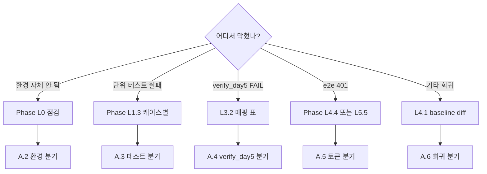

---

## A.2 — 환경 분기 (Phase L0 류 문제)

```
Symptom                        | 1차 점검          | 복구
---------------------------------+--------------------+------------------------
ModuleNotFoundError: jose       | L0.3.a            | pip install python-jose[cryptography]
ModuleNotFoundError: cryptography | L0.3.b           | pip install cryptography
Python 3.11 잡힘                | L0.2.a            | venv 재생성 (py -3.10 -m venv venv)
git status dirty 인데 본인 아님 | L0.1.d            | git diff > backup ; git checkout -- .
NY 영역 modified               | L0.1.d (민감 케이스) | git checkout -- agents/handlers/anomaly/
'bash' is not recognized        | L0.4.b            | PATH 에 C:\Program Files\Git\bin 추가
openssl not found               | L0.4.a            | Git for Windows 설치
```

---

## A.3 — 단위 테스트 분기 (Phase L1.3 류)

```
Failed test                                    | 1차 의심                | 복구 단계
-----------------------------------------------+--------------------------+---------------------
test_keygen_script_exists                      | 실행 비트 OFF            | L1.2.a
test_hs256_roundtrip                           | jwt_secret 비어있음      | .env 확인
test_rs256_roundtrip_via_env (SKIPPED)         | cryptography 미설치      | L0.3.b
test_rs256_roundtrip_via_env (FAILED alg!=RS256)| _effective_algo 깨짐    | L1.1.f (Vault 폴백 로직)
test_decode_accepts_both_when_rs_available     | decode_token pairs 빌더 | L1.1.f + jwt.py 본문
test_vault_priority_over_env                   | monkeypatch 안 먹힘     | reset_key_cache 호출 누락
```

---

## A.4 — verify_day5.py FAIL 분기 (Phase L3.2.c)

L3.2.c 의 매핑 표 참조. 13 체크 각각의 복구 절차 명시.

---

## A.5 — e2e 401 분기 (Phase L4.4 / L5.5)

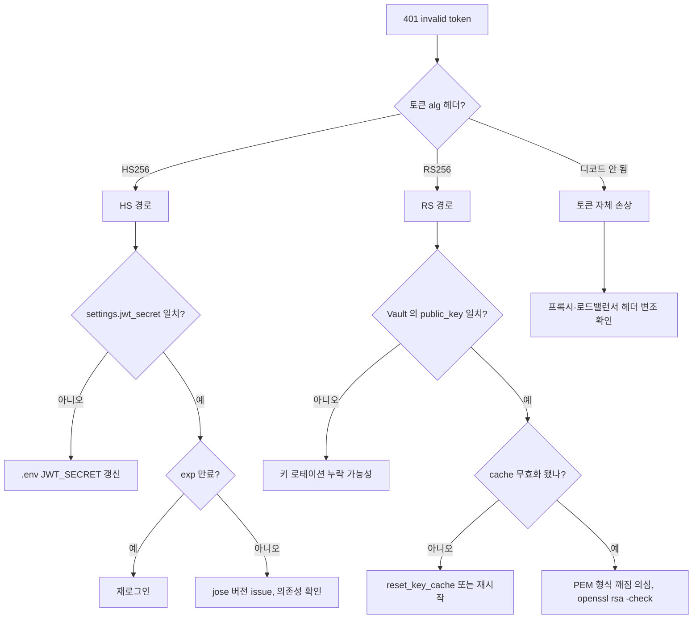

---

## A.6 — 회귀 분기 (Phase L4.1)

```
Failed test                  | 의심 원인                        | 복구
-----------------------------+----------------------------------+----------
api.* / pipelines.*          | jwt 의존하는 라우트 import 깨짐  | L1.4.b
agents.security_guard.*      | Day 4 영역 회귀, 본 PR 영향 아님 | 별도 PR
ada.security.guardrails.*    | 동상                             | 동상
test_state.* / test_personas | 본 PR 영향 거의 없음             | git log 로 다른 PR 추적
test_outputs_*               | 본 PR 무관                       | NY/CS/jh 영역
```

---

# 부록 B — 빠른 명령 참조 (Cheat Sheet)

## B.1 — 5초 sanity check

```powershell
# "내 환경 멀쩡한가?" — 5초 안에 답
venv\Scripts\python.exe -c "from ada.security.jwt import create_access_token, decode_token; t = create_access_token(sub='dbg'); print(decode_token(t)['sub'])"
```

**예상**: `dbg`

---

## B.2 — 1분 회귀

```powershell
# "내 변경이 뭔가 깼나?"
$env:PYTHONUTF8=1
venv\Scripts\python.exe -m pytest tests\test_day5_rs256_jwt.py tests\integration\test_security.py -q
venv\Scripts\python.exe scripts\dev\verify_day5.py
```

**예상**: 8 passed + 13/13.

---

## B.3 — 3분 종합

```powershell
# "PR 머지 가능한가?"
$env:PYTHONUTF8=1
venv\Scripts\python.exe -m pytest tests\ -q --tb=no
venv\Scripts\python.exe scripts\dev\verify_day5.py
& "C:\Program Files\Git\bin\bash.exe" scripts/dev/check_scope.sh 2>&1
git status --short
```

**예상**: 모두 그린.

---

## B.4 — 토큰 디버깅

```powershell
# 임의 토큰의 알고리즘 헤더 + payload 까보기
function Decode-JWT($token) {
    $parts = $token.Split(".")
    foreach ($p in $parts[0..1]) {
        $pad = (4 - $p.Length % 4) % 4
        $b64 = $p.Replace('-','+').Replace('_','/') + ("=" * $pad)
        [System.Text.Encoding]::UTF8.GetString([Convert]::FromBase64String($b64))
    }
}

$tok = "eyJhbGc..."
Decode-JWT $tok
```

---

## B.5 — Vault 키 상태 1초 확인

```powershell
vault kv get -field=public_key secret/jwt/rs256 | Select-Object -First 1
# 빈 출력 = placeholder 상태
# "-----BEGIN PUBLIC KEY-----" = 실제 키 발급됨
```

---

# 부록 C — 작업 시간 추적 + 우선순위

## C.1 — 시간 추적 (재계산)

| Phase | 시간 | 누적 | 비고 |
|---|---|---|---|
| L0 사전점검 | 15 분 | 15 분 | |
| L1 회귀 검증 | 25 분 | 40 분 | baseline 확보 |
| L2 코드 보강 (C3·C4) | 30 분 | 70 분 | |
| L3 문서·검증 (C1·C2) | 45 분 | 115 분 | 본 가이드 작성 포함 |
| L4 통합 검증 | 30 분 | 145 분 | |
| L5 운영 리허설 | 60 분 | 205 분 | 선택 |
| L6 커밋·PR | (사용자 직접) | — | |
| **합계** | **2.5 시간 (L5 제외) / 3.4 시간 (포함)** | | |

---

## C.2 — 핵심 경로 (최소 시간으로 DoD 달성)

DoD 만 충족하면 되는 시나리오 (L5 생략):

1. L0.1.a~c (브랜치) — 3분
2. L0.2.a~b (Python) — 2분
3. L0.3.a, b, d (jose, cryptography, ada) — 2분
4. L1.3.f (단위 테스트 5건 종합) — 1분
5. L1.4.a (test_security.py) — 1분
6. L1.5 (baseline) — 5분
7. L4.2.a (verify_day5 최종) — 1분

**최소 합계: 약 15분**. 코드 보강(L2)·신규 문서(L3)·통합(L4) 은 PR 품질 측면 추가 작업.

---

# 부록 D — Mermaid 다이어그램 인덱스

본 문서 안의 모든 Mermaid 다이어그램 9종:

| ID | 위치 | 다이어그램 | 재사용 추천처 |
|---|---|---|---|
| M1 | A1 | 컨텍스트 (Client→API→JWT→Storage) | PR 본문 (개관) |
| M2 | A2 | 컴포넌트 (모듈 내부 7 심볼) | 코드 리뷰 |
| M3 | A3.1 | 토큰 발급 시퀀스 | ADR §2 |
| M4 | A3.2 | 토큰 검증 시퀀스 | ADR §2 |
| M5 | A3.3 | 키 로드 폴백 flowchart | 운영 인계 |
| M6 | A3.4 | 키 로테이션 시퀀스 | Operations runbook |
| M7 | A4 | 알고리즘 선택 의사결정 트리 | dev 온보딩 |
| M8 | A5 | 키 라이프사이클 상태기계 | Operations runbook |
| M9 | A.1, A.5 | 디버깅 의사결정 트리 | wiki / FAQ |

각 다이어그램은 그대로 복붙 가능 (마크다운 호환). PR 본문에는 M1 + M3 정도가 적당.

---

# 부록 E — 변경 영향도 분석 (Blast Radius)

## E.1 — 본 PR 의 변경 영향

| 변경 | 직접 영향 | 간접 영향 | 미영향 |
|---|---|---|---|
| `_verify_keys` 제거 (C4) | jwt.py 내부 | — | 모든 외부 모듈 |
| `vault_seed.sh` placeholder (C3) | 시드 절차 | dev Vault 부팅 시 — | 앱 런타임 |
| `verify_day5.py` 신규 | — | CI 그린 게이트 추가 | 런타임 코드 |
| ADR-009 신규 | — | 문서 일관성 | 런타임 코드 |
| 본 가이드 신규 | — | 문서 일관성 | 런타임 코드 |

→ **런타임 영향 = 0**. 본 PR 은 안전한 정리·문서 PR.

---

## E.2 — 다운스트림 알림 필요 여부

| 멤버 | 영향? | 알림 |
|---|---|---|
| CS (timeseries) | 없음 | 불필요 |
| NY (anomaly) | 없음 | 불필요 |
| jh (tabular) | 없음 | 불필요 |

→ Contract Day 아님 (CLAUDE.md §5 외). Slack 공지 불필요.

---

## E.3 — Day 6 작업과의 의존성

Day 6 (Contract Day) 에서 HJ 가 다음을 작업:
- `ada/core/state.py` 의 `PipelineState.best_params: dict` 필드 추가
- `HyperparameterTunerAgent` 본구현

**본 PR 과의 의존성**: 없음.
- 본 PR 은 `ada/security/*` 만 건드림
- Day 6 은 `ada/core/state.py` + `agents/hyperparameter_tuner.py` + `agents/training_executor.py`
- 두 영역의 import 경로 비교차

→ **본 PR 머지 늦어도 Day 6 작업 시작 안 막힘**. 하지만 빠른 머지 권장 (HJ 자신의 본 PR 이 자신의 Day 6 작업 디렉토리에 stash 로 남지 않게).

---

# 부록 F — 회고용 메모 자리

> 작업 종료 후 배운 점 / 다음에 다를 점을 여기에 기록.

- [ ] 예상 시간 vs 실제 시간: ___분 / ___분
- [ ] 가장 시간 많이 든 Phase: ___
- [ ] 가장 시간 짧게 든 Phase: ___
- [ ] 막혔던 micro-step: ___
- [ ] 본 가이드의 부족했던 부분: ___
- [ ] 다음 ADR 가이드에 반영할 점: ___

---

# 부록 G — 최종 점검 ("누수 없이" 체크리스트)

본 가이드의 모든 Phase 를 통과했다면 머지 직전 마지막 한 번:

## G.1 — 코드 변경 무결성
- [ ] `ada/security/jwt.py` 에 `_verify_keys` 함수 부재 (`Select-String "def _verify_keys"` → 0)
- [ ] `scripts/vault_seed.sh` 에 `secret/jwt/rs256` 라인 존재
- [ ] 두 파일 모두 UTF-8, no BOM, syntax OK

## G.2 — 신규 산출물 4종
- [ ] `scripts/dev/verify_day5.py` 존재 + 실행 시 13/13
- [ ] `docs/ADR-009-DAY5-JWT-RS256.md` 존재 + 7 섹션
- [ ] `docs/ADR-009-DAY5-IMPLEMENTATION-GUIDE.md` (본 문서) 존재
- [ ] (PR 본문 작성됨) — Phase L6 인계 노트 참고

## G.3 — 검증 상태
- [ ] `pytest tests/ -q` baseline 과 동일 (passed/skipped 수 동일)
- [ ] `pytest tests/test_day5_rs256_jwt.py -v` 5 passed 또는 3 passed + 2 skipped
- [ ] `pytest tests/integration/test_security.py -v` 3 passed
- [ ] `scripts/dev/verify_day5.py` 13/13 + exit 0

## G.4 — 영역 + 권한
- [ ] `bash scripts/dev/check_scope.sh` 통과 (영역 위반 0)
- [ ] 변경된 모든 파일이 부록 E 의 권한 표와 일치 (HJ 영역만)
- [ ] NY/CS/jh 영역 파일 변경 0

## G.5 — 문서 정합성
- [ ] ADR-009 와 본 가이드의 핵심 결정 일치 (L3.4.a 통과)
- [ ] verify_day5.py 의 13 체크가 본 가이드 phase 와 매핑 (L3.4.b 통과)
- [ ] 본 가이드의 모든 sub-sub-step 식별자가 일관 (`[L*.*.*]` 형식)

## G.6 — 다음 sprint 준비
- [ ] Day 6 Contract Day 의 의존성(없음) 재확인
- [ ] Phase L5 운영 리허설 메모(부록 F) 보존 — 운영 배포 시 참고

---

**모두 ✓ 면 머지 가능 상태.** Phase L6 (사용자 직접 처리) 의 인계 노트 따라 진행.

---

# 부록 H — 의도적 비포함 / 미해결 (Out of Scope)

본 가이드 안에 *의도적으로* 다루지 않은 항목들. Day 5 PR 의 scope 가 부풀지 않도록 명시.

| 항목 | 왜 미포함 | 향후 ADR |
|---|---|---|
| `/auth/jwks.json` 라우트 (JWKS endpoint) | Day 5 는 *서버 내부* 변경만. 외부 노출은 외부 서비스 통합 시점 | Day 9+ |
| `kid` 헤더 활성화 | JWKS endpoint 와 짝. 단독으로 의미 없음 | Day 9+ |
| Prometheus 메트릭 (`jwt_decode_failures_total` 등) | 본 PR 은 운영 관측 인프라 변경 안 함 | ADR-010 (예정) |
| Vault audit log 기반 키 회전 자동화 | 운영 정착 후 추가. 분기 1회 수동도 충분 | Q3 2026 |
| RS512 / ES256 등 다른 비대칭 알고리즘 | 단순화 위해 RS256 단일 | 필요 시 별도 ADR |
| FastAPI middleware 레벨 통일 처리 | 현재 `Depends(get_current_user)` 패턴 유지 | 리팩토링 후보 |
| 토큰 폐기 목록 (revocation list) | 짧은 expire (60분) 으로 대체 — 운영 관행 일반적 | 보안 사고 발생 시 검토 |

→ 위 항목 중 어느 것이라도 PR 리뷰어가 요구하면: "ADR-009 §7 / 본 가이드 부록 H 에 명시된 OOS — Day 5 scope 외" 로 답변.

---

**끝.** 이 줄까지 진행했으면 Day 5 완료. PR 머지 후 Day 6 으로.
_available (1분)

**실행**:
```powershell
venv\Scripts\python.exe -m pytest tests\test_day5_rs256_jwt.py::test_decode_accepts_both_when_rs_available -v
```

**예상**: `PASSED`

**이 테스트가 검증하는 것**: RS 환경에서 받은 *HS256 토큰* 이 거부되지 않음 (dual-verify 윈도우).

**실패 분기**:
- `decoded["sub"] == "old"` 어설션 실패 → `decode_token` 의 pairs 빌더가 HS256 폴백을 안 함. jwt.py 의 decode_token 함수 본문 재점검:
  ```python
  pairs.append((settings.jwt_secret, "HS256"))   # 이 라인이 있어야 함
  ```

---

#### [L1.3.e] test_vault_priority_over_env (1분)

**실행**:
```powershell
venv\Scripts\python.exe -m pytest tests\test_day5_rs256_jwt.py::test_vault_priority_over_env -v
```

**예상**: `PASSED`

**이 테스트가 검증하는 것**: Vault 응답이 정상이면 env 무시.

**실패 분기**:
- `keys["private_key"] == "env-priv"` (env 가 이김) → `_load_rs_keys` 가 Vault 먼저 시도하지 않음. 함수 순서 확인:
  ```python
  # Vault 가 priority — 함수 본문 시작 부분이어야 함
  try:
      from ada.security.vault import read_secret
      v = read_secret("jwt/rs256")
      if v and v.get("private_key") and v.get("public_key"):
          return {...}
  except Exception: ...
  # env 는 그 다음
  priv = os.environ.get("JWT_PRIVATE_KEY", "")
  ```
- `keys` 가 빈 dict → monkeypatch 한 `read_secret` 가 못 잡힘. import 순서 확인

---

#### [L1.3.f] 5건 한꺼번에 — 종합 (30초)

**실행**:
```powershell
venv\Scripts\python.exe -m pytest tests\test_day5_rs256_jwt.py -v --tb=short
```

**예상**:
```
tests/test_day5_rs256_jwt.py::test_keygen_script_exists PASSED  [ 20%]
tests/test_day5_rs256_jwt.py::test_hs256_roundtrip PASSED        [ 40%]
tests/test_day5_rs256_jwt.py::test_rs256_roundtrip_via_env PASSED [ 60%]
tests/test_day5_rs256_jwt.py::test_decode_accepts_both_when_rs_available PASSED [ 80%]
tests/test_day5_rs256_jwt.py::test_vault_priority_over_env PASSED [100%]
========= 5 passed in X.XXs =========
```

**허용 가능한 변형**: 2 SKIPPED + 3 PASSED (cryptography 없음) → DoD 미충족이지만 진행은 가능. [L0.3.b] 로 복귀 권장.

**진입 조건**: 5/5 PASSED 또는 (3/5 PASSED + 2 SKIPPED).

---

### L1.4 — 보안 통합 회귀

#### [L1.4.a] test_security.py 3건 (30초)

**실행**:
```powershell
venv\Scripts\python.exe -m pytest tests\integration\test_security.py -v
```

**예상**:
```
test_prompt_injection_blocked PASSED
test_jwt_roundtrip PASSED
test_rbac_perm_matrix PASSED
```

**실패 분기**:
- `test_jwt_roundtrip` 만 실패 → 본 Phase 의 변경이 보안 통합을 깸. [L1.3] 의 baseline 으로 즉시 복귀
- `test_prompt_injection_blocked` 실패 → Day 4 가드레일 회귀. 본 PR 영역 외 — NY/HJ 확인 필요

---

#### [L1.4.b] /auth/login 라우트 import 가능성 (30초)

**실행**:
```powershell
venv\Scripts\python.exe -c "from api.routes.auth import router, login, register; print('auth route OK')"
```

**예상**: `auth route OK`

**실패 분기**: ImportError → jwt.py 의 어떤 심볼이 사라졌음. 위 [L1.1.c] 의 4 심볼 + `api.routes.auth` 가 쓰는 심볼 (`create_access_token` 만) 재확인

---

### L1.5 — 전체 회귀 baseline

#### [L1.5.a] 전체 pytest 실행 + 결과 기록 (5분)

**실행**:
```powershell
$env:PYTHONUTF8=1
venv\Scripts\python.exe -m pytest tests\ -q --tb=no 2>&1 | Tee-Object -FilePath $env:TEMP\day5_baseline.txt
```

**예상 마지막 라인** (예시):
```
35 passed, 2 skipped in 12.34s
```

**기록**: `$env:TEMP\day5_baseline.txt` 가 baseline. Phase L2 후 비교용.

**실패 분기**:
- `5 failed` 등 → 본 PR 작업 전에 깨진 테스트. 어느 PR 머지 시점부터인지 `git bisect` 또는 마지막 그린 커밋 찾기
- 새 failure 가 Day 5 영역 (jwt, security) → 즉시 Phase L1.1~L1.4 재점검

---

#### [L1.5.b] passed/skipped 수 추출 (30초)

**실행**:
```powershell
Get-Content $env:TEMP\day5_baseline.txt | Select-String -Pattern "passed|failed|skipped" | Select-Object -Last 1
```

**기억할 숫자**: `<N>` passed, `<M>` skipped — Phase L4 의 비교 기준.

---

### L1.6 — Phase L1 종료 게이트

**최종 체크**:
- [ ] L1.1.a~f 모두 PASS
- [ ] L1.2.a~c 모두 PASS
- [ ] L1.3.a~f 모두 PASS (RS 2건 SKIPPED 도 가능)
- [ ] L1.4.a, b 모두 PASS
- [ ] L1.5 baseline 의 passed 수 N ≥ 30 (대략)
- [ ] baseline 텍스트 파일 보존 완료

**다음 Phase 진입 조건**: 위 6개 체크박스 모두 ✓.

---

## Phase L2 — 코드 보강 C3·C4 (30분)

> **Phase 목표**: 두 가지 작은 보강 — `_verify_keys` 데드코드 제거(C4), `vault_seed.sh` 에 `secret/jwt/rs256` placeholder 추가(C3).
>
> **순서**: C4 → C3 (둘 사이 의존성 없음).
>
> **세부 단계 트리**:
> - L2.1 C4 사전 점검 (3 micro-step)
> - L2.2 C4 실행 — 데드코드 제거 (2 micro-step)
> - L2.3 C4 검증 (3 micro-step)
> - L2.4 C3 사전 점검 (2 micro-step)
> - L2.5 C3 실행 (2 micro-step)
> - L2.6 C3 검증 (3 micro-step)
> - L2.7 종료 게이트

---

### L2.1 — C4 사전 점검

#### [L2.1.a] 정의 위치 확인 (30초)

```powershell
Select-String -Path ada\security\jwt.py -Pattern "def _verify_keys" | Format-Table LineNumber, Line
```

**상황 분기**:
- 1 hit → 정상, L2.1.b 진행
- 0 hit → 이미 제거됨, L2.3 검증으로 점프
- 2+ hit → 중복 정의, 모두 제거

#### [L2.1.b] 호출처 전수 grep (1분)

```bash
grep -rn "_verify_keys" --include="*.py" --exclude-dir=venv --exclude-dir=.git .
```

**예상**: 정의처 1줄만.

**다른 hit**: 호출처 동반 제거 필요.

#### [L2.1.c] decode_token 책임 대체 확인 (30초)

```powershell
Get-Content ada\security\jwt.py | Select-String "pairs.append"
```

**예상**: 2 라인 — RS256 pair, HS256 pair. `_verify_keys` 의 책임이 인라인됨 → 안전 제거.

---

### L2.2 — C4 실행

#### [L2.2.a] 정확한 라인 범위 식별 (30초)

```powershell
Get-Content ada\security\jwt.py | Select-Object -Index 65..78
```

**예상**: 라인 67~75 가 `def _verify_keys` 함수 본체.

#### [L2.2.b] Edit 적용 (1분)

**old_string** (정확히):
```python
def _verify_keys() -> tuple[list[str], list[str]]:
    """(허용 알고리즘 목록, 검증 키 후보 목록).

    RS256 가 가능하면 RS256+HS256 모두 허용 (운영 전환 기간 호환).
    """
    rs = _load_rs_keys()
    if rs.get("public_key"):
        return ["RS256", "HS256"], [rs["public_key"], settings.jwt_secret]
    return ["HS256"], [settings.jwt_secret]
```

**new_string**:
```python
# 운영 전환 기간에는 RS256·HS256 두 알고리즘 모두 허용한다.
# decode_token() 이 (key, algo) 쌍 리스트를 직접 만들어 시도하므로
# 별도의 _verify_keys() 헬퍼는 두지 않는다 (호출처 없는 데드코드 제거 — Day 5).
```

---

### L2.3 — C4 검증

#### [L2.3.a] V1 정적 — 함수 정의 사라짐 (30초)

```powershell
(Select-String -Path ada\security\jwt.py -Pattern "def _verify_keys").Count
```
**예상**: `0`

#### [L2.3.b] V1 정적 — 호출처 0 재확인 (30초)

```bash
grep -rn "_verify_keys" --include="*.py" --exclude-dir=venv --exclude-dir=.git .
```
**예상**: 빈 출력

#### [L2.3.c] V2 단위 — 5 테스트 재실행 (1분)

```powershell
venv\Scripts\python.exe -m pytest tests\test_day5_rs256_jwt.py -v
```
**예상**: 5 passed (baseline 동일)

---

### L2.4 — C3 사전 점검

#### [L2.4.a] vault_seed.sh 현재 내용 (30초)

```powershell
Get-Content scripts\vault_seed.sh
```
**확인**: `vault kv put ada/jwt` 블록 존재 + `secret/jwt/rs256` 이미 있는지.

#### [L2.4.b] mount 호환성 (30초)

```bash
vault secrets list
```
**예상**: `ada/` + `secret/` 두 mount 존재.

→ jwt.py 의 `_load_rs_keys` 가 `secret/` mount 의 `jwt/rs256` 사용. 일치 확인.

---

### L2.5 — C3 실행

#### [L2.5.a] Edit 대상 위치 (30초)

```powershell
(Get-Content scripts\vault_seed.sh | Select-String "vault kv put ada/jwt").LineNumber
```
**예상**: 라인 38 근처.

#### [L2.5.b] Edit 적용 (1분)

**old_string**:
```bash
vault kv put ada/jwt \
  jwt_secret="${JWT_SECRET:-}" \
  secret_key="${SECRET_KEY:-}"

echo "[done] Vault seeded:"
vault kv list ada/
```

**new_string** (placeholder 추가):
```bash
vault kv put ada/jwt \
  jwt_secret="${JWT_SECRET:-}" \
  secret_key="${SECRET_KEY:-}"

# Day 5 — RS256 키쌍 placeholder. 실제 키는
# scripts/security/jwt_keygen.sh --vault 가 덮어 쓴다.
vault kv put secret/jwt/rs256 \
  private_key="" \
  public_key="" \
  || echo "[skip] secret/jwt/rs256 placeholder (mount 'secret' may not exist yet)"

echo "[done] Vault seeded:"
vault kv list ada/
```

**핵심**:
- `|| echo` 로 mount 부재 silent 처리
- 빈 값 → `_load_rs_keys` 의 `if v.get("private_key") and v.get("public_key")` 분기에서 False → env/HS256 폴백

---

### L2.6 — C3 검증

#### [L2.6.a] V1 정적 — bash syntax (30초)

```powershell
& "C:\Program Files\Git\bin\bash.exe" -n scripts/vault_seed.sh
```
**예상**: exit 0

#### [L2.6.b] V1 정적 — placeholder 라인 grep (30초)

```powershell
Select-String -Path scripts\vault_seed.sh -Pattern "secret/jwt/rs256"
```
**예상**: 2 hit (kv put + 안내)

#### [L2.6.c] V3 통합 — dev Vault 실행 (선택, 2분)

```bash
docker compose --profile sec up -d vault
docker compose exec vault sh /scripts/vault_seed.sh
vault kv get secret/jwt/rs256
```
**예상**: `private_key=""`, `public_key=""` 출력.

---

### L2.7 — Phase L2 종료 게이트

**최종 체크**:
- [ ] L2.1.a, b, c 모두 PASS
- [ ] L2.2.b Edit 적용 완료
- [ ] L2.3.a, b, c 모두 PASS
- [ ] L2.4.a, b PASS
- [ ] L2.5.b Edit 적용 완료
- [ ] L2.6.a, b PASS (L2.6.c 선택)
- [ ] `git diff --stat` 가 정확히 2 파일 변경

```powershell
git diff --stat ada\security\jwt.py scripts\vault_seed.sh
```

**다음 Phase**: 7개 체크박스 모두 ✓.

---

## Phase L3 — 문서·검증 스크립트 C1·C2 (45분)

> **Phase 목표**: 코드 변경 없는 PR 산출물 4종 — C1 verify_day5.py, C2 ADR-009, C3 본 가이드, C4 PR 본문.
>
> **순서**: C2 (결정) → C1 (검증 스크립트) → C3 (가이드).
>
> **세부 단계 트리**:
> - L3.1 ADR-009 결정 문서 (4 micro-step)
> - L3.2 verify_day5.py (5 micro-step)
> - L3.3 본 가이드 (3 micro-step)
> - L3.4 교차 검증 (2 micro-step)
> - L3.5 종료 게이트

---

### L3.1 — ADR-009 결정 문서

#### [L3.1.a] 파일 존재 + h1 1개 (30초)

```powershell
Test-Path docs\ADR-009-DAY5-JWT-RS256.md
(Get-Content docs\ADR-009-DAY5-JWT-RS256.md | Select-String "^# ").Count
```
**예상**: True / 1

#### [L3.1.b] 필수 메타데이터 6 항목 (1분)

```powershell
$pattern = '\*\*Status\*\*|\*\*Date\*\*|\*\*Owners\*\*|\*\*Related\*\*|\*\*Contract Day\*\*|TEAM_10DAY_SCHEDULE'
(Select-String -Path docs\ADR-009-DAY5-JWT-RS256.md -Pattern $pattern).Count
```
**예상**: 6

#### [L3.1.c] 핵심 섹션 7종 (1분)

배경 / 결정 / 실행 절차 / 키 로테이션 SOP / 위험 / 단위 테스트 / 미해결.

#### [L3.1.d] 결정 키워드 grep (1분)

`RS256.*HS256`, `_load_rs_keys`, `Vault.*우선`, `JWT_EXPIRE_MIN`, `lru_cache`, `reset_key_cache`, `dual-verify` — 모두 1+ hit.

---

### L3.2 — verify_day5.py

#### [L3.2.a] 파일 존재 + py_compile (30초)

```powershell
Test-Path scripts\dev\verify_day5.py
venv\Scripts\python.exe -m py_compile scripts\dev\verify_day5.py
```

#### [L3.2.b] @check 데코레이터 13개 (1분)

```powershell
(Get-Content scripts\dev\verify_day5.py | Select-String '@check\(').Count
```
**예상**: `13`

#### [L3.2.c] 실제 실행 13/13 (2분)

```powershell
$env:PYTHONUTF8=1
venv\Scripts\python.exe scripts\dev\verify_day5.py
```

**예상 마지막**:
```
결과: 13/13 통과
✅ Day 5 정적 검증 모두 통과
```

**실패 분기 매핑**:

| 실패 | 원인 | 복구 |
|---|---|---|
| `L1.1` 공개 API | [L1.1.c] | jwt.py 시그니처 복구 |
| `L1.2` Vault 우선 | `read_secret("jwt/rs256")` 변경 | 원본 복구 |
| `L1.3` effective_algo | settings 참조 변경 | jwt.py 본문 |
| `L1.4` decode pairs | pairs.append 변경 | jwt.py decode_token |
| `L1.5` _verify_keys 부재 | 데드코드 재추가됨 | Phase L2.2.b |
| `L2.1` keygen 실행비트 | 비트 OFF | `git update-index --chmod=+x` |
| `L2.2` keygen 명령 | openssl/vault 사라짐 | keygen 복구 |
| `L3.1` placeholder | secret/jwt/rs256 누락 | Phase L2.5.b |
| `L4.1` 5 케이스 | 함수 이름 변경 | 테스트 복구 |
| `L4.2` alg=RS256 | 어설션 변경 | 테스트 복구 |
| `L5.1` settings 필드 | config.py 변경 | A6 표 참조 |
| `L5.2` jwt_algo 값 | env 오류 | .env 확인 |

#### [L3.2.d] V3 통합 — 의도적 실패 감지 (3분)

```powershell
Copy-Item ada\security\jwt.py ada\security\jwt.py.bak
(Get-Content ada\security\jwt.py -Raw) -replace 'def reset_key_cache', 'def reset_key_cache_BROKEN' | Set-Content ada\security\jwt.py -Encoding UTF8 -NoNewline
venv\Scripts\python.exe scripts\dev\verify_day5.py    # 기대: 1+ FAIL + exit 1
Move-Item -Force ada\security\jwt.py.bak ada\security\jwt.py
venv\Scripts\python.exe scripts\dev\verify_day5.py    # 기대: 13/13 그린 복귀
```

#### [L3.2.e] sys.path 처리 (30초)

```powershell
Select-String -Path scripts\dev\verify_day5.py -Pattern "REPO_ROOT|sys.path.insert"
```
**예상 2 라인**: `REPO_ROOT = Path(__file__).resolve().parents[2]` + `sys.path.insert(0, str(REPO_ROOT))`

---

### L3.3 — 본 가이드

#### [L3.3.a] markdown 구조 (1분)

```powershell
$file = "docs\ADR-009-DAY5-IMPLEMENTATION-GUIDE.md"
$h1 = (Get-Content $file | Select-String "^# ").Count
$fences = (Get-Content $file | Select-String '^```').Count
$phases = (Get-Content $file | Select-String "^## Phase L").Count
"h1: $h1, fences: $fences (짝수?), phases: $phases"
```

**예상**: h1≥5, fences=짝수, phases=6.

#### [L3.3.b] sub-sub-step 식별자 일관성 (1분)

```powershell
$ids = Get-Content $file | Select-String -Pattern '\[L\d+\.\d+\.[a-z]\]' -AllMatches | ForEach-Object { $_.Matches.Value } | Sort-Object -Unique
"unique IDs: $($ids.Count)"
# 중복 검사
$dups = Get-Content $file | Select-String -Pattern '\[L\d+\.\d+\.[a-z]\]' -AllMatches | ForEach-Object { $_.Matches.Value } | Group-Object | Where-Object Count -gt 1
$dups.Count
```

**예상**: unique IDs ≥ 50, 중복 0.

#### [L3.3.c] Mermaid 9개 존재 (30초)

```powershell
(Get-Content $file | Select-String '^```mermaid').Count
```
**예상**: `9`

---

### L3.4 — 교차 검증

#### [L3.4.a] ADR-009 ↔ 본 가이드 일치 (2분)

핵심 키워드(`RS256.*우선`, `dual-verify`, `reset_key_cache`) 가 양쪽 모두 1+ hit.

#### [L3.4.b] verify_day5 ↔ 가이드 ↔ ADR 매핑 (3분)

수동 표 (가이드 L3.4 의 매핑 표) 휴먼 리뷰. 13 체크 모두 가이드 phase + ADR 섹션과 매핑.

---

### L3.5 — 종료 게이트

- [ ] L3.1.a~d 모두 PASS
- [ ] L3.2.a~e 모두 PASS (13/13 + 실패 감지)
- [ ] L3.3.a~c PASS (구조 + 식별자 + Mermaid)
- [ ] L3.4.a, b PASS
- [ ] 4 문서 UTF-8, no BOM 일관

---

## Phase L4 — 통합 검증 (30분)

> **Phase 목표**: 모든 변경 종합 후 시스템 일관성. L1 의 baseline 과 비교.
>
> **세부 단계 트리**:
> - L4.1 전체 회귀 (3 micro-step)
> - L4.2 verify_day5 최종 (2 micro-step)
> - L4.3 import 그래프 (2 micro-step)
> - L4.4 e2e (5 micro-step, 선택)
> - L4.5 종료 게이트

---

### L4.1 — 전체 회귀

#### [L4.1.a] 전체 실행 (3분)

```powershell
$env:PYTHONUTF8=1
venv\Scripts\python.exe -m pytest tests\ -q --tb=short 2>&1 | Tee-Object -FilePath $env:TEMP\day5_final.txt
```

**baseline 비교**:
```powershell
Compare-Object (Get-Content $env:TEMP\day5_baseline.txt) (Get-Content $env:TEMP\day5_final.txt)
```

**규칙**: passed/skipped/failed 수 baseline 과 동일.

#### [L4.1.b] PASS/FAIL diff (1분)

```powershell
$base = Get-Content $env:TEMP\day5_baseline.txt | Select-String "PASSED|FAILED"
$final = Get-Content $env:TEMP\day5_final.txt | Select-String "PASSED|FAILED"
Compare-Object $base $final
```
**예상**: 빈 출력.

#### [L4.1.c] flaky 검증 — 3회 (3분, 선택)

```powershell
1..3 | ForEach-Object {
    "=== Run $_ ==="
    venv\Scripts\python.exe -m pytest tests\test_day5_rs256_jwt.py tests\integration\test_security.py -q --tb=no
}
```
**예상**: 3회 모두 동일.

---

### L4.2 — verify_day5 최종

#### [L4.2.a] 실행 (1분)
```powershell
venv\Scripts\python.exe scripts\dev\verify_day5.py
```
**예상**: 13/13 통과.

#### [L4.2.b] exit code (30초)
```powershell
venv\Scripts\python.exe scripts\dev\verify_day5.py; Write-Host "Exit: $LASTEXITCODE"
```
**예상**: Exit: 0

---

### L4.3 — import 그래프

#### [L4.3.a] 전체 ada import + 시간 측정 (1분)

```powershell
venv\Scripts\python.exe -c @"
import time
t0 = time.perf_counter()
import ada, ada.security.jwt, ada.security.vault, ada.security.guardrails
import api.routes.auth, api.main
print(f'import time: {time.perf_counter()-t0:.3f}s')
print('all OK')
"@
```
**예상**: 1초 이하, OK.

#### [L4.3.b] 순환 import 검사 (1분)

```powershell
venv\Scripts\python.exe -X importtime -c "import ada.security.jwt" 2>&1 | Select-String "ada.security|api.routes" | Select-Object -First 20
```

**확인**: `ada.security.jwt` 가 `api.routes.*` 를 import 하지 않음.

---

### L4.4 — End-to-End (선택, 10분)

#### [L4.4.a] API 컨테이너 기동
```powershell
docker compose up -d postgres redis api
Start-Sleep 10
docker compose ps
```

#### [L4.4.b] healthcheck
```powershell
curl http://localhost:8000/health
```

#### [L4.4.c] register → HS256 토큰
```powershell
$body = @{ email="day5@test"; password="Pw1234!" } | ConvertTo-Json
$resp = Invoke-RestMethod -Method POST -Uri http://localhost:8000/auth/register -ContentType "application/json" -Body $body
$token = $resp.access_token
# 헤더 디코드 — alg 확인
```

#### [L4.4.d] 보호 라우트 호출
```powershell
Invoke-RestMethod -Method GET -Uri http://localhost:8000/pipelines/ -Headers @{ Authorization = "Bearer $token" }
```
**예상**: 200

#### [L4.4.e] RS256 미니 리허설 (Phase L5 의 미니 버전)

키 발급 → env 주입 → 재시작 → 새 토큰 alg=RS256 확인.

---

### L4.5 — 종료 게이트

**필수 5개**:
- [ ] L4.1.a baseline 일치
- [ ] L4.1.b diff 0
- [ ] L4.2.a 13/13
- [ ] L4.2.b exit 0
- [ ] L4.3.a import OK

**선택**: L4.1.c flaky, L4.4 e2e.

---

## Phase L5 — 운영 전환 리허설 (선택, 60분)

> **목적**: 실제 운영 배포 전 dev 에서 RS256 전환 절차 한 번 거쳐 봄. **DoD 무관**.
>
> **세부 단계**:
> - L5.1 사전 준비 (3 micro-step)
> - L5.2 Vault + 시드 (3 micro-step)
> - L5.3 RS 키 발급 + Vault (4 micro-step)
> - L5.4 설정 전환 (2 micro-step)
> - L5.5 재기동 + 발급 검증 (3 micro-step)
> - L5.6 호환성 — 구·신 공존 (3 micro-step)
> - L5.7 로테이션 리허설 (4 micro-step)
> - L5.8 정리

---

### L5.1 — 사전 준비

#### [L5.1.a] 도구 재확인 (1분)
```powershell
docker --version; docker compose version
& "C:\Program Files\Git\bin\bash.exe" --version
openssl version
```

#### [L5.1.b] .env 백업 (1분)
```powershell
Copy-Item .env .env.bak_$(Get-Date -Format yyyyMMdd_HHmmss)
Get-Content .env | Select-String "JWT_ALGO|VAULT_ADDR|VAULT_DEV_TOKEN"
```

#### [L5.1.c] compose 구성 점검 (1분)
```powershell
docker compose config --services
docker compose config --profiles
```
**확인**: `vault` 서비스 + `sec` profile.

---

### L5.2 — Vault 컨테이너 + 시드

#### [L5.2.a] 기동 (1분)
```powershell
docker compose --profile sec up -d vault
Start-Sleep 5
docker compose ps vault
```
**예상**: `running (healthy)`

#### [L5.2.b] 인증 (30초)
```powershell
$env:VAULT_ADDR = "http://localhost:8200"
$env:VAULT_TOKEN = "root"
vault status
```
**예상**: `Sealed=false`, `Initialized=true`.

#### [L5.2.c] vault_seed.sh 실행 (1분)
```powershell
docker compose --profile sec exec vault sh /scripts/vault_seed.sh
docker compose exec vault vault kv get secret/jwt/rs256
```
**예상**: placeholder `private_key="n/a"`, `public_key="n/a"`.

---

### L5.3 — RS 키쌍 발급 + Vault 저장

#### [L5.3.a] 리허설 디렉토리 (30초)
```powershell
$rehearsal = "$env:TEMP\day5_rehearsal_$(Get-Date -Format yyyyMMdd)"
New-Item -ItemType Directory -Force -Path $rehearsal | Out-Null
Set-Location $rehearsal
```

#### [L5.3.b] 키 생성 + openssl 검증 (1분)
```powershell
& "C:\Program Files\Git\bin\bash.exe" "C:\IT\workspace_python\ADA\scripts\security\jwt_keygen.sh"
ls
& openssl rsa -in jwt_private.pem -check -noout
```

#### [L5.3.c] Vault 저장 (1분)
```powershell
vault kv put secret/jwt/rs256 `
  private_key=@jwt_private.pem `
  public_key=@jwt_public.pem
```
**예상**: version 2 (placeholder 가 v1, 새 키 v2).

#### [L5.3.d] 저장 확인 (30초)
```powershell
vault kv get -format=json secret/jwt/rs256 | ConvertFrom-Json | ForEach-Object { $_.data.data } | Select-Object @{N='priv';E={$_.private_key.Substring(0,50)}}, @{N='pub';E={$_.public_key.Substring(0,50)}}
```

---

### L5.4 — 앱 설정 전환

#### [L5.4.a] .env RS256 (1분)
```powershell
Set-Location C:\IT\workspace_python\ADA
(Get-Content .env) -replace '^JWT_ALGO=.*', 'JWT_ALGO=RS256' | Set-Content .env -Encoding UTF8
```

#### [L5.4.b] env JWT_PRIVATE_KEY 주석 처리 (30초)
```powershell
(Get-Content .env) -replace '^JWT_PRIVATE_KEY=', '# JWT_PRIVATE_KEY=' | Set-Content .env -Encoding UTF8
```

---

### L5.5 — 앱 재기동 + 발급 검증

#### [L5.5.a] api·worker 재시작 (1분)
```powershell
docker compose restart api worker
Start-Sleep 5
docker compose ps api worker
```

#### [L5.5.b] 로그 — Vault 로드 (30초)
```powershell
docker compose logs api --tail=50 | Select-String "vault|jwt|rs256"
```
**경고 부재 확인**: `vault_rs_key_load_failed` 없어야.

#### [L5.5.c] 새 토큰 발급 + alg 검증 (1분)
```powershell
$body = @{ email="day5rs@test"; password="Pw1234!" } | ConvertTo-Json
$resp = Invoke-RestMethod -Method POST -Uri http://localhost:8000/auth/register -ContentType "application/json" -Body $body
$token_rs = $resp.access_token

$header_b64 = $token_rs.Split(".")[0]
$pad = (4 - $header_b64.Length % 4) % 4
$h = [System.Text.Encoding]::UTF8.GetString([Convert]::FromBase64String($header_b64.Replace('-','+').Replace('_','/') + ("=" * $pad)))
"Header: $h"
```
**예상**: `{"alg":"RS256","typ":"JWT"}`

---

### L5.6 — 호환성 — 구·신 토큰

#### [L5.6.a] 구 HS256 토큰 발급 시뮬 (1분)

`.env` 잠시 HS256 → 재시작 → 토큰 발급 → 다시 RS256.

#### [L5.6.b] RS 환경에서 구 HS 토큰 통과 (30초)
```powershell
Invoke-RestMethod -Method GET -Uri http://localhost:8000/pipelines/ -Headers @{ Authorization = "Bearer $token_hs" }
```
**예상**: 200 — dual-verify 작동.

#### [L5.6.c] RS 환경에서 새 RS 토큰 통과 (30초)
```powershell
Invoke-RestMethod -Method GET -Uri http://localhost:8000/pipelines/ -Headers @{ Authorization = "Bearer $token_rs" }
```
**예상**: 200.

---

### L5.7 — 키 로테이션 리허설

#### [L5.7.a] 새 키쌍 발급 + 덮어쓰기 (1분)
```powershell
Set-Location $rehearsal
& "C:\Program Files\Git\bin\bash.exe" "C:\IT\workspace_python\ADA\scripts\security\jwt_keygen.sh"
vault kv put secret/jwt/rs256 private_key=@jwt_private.pem public_key=@jwt_public.pem
vault kv metadata get secret/jwt/rs256
```
**예상**: `current_version: 3`

#### [L5.7.b] 캐시 무효화 (30초)
```powershell
docker compose restart api worker
Start-Sleep 5
```

#### [L5.7.c] 구 RS 토큰 통과 시도 (30초)
```powershell
Invoke-RestMethod -Method GET -Uri http://localhost:8000/pipelines/ -Headers @{ Authorization = "Bearer $token_rs" }
```
**예상**: 401 (구 키로 서명된 토큰 = 새 검증 환경에서 거부됨) → **로테이션 정책의 의미 체감**.

#### [L5.7.d] 정리 (30초)
```powershell
Set-Location C:\IT\workspace_python\ADA
docker compose down
Remove-Item -Recurse -Force $rehearsal
Remove-Item Env:VAULT_ADDR, Env:VAULT_TOKEN -ErrorAction SilentlyContinue
```

---

### L5.8 — 정리

#### [L5.8.a] dev 환경 복원 (1분)
```powershell
$bak = Get-ChildItem .env.bak_* | Sort-Object LastWriteTime | Select-Object -Last 1
Copy-Item $bak .env -Force
docker compose down vault 2>$null
```

#### [L5.8.b] 정리 체크 (30초)
- [ ] `*.pem` 없음
- [ ] env 변수 정리됨
- [ ] .env 복원됨

#### [L5.8.c] 회고 메모 (선택, 2분)
ADR-009 §3.4 또는 부록 F 에 운영 배포 시 참고 메모 기록.

---

## Phase L6 — 커밋·푸시·PR (사용자 직접 처리)

> 사용자가 직접 수행. 짧은 인계 노트만.

### L6 인계 노트

**변경 파일 (예상)**:
```
ada/security/jwt.py
scripts/vault_seed.sh
scripts/dev/verify_day5.py (신규)
docs/ADR-009-DAY5-JWT-RS256.md (신규)
docs/ADR-009-DAY5-IMPLEMENTATION-GUIDE.md (신규)
```

**PR 본문 템플릿**:
```markdown
## hj-day5 — RS256 JWT 전환 + Vault 키 로딩

### What
- `ada/security/jwt.py` `_verify_keys` 데드코드 제거
- `scripts/vault_seed.sh` 에 `secret/jwt/rs256` placeholder 추가
- `scripts/dev/verify_day5.py` 정적 검증 13 체크 (신규)
- `docs/ADR-009-DAY5-JWT-RS256.md` 결정 기록 (신규)
- `docs/ADR-009-DAY5-IMPLEMENTATION-GUIDE.md` 시공 도면 (신규)

### Why
- 본 구현(RS256/HS256 dual + Vault fallback) 은 Day 2~4 통합 커밋에 선반영
- 본 PR 은 DoD 검증 인프라 + 문서 + 운영 SOP

### DoD 충족
- [x] decode_token RS256 통과 단위 테스트
- [x] HS256 호환 회귀
- [x] keygen 스크립트 실행 가능

### How to verify
1. `pytest tests/test_day5_rs256_jwt.py -v` → 5 passed
2. `python scripts/dev/verify_day5.py` → 13/13 통과
```

**머지 전 한 줄 검증**:
```powershell
$env:PYTHONUTF8=1
venv\Scripts\python.exe -m pytest tests\ -q --tb=no
venv\Scripts\python.exe scripts\dev\verify_day5.py
```

---

# 부록 A — 디버깅 체크리스트 (의사결정 트리)

## A.1 — 막혔을 때의 1단 분류

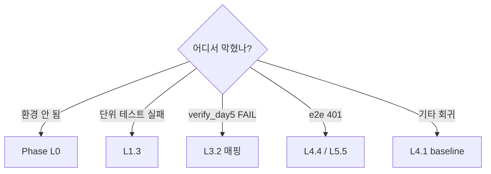

## A.2 — 환경 분기

| Symptom | 점검 | 복구 |
|---|---|---|
| `ModuleNotFoundError: jose` | L0.3.a | `pip install python-jose[cryptography]` |
| `ModuleNotFoundError: cryptography` | L0.3.b | `pip install cryptography` |
| Python 3.11 잡힘 | L0.2.a | venv 재생성 (3.10) |
| git status dirty 미상 | L0.1.d | `git diff > backup; git checkout -- .` |
| NY 영역 modified | L0.1.d | `git checkout -- agents/handlers/anomaly/` |
| 'bash' 없음 | L0.4.b | Git for Windows PATH |
| openssl 없음 | L0.4.a | 동상 |

## A.3 — 단위 테스트 분기

| Failed test | 의심 | 복구 |
|---|---|---|
| test_keygen_script_exists | 실행 비트 OFF | L1.2.a |
| test_hs256_roundtrip | jwt_secret 빈값 | .env |
| test_rs256_roundtrip_via_env (SKIP) | cryptography 미설치 | L0.3.b |
| test_rs256_roundtrip_via_env (FAIL alg) | `_effective_algo` 깨짐 | L1.1.f |
| test_decode_accepts_both | pairs 빌더 | L1.1.f |
| test_vault_priority_over_env | monkeypatch 못 잡음 | reset_key_cache 호출 누락 |

## A.4 — verify_day5.py FAIL 분기

L3.2.c 매핑 표 참조 — 13 체크 각각 복구 절차 명시.

## A.5 — e2e 401 분기

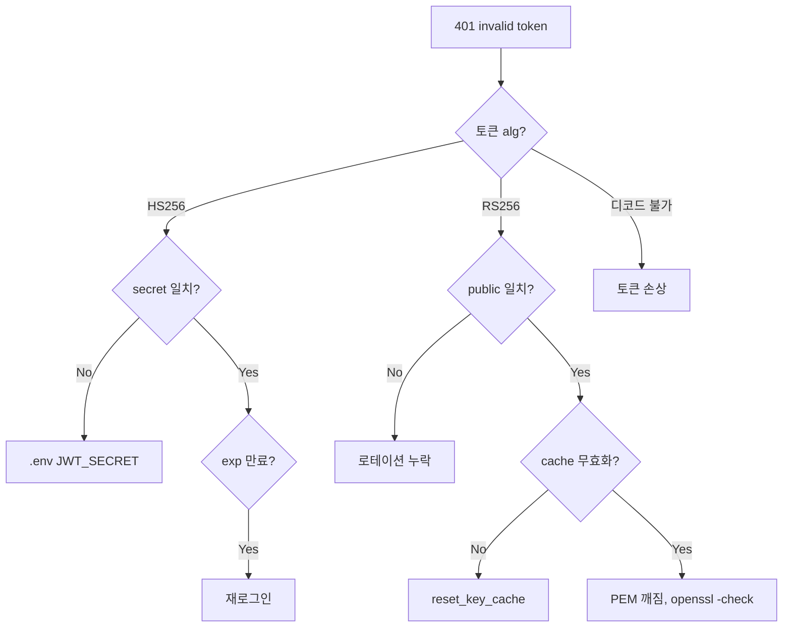

## A.6 — 회귀 분기

| Failed test | 원인 | 복구 |
|---|---|---|
| api.*/pipelines.* | jwt 의존 라우트 import 깨짐 | L1.4.b |
| agents.security_guard.* | Day 4 회귀 | 별도 PR |
| ada.security.guardrails.* | 동상 | 동상 |
| test_state.*/personas | 본 PR 무관 | git log |
| test_outputs_* | NY/CS/jh 영역 | 영역 owner |

---

# 부록 B — 빠른 명령 참조 (Cheat Sheet)

## B.1 — 5초 sanity
```powershell
venv\Scripts\python.exe -c "from ada.security.jwt import create_access_token, decode_token; t = create_access_token(sub='dbg'); print(decode_token(t)['sub'])"
```
**예상**: `dbg`

## B.2 — 1분 회귀
```powershell
$env:PYTHONUTF8=1
venv\Scripts\python.exe -m pytest tests\test_day5_rs256_jwt.py tests\integration\test_security.py -q
venv\Scripts\python.exe scripts\dev\verify_day5.py
```
**예상**: 8 passed + 13/13.

## B.3 — 3분 종합 (머지 전)
```powershell
$env:PYTHONUTF8=1
venv\Scripts\python.exe -m pytest tests\ -q --tb=no
venv\Scripts\python.exe scripts\dev\verify_day5.py
& "C:\Program Files\Git\bin\bash.exe" scripts/dev/check_scope.sh
git status --short
```

## B.4 — 토큰 디버깅
```powershell
function Decode-JWT($token) {
    $parts = $token.Split(".")
    foreach ($p in $parts[0..1]) {
        $pad = (4 - $p.Length % 4) % 4
        [System.Text.Encoding]::UTF8.GetString([Convert]::FromBase64String($p.Replace('-','+').Replace('_','/') + ("=" * $pad)))
    }
}
Decode-JWT "eyJhbGc..."
```

## B.5 — Vault 키 상태
```powershell
vault kv get -field=public_key secret/jwt/rs256 | Select-Object -First 1
# 빈 = placeholder, "-----BEGIN" = 실제 키
```

---

# 부록 C — 작업 시간 + 우선순위

## C.1 — 시간 표

| Phase | 시간 | 누적 |
|---|---|---|
| L0 사전점검 | 15 분 | 15 |
| L1 회귀 baseline | 25 분 | 40 |
| L2 코드 보강 | 30 분 | 70 |
| L3 문서·검증 | 45 분 | 115 |
| L4 통합 검증 | 30 분 | 145 |
| L5 운영 리허설 | 60 분 | 205 |
| L6 (사용자) | — | — |
| **합계** | 2.5h (L5 제외) / 3.4h (포함) | |

## C.2 — 핵심 경로 (최소 15분)
1. L0.1.a~c (3분) → L0.2.a~b (2분) → L0.3.a,b,d (2분) → L1.3.f (1분) → L1.4.a (1분) → L1.5 (5분) → L4.2.a (1분)

---

# 부록 D — Mermaid 인덱스

| ID | 위치 | 다이어그램 | 재사용 |
|---|---|---|---|
| M1 | A1 | 컨텍스트 | PR 본문 |
| M2 | A2 | 컴포넌트 | 코드 리뷰 |
| M3 | A3.1 | sign 시퀀스 | ADR |
| M4 | A3.2 | verify 시퀀스 | ADR |
| M5 | A3.3 | 키 로드 폴백 | Operations |
| M6 | A3.4 | 로테이션 | Operations |
| M7 | A4 | 알고리즘 결정 | 온보딩 |
| M8 | A5 | 키 라이프사이클 | Operations |
| M9 | A.1, A.5 | 디버깅 트리 | wiki |

---

# 부록 E — 변경 영향도 (Blast Radius)

## E.1 — 변경 영향

| 변경 | 직접 | 간접 | 미영향 |
|---|---|---|---|
| `_verify_keys` 제거 (C4) | jwt.py 내부 | — | 외부 모듈 |
| vault_seed placeholder (C3) | 시드 절차 | Vault 부팅 | 앱 런타임 |
| verify_day5.py 신규 | — | CI 게이트 | 런타임 |
| ADR-009 신규 | — | 문서 일관 | 런타임 |
| 본 가이드 신규 | — | 문서 일관 | 런타임 |

→ **런타임 영향 = 0**

## E.2 — 다운스트림 알림

| 멤버 | 영향 | 알림 |
|---|---|---|
| CS / NY / jh | 없음 | 불필요 |

→ Contract Day 아님.

## E.3 — Day 6 의존성

Day 6 는 `ada/core/state.py` + `agents/hyperparameter_tuner.py` + `agents/training_executor.py`. 본 PR(`ada/security/*`) 과 비교차. **의존성 0**.

---

# 부록 F — 회고 메모

- [ ] 예상 vs 실제 시간:
- [ ] 가장 시간 든 Phase:
- [ ] 막혔던 micro-step:
- [ ] 본 가이드 부족했던 부분:
- [ ] 다음 ADR 반영점:

---

# 부록 G — 최종 점검 ("누수 없이")

## G.1 — 코드 무결성
- [ ] `ada/security/jwt.py` 에 `_verify_keys` 부재
- [ ] `scripts/vault_seed.sh` 에 `secret/jwt/rs256` 존재
- [ ] 두 파일 UTF-8, no BOM, syntax OK

## G.2 — 신규 산출물 4종
- [ ] verify_day5.py 존재 + 13/13
- [ ] ADR-009 결정 존재 + 7 섹션
- [ ] 본 가이드 존재
- [ ] PR 본문 작성됨

## G.3 — 검증 상태
- [ ] pytest 전체 baseline 일치
- [ ] test_day5_rs256_jwt.py 5/5 (또는 3+2 skip)
- [ ] test_security.py 3/3
- [ ] verify_day5.py 13/13 + exit 0

## G.4 — 영역·권한
- [ ] check_scope.sh 통과
- [ ] 변경 파일 모두 HJ 영역
- [ ] NY/CS/jh 영역 변경 0

## G.5 — 문서 정합성
- [ ] ADR-009 ↔ 가이드 일치 (L3.4.a)
- [ ] verify_day5.py ↔ 가이드 매핑 (L3.4.b)
- [ ] 식별자 일관 `[L*.*.*]`

## G.6 — 다음 sprint
- [ ] Day 6 의존성(없음) 재확인
- [ ] L5 리허설 메모 보존

**모두 ✓ → 머지 가능 상태.** L6 인계 노트 따라.

---

# 부록 H — 의도적 비포함 / 미해결 (Out of Scope)

| 항목 | 미포함 이유 | 향후 ADR |
|---|---|---|
| `/auth/jwks.json` 라우트 | 서버 내부 변경만 | Day 9+ |
| `kid` 헤더 활성화 | JWKS 와 짝 | Day 9+ |
| Prometheus 메트릭 | 관측 인프라 별도 | ADR-010 |
| Vault 키 회전 자동화 | 운영 정착 후 | Q3 2026 |
| RS512 / ES256 | 단순화 위해 RS256 | 필요 시 |
| FastAPI middleware 통일 | 현재 Depends 유지 | 리팩토링 |
| 토큰 폐기 목록 | 짧은 expire 으로 대체 | 사고 시 |

→ PR 리뷰어 요구 시: "ADR-009 §7 / 본 가이드 부록 H — Day 5 scope 외".

---

**끝.** 이 줄까지 진행했으면 Day 5 완료. PR 머지 후 Day 6 으로.
