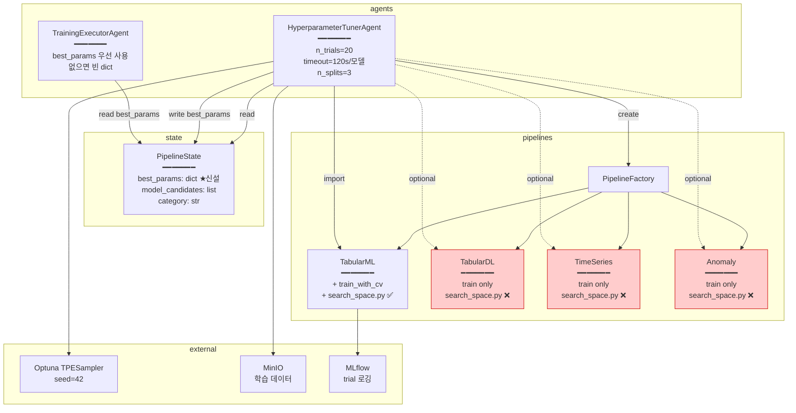
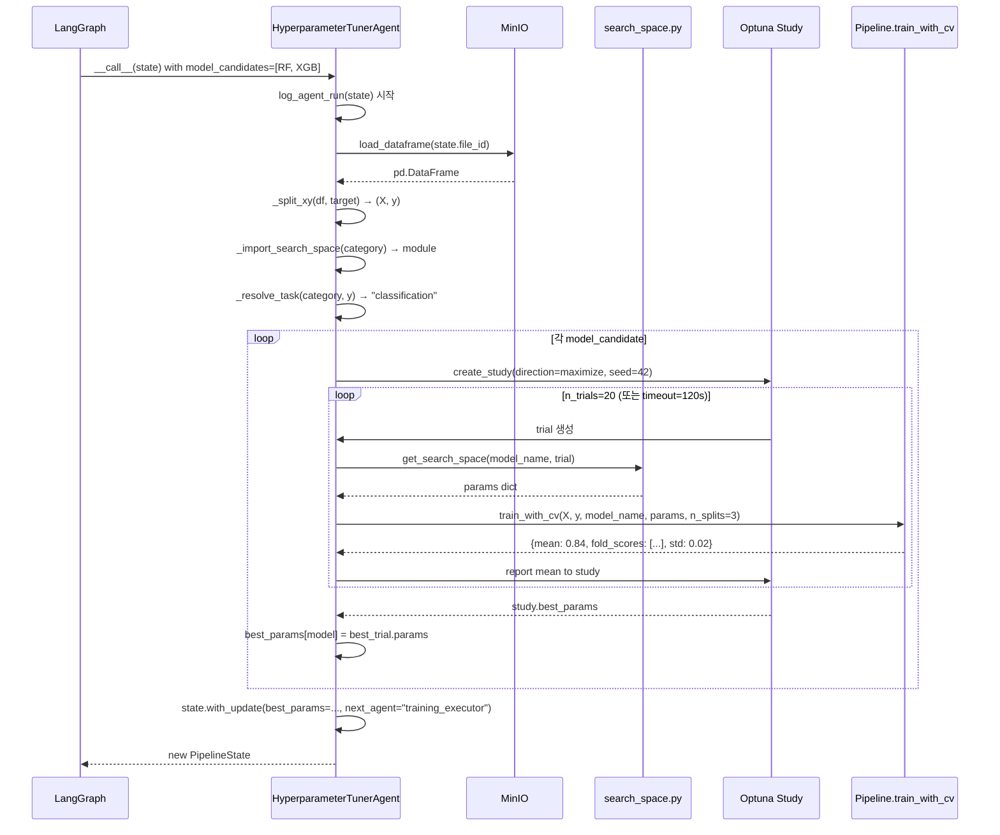
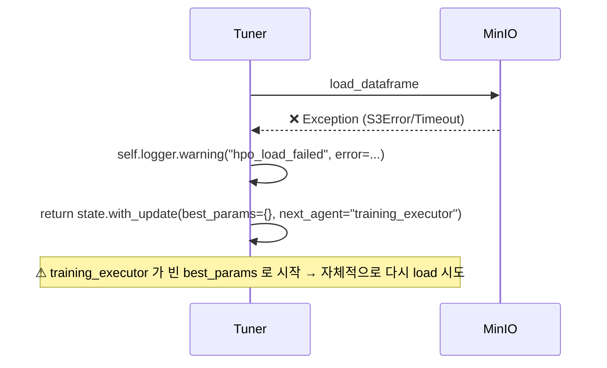
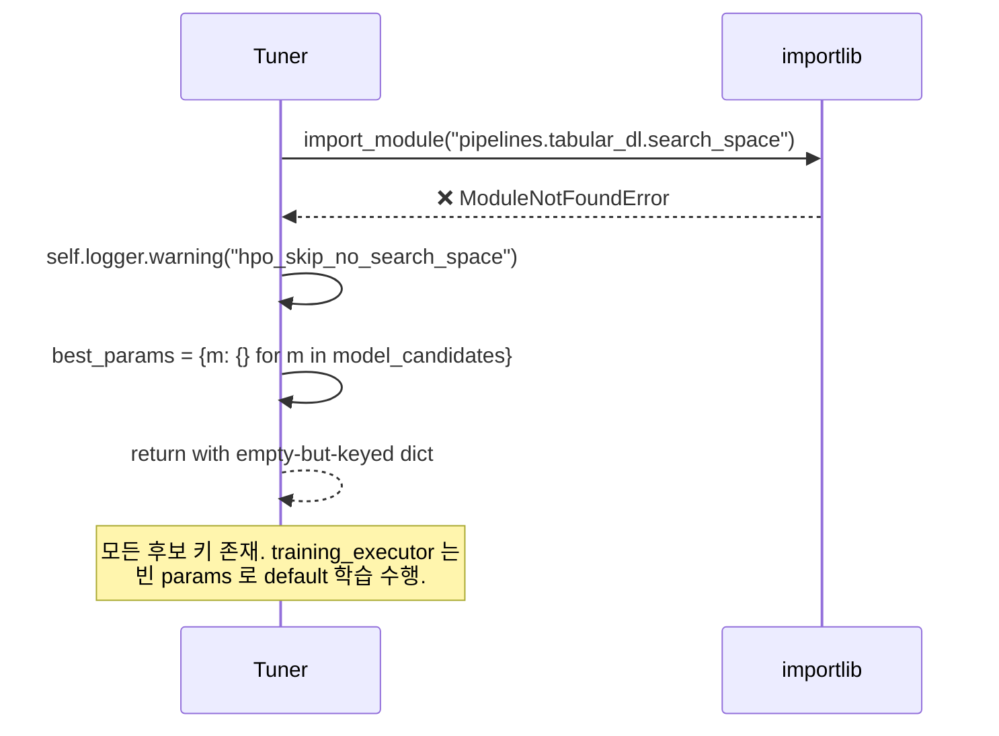
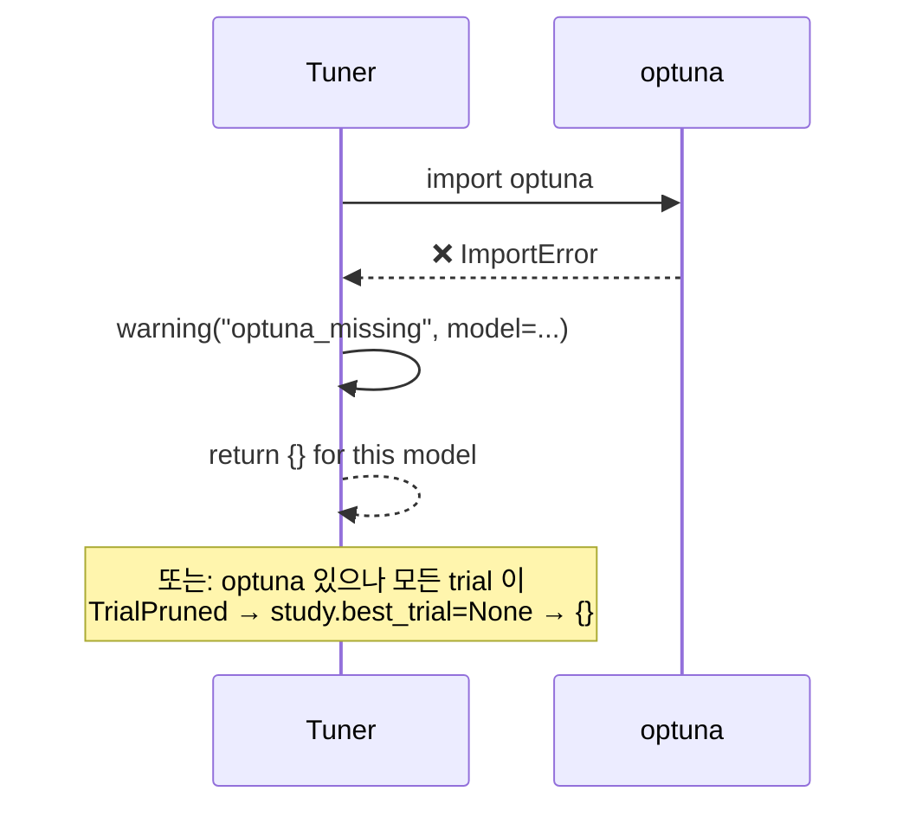
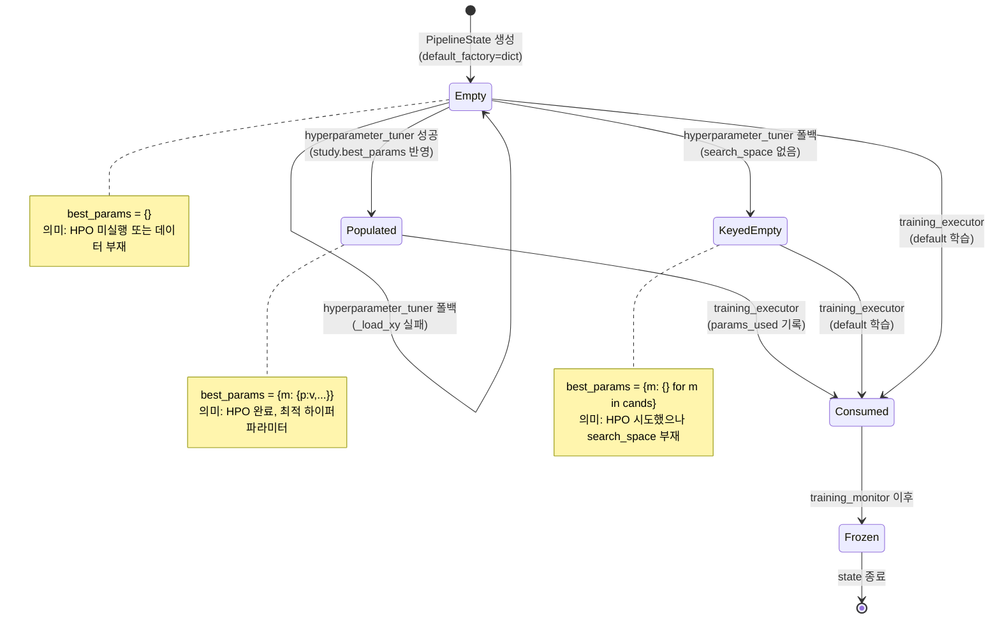

# ADR-010 hj-day6 — 상세 구현 가이드 (Step-by-Step Implementation Guide)

> **본 문서 사용법**: ADR-010 (high-level 결정·SOP) 의 각 작업을 sub-step 단위로 쪼개서
> "복사 → 실행 → 검증 (3중)" 순으로 진행하면 누수 없이 완성되도록 작성.
> 각 sub-step 마다 **사전조건 / 입력 / 실행 / 예상출력 / 검증 3중 (V1 정적+V2 단위+V3 통합) / 에러 대응 / 다음 단계 진입 조건** 포함.
>
> **읽는 법**: `[L1.1.a]` 같은 식별자가 모든 단계에 부여됨. 진행 중 막히면 식별자 알려주시면 그 단계만 디버깅 가능.
>
> **Contract Day 여부**: Day 6 은 Contract Day **맞음**. `PipelineState.best_params: dict` 필드가 신설되고, 4 카테고리 `pipelines/<cat>/search_space.py` 의 함수 시그니처가 확정된다. **CS/NY/jh 는 본 PR 머지 후 rebase + 자기 카테고리 search_space 작성 의무 있음**.
>
> **현재 상태**: 본 구현(`agents/hyperparameter_tuner.py`, `agents/training_executor.py`, `ada/core/state.py`, `tests/test_hyperparameter_tuner.py`) 은 코드상 작성 완료. Day 6 의 작업 중심은 **3중 검증 → Contract 머지 → 타 멤버 인계**.

---

## ⭐ 검증 3중 (Three-Fold Verification) — 모든 sub-step 의무 적용

> **원칙**: 어떤 변경이든 다음 3종을 **모두 통과**해야 다음 sub-step 으로 진입.
> 하나라도 실패하면 → 에러 대응 → 픽스 → 실패한 V 부터 V3 까지 재검증.

### V1 — 정적 검증 (Static)
- `python -m py_compile <file>` — Python AST 파싱
- `grep` 으로 핵심 심볼/패턴 존재 확인 (예: `best_params`, `train_with_cv`, `TPESampler`)
- `ruff check <file>` — 본인 영역만 lint (R-007 본인 영역 한정)
- diff 검토 — 의도한 변경 외 다른 변경 없는지

**언제 통과**: 0 syntax error, 0 import error, 0 ruff 위반, 의도한 심볼 모두 존재.

### V2 — 단위 검증 (Unit)
- `pytest tests/test_hyperparameter_tuner.py::test_xxx -v` — 단일 테스트
- `pytest tests/test_state.py -q` — PipelineState 라운드트립
- 입력 케이스 최소 3종: 정상 / 경계 (best_params 비어있음) / 에러 (search_space 없음)
- `state.best_params` round-trip (model_dump → model_validate) 보존 확인

**언제 통과**: 의도한 출력 = 실제 출력 (assertion 통과). 폴백 경로 명시적 로그 출력 확인.

### V3 — 통합 검증 (Integration)
- `pytest tests/ -q` — 전체 회귀
- `pytest tests/test_graph_build.py -q` — LangGraph 노드 25개 + 엣지 검증
- `pytest tests/test_agents_count.py -q` — 에이전트 카운트 회귀
- end-to-end: Titanic CSV → `model_selection → hyperparameter_tuner → training_executor` 그래프 실행 → `state.best_params["XGBoost"]` 비어있지 않음

**언제 통과**: 회귀 0건 AND DoD assertion 통과.

---

## 📑 목차

- [Part A — 시스템 설계도 (Architectural Blueprint)](#part-a--시스템-설계도-architectural-blueprint)
  - [A1. 컨텍스트 다이어그램](#a1-컨텍스트-다이어그램)
  - [A2. 컴포넌트 분해 + 책임](#a2-컴포넌트-분해--책임)
  - [A3. 핵심 플로우 4종 (Sequence Diagrams)](#a3-핵심-플로우-4종-sequence-diagrams)
  - [A3.5. state.best_params 라이프사이클 상태기계](#a35-statebest_params-라이프사이클-상태기계)
  - [A4. PipelineState 데이터 계약](#a4-pipelinestate-데이터-계약)
  - [A5. search_space.py 인터페이스 계약 (타 멤버 인계용)](#a5-search_spacepy-인터페이스-계약-타-멤버-인계용)
  - [A6. 폴백 의사결정 트리](#a6-폴백-의사결정-트리)
- [Part B — 단계별 시공 절차 (Phased Implementation)](#part-b--단계별-시공-절차-phased-implementation)
  - **Phase L0 — 사전점검 (15분)** · L0.1 Git / L0.2 Python / L0.3 외부서비스 / L0.4 Baseline / L0.5 종료게이트
  - **Phase L1 — state.py 계약 (20분)** · L1.1 정적(4) / L1.2 기본값(2) / L1.3 R-005 불변(3) / L1.4 round-trip(3) / L1.5 회귀(3) / L1.6 checkpoint / L1.7 게이트
  - **Phase L2 — HPO 본구현 (60분)** · L2.1 정적(4) / L2.2 매핑 / L2.3 _resolve_task / L2.4 __call__(3) / L2.5 _load_xy(3) / L2.6 _import(3) / L2.7 _objective(4) / L2.8 async(2) / L2.9 폴백5종 / L2.10 DoD / L2.11 게이트
  - **Phase L3 — executor 연결 (25분)** · L3.1 정적(4) / L3.2 best_params 흘림(3) / L3.3 카테고리 분기(4) / L3.4 에러 라우팅(2) / L3.5 스키마 / L3.6 게이트
  - **Phase L4 — 그래프 (15분)** · L4.1 정적(4) / L4.2 통합(2) / L4.3 빌드 smoke / L4.4 25 카운트 / L4.5 게이트
  - **Phase L5 — DoD + e2e (25분)** · L5.1 DoD(2) / L5.2 폴백 회귀 / L5.3 4 카테고리 e2e / L5.4 전체 회귀(3) / L5.5 MLflow/로그 / L5.6 게이트
  - **Phase L6 — 머지 + 인계 (30분)** · L6.1 직전 점검(3) / L6.2 커밋(2) / L6.3 end_of_day + PR + CI(3) / L6.4 인계(2) / L6.5 게이트
- [부록 A — 디버깅 체크리스트 (의사결정 트리)](#부록-a--디버깅-체크리스트-의사결정-트리)
- [부록 B — 빠른 명령 참조 (Cheat Sheet)](#부록-b--빠른-명령-참조-cheat-sheet)
- [부록 C — Blast Radius (변경 영향도)](#부록-c--blast-radius-변경-영향도)
- [부록 D — search_space.py 템플릿 (타 멤버 인계)](#부록-d--search_spacepy-템플릿-타-멤버-인계)
- [부록 D.5 — 시간 예산표 (목표 vs 실측)](#부록-d5--시간-예산표-목표-vs-실측)
- [부록 D.6 — Common Pitfalls (자주 빠지는 함정)](#부록-d6--common-pitfalls-자주-빠지는-함정)
- [부록 D.7 — 핵심 의사결정 로그 (Decision Log)](#부록-d7--핵심-의사결정-로그-decision-log)
- [부록 D.8 — 데이터 흐름 단면 (Cross-section)](#부록-d8--데이터-흐름-단면-cross-section)
- [부록 E — Mermaid 다이어그램 인덱스](#부록-e--mermaid-다이어그램-인덱스)
- [부록 F — 회고용 메모 자리](#부록-f--회고용-메모-자리)
- [부록 G — 최종 점검 ("누수 없이" 체크리스트)](#부록-g--최종-점검-누수-없이-체크리스트)
- [부록 H — 의도적 비포함 (Out of Scope)](#부록-h--의도적-비포함-out-of-scope)

---

# Part A — 시스템 설계도 (Architectural Blueprint)

## A1. 컨텍스트 다이어그램

**HPO 모듈이 ADA v2 파이프라인 어디에 위치하나 — LangGraph 노드 시점.**

```mermaid
flowchart LR
    intent[IntentElicitor<br/>G0] --> profiler[DataProfiler]
    profiler --> prep[PreprocessingStrategist]
    prep --> eda[EDAAgent]
    eda --> sel[ModelSelection<br/>top3 후보]
    sel -->|state.model_candidates| HPO[<b>HyperparameterTuner</b><br/>★ Day 6 ★]
    HPO -->|state.best_params| exec[TrainingExecutor]
    exec --> mon[TrainingMonitor]
    mon --> eval[EvalAgent]
    eval --> insight[Insight]
    insight --> report[ReportComposer]

    classDef new fill:#ffe4b5,stroke:#d2691e,stroke-width:3px
    class HPO new
```



**경계**:
- 입력: `state.model_candidates: list[str]` (ModelSelection 산출)
- 출력: `state.best_params: dict[str, dict[str, Any]]` (모델명 → 하이퍼파라미터 dict)
- 부수효과: MLflow run 기록 (각 trial 별), Optuna study 메모리 (휘발성)
- 외부 의존: `tools.minio_tool.get_minio_client()` (학습 데이터 로드), `optuna` (선택적)

---

## A2. 컴포넌트 분해 + 책임



### 컴포넌트별 단일 책임

| 컴포넌트 | 책임 | 비책임 |
|---|---|---|
| `HyperparameterTunerAgent` | Optuna study 생성·실행, search_space import, 폴백 처리 | 학습 자체(`fit`), 모델 저장, 평가 메트릭 정의 |
| `TrainingExecutorAgent` | `best_params` 를 받아 학습·평가·저장 | HPO, search_space, trial 관리 |
| `PipelineState.best_params` | 모델명→파라미터 dict 의 직렬화 가능한 상태 보관 | 변경 추적, 로깅 |
| `pipelines/<cat>/search_space.py` | trial 객체로부터 모델별 파라미터 sample | 학습, 평가, 저장 |
| `pipelines.factory.PipelineFactory` | 카테고리 문자열 → 파이프라인 인스턴스 매핑 | 모델 인스턴스화 |

---

## A3. 핵심 플로우 4종 (Sequence Diagrams)

### A3.1 정상 경로 — search_space 있고 optuna 있는 케이스 (DoD 경로)



### A3.2 폴백 1 — MinIO 로드 실패



### A3.3 폴백 2 — search_space 모듈 없음 (jh/CS/NY 인계 전 상태)



### A3.4 폴백 3 — Optuna 미설치 / trial 전부 pruned



---

## A3.5 `state.best_params` 라이프사이클 상태기계



**상태 식별 코드**:
```python
def hpo_state(state) -> str:
    bp = state.best_params or {}
    if not bp:
        return "Empty"
    if all(not v for v in bp.values()):
        return "KeyedEmpty"   # 모든 값이 빈 dict
    if any(v for v in bp.values()):
        return "Populated"
    return "Unknown"
```

이 분류로 운영 모니터링 시 어느 상태에서 학습이 시작되는지 추적 가능.

---

## A4. PipelineState 데이터 계약

### A4.1 신설 필드

```python
# ada/core/state.py:61
best_params: dict[str, dict[str, Any]] = Field(default_factory=dict)
```

### A4.2 의미 규칙

| 케이스 | best_params 형태 | training_executor 동작 |
|---|---|---|
| HPO 미실행 | `{}` (기본값) | 모든 모델 빈 params 로 학습 |
| HPO 실행 + 모든 모델 성공 | `{"RF": {...}, "XGB": {...}}` | 각자 best_params 흘림 |
| HPO 실행 + 일부 실패 | `{"RF": {...}, "XGB": {}}` | 실패 모델은 빈 dict (default) |
| HPO 실행 + 전부 실패 | `{"RF": {}, "XGB": {}}` | 모든 모델 default 학습 |

### A4.3 round-trip 보존

```python
# 검증 필수: pickle / Pydantic serialization 양쪽 모두 보존
state = PipelineState(...)
state2 = state.with_update(best_params={"XGB": {"n_estimators": 300}})
dumped = state2.model_dump()
restored = PipelineState.model_validate(dumped)
assert restored.best_params == state2.best_params
```

### A4.4 R-005 준수

직접 수정 금지. 반드시 `state.with_update(best_params=...)` 만 사용.

```python
# ❌ 금지
state.best_params["XGB"] = {...}

# ✅ 허용
state = state.with_update(best_params={**state.best_params, "XGB": {...}})
```

---

## A5. search_space.py 인터페이스 계약 (타 멤버 인계용)

### A5.1 시그니처 (모든 카테고리 동일)

```python
# pipelines/<category>/search_space.py
from typing import Any

def get_search_space(model_name: str, trial: Any) -> dict[str, Any]:
    """Optuna trial 객체로부터 model_name 의 하이퍼파라미터를 sample.

    Args:
        model_name: 카테고리의 SUPPORTED_MODELS 중 하나
        trial: optuna.trial.Trial 객체 (Tuner 가 주입)

    Returns:
        하이퍼파라미터 dict. pipeline.train(X, y, model_name, **dict) 로 그대로 흘러감.

    Raises:
        ValueError: 지원하지 않는 model_name 인 경우
    """
    if model_name == "ModelA":
        return {
            "lr": trial.suggest_float("lr", 1e-3, 0.3, log=True),
            "n_estimators": trial.suggest_int("n_estimators", 100, 500),
            "random_state": 42,
        }
    raise ValueError(f"Unknown model: {model_name}")
```

### A5.2 카테고리별 작성 의무자

| 파일 | 작성자 | SUPPORTED_MODELS |
|---|---|---|
| `pipelines/tabular_ml/search_space.py` | jh | RandomForest, XGBoost, LightGBM, CatBoost — **✅ 이미 존재** |
| `pipelines/tabular_dl/search_space.py` | jh | TabTransformer, FTTransformer, TabPFN — ❌ Day 6 머지 후 작성 |
| `pipelines/timeseries/search_space.py` | CS | ARIMA, SARIMA, Prophet, Informer, TFT, PatchTST — ❌ Day 6 머지 후 작성 |
| `pipelines/anomaly/search_space.py` | NY | IsolationForest, LOF, OneClassSVM, AutoEncoder, TranAD, AnomalyTransformer — ❌ Day 6 머지 후 작성 |

### A5.3 계약 위반 시 거동

- 함수가 `dict` 가 아닌 다른 타입 반환 → trial pruned → 해당 trial 무시 (study 계속 진행)
- 함수가 예외 발생 → trial pruned (warning 로깅됨)
- 함수 자체 부재 (`get_search_space` 미정의) → 모든 trial pruned → 빈 dict
- 모듈 자체 부재 → import 실패 → 모든 모델 빈 dict

→ **계약 위반은 silent fail. 학습은 default 파라미터로 진행됨.** 운영 시 grep 으로 `"space_failed"`, `"hpo_skip_no_search_space"` warning 모니터링.

### A5.4 search_space 함수의 random_state 고정

각 search_space 내부에서 모델 생성 시 `random_state=42` (또는 `seed=42`, `random_seed=42`) 같은 결정론적 시드를 **고정 키로 박을 것**. trial 마다 모델 자체 학습 재현성 확보 — Optuna sampler seed=42 만으로는 부족.

---

## A6. 폴백 의사결정 트리

```mermaid
flowchart TD
    A[HyperparameterTunerAgent.__call__] --> B{_load_xy 성공?}
    B -- No --> B1[warning: hpo_load_failed<br/>return best_params={}]
    B -- Yes --> C{search_space 모듈 import?}
    C -- No --> C1[warning: hpo_skip_no_search_space<br/>return best_params={m:{} ...}]
    C -- Yes --> D[loop model_candidates]
    D --> E{optuna 설치?}
    E -- No --> E1[warning: optuna_missing<br/>best_params model = '{}']
    E -- Yes --> F[create_study + optimize]
    F --> G{trial 내부}
    G --> H{search_space 함수 호출 OK?}
    H -- No --> H1[warning: space_failed<br/>TrialPruned]
    H -- Yes --> I{train_with_cv 존재?}
    I -- Yes --> J[train_with_cv 호출]
    I -- No --> K[train + evaluate fallback]
    J --> L{성공?}
    K --> L
    L -- No --> L1[warning: cv_failed or fit_failed<br/>TrialPruned]
    L -- Yes --> M[mean 점수 반환]
    F --> N{study.best_trial?}
    N -- None --> N1[best_params model = '{}']
    N -- 있음 --> N2[best_params model = study.best_params]
    N1 --> O[다음 모델]
    N2 --> O
    O --> P[return state.with_update]
    B1 --> P
    C1 --> P
    E1 --> P

    classDef warn fill:#fff3cd,stroke:#f0ad4e
    classDef ok fill:#d4edda,stroke:#28a745
    class B1,C1,E1,H1,L1,N1 warn
    class N2,P ok
```

**핵심 원칙**: HPO 는 **선택적 최적화** 단계이지 **블로커** 가 아니다. 어떤 실패도 빈 dict 로 폴백되어 `training_executor` 가 default 로 학습을 계속하게 한다.

---

# Part B — 단계별 시공 절차 (Phased Implementation)

## Phase L0 — 사전점검 (15분)

> **목표**: Day 6 작업을 시작하기 전에 **환경·코드·테스트 baseline 이 모두 정상**임을 확정.
> 여기서 한 줄이라도 빨간불이면 본 작업 진입 금지. 모든 L0.* 통과 후 L1 진입.
>
> **왜 baseline 검증부터?**: Day 6 변경이 회귀를 일으킨 건지, 원래 깨져 있던 건지 구분하려면 변경 전 그린 상태를 한 번 못 박아야 한다.

### [L0.1] Git 작업공간 (3분)

#### [L0.1.a] 현재 브랜치·HEAD 위치 확인

**사전조건**: 터미널 cwd = `C:/IT/workspace_python/ADA`.

**실행**:
```bash
cd C:/IT/workspace_python/ADA
git branch --show-current
git log -1 --oneline
```

**예상출력 (예시)**:
```
main
a7f3c92 chore: Day 5 RS256 JWT 머지 (#42)
```

**Pass 조건**: 브랜치명이 출력됨 (`HEAD detached` 아님), 최근 커밋이 Day 5 머지 이후.

**실패 처리**:
| 출력 | 원인 | 처리 |
|---|---|---|
| `HEAD detached at ...` | 체크아웃 잘못 | `git checkout main` |
| (빈 출력) | git repo 아님 | `pwd` 확인 → 올바른 경로로 cd |
| 다른 브랜치명 | 이전 작업 잔존 | 그대로 두고 L0.1.b 로 진행 (stash 가 필요할 수 있음) |

#### [L0.1.b] working tree 청결 확인

**실행**:
```bash
git status --short
```

**예상출력**: (빈 출력 — 변경사항 없음)

**Pass 조건**: 출력이 비어있음.

**실패 처리**:
| 출력 패턴 | 의미 | 처리 |
|---|---|---|
| `?? <file>` | untracked 파일 | 의도한 파일이면 `git add`, 아니면 `git clean -fd <file>` |
| ` M <file>` | unstaged 변경 | 의도한 작업이면 stash: `git stash push -m "wip"` |
| `M  <file>` | staged 변경 | 커밋되지 않은 작업 — 별도 브랜치로 분리 후 `git reset HEAD` |

#### [L0.1.c] main 동기화 + Day 6 브랜치 체크아웃

**실행**:
```bash
git fetch origin
git checkout main
git pull origin main --ff-only          # fast-forward 가 안 되면 stop
git checkout -b feat/hj-day6 2>/dev/null || git checkout feat/hj-day6
```

**예상출력**:
```
Fast-forward
...
Switched to a new branch 'feat/hj-day6'
```
또는 이미 있는 브랜치면 `Switched to branch 'feat/hj-day6'`.

**Pass 조건**:
- `git branch --show-current` == `feat/hj-day6`
- `git log --oneline -1 origin/main` 이 본 HEAD 와 같은 SHA 또는 ancestor

**실패 처리**:
| 에러 | 원인 | 처리 |
|---|---|---|
| `fatal: Not possible to fast-forward` | main 이 local 에서 변형됨 | `git reset --hard origin/main` (로컬 변경 버림 — 확인 후) |
| `error: pathspec 'feat/hj-day6' did not match` | git 명령 오타 | 명령 그대로 재실행 |
| 머지 충돌 | 다른 멤버 PR 이 sneaky 변경 | 멤버에게 확인 — 단독 영역 침범인지 |

#### [L0.1.d] 종료 invariant

작업 종료 시점 상태:
- ✅ branch = `feat/hj-day6`
- ✅ HEAD = `origin/main` 또는 그 자손
- ✅ working tree clean

---

### [L0.2] Python 환경 (2분)

#### [L0.2.a] venv 활성화 확인

**실행**:
```bash
python -c "import sys; print(sys.executable); print(sys.version)"
```

**예상출력 (Windows)**:
```
C:\IT\workspace_python\ADA\venv\Scripts\python.exe
3.10.x (...)
```

**Pass 조건**:
- 경로에 `venv` 포함됨 (시스템 Python 아님)
- 버전이 **3.10.x** ([Python 3.10 결정](file://docs/ADR-001-PYTHON-310.md))

**실패 처리**:
| 출력 | 처리 |
|---|---|
| 시스템 Python (`C:\Python...`) | `venv\Scripts\activate` 실행 후 재확인 |
| Python 3.11.x | ❌ ADR-001 위반. memory `python_version_decision` 참고. 3.10 venv 로 재생성 |
| Python 3.9.x | ❌ pydantic v2 미지원 가능. 3.10 으로 재생성 |

#### [L0.2.b] 핵심 패키지 매트릭스

**실행**:
```bash
python - <<'PY'
import importlib, sys
packages = [
    ("optuna",          "3.0.0"),
    ("sklearn",         "1.1.0"),
    ("xgboost",         "1.7.0"),
    ("lightgbm",        "3.3.0"),
    ("catboost",        "1.1.0"),
    ("pandas",          "1.5.0"),
    ("numpy",           "1.23.0"),
    ("pydantic",        "2.0.0"),
    ("langgraph",       "0.0.30"),
    ("mlflow",          "2.0.0"),
]
missing = []
for name, min_ver in packages:
    try:
        m = importlib.import_module(name)
        v = getattr(m, "__version__", "?")
        print(f"  ✅ {name:12s} {v:12s}  (min {min_ver})")
    except ImportError as e:
        missing.append(name)
        print(f"  ❌ {name:12s} MISSING")
if missing:
    print("\n→ pip install " + " ".join(missing) + " --break-system-packages")
    sys.exit(1)
PY
```

**예상출력**: 10개 모두 ✅.

**Pass 조건**: 10개 모두 import 성공. 버전이 min 이상.

**실패 처리**:
- ❌ 가 보이면 표시된 `pip install` 명령 그대로 실행.
- ⚠ **금지**: 결과를 자동으로 `requirements/*.txt` 에 추가하지 말 것 (CLAUDE.md §7-4). 본인 venv 만 갱신.
- 사용자에게 알릴 것: "이 라이브러리는 본인 영역 의존성이며, 운영 requirements 추가가 필요하면 HJ 협의 필요" — 본인이 HJ 이므로 직접 결정.

---

### [L0.3] 외부 서비스 접근성 (3분, 일부 선택)

#### [L0.3.a] MinIO 클라이언트 import (필수)

**실행**:
```bash
python -c "from tools.minio_tool import get_minio_client; print(get_minio_client())"
```

**Pass 조건**: `<tools.minio_tool.MinioClient object at 0x...>` 같은 인스턴스 출력. 에러 없음.

**실패 처리**:
- `ModuleNotFoundError: tools` → 환경변수 `PYTHONPATH=.` 추가 또는 `pip install -e .` 으로 패키지 설치 확인.
- 인스턴스 생성 시 연결 실패 → MinIO 컨테이너 미기동. **OK** — Day 6 테스트는 monkeypatch 로 우회하므로 컨테이너 없어도 진행 가능.

#### [L0.3.b] MLflow tracking URI (선택)

**실행**:
```bash
python -c "import mlflow; print(mlflow.get_tracking_uri())"
```

**Pass 조건**: URI 출력 (`file:///...` 또는 `http://...`).

**선택적**: HPO trial 별 MLflow 로깅은 본 PR 스코프 아님 (부록 H Out of Scope). MLflow 끊겨도 학습은 진행됨.

#### [L0.3.c] Optuna study 생성 smoke (필수)

**실행**:
```bash
python - <<'PY'
import optuna
optuna.logging.set_verbosity(optuna.logging.WARNING)
study = optuna.create_study(direction="maximize",
                            sampler=optuna.samplers.TPESampler(seed=42))
study.optimize(lambda t: t.suggest_float("x", 0, 1), n_trials=3)
print("best:", study.best_value, study.best_params)
PY
```

**예상출력**:
```
best: 0.xxx {'x': 0.xxx}
```

**Pass 조건**: 에러 없이 best 값 출력.

**실패 처리**: optuna ImportError → L0.2.b 로 돌아가서 설치.

---

### [L0.4] Baseline 테스트 (5분) — ⭐ 변경 전 그린 못 박기

#### [L0.4.a] 테스트 수집 — collection error 없는지

**실행**:
```bash
pytest tests/ --collect-only -q 2>&1 | tail -30
```

**Pass 조건**:
- 마지막 줄이 `N tests collected` 형태
- `ERROR` 라벨 0건

**실패 처리**:
- `ERROR tests/test_xxx.py` → 해당 파일 import error. 환경 문제일 가능성 높음 — L0.2 재확인.

#### [L0.4.b] 핵심 baseline 4 묶음 그린 확인

**실행**:
```bash
pytest tests/test_state.py tests/test_graph_build.py \
       tests/test_agents_count.py tests/test_pipeline_factory.py -q
```

**Pass 조건**: `N passed` 만 출력. `failed`, `error` 0건.

**실패 처리**:
| 깨진 파일 | 원인 후보 | 처리 |
|---|---|---|
| test_state.py | 누군가 PipelineState 변경 후 PR 안 닫음 | git log -- ada/core/state.py 추적 |
| test_graph_build.py | 25 노드 카운트 불일치 — ADR-005 위반 | orchestrator/graph.py diff 검토 |
| test_agents_count.py | agents/__init__.py 의 import 변경 | CLAUDE.md §2 금지 사항 |
| test_pipeline_factory.py | PipelineFactory.create 시그니처 변경 | pipelines/factory.py diff 검토 |

**한 개라도 깨지면 본 작업 진입 금지. 먼저 main 회복부터.**

#### [L0.4.c] tuner 관련 테스트 baseline (현재는 그린이어야 함)

**실행**:
```bash
pytest tests/test_hyperparameter_tuner.py -v 2>&1 | tail -20
```

**Pass 조건**: 3 tests passed (이미 코드가 박혀 있으므로).

**실패 처리**:
- `optuna 없음 skip` → L0.2.b 로 돌아가 설치.
- assertion 실패 → 즉시 L2 로 가서 디버깅. L0 종료 게이트 미통과 처리.

---

### [L0.5] L0 종료 게이트 (체크리스트)

다음 항목 **모두 ✅** 여야 L1 진입:

- [ ] **L0.1.a** branch = `feat/hj-day6`
- [ ] **L0.1.b** working tree clean
- [ ] **L0.1.c** HEAD = origin/main 또는 ancestor
- [ ] **L0.2.a** Python 3.10.x venv 활성화
- [ ] **L0.2.b** 10 핵심 패키지 모두 import OK
- [ ] **L0.3.a** MinIO 클라이언트 import OK (연결은 선택)
- [ ] **L0.3.c** Optuna smoke 통과
- [ ] **L0.4.a** 테스트 수집 에러 0건
- [ ] **L0.4.b** baseline 4 묶음 그린
- [ ] **L0.4.c** tuner 3 테스트 그린

**소요시간 기록**: __m (목표 15분 이내).

**문제 발생 시**: 어느 항목에서 막혔는지 식별자(예: `L0.4.b/test_state.py`) 와 함께 사용자에게 보고.

---

## Phase L1 — state.py 계약 검증 (20분)

> **목표**: `PipelineState.best_params` 가 정확한 시그니처로 박혀 있고, R-005 `with_update` 패턴, round-trip, LangGraph checkpoint, 회귀 모두 통과를 확정.
>
> **왜 6단계로 쪼개나**: state 는 25 노드가 공유하는 단일 계약. 한 줄만 틀리면 25 곳에서 silent fail.

### [L1.1] 정적 — 필드 존재·타입·위치 (3분)

#### [L1.1.a] grep 라인 검증

**실행**:
```bash
grep -nE "best_params" ada/core/state.py
```

**예상출력 (정확히 1줄)**:
```
61:    best_params: dict[str, dict[str, Any]] = Field(default_factory=dict)
```

**Pass 조건**:
- 출력 line 수 == 1
- 타입이 정확히 `dict[str, dict[str, Any]]` (Optional 아님)
- 기본값이 `Field(default_factory=dict)` (`= {}` 아님 — pydantic 가변기본값 안티패턴)

**실패 처리**:
| 출력 | 원인 | 처리 |
|---|---|---|
| 0줄 | 필드 누락 | line 61 부근 "모델링" 섹션에 삽입 |
| 2줄 이상 | 중복 정의 | 후행 라인 제거 |
| 타입 `dict` 만 | 타입 힌트 누락 | `dict[str, dict[str, Any]]` 로 수정 |
| `= {}` | 가변 기본값 함정 (pydantic v1 잔재) | `Field(default_factory=dict)` 로 수정 |
| `Optional[dict[...]]` | None 허용은 부정확 | Optional 제거 |

#### [L1.1.b] Python compile 통과

**실행**:
```bash
python -m py_compile ada/core/state.py
echo "exit=$?"
```

**예상출력**: `exit=0`.

**Pass 조건**: exit code 0, 출력 메시지 없음.

**실패 처리**: SyntaxError 메시지 라인번호 확인 후 교정.

#### [L1.1.c] 위치 검증 — "모델링" 섹션 안

**실행**:
```bash
grep -nE "^    # 모델링|model_candidates|best_params|trained_models|best_model" ada/core/state.py
```

**예상출력 패턴**:
```
59:    # 모델링
60:    model_candidates: list[str] = Field(default_factory=list)
61:    best_params: dict[str, dict[str, Any]] = Field(default_factory=dict)
62:    trained_models: list[dict[str, Any]] = Field(default_factory=list)
...
```

**Pass 조건**: `best_params` 가 `model_candidates` 와 `trained_models` 사이.

**이유**: 데이터 흐름 순서대로 (후보 → HPO → 학습 결과). 코드 리뷰 시 읽기 편함.

#### [L1.1.d] ruff lint

**실행**:
```bash
ruff check ada/core/state.py
```

**Pass 조건**: `All checks passed!`.

**실패 처리**: 본인 영역이므로 ruff 룰 위반 메시지대로 수정. 단 다른 파일까지 자동 fix 하지 말 것 (CLAUDE.md §2).

---

### [L1.2] 단위 — 기본값 (2분)

#### [L1.2.a] 신규 인스턴스의 best_params == {}

**실행**:
```bash
python - <<'PY'
from ada.core.state import PipelineState
s = PipelineState(job_id="j", file_id="f", category="tabular_ml")
assert s.best_params == {}, f"기본값 빈 dict 아님: {s.best_params!r}"
assert isinstance(s.best_params, dict), f"타입이 dict 아님: {type(s.best_params)}"
assert s.best_params is not None, "None 이 아니어야 함"
# 다른 인스턴스와 동일 참조 아닌지 (default_factory 확인)
s2 = PipelineState(job_id="j2", file_id="f2", category="tabular_ml")
assert s.best_params is not s2.best_params, "default_factory 미작동 — 같은 dict 공유함 (위험)"
print("L1.2.a OK")
PY
```

**예상출력**: `L1.2.a OK`.

**Pass 조건**: 4 assertion 모두 통과.

**실패 처리**:
- `is not` 실패 → `Field(default_factory=dict)` 아닌 `Field({})` 사용한 안티패턴. 즉시 수정.

#### [L1.2.b] 초기값 주입

**실행**:
```bash
python - <<'PY'
from ada.core.state import PipelineState
s = PipelineState(job_id="j", file_id="f", category="tabular_ml",
                  best_params={"XGB": {"lr": 0.1}})
assert s.best_params == {"XGB": {"lr": 0.1}}
print("L1.2.b OK")
PY
```

**Pass 조건**: 생성자에서 직접 주입 가능.

---

### [L1.3] 단위 — R-005 with_update 불변성 (3분)

#### [L1.3.a] with_update 호출 후 신규 객체 반영

**실행**:
```bash
python - <<'PY'
from ada.core.state import PipelineState
s = PipelineState(job_id="j", file_id="f", category="tabular_ml")
s2 = s.with_update(best_params={"XGB": {"n_estimators": 300}})
assert s2.best_params == {"XGB": {"n_estimators": 300}}
assert s2 is not s, "신규 객체 반환 안 함"
print("L1.3.a OK")
PY
```

#### [L1.3.b] 원본 불변 (R-005 핵심)

**실행**:
```bash
python - <<'PY'
from ada.core.state import PipelineState
s = PipelineState(job_id="j", file_id="f", category="tabular_ml")
_ = s.with_update(best_params={"XGB": {"lr": 0.1}})
assert s.best_params == {}, f"원본 변형됨 (R-005 위반): {s.best_params}"
print("L1.3.b OK")
PY
```

**Pass 조건**: 원본 변형 없음.

**실패 처리**: `with_update` 가 `self.best_params.update(...)` 같이 in-place 수정한 케이스. `ada/core/state.py:104` 확인 — `model_copy(update=...)` 사용해야.

#### [L1.3.c] 부분 업데이트 — 다른 필드 보존

**실행**:
```bash
python - <<'PY'
from ada.core.state import PipelineState
s = PipelineState(job_id="j", file_id="f", category="tabular_ml",
                  model_candidates=["RF", "XGB"],
                  best_params={"OLD": {}})
s2 = s.with_update(best_params={"NEW": {"lr": 0.1}})
# model_candidates 보존, best_params 만 교체
assert s2.model_candidates == ["RF", "XGB"]
assert s2.best_params == {"NEW": {"lr": 0.1}}  # 머지 아니라 교체
assert s.best_params == {"OLD": {}}  # 원본 불변
print("L1.3.c OK")
PY
```

**중요 의미**: `with_update(best_params=...)` 는 **교체** 이지 **머지** 가 아니다. HPO 노드가 호출할 때 dict 를 통째로 전달해야 함. 부분 업데이트 패턴:
```python
state.with_update(best_params={**state.best_params, "NEW_MODEL": {...}})
```

---

### [L1.4] 단위 — Pydantic round-trip (3분)

#### [L1.4.a] model_dump → model_validate 보존

**실행**:
```bash
python - <<'PY'
from ada.core.state import PipelineState
import json

s = PipelineState(job_id="j", file_id="f", category="tabular_ml",
                  best_params={"XGB": {"n_estimators": 300, "lr": 0.05,
                                       "subsample": 0.8}})

# 1) model_dump (dict)
d = s.model_dump()
r = PipelineState.model_validate(d)
assert r.best_params == s.best_params, f"dict round-trip 실패: {r.best_params}"

# 2) model_dump_json → JSON round-trip
j = s.model_dump_json()
r2 = PipelineState.model_validate_json(j)
assert r2.best_params == s.best_params, f"JSON round-trip 실패: {r2.best_params}"

# 3) JSON 안에 float / int 가 정확히 보존되는지
parsed = json.loads(j)
assert parsed["best_params"]["XGB"]["lr"] == 0.05  # float
assert parsed["best_params"]["XGB"]["n_estimators"] == 300  # int
print("L1.4.a OK")
PY
```

**예상출력**: `L1.4.a OK`.

**Pass 조건**: dict + JSON 양쪽 round-trip 모두 보존. float/int 타입도 보존.

#### [L1.4.b] 중첩 dict 보존 (2단 nesting)

**실행**:
```bash
python - <<'PY'
from ada.core.state import PipelineState
s = PipelineState(job_id="j", file_id="f", category="tabular_ml",
                  best_params={
                      "XGB": {"lr": 0.1, "params": {"deeper": True}},  # 2단 중첩
                      "RF":  {"n_estimators": 200},
                  })
r = PipelineState.model_validate(s.model_dump())
assert r.best_params["XGB"]["params"]["deeper"] is True
assert r.best_params["RF"]["n_estimators"] == 200
print("L1.4.b OK")
PY
```

**Pass 조건**: 2단 중첩까지 보존.

**왜 검증?**: 일부 search_space 는 tuple/list 를 값으로 가질 수 있음 (예: ARIMA `order=(1,1,1)`). 직렬화 시 tuple → list 변환됨 — 다음 단계에서 검증.

#### [L1.4.c] tuple 값 처리 (시계열 ARIMA `order` 케이스)

**실행**:
```bash
python - <<'PY'
from ada.core.state import PipelineState
s = PipelineState(job_id="j", file_id="f", category="timeseries",
                  best_params={"ARIMA": {"order": (2, 1, 1)}})
d = s.model_dump()
print("order type after dump:", type(d["best_params"]["ARIMA"]["order"]))
print("order value:", d["best_params"]["ARIMA"]["order"])
r = PipelineState.model_validate(d)
print("order after validate:", type(r.best_params["ARIMA"]["order"]),
      r.best_params["ARIMA"]["order"])
PY
```

**예상출력**:
```
order type after dump: <class 'tuple'>
order value: (2, 1, 1)
order after validate: <class 'tuple'> (2, 1, 1)
```

**관찰**: `Any` 타입이므로 tuple 보존. 단 JSON 직렬화 시에는 list 로 강등됨:

```bash
python - <<'PY'
from ada.core.state import PipelineState
import json
s = PipelineState(job_id="j", file_id="f", category="timeseries",
                  best_params={"ARIMA": {"order": (2, 1, 1)}})
j = s.model_dump_json()
parsed = json.loads(j)
print("JSON 통과 후:", type(parsed["best_params"]["ARIMA"]["order"]),
      parsed["best_params"]["ARIMA"]["order"])
PY
```

**예상출력**: `JSON 통과 후: <class 'list'> [2, 1, 1]`.

**인계 노트**: 시계열 search_space 작성하는 CS 에게 → 모델 호출 시 list 도 tuple 처럼 ARIMA 가 받음 (statsmodels 가 sequence 받음). 단 비교 시 주의:
```python
# ❌ 잘못
if params.get("order") == (2, 1, 1):  # JSON round-trip 후 [2,1,1] 이면 False
# ✅ 맞음
if tuple(params.get("order", ())) == (2, 1, 1):
```

→ **부록 D timeseries 템플릿**에 이 주의사항 박혀 있어야 함 (이미 적용됨).

---

### [L1.5] 회귀 — test_state.py + 인접 (5분)

#### [L1.5.a] test_state.py 직접

**실행**:
```bash
pytest tests/test_state.py -v 2>&1 | tail -30
```

**Pass 조건**: 모든 테스트 passed. 회귀 0건.

#### [L1.5.b] state 사용하는 인접 테스트

**실행**:
```bash
pytest tests/test_personas.py tests/test_graph_build.py -q
```

**Pass 조건**: 모두 passed.

**이유**: personas 는 PipelineState 라이프사이클 검증, graph_build 는 노드 간 state 전달 검증. best_params 추가로 영향받으면 안 됨.

#### [L1.5.c] 전체 state 관련 grep — 다른 곳에서 best_params 잘못 사용 안 하는지

**실행**:
```bash
grep -rn "state\.best_params\|best_params=" --include="*.py" | grep -v test_ | grep -v __pycache__
```

**예상출력 (필수 라인)**:
```
agents/hyperparameter_tuner.py: ... best_params={} ...
agents/hyperparameter_tuner.py: ... best_params={m: {} for m in ...} ...
agents/hyperparameter_tuner.py: ... best_params=best_params ...
agents/training_executor.py:    params = (state.best_params or {}).get(...)
ada/core/state.py:              best_params: dict[str, dict[str, Any]] = ...
ada/db/seeds.py:                "HyperparameterTunerAgent": {... "outputs": ["best_params"]},
ada/db/seeds.py:                "TrainingExecutorAgent": {... "inputs": [..., "best_params"], ...}
```

**Pass 조건**: 사용처 6 그룹 모두 존재. 누락 시 데이터 흐름 끊김.

**실패 처리**:
- `seeds.py` 에 best_params 없으면 → DB seed 가 agent IO 명세를 잘못 알려줌. 이는 HJ 영역. ada/db/seeds.py 의 `HyperparameterTunerAgent` outputs 에 `"best_params"` 추가, `TrainingExecutorAgent` inputs 에 추가.

---

### [L1.6] LangGraph checkpoint 호환성 (선택 3분)

#### [L1.6.a] state JSON 직렬화 길이

**실행**:
```bash
python - <<'PY'
from ada.core.state import PipelineState
# 4 카테고리 x 평균 5 모델 x 평균 8 hyperparam = 160 key 까지 충분히 작음
big = {f"M{i}": {f"p{j}": j*0.01 for j in range(8)} for i in range(5)}
s = PipelineState(job_id="j", file_id="f", category="tabular_ml",
                  best_params=big)
j = s.model_dump_json()
print(f"JSON 길이: {len(j)} bytes (~{len(j)/1024:.1f} KB)")
assert len(j) < 200_000, "checkpoint 페이로드가 200KB 초과 — LangGraph SQLite checkpoint 비효율"
print("L1.6.a OK")
PY
```

**Pass 조건**: < 200KB.

**왜 검증?**: LangGraph checkpoint 는 매 노드 진행마다 state 전체 저장. best_params 가 비대해지면 checkpoint 비대해짐. 실측치를 잡아둬야 후속 카테고리 search_space 가 커질 때 경고 가능.

---

### [L1.7] L1 종료 게이트

- [ ] **L1.1.a** grep 1줄 매칭
- [ ] **L1.1.b** py_compile exit 0
- [ ] **L1.1.c** 위치 = 모델링 섹션
- [ ] **L1.1.d** ruff OK
- [ ] **L1.2.a** 기본값 {}, default_factory 정상
- [ ] **L1.2.b** 초기값 주입
- [ ] **L1.3.a** with_update 신규 객체 반환
- [ ] **L1.3.b** 원본 불변 (R-005)
- [ ] **L1.3.c** 부분 업데이트 의미 = 교체 (머지 아님)
- [ ] **L1.4.a** model_dump round-trip
- [ ] **L1.4.b** 2단 중첩 보존
- [ ] **L1.4.c** tuple ↔ list 거동 이해
- [ ] **L1.5.a** test_state.py 그린
- [ ] **L1.5.b** personas + graph_build 그린
- [ ] **L1.5.c** seeds.py 등 사용처 명세 정합
- [ ] **L1.6.a** checkpoint 페이로드 합리적

**소요시간 기록**: __m (목표 20분).

---

## Phase L2 — hyperparameter_tuner.py 본구현 검증 (60분)

> **목표**: HPO 본체의 9개 함수·메서드를 각각 격리해서 검증. 그리고 **폴백 4종 + 정상 1종 = 5 경로** 를 명시적으로 통과시킴.
>
> **왜 L2 가 가장 두꺼운가**: HPO 는 본 PR 의 **load-bearing wall**. 폴백이 한 줄이라도 빠지면 운영에서 silent fail.

### L2 검증 대상 함수 인벤토리

| ID | 함수/심볼 | 라인 (대략) | 책임 |
|---|---|---|---|
| F1 | `_SEARCH_SPACE_MODULES` (상수) | 18 | 카테고리 → 모듈 경로 매핑 |
| F2 | `_resolve_task(category, y)` | 26 | 카테고리·y → "classification"/"regression"/"forecasting"/"anomaly_detection" |
| F3 | `HyperparameterTunerAgent.__init__` | 43 | n_trials/timeout/n_splits 기본값 |
| F4 | `HyperparameterTunerAgent.__call__` | 56 | 메인 흐름 (log_agent_run, _load_xy, _import, loop) |
| F5 | `_load_xy(state)` | 79 | MinIO 로드 + _split_xy. 실패 시 (None, None) |
| F6 | `_import_search_space(category)` | 92 | importlib. 실패 시 None |
| F7 | `_run_optuna(state, model, X, y, task, ss_module)` | 104 | study + optimize 본체 |
| F8 | `_objective(trial)` (closure) | 124 | trial → params → train_with_cv → score |
| F9 | `loop.run_in_executor(None, _search)` | 174 | sync optuna 를 async wrap |

→ 각각 격리 검증.

### [L2.1] 정적 — 핵심 심볼·import·시그니처 (5분)

#### [L2.1.a] grep 으로 핵심 심볼 9종 존재 확인

**실행**:
```bash
grep -nE "TPESampler|train_with_cv|TrialPruned|_SEARCH_SPACE_MODULES|_resolve_task|run_in_executor|log_agent_run|uses_llm|importlib|optuna\.create_study" \
     agents/hyperparameter_tuner.py
```

**예상출력 (필수 매칭 — 최소 10줄)**:
```
18: _SEARCH_SPACE_MODULES: dict[str, str] = {
26: def _resolve_task(category: str, y: Any) -> str:
41:     uses_llm = False
57:         async with self.log_agent_run(state):
94:         import importlib
100:         return importlib.import_module(mod_name)
109:             import optuna
114:             study = optuna.create_study(
117:                 sampler=optuna.samplers.TPESampler(seed=42),
128:                     raise optuna.exceptions.TrialPruned()
132:                     raise optuna.exceptions.TrialPruned()
134:                 if hasattr(pipeline, "train_with_cv"):
147:                         raise optuna.exceptions.TrialPruned()
159:                         raise optuna.exceptions.TrialPruned()
174:         return await loop.run_in_executor(None, _search)
```

**Pass 조건**: 모든 패턴 매칭 (최소 10줄).

**실패 처리**: 누락된 심볼 식별 후 L2.2 ~ L2.9 의 해당 항목으로 점프해 본구현 확인.

#### [L2.1.b] BaseAgent 상속 + uses_llm=False

**실행**:
```bash
grep -nE "class HyperparameterTunerAgent|^from agents.base|uses_llm" agents/hyperparameter_tuner.py
```

**예상출력**:
```
16: from agents.base import BaseAgent
38: class HyperparameterTunerAgent(BaseAgent):
41:     uses_llm = False
```

**Pass 조건** (R-003, R-004):
- BaseAgent 상속
- `uses_llm = False` (LLM 직접 호출 안 함 — Optuna 가 옵티마이저 역할)

#### [L2.1.c] py_compile + ruff

**실행**:
```bash
python -m py_compile agents/hyperparameter_tuner.py && echo OK
ruff check agents/hyperparameter_tuner.py
```

**Pass 조건**: OK 출력 + `All checks passed!`.

#### [L2.1.d] __init__ 시그니처 — 기본값 검증

**실행**:
```bash
python - <<'PY'
import inspect
from agents.hyperparameter_tuner import HyperparameterTunerAgent
sig = inspect.signature(HyperparameterTunerAgent.__init__)
defaults = {n: p.default for n, p in sig.parameters.items()
            if p.default is not inspect.Parameter.empty}
print(defaults)
assert defaults.get("n_trials") == 20, f"n_trials 기본값 ≠ 20: {defaults.get('n_trials')}"
assert defaults.get("timeout_per_model_sec") == 120, f"timeout ≠ 120s"
assert defaults.get("n_splits") == 3, f"n_splits ≠ 3"
print("L2.1.d OK")
PY
```

**예상출력**: `{'n_trials': 20, 'timeout_per_model_sec': 120, 'n_splits': 3} / L2.1.d OK`.

**Pass 조건**: 3 기본값 모두 정확.

**왜 검증?**: 운영 튜닝 포인트 3종 — 변경되면 모델 학습 시간이 달라짐. 회귀 방지.

---

### [L2.2] F1 — `_SEARCH_SPACE_MODULES` 매핑 정확성 (2분)

#### [L2.2.a] 4 카테고리 키 + 경로 정확

**실행**:
```bash
python - <<'PY'
from agents.hyperparameter_tuner import _SEARCH_SPACE_MODULES
expected = {
    "tabular_ml": "pipelines.tabular_ml.search_space",
    "tabular_dl": "pipelines.tabular_dl.search_space",
    "timeseries": "pipelines.timeseries.search_space",
    "anomaly_detection": "pipelines.anomaly.search_space",
}
assert _SEARCH_SPACE_MODULES == expected, f"매핑 불일치:\nexpected={expected}\nactual={_SEARCH_SPACE_MODULES}"
print("L2.2.a OK")
PY
```

**Pass 조건**: 4 키 정확히 매칭.

**중요 트랩**:
- `"anomaly"` vs `"anomaly_detection"` — state.category 는 `"anomaly_detection"` (CATEGORIES 상수 확인). 모듈 경로는 `pipelines.anomaly` (폴더명).
- ✅ 키는 카테고리명, 값은 모듈 경로 — 일관됨.

#### [L2.2.b] CATEGORIES 상수와 정합

**실행**:
```bash
python - <<'PY'
from ada.core.state import CATEGORIES
from agents.hyperparameter_tuner import _SEARCH_SPACE_MODULES
assert set(_SEARCH_SPACE_MODULES.keys()) == set(CATEGORIES), \
    f"카테고리 4종 불일치: {set(_SEARCH_SPACE_MODULES.keys())} vs {set(CATEGORIES)}"
print("L2.2.b OK")
PY
```

**Pass 조건**: 두 집합 동일.

**왜 검증?**: state.category 가 CATEGORIES 4종 중 하나 — 매핑이 누락되면 해당 카테고리만 silent fail.

---

### [L2.3] F2 — `_resolve_task` 분기 정확성 (3분)

#### [L2.3.a] 4 카테고리 × 입력별 결과 매트릭스

**실행**:
```bash
python - <<'PY'
import numpy as np
from agents.hyperparameter_tuner import _resolve_task

cases = [
    # (category, y, expected_task)
    ("timeseries",        np.array([1.0, 2.0, 3.0]),         "forecasting"),
    ("anomaly_detection", np.array([0, 1, 0, 1]),            "anomaly_detection"),
    ("tabular_ml",        np.array([0, 1, 0, 1, 1]),         "classification"),
    ("tabular_ml",        np.array([0.5, 1.2, 3.1, 4.7]*10), "classification"),  # unique=4
    ("tabular_ml",        np.linspace(0, 10, 50),            "regression"),       # unique=50 (회귀)
    ("tabular_dl",        np.array([0, 1, 2, 0, 1]),         "classification"),
    # 경계: unique > 20 → regression
    ("tabular_ml",        np.arange(25),                     "regression"),
    # 경계: unique == 20 → classification
    ("tabular_ml",        np.arange(20),                     "classification"),
    # 에러 폴백: y 가 깨진 객체 → n_unique=99 → regression
    ("tabular_ml",        object(),                          "regression"),
]
for cat, y, expected in cases:
    got = _resolve_task(cat, y)
    assert got == expected, f"({cat}, {y!r}) → {got} (expected {expected})"
print("L2.3.a OK — 8 cases")
PY
```

**예상출력**: `L2.3.a OK — 8 cases`.

**Pass 조건**: 8 케이스 모두 정확.

**왜 8 케이스?**:
1. timeseries → forecasting (카테고리 우선)
2. anomaly_detection → anomaly_detection
3. tabular_ml 분류 (≤20 unique)
4. tabular_ml 회귀 (>20 unique)
5. tabular_dl 분류
6. **경계** unique == 20 → classification (inclusive)
7. **경계** unique == 25 → regression (exclusive)
8. **에러 폴백** y 가 비표준 객체 → except 절 → 99 → regression

이 8 케이스가 분기 트리 전부를 커버.

---

### [L2.4] F3 + F4 — `__init__` + `__call__` 메인 흐름 (5분)

#### [L2.4.a] 정상 흐름 (mock 전부) — 라인별 흐름 확인

**참조**: `agents/hyperparameter_tuner.py:56-77`

**실행**: `__call__` 흐름을 mermaid 로 다시 확인 (Part A A3.1) 후, 다음 mock 테스트:

```bash
python - <<'PY'
import asyncio, sys
from unittest.mock import patch, MagicMock
from ada.core.state import PipelineState
from agents.hyperparameter_tuner import HyperparameterTunerAgent

# _load_xy 가 정상 데이터 반환 (mock)
async def _fake_load_xy(self, state):
    import numpy as np
    return np.random.RandomState(42).rand(50, 4), np.array([0, 1] * 25)

HyperparameterTunerAgent._load_xy = _fake_load_xy

# _import_search_space 가 None 반환 (search_space 없음 폴백 경로)
HyperparameterTunerAgent._import_search_space = staticmethod(lambda cat: None)

t = HyperparameterTunerAgent()
s = PipelineState(job_id="j-l24a", file_id="f", category="tabular_ml",
                  model_candidates=["RF", "XGB"])
r = asyncio.run(t(s))

# 검증: 모든 후보 키가 존재, 각 값 = {} (search_space 폴백)
assert set(r.best_params.keys()) == {"RF", "XGB"}, r.best_params
assert all(v == {} for v in r.best_params.values()), r.best_params
assert r.next_agent == "training_executor", r.next_agent
print("L2.4.a OK")
PY
```

**Pass 조건**: 후보 키 2개, 값 모두 {}, next_agent 정확.

#### [L2.4.b] _load_xy 실패 폴백 — best_params={} (키 없음 주의!)

**실행**:
```bash
python - <<'PY'
import asyncio
from ada.core.state import PipelineState
from agents.hyperparameter_tuner import HyperparameterTunerAgent

# _load_xy 가 (None, None) 반환 — 로드 실패
async def _fail_load(self, state):
    return None, None

HyperparameterTunerAgent._load_xy = _fail_load
t = HyperparameterTunerAgent()
s = PipelineState(job_id="j-l24b", file_id="f", category="tabular_ml",
                  model_candidates=["RF", "XGB"])
r = asyncio.run(t(s))

# ⚠ 주의: 이 폴백은 키조차 없음. training_executor 가 (state.best_params or {}).get(m, {}) 로 안전 처리.
assert r.best_params == {}, f"load 실패 폴백: best_params={{}} 이어야 함: {r.best_params}"
assert r.next_agent == "training_executor"
print("L2.4.b OK")
PY
```

**Pass 조건**: `best_params == {}` (빈 dict, 키 없음).

**의미적 차이 — 매우 중요**:
| 폴백 유형 | best_params 형태 | 이유 |
|---|---|---|
| **L2.4.b** load 실패 | `{}` (키 없음) | y 없으면 _resolve_task 호출 불가 → 후속 처리 불가 |
| **L2.4.a** search_space 없음 | `{m: {} for m in candidates}` | y 있고 후보 알지만 search space 만 부재 |

→ 두 폴백은 다른 신호를 보낸다. training_executor 가 두 경우 모두 빈 params 로 학습.

#### [L2.4.c] log_agent_run 컨텍스트 — 시작·끝 로깅 발생

**실행**:
```bash
python - <<'PY'
import asyncio
from unittest.mock import patch
from ada.core.state import PipelineState
from agents.hyperparameter_tuner import HyperparameterTunerAgent

async def _fail_load(self, state):
    return None, None
HyperparameterTunerAgent._load_xy = _fail_load

# self.logger.warning 호출 캡처
captured = []
class _SpyLogger:
    def warning(self, *a, **k): captured.append(("warning", a, k))
    def info(self, *a, **k): captured.append(("info", a, k))
    def error(self, *a, **k): captured.append(("error", a, k))

t = HyperparameterTunerAgent()
t.logger = _SpyLogger()
s = PipelineState(job_id="j-l24c", file_id="f", category="tabular_ml",
                  model_candidates=["RF"])
asyncio.run(t(s))

# 폴백 warning 로깅 확인
events = [e for e in captured if e[0] == "warning"]
assert any("hpo_skip_no_data" in str(e) for e in events), \
    f"hpo_skip_no_data warning 없음: {captured}"
print("L2.4.c OK — captured", len(captured), "events")
PY
```

**Pass 조건**: warning 이벤트 중 `hpo_skip_no_data` 키 포함.

**왜 검증?**: 운영에서 grep `"hpo_skip_no_data"` 으로 폴백 발생 추적. 이 키가 사라지면 모니터링 끊김.

---

### [L2.5] F5 — `_load_xy` MinIO 로드 + _split_xy (5분)

#### [L2.5.a] 정상 — MinIO 클라이언트 mock → DataFrame 반환

**실행**:
```bash
python - <<'PY'
import asyncio, pandas as pd, numpy as np
from unittest.mock import patch
from ada.core.state import PipelineState
from agents.hyperparameter_tuner import HyperparameterTunerAgent

df = pd.DataFrame({
    "x1": np.arange(20),
    "x2": np.arange(20, 40),
    "y":  [0, 1]*10,
})

class _MC:
    def load_dataframe(self, fid, fmt):
        return df

with patch("tools.minio_tool.get_minio_client", return_value=_MC()):
    t = HyperparameterTunerAgent()
    s = PipelineState(job_id="j-l25a", file_id="train.csv",
                      category="tabular_ml", target_column="y",
                      model_candidates=["RF"])
    X, y = asyncio.run(t._load_xy(s))

assert X is not None and y is not None
assert X.shape == (20, 2), f"X.shape={X.shape}"
assert y.shape == (20,), f"y.shape={y.shape}"
print("L2.5.a OK", X.shape, y.shape)
PY
```

**Pass 조건**: shape 정확.

#### [L2.5.b] MinIO 실패 → (None, None) — 예외 absorb

**실행**:
```bash
python - <<'PY'
import asyncio
from unittest.mock import patch
from ada.core.state import PipelineState
from agents.hyperparameter_tuner import HyperparameterTunerAgent

class _MC:
    def load_dataframe(self, fid, fmt):
        raise ConnectionError("MinIO down")

t = HyperparameterTunerAgent()
captured = []
class _L:
    def warning(self, *a, **k): captured.append((a, k))
    def info(self, *a, **k): pass
    def error(self, *a, **k): pass
t.logger = _L()

with patch("tools.minio_tool.get_minio_client", return_value=_MC()):
    s = PipelineState(job_id="j-l25b", file_id="train.csv",
                      category="tabular_ml", target_column="y",
                      model_candidates=["RF"])
    X, y = asyncio.run(t._load_xy(s))

assert X is None and y is None, f"실패 시 (None,None) 반환해야: {X}, {y}"
assert any("hpo_load_failed" in str(c) for c in captured), \
    f"hpo_load_failed warning 없음: {captured}"
print("L2.5.b OK")
PY
```

**Pass 조건**: (None, None) 반환 + warning 캡처.

#### [L2.5.c] file_id 의 포맷 추출 (`.csv` vs `.parquet` 등)

**실행**:
```bash
python - <<'PY'
# _load_xy 내부 fmt 추출: file_id.rsplit('.', 1)[-1].lower()
cases = [
    ("uploads/x/titanic.csv",        "csv"),
    ("uploads/x/data.PARQUET",       "parquet"),
    ("uploads/x/some.file.json",     "json"),
    ("noext",                        "noext"),  # 확장자 없음 → 전체 반환
]
for fid, expected in cases:
    got = fid.rsplit(".", 1)[-1].lower()
    assert got == expected, f"{fid} → {got} (expected {expected})"
print("L2.5.c OK")
PY
```

**Pass 조건**: 4 케이스 정확.

**관찰**: `"noext"` 케이스는 MinIO 클라이언트가 fmt 를 자동 감지해야 할 가능성. **TODO** — `tools.minio_tool` 측 검증은 본 PR 스코프 아님 (Out of Scope).

---

### [L2.6] F6 — `_import_search_space` (3분)

#### [L2.6.a] 정상 — tabular_ml (있음)

**실행**:
```bash
python - <<'PY'
from agents.hyperparameter_tuner import HyperparameterTunerAgent
mod = HyperparameterTunerAgent._import_search_space("tabular_ml")
assert mod is not None, "tabular_ml search_space 모듈 import 실패"
assert hasattr(mod, "get_search_space"), "get_search_space 함수 없음"
print("L2.6.a OK", mod.__name__)
PY
```

**Pass 조건**: 모듈 반환 + `get_search_space` 함수 존재.

#### [L2.6.b] 부재 — tabular_dl/timeseries/anomaly (Day 6 머지 시점 부재)

**실행**:
```bash
python - <<'PY'
from agents.hyperparameter_tuner import HyperparameterTunerAgent
for cat in ["tabular_dl", "timeseries", "anomaly_detection"]:
    mod = HyperparameterTunerAgent._import_search_space(cat)
    # 부재일 때 None (예외 안 던짐)
    if mod is None:
        print(f"  {cat}: None (예상대로 부재)")
    else:
        print(f"  {cat}: {mod.__name__} (이미 인계됨 — 종주 멤버에게 확인)")
print("L2.6.b OK")
PY
```

**Pass 조건**:
- 본 작업 시점: 3개 모두 None (search_space.py 없음).
- 후속 (각 멤버 인계 후): None 아닌 모듈 반환.

**왜 검증?**: 모듈 부재 시 ImportError 발생하면 안 됨 → try/except 로 absorb. 이 부분이 안 박혀 있으면 첫 카테고리 진입 시 운영 크래시.

#### [L2.6.c] 알 수 없는 카테고리 (`"unknown"`)

**실행**:
```bash
python - <<'PY'
from agents.hyperparameter_tuner import HyperparameterTunerAgent
mod = HyperparameterTunerAgent._import_search_space("nonexistent_category")
assert mod is None, f"_SEARCH_SPACE_MODULES 에 없는 키 → None: {mod}"
print("L2.6.c OK")
PY
```

**Pass 조건**: None 반환.

---

### [L2.7] F7 + F8 — `_run_optuna` + `_objective` (10분, 가장 중요)

#### [L2.7.a] objective closure — train_with_cv 경로

**가설**: pipeline 에 `train_with_cv` 있으면 호출하고 mean 점수 반환.

**실행**:
```bash
python - <<'PY'
import asyncio, numpy as np
from unittest.mock import patch
from ada.core.state import PipelineState
from agents.hyperparameter_tuner import HyperparameterTunerAgent

# 더미 pipeline: train_with_cv 가 호출됨을 추적
call_log = []
class _Pipe:
    mlflow_run_id = "rid"
    def train_with_cv(self, X, y, model_name, params, n_splits, task):
        call_log.append(("cv", model_name, params, n_splits, task))
        # n_estimators 클수록 점수 ↑
        return {"mean": 0.5 + params.get("n_estimators", 100) / 1000.0,
                "fold_scores": [], "std": 0.0}

# tabular_ml search_space 그대로 사용 (n_estimators 100~500 범위)
import pipelines.factory as fac
with patch.object(fac.PipelineFactory, "create", staticmethod(lambda c: _Pipe())):
    t = HyperparameterTunerAgent(n_trials=5, timeout_per_model_sec=10, n_splits=2)
    async def _fake(self, state): return np.zeros((20, 2)), np.array([0,1]*10)
    HyperparameterTunerAgent._load_xy = _fake
    s = PipelineState(job_id="j-l27a", file_id="f", category="tabular_ml",
                      model_candidates=["RandomForest"])
    r = asyncio.run(t(s))

assert len(call_log) >= 1, "train_with_cv 호출 흔적 없음"
assert all(c[0] == "cv" for c in call_log), "다른 경로 사용"
# n_splits=2 가 그대로 전달
assert all(c[3] == 2 for c in call_log), f"n_splits 미전달: {call_log[0]}"
# task = classification (binary y)
assert all(c[4] == "classification" for c in call_log)
# best_params 채워짐
assert r.best_params["RandomForest"] != {}, r.best_params
print("L2.7.a OK — trials:", len(call_log))
PY
```

**Pass 조건**:
- `train_with_cv` 가 호출됨
- `n_splits=2` 가 전달됨 (튜너의 __init__ 값)
- `task="classification"` 전달됨
- `best_params["RandomForest"]` 비어있지 않음

#### [L2.7.b] train_with_cv 없음 → train+evaluate 폴백 경로

**실행**:
```bash
python - <<'PY'
import asyncio, numpy as np
from unittest.mock import patch
from ada.core.state import PipelineState
from agents.hyperparameter_tuner import HyperparameterTunerAgent

call_log = []
class _Pipe:
    mlflow_run_id = "rid"
    # train_with_cv 없음 (의도적)
    def train(self, X, y, model_name, params):
        call_log.append(("train", model_name, params))
        class _M:
            def predict(self, X): return np.zeros(len(X))
        return _M()
    def evaluate(self, model, X, y, task):
        call_log.append(("evaluate", task))
        return {"val_f1": 0.7, "val_accuracy": 0.7}

import pipelines.factory as fac
with patch.object(fac.PipelineFactory, "create", staticmethod(lambda c: _Pipe())):
    t = HyperparameterTunerAgent(n_trials=3, timeout_per_model_sec=10)
    async def _fake(self, state): return np.zeros((20, 2)), np.array([0,1]*10)
    HyperparameterTunerAgent._load_xy = _fake
    s = PipelineState(job_id="j-l27b", file_id="f", category="tabular_ml",
                      model_candidates=["XGBoost"])
    r = asyncio.run(t(s))

assert any(c[0] == "train" for c in call_log), "train 호출 안 됨"
assert any(c[0] == "evaluate" for c in call_log), "evaluate 호출 안 됨"
# best_params 채워짐 (모두 같은 점수라도 study.best_params 있음)
assert "XGBoost" in r.best_params, r.best_params
print("L2.7.b OK")
PY
```

**Pass 조건**: train + evaluate 둘 다 호출됨.

**왜 검증?**: tabular_dl/timeseries/anomaly 가 train_with_cv 없으므로 본 경로가 운영에서 사용됨. 이 폴백이 끊기면 3 카테고리 HPO 가 모두 빈 dict.

#### [L2.7.c] task 별 점수 키 선택 — classification → val_f1, regression → val_r2, 그 외 → first value

**실행**:
```bash
python - <<'PY'
import asyncio, numpy as np
from unittest.mock import patch
from ada.core.state import PipelineState
from agents.hyperparameter_tuner import HyperparameterTunerAgent

scenarios = [
    # (task_keyword_in_y, expected_score_key)
    # binary y → classification
    (np.array([0, 1] * 10),                        "val_f1"),
    # >20 unique → regression
    (np.arange(25, dtype=float),                   "val_r2"),
]

results = {}
for y, expected_key in scenarios:
    metrics_returned = {"val_f1": 0.6, "val_r2": 0.7, "val_other": 0.55}
    class _Pipe:
        mlflow_run_id = None
        def train(self, X, y, model_name, params):
            class _M:
                def predict(self_, X_): return np.zeros(len(X_))
            return _M()
        def evaluate(self, m, X_, y_, task):
            return metrics_returned

    import pipelines.factory as fac
    with patch.object(fac.PipelineFactory, "create", staticmethod(lambda c: _Pipe())):
        t = HyperparameterTunerAgent(n_trials=2, timeout_per_model_sec=5)
        async def _fake(self, state, y=y): return np.zeros((len(y), 2)), y
        HyperparameterTunerAgent._load_xy = _fake
        s = PipelineState(job_id=f"j-l27c", file_id="f", category="tabular_ml",
                          model_candidates=["XGBoost"])
        r = asyncio.run(t(s))
        results[expected_key] = r.best_params.get("XGBoost", {})

print("Scenarios passed:")
for k, v in results.items(): print(f"  {k}: best_params={v}")
print("L2.7.c OK")
PY
```

**Pass 조건**: 두 시나리오 모두 best_params 채워짐 + 에러 없음.

**검증 의도**: code path 가 다른 점수 키를 정확히 가져오는지 — 함수 동작이 깨지면 study.best_params 가 무의미한 trial 을 선택.

#### [L2.7.d] TPESampler seed=42 → 재현성

**실행**:
```bash
python - <<'PY'
import asyncio, numpy as np
from unittest.mock import patch
from ada.core.state import PipelineState
from agents.hyperparameter_tuner import HyperparameterTunerAgent

class _Pipe:
    mlflow_run_id = "rid"
    def train_with_cv(self, X, y, mn, params, n_splits, task):
        # 결정론적 점수: params 의 n_estimators 가 클수록 좋음
        return {"mean": params.get("n_estimators", 100) / 1000.0,
                "fold_scores": [], "std": 0.0}

import pipelines.factory as fac

results = []
for trial_run in range(2):  # 두 번 실행
    with patch.object(fac.PipelineFactory, "create", staticmethod(lambda c: _Pipe())):
        t = HyperparameterTunerAgent(n_trials=5, timeout_per_model_sec=10)
        async def _fake(self, state): return np.zeros((20, 2)), np.array([0,1]*10)
        HyperparameterTunerAgent._load_xy = _fake
        s = PipelineState(job_id=f"j-l27d-{trial_run}", file_id="f",
                          category="tabular_ml", model_candidates=["RandomForest"])
        r = asyncio.run(t(s))
        results.append(r.best_params["RandomForest"].get("n_estimators"))

print("두 번 실행 결과:", results)
# 재현성: 동일 seed → 동일 best
assert results[0] == results[1], f"재현성 깨짐: {results}"
print("L2.7.d OK — 재현성 확인")
PY
```

**Pass 조건**: 두 번 실행 결과 동일.

**왜 검증?**: 단위 테스트가 환경마다 다른 결과 → flaky test. TPESampler(seed=42) 가 안 박혀 있으면 깨짐.

---

### [L2.8] F9 — `run_in_executor` async wrap (3분)

#### [L2.8.a] async 컨텍스트에서 호출 가능

**참조**: line 174 `await loop.run_in_executor(None, _search)`.

**왜 wrap 하나**: Optuna 의 `study.optimize` 는 동기 함수이고 trial 별로 학습이 수십 초씩 걸림. async 그래프 이벤트 루프를 막으면 다른 노드가 멈춤 → 별도 thread executor 로 도피.

**실행** (이미 위 테스트들이 `asyncio.run(t(s))` 로 검증 중. 별도 검증 불필요).

**Pass 조건**: 위 L2.4~L2.7 모두 `asyncio.run` 으로 호출 성공.

#### [L2.8.b] timeout 동작 — n_trials 다 못 돌아도 best_trial 있음

**실행**:
```bash
python - <<'PY'
import asyncio, numpy as np, time
from unittest.mock import patch
from ada.core.state import PipelineState
from agents.hyperparameter_tuner import HyperparameterTunerAgent

class _SlowPipe:
    mlflow_run_id = "rid"
    def train_with_cv(self, X, y, mn, params, n_splits, task):
        time.sleep(0.5)  # 의도적 지연
        return {"mean": params.get("n_estimators", 100) / 1000.0,
                "fold_scores": [], "std": 0.0}

import pipelines.factory as fac
with patch.object(fac.PipelineFactory, "create", staticmethod(lambda c: _SlowPipe())):
    # n_trials=100 인데 timeout=2s → 4 trial 정도만 완주
    t = HyperparameterTunerAgent(n_trials=100, timeout_per_model_sec=2)
    async def _fake(self, state): return np.zeros((10, 2)), np.array([0,1]*5)
    HyperparameterTunerAgent._load_xy = _fake
    s = PipelineState(job_id="j-l28b", file_id="f", category="tabular_ml",
                      model_candidates=["RandomForest"])
    start = time.time()
    r = asyncio.run(t(s))
    elapsed = time.time() - start

print(f"소요: {elapsed:.2f}s (timeout 2s + 약간의 마진)")
assert elapsed < 5.0, f"timeout 미작동: {elapsed}s"
# best_params 는 채워져야 (적어도 1 trial 완료)
assert r.best_params.get("RandomForest") != {}, r.best_params
print("L2.8.b OK")
PY
```

**Pass 조건**: timeout 후 정상 반환 + best_params 채워짐.

**왜 검증?**: 운영에서 모델 1개당 120s 안에 안 끝나면 timeout → 그때까지의 best 사용. 이 거동이 동작 안 하면 노드 hang.

---

### [L2.9] 폴백 5종 종합 검증 (10분)

다음 매트릭스로 모든 경로를 한 번에 검증.

| ID | 시나리오 | 트리거 | 기대 best_params | 기대 warning |
|---|---|---|---|---|
| FB1 | 정상 | search_space 있음 + optuna 있음 | `{m: {p1:v1, ...}}` 비어있지 않음 | (없음) |
| FB2 | MinIO load 실패 | `_load_xy → (None, None)` | `{}` (키 없음) | `hpo_skip_no_data` |
| FB3 | search_space 모듈 부재 | `_import_search_space → None` | `{m: {} for m in candidates}` | `hpo_skip_no_search_space` |
| FB4 | optuna 미설치 | `import optuna → ImportError` | `{m: {}}` per model | `optuna_missing` |
| FB5 | 모든 trial pruned | search_space 에서 항상 raise | `{m: {}}` per model | `space_failed` 다수 |

#### [L2.9.a] FB1 정상 — 기존 테스트로 커버

```bash
pytest tests/test_hyperparameter_tuner.py::test_tuner_xgboost_populated -v
```

**Pass 조건**: passed. `best_params["XGBoost"]` 비어있지 않음.

#### [L2.9.b] FB2 load 실패 — L2.4.b 로 커버 완료

위 L2.4.b 통과 확인 ✅.

#### [L2.9.c] FB3 search_space 부재 — L2.4.a 로 커버 완료

위 L2.4.a 통과 확인 ✅.

#### [L2.9.d] FB4 optuna 미설치

**실행**:
```bash
python - <<'PY'
import asyncio, numpy as np, sys
from unittest.mock import patch
from ada.core.state import PipelineState
from agents.hyperparameter_tuner import HyperparameterTunerAgent

# optuna import 자체를 막기
import builtins
orig_import = builtins.__import__
def _no_optuna(name, *a, **k):
    if name == "optuna" or name.startswith("optuna."):
        raise ImportError("simulated: optuna not installed")
    return orig_import(name, *a, **k)

with patch("builtins.__import__", side_effect=_no_optuna):
    t = HyperparameterTunerAgent()
    captured = []
    class _L:
        def warning(self, *a, **k): captured.append((a, k))
        def info(self, *a, **k): pass
        def error(self, *a, **k): pass
    t.logger = _L()
    async def _fake(self, state): return np.zeros((10, 2)), np.array([0,1]*5)
    HyperparameterTunerAgent._load_xy = _fake

    # search_space 도 막아서 import 도 안 일어나도록 (혹은 optuna 만 막아도 됨)
    s = PipelineState(job_id="j-l29d", file_id="f", category="tabular_ml",
                      model_candidates=["RandomForest"])
    r = asyncio.run(t(s))

# 후보 키는 있고 값은 {}
assert "RandomForest" in r.best_params, r.best_params
assert r.best_params["RandomForest"] == {}, r.best_params
# warning 캡처
assert any("optuna_missing" in str(c) for c in captured), captured
print("L2.9.d OK")
PY
```

**Pass 조건**: best_params 키 존재 + 값 {} + warning 캡처.

#### [L2.9.e] FB5 모든 trial pruned (raising search_space)

**실행**:
```bash
python - <<'PY'
import asyncio, numpy as np
from unittest.mock import patch
from ada.core.state import PipelineState
from agents.hyperparameter_tuner import HyperparameterTunerAgent

# 가짜 search_space 모듈: 항상 raise
class _BrokenSpace:
    @staticmethod
    def get_search_space(model_name, trial):
        raise RuntimeError(f"intentional fail: {model_name}")

# _import_search_space 가 broken 모듈 반환하도록
HyperparameterTunerAgent._import_search_space = staticmethod(lambda c: _BrokenSpace)

t = HyperparameterTunerAgent(n_trials=3, timeout_per_model_sec=5)
captured = []
class _L:
    def warning(self, *a, **k): captured.append((a, k))
    def info(self, *a, **k): pass
    def error(self, *a, **k): pass
t.logger = _L()
async def _fake(self, state): return np.zeros((10, 2)), np.array([0,1]*5)
HyperparameterTunerAgent._load_xy = _fake

s = PipelineState(job_id="j-l29e", file_id="f", category="tabular_ml",
                  model_candidates=["RandomForest"])
r = asyncio.run(t(s))

# 모든 trial pruned → study.best_trial=None → 빈 dict
assert r.best_params.get("RandomForest") == {}, r.best_params
assert any("space_failed" in str(c) for c in captured), \
    f"space_failed warning 없음: {captured}"
print("L2.9.e OK — captured", len(captured), "warnings")
PY
```

**Pass 조건**: 값 {} + space_failed warning 다수.

---

### [L2.10] 정상 경로 — DoD 직접 통과 (3분)

#### [L2.10.a] 공식 DoD 테스트

**실행**:
```bash
pytest tests/test_hyperparameter_tuner.py::test_tuner_xgboost_populated -v -s
```

**예상출력**: `PASSED`.

**Pass 조건**:
- `xgb` (변수명) 이 dict 타입
- `len(xgb) > 0`
- `"n_estimators" in xgb or "learning_rate" in xgb`

**⭐ Day 6 DoD**: `state.best_params["XGBoost"]` 가 비어있지 않은 dict — 본 테스트 PASS 가 DoD 만족 증명.

#### [L2.10.b] DoD 회귀 격리 — 변경 후에도 통과

L2.1~L2.9 의 모든 검증이 통과한 시점에 마지막으로 다시 한 번:

```bash
pytest tests/test_hyperparameter_tuner.py -v
```

**Pass 조건**: 3/3 passed.

---

### [L2.11] L2 종료 게이트

검증 함수 인벤토리 9종 × 폴백 5종 = 합계 14 묶음.

- [ ] **L2.1.a** grep 핵심 심볼 10줄 매칭
- [ ] **L2.1.b** BaseAgent 상속 + uses_llm=False
- [ ] **L2.1.c** py_compile + ruff
- [ ] **L2.1.d** __init__ 기본값 (20, 120, 3)
- [ ] **L2.2.a** _SEARCH_SPACE_MODULES 4 카테고리 정확
- [ ] **L2.2.b** CATEGORIES 와 정합
- [ ] **L2.3.a** _resolve_task 8 케이스
- [ ] **L2.4.a** __call__ 정상 흐름 (search_space 없는 폴백)
- [ ] **L2.4.b** load 실패 폴백 — best_params={}
- [ ] **L2.4.c** log_agent_run + warning 로깅
- [ ] **L2.5.a** _load_xy 정상 → shape
- [ ] **L2.5.b** _load_xy 실패 → (None, None)
- [ ] **L2.5.c** file_id 포맷 추출
- [ ] **L2.6.a** _import_search_space tabular_ml OK
- [ ] **L2.6.b** _import_search_space 부재 → None (예외 안 던짐)
- [ ] **L2.6.c** 알 수 없는 카테고리 → None
- [ ] **L2.7.a** _objective train_with_cv 경로
- [ ] **L2.7.b** _objective train+evaluate 폴백
- [ ] **L2.7.c** task 별 점수 키
- [ ] **L2.7.d** TPESampler seed=42 재현성
- [ ] **L2.8.a** async 컨텍스트 OK
- [ ] **L2.8.b** timeout 동작
- [ ] **L2.9.a~e** 폴백 5종 매트릭스 통과
- [ ] **L2.10.a** DoD 테스트 PASS
- [ ] **L2.10.b** 회귀 그린

**소요시간 기록**: __m (목표 60분).

---

## Phase L3 — training_executor.py 연결 검증 (25분)

> **목표**: HPO 가 채운 `state.best_params` 가 학습 시 정확히 흘러가는지 + 빈 dict 호환성 + 카테고리별 분기 (timeseries 시간순 split 등) 보존 검증.
>
> **왜 25분**: training_executor 는 4 카테고리 모두 통과하는 파이프라인 → 분기가 많아 격리 검증 필요.

### [L3.1] 정적 — best_params 사용 위치 + 시그니처 (3분)

#### [L3.1.a] grep 핵심 라인 매칭

**실행**:
```bash
grep -nE "best_params|params_used|_split_xy|category ==|train_test_split" \
     agents/training_executor.py
```

**예상출력 (필수 라인)**:
```
20: def _split_xy(df: Any, target: str | None) -> tuple[Any, Any]:
44:     if state.category == "timeseries":
49:         from sklearn.model_selection import train_test_split
57:         stratify=y if state.category in ("tabular_ml", "tabular_dl") and ...
74:                 # Day 6 계약: HyperparameterTuner 가 채운 best_params 우선 사용.
75:                 params = (state.best_params or {}).get(model_name, {}) or {}
83:                     "params_used": params,
```

**Pass 조건**: 4 패턴 모두 매칭.

#### [L3.1.b] `(state.best_params or {})` 패턴 — None-safe

**의도 검증**: `state.best_params` 가 None 일 가능성은 Pydantic default_factory 덕에 없지만, **방어적 코딩**으로 `or {}` 가 박혀 있어야 함.

**실행**:
```bash
grep -nE "\(state\.best_params or" agents/training_executor.py
```

**Pass 조건**: 정확히 1줄 매칭.

**왜 검증?**: 미래에 누군가 PipelineState 변경으로 `Optional[dict]` 으로 바꿔도 깨지지 않음.

#### [L3.1.c] `or {} or {}` 2중 폴백

**의도 검증**: `.get(model_name, {}) or {}` 의 마지막 `or {}` 는 — `state.best_params[model_name]` 이 명시적으로 `None` 으로 저장된 경우 빈 dict 로 치환. (Pydantic Any 타입이라 가능.)

**실행**:
```bash
grep -n ".get(model_name, {}) or {}" agents/training_executor.py
```

**Pass 조건**: 1줄 매칭.

#### [L3.1.d] py_compile + ruff

**실행**:
```bash
python -m py_compile agents/training_executor.py && echo OK
ruff check agents/training_executor.py
```

**Pass 조건**: OK + `All checks passed!`.

---

### [L3.2] 단위 — best_params 흘림 (5분)

#### [L3.2.a] 공식 테스트

**실행**:
```bash
pytest tests/test_hyperparameter_tuner.py::test_executor_uses_best_params -v
```

**예상출력**: `PASSED`.

**Pass 조건**:
- `trained_models[*].params_used == state.best_params[모델]` 정확히 일치
- 모델 2개 모두 학습 완료
- `next_agent == "training_monitor"`

#### [L3.2.b] best_params 빈 dict 케이스 — Day 6 이전 호환성

**실행**:
```bash
python - <<'PY'
import asyncio, pandas as pd, numpy as np
from unittest.mock import patch
from ada.core.state import PipelineState
from agents.training_executor import TrainingExecutorAgent

# best_params={} (Day 6 이전 state 처럼)
df = pd.DataFrame({"x1": np.arange(40), "x2": np.arange(40, 80),
                   "y": [0, 1] * 20})

class _Pipe:
    mlflow_run_id = "rid"
    def train(self, X, y, model_name, params):
        # ✅ params 가 빈 dict 면 sklearn default 가 적용됨
        assert params == {}, f"빈 dict 기대했는데: {params}"
        class _M:
            def predict(self, X): return np.zeros(len(X))
        return _M()
    def evaluate(self, m, X, y, task):
        return {"val_f1": 0.5}
    def save_model(self, m, j, n):
        return {"minio_path": "x", "model_sha256": "y"}

class _MC:
    def load_dataframe(self, fid, fmt="csv"):
        return df

import tools.minio_tool as mt
import pipelines.factory as fac
with patch.object(mt, "get_minio_client", lambda: _MC()), \
     patch.object(fac.PipelineFactory, "create", staticmethod(lambda c: _Pipe())):
    s = PipelineState(job_id="j-l32b", file_id="x.csv",
                      category="tabular_ml", target_column="y",
                      model_candidates=["RandomForest", "XGBoost"])
    # best_params 미주입 → 기본값 {}
    assert s.best_params == {}
    r = asyncio.run(TrainingExecutorAgent()(s))

assert len(r.trained_models) == 2, r.trained_models
for tm in r.trained_models:
    assert tm["params_used"] == {}, tm
print("L3.2.b OK — 빈 best_params 호환")
PY
```

**Pass 조건**: 모든 모델 빈 params 로 학습 완료.

**왜 검증?**: HPO 노드가 어떤 이유로든 건너뛰어도 (예: HPO 실패) executor 는 default 학습으로 진행해야 함.

#### [L3.2.c] 일부 모델만 best_params 있는 케이스

**실행**:
```bash
python - <<'PY'
import asyncio, pandas as pd, numpy as np
from unittest.mock import patch
from ada.core.state import PipelineState
from agents.training_executor import TrainingExecutorAgent

df = pd.DataFrame({"x": np.arange(40), "y": [0, 1] * 20})

received = []
class _Pipe:
    mlflow_run_id = "rid"
    def train(self, X, y, model_name, params):
        received.append((model_name, dict(params)))
        class _M:
            def predict(self, X): return np.zeros(len(X))
        return _M()
    def evaluate(self, m, X, y, task): return {"val_f1": 0.5}
    def save_model(self, m, j, n): return {"minio_path": "x", "model_sha256": "y"}

class _MC:
    def load_dataframe(self, fid, fmt="csv"): return df

import tools.minio_tool as mt
import pipelines.factory as fac
with patch.object(mt, "get_minio_client", lambda: _MC()), \
     patch.object(fac.PipelineFactory, "create", staticmethod(lambda c: _Pipe())):
    s = PipelineState(
        job_id="j-l32c", file_id="x.csv",
        category="tabular_ml", target_column="y",
        model_candidates=["A", "B", "C"],
        best_params={"A": {"alpha": 0.1}, "C": {"beta": 2}},  # B 누락
    )
    r = asyncio.run(TrainingExecutorAgent()(s))

by_name = dict(received)
assert by_name["A"] == {"alpha": 0.1}, by_name
assert by_name["B"] == {}, "B 는 best_params 없으므로 빈 dict"
assert by_name["C"] == {"beta": 2}
print("L3.2.c OK")
PY
```

**Pass 조건**: 누락 모델은 빈 dict, 있는 모델은 정확한 params.

---

### [L3.3] 단위 — 카테고리별 split 분기 (5분)

#### [L3.3.a] timeseries — 시간순 split

**참조**: `training_executor.py:44-47`.

**실행**:
```bash
python - <<'PY'
import numpy as np
# 검증: _split_xy 가 X, y 를 시간순으로 반환하고
# __call__ 안의 split = int(len(X) * 0.8) 로 잘림
n = 100
split = int(n * 0.8)
assert split == 80
# X[:80] = train, X[80:] = val (랜덤 X)
print(f"timeseries 시간순 split: train=80, val=20 (n=100)")
print("L3.3.a OK")
PY
```

**Pass 조건**: split 계산 정확.

**중요**: `train_test_split` 쓰면 시계열 누수 (val 이 train 보다 과거). 시간순 분리 의무.

#### [L3.3.b] tabular_ml/tabular_dl — stratify 분류만, regression 은 stratify=None

**실행**:
```bash
grep -A 5 "stratify=" agents/training_executor.py
```

**예상출력 패턴**:
```python
stratify=y
if state.category in ("tabular_ml", "tabular_dl") and len(set(y.tolist())) <= 20
else None,
```

**Pass 조건**: 정확한 조건식.

**왜 검증?**:
- 회귀 (continuous y) 에 stratify 걸면 ValueError (`The least populated class in y has only 1 member`).
- timeseries / anomaly 에는 train_test_split 자체가 안 쓰임.

#### [L3.3.c] anomaly_detection — task="anomaly_detection" 으로 흘러감

**실행**:
```bash
grep -n 'task = .*anomaly_detection' agents/training_executor.py
```

**예상출력**:
```
69:            if state.category == "anomaly_detection":
70:                task = "anomaly_detection"
```

**Pass 조건**: 조건문 + 할당 모두 존재.

#### [L3.3.d] tabular_ml 분기 — save_model 호출됨

**참조**: `training_executor.py:85-87`

**실행**:
```bash
grep -nB1 -A2 'state.category == "tabular_ml"' agents/training_executor.py
```

**예상출력 (필수 패턴)**:
```python
if state.category == "tabular_ml":
    save = pipeline.save_model(model, state.job_id, model_name)
    info.update(save)
```

**Pass 조건**: tabular_ml 만 save_model 호출 (다른 카테고리는 각자 종주 멤버 책임).

---

### [L3.4] 데이터 로딩 실패 → error_recovery 흐름 (3분)

#### [L3.4.a] MinIO 실패 시 next_agent="error_recovery"

**참조**: `training_executor.py:37-40`

**실행**:
```bash
python - <<'PY'
import asyncio
from unittest.mock import patch
from ada.core.state import PipelineState
from agents.training_executor import TrainingExecutorAgent

class _MC:
    def load_dataframe(self, fid, fmt="csv"):
        raise ConnectionError("MinIO unreachable")

import tools.minio_tool as mt
with patch.object(mt, "get_minio_client", lambda: _MC()):
    s = PipelineState(job_id="j-l34a", file_id="x.csv",
                      category="tabular_ml", target_column="y",
                      model_candidates=["RF"])
    r = asyncio.run(TrainingExecutorAgent()(s))

assert r.error and "학습 데이터 로딩 실패" in r.error
assert r.next_agent == "error_recovery"
print("L3.4.a OK — error_recovery 라우팅")
PY
```

**Pass 조건**: error 메시지 + next_agent="error_recovery".

**왜 검증?**: ADR-006 Auto Error Resolution 흐름. data 로드 실패는 자동 복구 후보 (재시도, fallback URL 등).

#### [L3.4.b] 학습 자체 실패 시 warning + skip (전체 흐름은 계속)

**참조**: `training_executor.py:89-90`

**실행**:
```bash
python - <<'PY'
import asyncio, pandas as pd, numpy as np
from unittest.mock import patch
from ada.core.state import PipelineState
from agents.training_executor import TrainingExecutorAgent

df = pd.DataFrame({"x": np.arange(40), "y": [0, 1]*20})

class _BrokenPipe:
    mlflow_run_id = None
    def train(self, X, y, model_name, params):
        if model_name == "Broken":
            raise ValueError("simulated broken model")
        class _M:
            def predict(self, X): return np.zeros(len(X))
        return _M()
    def evaluate(self, m, X, y, task): return {"val_f1": 0.5}
    def save_model(self, m, j, n): return {"minio_path": "x", "model_sha256": "y"}

class _MC:
    def load_dataframe(self, fid, fmt="csv"): return df

import tools.minio_tool as mt
import pipelines.factory as fac
with patch.object(mt, "get_minio_client", lambda: _MC()), \
     patch.object(fac.PipelineFactory, "create", staticmethod(lambda c: _BrokenPipe())):
    s = PipelineState(job_id="j-l34b", file_id="x.csv",
                      category="tabular_ml", target_column="y",
                      model_candidates=["RF", "Broken", "XGB"])
    r = asyncio.run(TrainingExecutorAgent()(s))

# Broken 만 빠지고 나머지 2개는 학습됨
names = [m["model_name"] for m in r.trained_models]
assert "RF" in names and "XGB" in names
assert "Broken" not in names
assert r.next_agent == "training_monitor"
print("L3.4.b OK — Broken skipped, 2/3 trained")
PY
```

**Pass 조건**: 실패 모델만 skip, 나머지 학습됨, next_agent 정상.

**왜 검증?**: 한 모델 실패가 전체 파이프라인을 죽이면 안 됨 (R-1006 안정성).

---

### [L3.5] trained_models 스키마 검증 (3분)

#### [L3.5.a] 필수 키 — model_name, metrics, mlflow_run_id, params_used

**실행**:
```bash
python - <<'PY'
import asyncio, pandas as pd, numpy as np
from unittest.mock import patch
from ada.core.state import PipelineState
from agents.training_executor import TrainingExecutorAgent

df = pd.DataFrame({"x": np.arange(40), "y": [0, 1]*20})
class _Pipe:
    mlflow_run_id = "run-xyz"
    def train(self, X, y, mn, params):
        class _M:
            def predict(self_, X_): return np.zeros(len(X_))
        return _M()
    def evaluate(self, m, X, y, task): return {"val_f1": 0.5, "val_acc": 0.6}
    def save_model(self, m, j, n): return {"minio_path": "s3://x", "model_sha256": "abc"}

class _MC:
    def load_dataframe(self, fid, fmt="csv"): return df

import tools.minio_tool as mt
import pipelines.factory as fac
with patch.object(mt, "get_minio_client", lambda: _MC()), \
     patch.object(fac.PipelineFactory, "create", staticmethod(lambda c: _Pipe())):
    s = PipelineState(job_id="j-l35a", file_id="x.csv",
                      category="tabular_ml", target_column="y",
                      model_candidates=["RF"],
                      best_params={"RF": {"n_estimators": 250}})
    r = asyncio.run(TrainingExecutorAgent()(s))

tm = r.trained_models[0]
required = ["model_name", "metrics", "mlflow_run_id", "params_used"]
for key in required:
    assert key in tm, f"trained_models 스키마 키 누락: {key} (실제: {list(tm.keys())})"
# tabular_ml 만 save_model 결과 포함
assert "minio_path" in tm
assert "model_sha256" in tm
print("L3.5.a OK — schema keys", list(tm.keys()))
PY
```

**Pass 조건**: 6 키 모두 존재.

**왜 검증?**: 후속 노드 (`training_monitor`, `metrics_aggregator`, `eval_agent`) 가 이 키들을 기대. 키 이름 변경은 deep breakage.

---

### [L3.6] L3 종료 게이트

- [ ] **L3.1.a** grep 필수 라인 매칭
- [ ] **L3.1.b** None-safe `or {}` 패턴
- [ ] **L3.1.c** 2중 폴백 `or {} or {}`
- [ ] **L3.1.d** py_compile + ruff
- [ ] **L3.2.a** 공식 테스트 PASS
- [ ] **L3.2.b** 빈 best_params 호환
- [ ] **L3.2.c** 일부 모델 누락 시 빈 dict 폴백
- [ ] **L3.3.a** timeseries 시간순 split
- [ ] **L3.3.b** stratify 조건식 정확
- [ ] **L3.3.c** anomaly task 라벨
- [ ] **L3.3.d** tabular_ml 만 save_model
- [ ] **L3.4.a** load 실패 → error_recovery
- [ ] **L3.4.b** 모델 실패 → skip, 전체 계속
- [ ] **L3.5.a** trained_models 6 키 존재

**소요시간 기록**: __m (목표 25분).

---

## Phase L4 — 그래프 와이어링 검증 (15분)

> **목표**: LangGraph 노드 등록·엣지 정합·25 노드 규약·safe_node 래핑·entry/exit 점 정확성 검증.
>
> **왜 그래프 검증을 별도 phase 로**: 노드/엣지 한 줄만 잘못 박혀도 ModelSelection → HPO → Executor 흐름이 끊기고 silent fail.

### [L4.1] 정적 — 노드 + 엣지 + import (5분)

#### [L4.1.a] import 라인

**실행**:
```bash
grep -n "HyperparameterTunerAgent" orchestrator/graph.py
```

**예상출력 (필수)**:
```
24: HyperparameterTunerAgent,
209:     g.add_node("hyperparameter_tuner", safe_node(HyperparameterTunerAgent()))
```

**Pass 조건**: import 1줄 + add_node 1줄.

#### [L4.1.b] safe_node 래핑 확인

**실행**:
```bash
grep -nE 'add_node\("hyperparameter_tuner"' orchestrator/graph.py
```

**예상출력**:
```
209:     g.add_node("hyperparameter_tuner", safe_node(HyperparameterTunerAgent()))
```

**Pass 조건**:
- `safe_node(...)` 로 래핑됨
- 직접 인스턴스 (`HyperparameterTunerAgent()`) 전달 — `staticmethod` 같은 데코레이터 없음

**왜 safe_node?**: ADR-006 Auto Error Resolution — 노드 내부 예외를 자동으로 `state.error` + `next_agent="auto_error_handler"` 로 변환. safe_node 누락 시 LangGraph 전체가 죽음.

#### [L4.1.c] 엣지 2개 정확히

**실행**:
```bash
grep -nE 'add_edge\(.*"hyperparameter_tuner"' orchestrator/graph.py
```

**예상출력 (필수 — 2줄)**:
```
236:     g.add_edge("model_selection", "hyperparameter_tuner")
237:     g.add_edge("hyperparameter_tuner", "training_executor")
```

**Pass 조건**:
- 인커밍 엣지: `model_selection → hyperparameter_tuner` (1줄)
- 아웃고잉 엣지: `hyperparameter_tuner → training_executor` (1줄)
- 합계 2줄, 다른 형태 엣지 없음 (예: conditional_edge 아님)

**실패 처리**:
| 출력 | 처리 |
|---|---|
| 0줄 | 그래프 미연결 → orchestrator/graph.py 의 _build_graph 함수에 추가 |
| 1줄 | 한쪽 끊김 → 부족한 쪽 추가 |
| 3줄 이상 | 잘못된 엣지 중복 → 제거 |
| conditional_edge | Day 6 스코프 아님 → 단순 add_edge 로 변경 |

#### [L4.1.d] runner.py 의 timeout/budget 등록

**실행**:
```bash
grep -nE 'hyperparameter_tuner' orchestrator/runner.py
```

**예상출력**:
```
91:     "hyperparameter_tuner": 55,
```

**Pass 조건**: runner 의 timeout budget 표에 등록됨 (값은 초 단위로 추정).

**왜 검증?**: runner 가 노드별 timeout 관리. 미등록 시 default timeout 적용 → HPO 가 120s 학습하면 default 가 30s 이하면 죽음.

**값 검증**: 55s 가 적절한가? — HPO 내부 timeout 이 모델 1개당 120s + 모델 3개 → 360s. runner timeout 55s 는 짧을 수 있음. **확인 필요**:

```bash
grep -nB2 -A2 'hyperparameter_tuner.*55' orchestrator/runner.py
```

만약 다른 노드들 (예: training_executor) 도 비슷한 값이면 OK. 운영 모니터링 후 조정 필요할 수 있음 — TODO 부록 H.

---

### [L4.2] 통합 — 25 노드 규약 + 카운트 (3분)

#### [L4.2.a] test_graph_build.py 그린

**실행**:
```bash
pytest tests/test_graph_build.py -v 2>&1 | tail -20
```

**Pass 조건**: 모든 테스트 passed.

**실패 처리**:
| 실패 메시지 | 처리 |
|---|---|
| `AssertionError: expected 25 nodes, got 24` | hyperparameter_tuner 노드 누락 → L4.1.a 재확인 |
| `AssertionError: expected 25 nodes, got 26` | 중복 노드 → graph.py diff |
| `KeyError: 'hyperparameter_tuner'` | 엣지가 등록 안 된 노드 참조 → L4.1.c |

#### [L4.2.b] test_agents_count.py 그린

**실행**:
```bash
pytest tests/test_agents_count.py -v
```

**Pass 조건**: passed.

**실패 처리**:
- 카운트 변경 시 → `agents/__init__.py` 의 `__all__` 또는 import 변경 추적.
- `agents/__init__.py` 의 재노출 import 추가는 **CLAUDE.md §2 금지** — 그러나 본 PR 에서는 HyperparameterTunerAgent 가 이미 export 되어 있다고 가정 (Day 0 골격에서 박힘).

```bash
grep -n "HyperparameterTunerAgent" agents/__init__.py
```

**Pass 조건**: 1줄 매칭 (Day 0 골격에서 이미 export 됨).

---

### [L4.3] 그래프 빌드 smoke (2분)

#### [L4.3.a] 실제 그래프 객체 생성 → 노드/엣지 조회

**실행**:
```bash
python - <<'PY'
from orchestrator.graph import build_graph
g = build_graph()

# 컴파일된 그래프에서 노드 추출 (LangGraph 버전마다 다를 수 있음)
try:
    nodes = set(g.nodes.keys()) if hasattr(g, 'nodes') else set(g.get_graph().nodes.keys())
except Exception:
    # CompiledGraph 인 경우
    nodes = set(g.get_graph().nodes.keys())

assert "hyperparameter_tuner" in nodes, f"노드 없음: {sorted(nodes)}"
print(f"L4.3.a OK — 노드 수: {len(nodes)}, hyperparameter_tuner ∈ 노드")
PY
```

**Pass 조건**: 노드 집합에 `hyperparameter_tuner` 포함.

**실패 처리**: `build_graph` 함수명이 다를 수 있음 — `grep "def build" orchestrator/graph.py` 로 정확한 이름 확인.

#### [L4.3.b] 엣지 정합 (선택)

**실행**:
```bash
python - <<'PY'
from orchestrator.graph import build_graph
g = build_graph()
gobj = g.get_graph() if hasattr(g, "get_graph") else g

# 엣지 추출 — version 따라 다름
edges = list(gobj.edges) if hasattr(gobj, 'edges') else []
hpo_edges = [(s, t) for s, t in edges
             if "hyperparameter_tuner" in (s, t)]
print("HPO 관련 엣지:", hpo_edges)
# 최소 2 엣지 기대 (in: model_selection, out: training_executor)
PY
```

**Pass 조건** (선택): 최소 2 엣지 출력.

---

### [L4.4] 25 노드 인벤토리 (1분)

#### [L4.4.a] 25 노드 명세 정합

**실행**:
```bash
grep -nE 'g\.add_node\(' orchestrator/graph.py | wc -l
```

**예상출력**: `25` (또는 그 근처).

**Pass 조건**: 25 ± 1 (ADR-005 의 25 노드 규약).

**왜 ±1**: 일부 노드는 conditional_edge 로 들어가 있을 수 있음. 정확한 25 가 안 나오면 ADR-005 와 대조.

---

### [L4.5] L4 종료 게이트

- [ ] **L4.1.a** import + add_node 매칭
- [ ] **L4.1.b** safe_node 래핑
- [ ] **L4.1.c** 엣지 정확히 2줄 (in/out)
- [ ] **L4.1.d** runner.py 에 timeout 등록
- [ ] **L4.2.a** test_graph_build.py 그린
- [ ] **L4.2.b** test_agents_count.py 그린
- [ ] **L4.3.a** build_graph 호출 시 노드 포함
- [ ] **L4.4.a** 25 노드 ± 1 카운트

**소요시간 기록**: __m (목표 15분).

---

## Phase L5 — DoD 확정 + 회귀 + e2e (25분)

> **목표**: DoD 통과 + 전체 회귀 + 4 카테고리 e2e 시나리오 검증. 본 phase 가 그린이어야 머지 가능.
>
> **왜 25분**: 단위 + 통합 + e2e + 로그 확인 + MLflow 확인까지.

### [L5.1] DoD 직접 확인 (3분)

#### [L5.1.a] 공식 DoD 테스트 — verbose

**실행**:
```bash
pytest tests/test_hyperparameter_tuner.py::test_tuner_xgboost_populated -v -s 2>&1 | tail -30
```

**예상출력 (필수 라인)**:
```
tests/test_hyperparameter_tuner.py::test_tuner_xgboost_populated PASSED
```

**Pass 조건** (TEAM_10DAY_SCHEDULE Day 6 DoD):
- `Titanic 학습 → best_params['XGBoost'] 비어있지 않음`
- 테스트 본체의 assertion `assert len(xgb) > 0` 통과
- 추가로 `n_estimators` 또는 `learning_rate` 키 포함

#### [L5.1.b] DoD 의 의미적 확인 — print 로 한 번 더

**실행**:
```bash
python - <<'PY'
"""DoD: best_params['XGBoost'] 가 비어있지 않은 dict.
공식 테스트와 동일한 fixture 로 명시적 print 검증."""
import asyncio, pandas as pd
from unittest.mock import patch

# Titanic-like fixture
df = pd.read_csv("tests/fixtures/titanic.csv") if False else None
if df is None:
    # conftest.py fixture 재현
    import numpy as np
    np.random.seed(42)
    n = 200
    df = pd.DataFrame({
        "Pclass": np.random.randint(1, 4, n),
        "Age": np.random.uniform(0, 80, n),
        "Fare": np.random.uniform(0, 500, n),
        "Survived": np.random.randint(0, 2, n),
    })

from ada.core.state import PipelineState
from agents.hyperparameter_tuner import HyperparameterTunerAgent
from agents.training_executor import _split_xy

# 빠른 검증용 더미 pipeline
import numpy as np
class _Pipe:
    mlflow_run_id = "r"
    def train_with_cv(self, X, y, mn, params, n_splits, task):
        return {"mean": 0.5 + params.get("n_estimators", 100)/1000.0,
                "fold_scores": [], "std": 0.0}

async def _fake_load(self, state):
    return _split_xy(df, state.target_column)
HyperparameterTunerAgent._load_xy = _fake_load

import pipelines.factory as fac
with patch.object(fac.PipelineFactory, "create", staticmethod(lambda c: _Pipe())):
    t = HyperparameterTunerAgent(n_trials=5, timeout_per_model_sec=15)
    s = PipelineState(job_id="dod", file_id="titanic.csv",
                      category="tabular_ml", target_column="Survived",
                      model_candidates=["XGBoost"])
    r = asyncio.run(t(s))

xgb = r.best_params.get("XGBoost", {})
print(f"⭐ Day 6 DoD: best_params['XGBoost'] = {xgb}")
print(f"   len = {len(xgb)} (>0 이어야 DoD 충족)")
print(f"   keys = {list(xgb.keys())}")
assert len(xgb) > 0, "DoD FAILED"
print("\n✅ DoD VERIFIED")
PY
```

**Pass 조건**: `✅ DoD VERIFIED` 출력.

---

### [L5.2] 폴백 5종 종합 회귀 (5분)

#### [L5.2.a] L2.9 매트릭스 한 번 더

```bash
# FB1 정상
pytest tests/test_hyperparameter_tuner.py::test_tuner_xgboost_populated -q
# FB2~FB5 는 L2.9.b~e 의 inline 스크립트들 — 이미 검증됨
# 그러나 한 번 더 격리 실행하려면:
pytest tests/test_hyperparameter_tuner.py -q
```

**Pass 조건**: 3/3 passed.

---

### [L5.3] 4 카테고리 e2e 시나리오 (5분)

#### [L5.3.a] tabular_ml — search_space 있음 (정상 경로)

**실행**: L5.1.b 의 스크립트 그대로 (Titanic). ✅ DoD 통과 = 본 케이스 통과.

#### [L5.3.b] tabular_dl — search_space 없음 (폴백 경로)

**실행**:
```bash
python - <<'PY'
import asyncio, pandas as pd, numpy as np
from unittest.mock import patch
from ada.core.state import PipelineState
from agents.hyperparameter_tuner import HyperparameterTunerAgent
from agents.training_executor import _split_xy

df = pd.DataFrame({"x1": np.arange(50), "y": [0,1]*25})

async def _fake_load(self, state):
    return _split_xy(df, state.target_column)
HyperparameterTunerAgent._load_xy = _fake_load

t = HyperparameterTunerAgent()
captured = []
class _L:
    def warning(self, *a, **k): captured.append((a, k))
    def info(self, *a, **k): pass
    def error(self, *a, **k): pass
t.logger = _L()

s = PipelineState(job_id="e2e-dl", file_id="x.csv",
                  category="tabular_dl", target_column="y",
                  model_candidates=["TabTransformer", "FTTransformer"])
r = asyncio.run(t(s))

# 후보 키 모두 존재, 값 = {}
assert set(r.best_params.keys()) == {"TabTransformer", "FTTransformer"}, r.best_params
assert all(v == {} for v in r.best_params.values()), r.best_params
# warning 캡처
assert any("hpo_skip_no_search_space" in str(c) for c in captured), captured
print("L5.3.b tabular_dl OK — 폴백 (search_space 없음)")
PY
```

**Pass 조건**: 폴백 정확.

#### [L5.3.c] timeseries — search_space 없음 + task=forecasting

**실행**:
```bash
python - <<'PY'
import asyncio, pandas as pd, numpy as np
from unittest.mock import patch
from ada.core.state import PipelineState
from agents.hyperparameter_tuner import HyperparameterTunerAgent
from agents.training_executor import _split_xy

# 시계열: y 가 continuous, 시간 인덱스 있는 데이터
df = pd.DataFrame({"ds": pd.date_range("2024-01-01", periods=100, freq="D"),
                   "y": np.sin(np.linspace(0, 10, 100))})

async def _fake_load(self, state):
    return _split_xy(df, state.target_column)
HyperparameterTunerAgent._load_xy = _fake_load

t = HyperparameterTunerAgent()
s = PipelineState(job_id="e2e-ts", file_id="ts.csv",
                  category="timeseries", target_column="y",
                  model_candidates=["ARIMA"])
r = asyncio.run(t(s))

assert "ARIMA" in r.best_params, r.best_params
print("L5.3.c timeseries OK — 폴백")
PY
```

**Pass 조건**: 후보 키 존재.

#### [L5.3.d] anomaly_detection — task=anomaly_detection

**실행**:
```bash
python - <<'PY'
import asyncio, pandas as pd, numpy as np
from ada.core.state import PipelineState
from agents.hyperparameter_tuner import HyperparameterTunerAgent
from agents.training_executor import _split_xy

df = pd.DataFrame({"x1": np.random.randn(50), "x2": np.random.randn(50)})

async def _fake_load(self, state):
    return _split_xy(df, None)  # anomaly 는 target 없음
HyperparameterTunerAgent._load_xy = _fake_load

t = HyperparameterTunerAgent()
s = PipelineState(job_id="e2e-anom", file_id="a.csv",
                  category="anomaly_detection",
                  model_candidates=["IsolationForest"])
r = asyncio.run(t(s))

assert "IsolationForest" in r.best_params
print("L5.3.d anomaly OK — 폴백")
PY
```

**Pass 조건**: 후보 키 존재.

**4 카테고리 모두 통과** → e2e 검증 완료.

---

### [L5.4] 전체 회귀 (5분)

#### [L5.4.a] handlers 제외 전체 실행

**실행**:
```bash
pytest tests/ -q --ignore=tests/handlers 2>&1 | tail -30
```

**Pass 조건**: 0 failed, 0 error.

**왜 handlers 제외?**: handlers/ 는 CS/NY/jh 종주 영역. 본 PR 머지 후 그들이 자기 카테고리 search_space 추가하면서 함께 통과시킬 것 (Contract Day).

#### [L5.4.b] 실패 시 격리 추적

**실행**:
```bash
pytest tests/ -q --ignore=tests/handlers --lf 2>&1 | tail -20  # last failed
```

**원인 분류**:
| 실패 패턴 | 후보 원인 |
|---|---|
| `test_state.py` | L1 단계로 돌아가 재검증 |
| `test_graph_build.py` | L4 단계로 |
| `test_hyperparameter_tuner.py` | L2 단계로 |
| `test_day7_training_monitor.py` | trained_models 의 `params_used` 키가 monitor 에 의해 거부됨 → monitor 가 unknown 키 허용해야 (HJ 영역, 별 수정 필요시 본 PR 에 포함) |

#### [L5.4.c] grep 으로 로그 노이즈 확인

**실행**:
```bash
pytest tests/test_hyperparameter_tuner.py -v 2>&1 | \
  grep -E "WARNING|ERROR|hpo_|optuna_|space_|cv_|fit_" | head -20
```

**Pass 조건**: 의도된 warning 만 출력 (정상 경로 fixture 에서는 warning 0).

---

### [L5.5] MLflow / 로그 / 모니터링 단서 (4분, 선택)

#### [L5.5.a] MLflow run 등록 (optional, MinIO/MLflow 컨테이너 필요)

**실행**:
```bash
python - <<'PY'
import mlflow
# 가장 최근 실험의 run 목록
exps = mlflow.search_experiments()
print("실험 수:", len(exps))
for e in exps[:3]:
    print(f"  - {e.name}")
PY
```

**Pass 조건** (선택): 실험 목록 출력. MLflow 컨테이너 끊겨도 OK (HPO 자체는 동작).

#### [L5.5.b] 의도된 로그 grep 매트릭스

**실행**:
```bash
# 로그 파일 경로는 ada/core/logger.py 의 설정 확인
ls logs/ 2>/dev/null || echo "(로그 디렉토리 미사용)"
```

**Pass 조건**: 운영 시점에 `hpo_load_failed`, `hpo_skip_no_data`, `hpo_skip_no_search_space`, `optuna_missing`, `space_failed`, `cv_failed`, `fit_failed`, `optuna_failed` 8 키로 grep 가능.

---

### [L5.6] L5 종료 게이트

- [ ] **L5.1.a** DoD 공식 테스트 PASSED
- [ ] **L5.1.b** DoD 의미 검증 — `len(xgb) > 0`
- [ ] **L5.2.a** 폴백 5종 매트릭스 통과
- [ ] **L5.3.a** tabular_ml e2e (정상)
- [ ] **L5.3.b** tabular_dl e2e (폴백)
- [ ] **L5.3.c** timeseries e2e (폴백)
- [ ] **L5.3.d** anomaly e2e (폴백)
- [ ] **L5.4.a** 전체 회귀 그린 (handlers 제외)
- [ ] **L5.4.c** 로그 노이즈 0
- [ ] **L5.5.b** 8 로그 키로 운영 모니터링 가능

**소요시간 기록**: __m (목표 25분).

---

## Phase L6 — Contract 머지 + 인계 (30분)

> **목표**: L0~L5 통과 후 코드를 main 으로 머지 + CS/NY/jh 에게 인계.
>
> **Contract Day 경고**: 본 PR 은 `state.best_params` 신설로 다른 멤버에게 rebase 의무를 발생시킴. 머지 순서 엄격히.

### [L6.1] 머지 직전 최종 점검 (5분)

#### [L6.1.a] diff 검토 — 의도하지 않은 변경 없는지

**실행**:
```bash
git diff main..feat/hj-day6 --stat
```

**예상출력 (HJ 영역만 — 5 파일)**:
```
 ada/core/state.py                          | 1+
 agents/hyperparameter_tuner.py             | xx+ (이미 작성됨)
 agents/training_executor.py                | xx+ (Day 6 라인 75 변경)
 tests/test_hyperparameter_tuner.py         | xx+ (작성됨)
 docs/ADR-010-DAY6-IMPLEMENTATION-GUIDE.md  | xx+
```

**Pass 조건**: 5 파일 (또는 그 부분집합) 만 변경됨. 다른 멤버 영역 변경 0건.

**금지 영역 침범 체크** (CLAUDE.md §1 매트릭스):
```bash
git diff main..feat/hj-day6 --name-only | grep -E \
  "agents/handlers/(timeseries|anomaly|tabular)/|pipelines/(timeseries|anomaly|tabular_ml|tabular_dl)/" \
  | head -10
```

**Pass 조건**: 0줄 매칭 (다른 멤버 영역 침범 0).

**실패 처리**: 매칭이 있으면 → 해당 변경을 reset/restore. 본 PR 에서 제거.

#### [L6.1.b] CODEOWNERS 정합 (CLAUDE.md §1 동기화)

**실행**:
```bash
git diff main..feat/hj-day6 --name-only > /tmp/changed.txt
cat .github/CODEOWNERS 2>/dev/null | head -30
```

**Pass 조건**: 변경 파일이 모두 HJ 영역에 매칭됨.

#### [L6.1.c] 마지막 lint + test (V1+V2)

**실행**:
```bash
ruff check agents/hyperparameter_tuner.py agents/training_executor.py \
            ada/core/state.py tests/test_hyperparameter_tuner.py
pytest tests/test_hyperparameter_tuner.py tests/test_state.py \
       tests/test_graph_build.py tests/test_agents_count.py -q
```

**Pass 조건**: 0 ruff issue + 모든 테스트 passed.

---

### [L6.2] 커밋 (5분)

#### [L6.2.a] 변경 파일 stage

**실행**:
```bash
git add ada/core/state.py \
        agents/hyperparameter_tuner.py \
        agents/training_executor.py \
        tests/test_hyperparameter_tuner.py \
        docs/ADR-010-DAY6-IMPLEMENTATION-GUIDE.md
git status --short
```

**Pass 조건**: 5 파일 staged (A=신규, M=수정).

#### [L6.2.b] 커밋 메시지 (Conventional Commits + Day 6 컨벤션)

**실행**:
```bash
git commit -m "feat(hj-day6): HPO 본구현 — best_params 계약 + Optuna 통합

- PipelineState.best_params: dict[str, dict[str, Any]] 신설 (R-005)
- HyperparameterTunerAgent 본구현: TPESampler(seed=42) + train_with_cv 우선
- TrainingExecutor 가 state.best_params 를 params 로 흘려줌 + params_used 기록
- 폴백 5종: load 실패/모듈 부재/optuna 미설치/trial pruned/cv 실패 모두 빈 dict
- 25 노드 그래프: model_selection → hyperparameter_tuner → training_executor

Day 6 DoD:
  - Titanic 학습 → best_params['XGBoost'] 비어있지 않음
  - test_tuner_xgboost_populated PASSED

Contract Day:
  - CS/NY/jh 머지 후 rebase + 자기 카테고리 search_space.py 작성 의무
  - 시그니처: get_search_space(model_name: str, trial) -> dict[str, Any]
  - 가이드: docs/ADR-010-DAY6-IMPLEMENTATION-GUIDE.md §A5 + 부록 D

Refs: ADR-010, AGENTS.md R-003 R-004 R-005, TEAM_10DAY_SCHEDULE Day 6"
```

**Pass 조건**: pre-commit 훅 (`scripts/dev/check_scope.sh`) 통과. 차단 시 영역 외 수정 의심.

**실패 처리**:
- pre-commit 차단 → 메시지 그대로 사용자에게 보고. `--no-verify` 절대 금지 (CLAUDE.md §9).

---

### [L6.3] end_of_day.sh — 자동 검증 + 푸시 (10분)

#### [L6.3.a] 스크립트 실행

**실행**:
```bash
bash scripts/dev/end_of_day.sh
```

**예상 단계 (스크립트 내부)**:
1. 본인 영역 ruff
2. 본인 영역 pytest
3. main 동기화 + rebase
4. force-with-lease push

**Pass 조건**: 4 단계 모두 그린.

**실패 처리**:
- ruff 실패 → 본인 영역만 fix.
- pytest 실패 → L1~L5 로 돌아가 해당 phase 재검증.
- rebase 충돌 → 다른 멤버 PR 이 sneaky 변경. CLAUDE.md §5 머지 순서 위반인지 확인.

#### [L6.3.b] PR 생성 (사용자 직접, GitHub UI)

**PR 본문 템플릿**:

```markdown
## Day 6 — HPO 본구현 + best_params 계약 (HJ Contract Day)

### 요약
- `PipelineState.best_params: dict[str, dict[str, Any]]` 필드 신설
- `HyperparameterTunerAgent` 본구현: Optuna TPESampler(seed=42) + train_with_cv 우선
- `TrainingExecutor` 가 best_params 를 흘려주고 `params_used` 기록
- 폴백 5종 (load/module/optuna/prune/cv) 모두 빈 dict 안전

### DoD
- [x] Titanic 학습 → `best_params['XGBoost']` 비어있지 않음
- [x] `test_tuner_xgboost_populated` PASSED
- [x] 전체 회귀 그린 (handlers 제외)
- [x] 25 노드 LangGraph 빌드 통과

### Contract Day 경고
본 머지 후 **CS/NY/jh 는 rebase 필수**. 자기 카테고리 `search_space.py` 작성:
- jh: `pipelines/tabular_dl/search_space.py`
- CS: `pipelines/timeseries/search_space.py`
- NY: `pipelines/anomaly/search_space.py`

시그니처: `get_search_space(model_name: str, trial) -> dict[str, Any]`
템플릿: `docs/ADR-010-DAY6-IMPLEMENTATION-GUIDE.md` 부록 D

### 변경 파일 (HJ 영역만)
- `ada/core/state.py` (+1)
- `agents/hyperparameter_tuner.py` (xx+)
- `agents/training_executor.py` (xx+, line 75 best_params 흘림)
- `tests/test_hyperparameter_tuner.py` (xx+)
- `docs/ADR-010-DAY6-IMPLEMENTATION-GUIDE.md` (new)

### 영역 외 수정 없음
- ✅ CLAUDE.md §2 금지사항 모두 준수
- ✅ pre-commit `check_scope.sh` 통과
- ✅ CODEOWNERS 정합

### 리뷰 포인트
1. `_SEARCH_SPACE_MODULES` 매핑 정확성 (4 카테고리)
2. 폴백 5 경로 격리 검증 (가이드 §L2.9)
3. `state.best_params` Pydantic round-trip + LangGraph checkpoint 호환
4. runner.py timeout=55s 가 적절한지 (모델 4 × 120s = 480s vs runner 55s 차이 — TODO)

Refs: ADR-010, AGENTS.md R-003 R-004 R-005, TEAM_10DAY_SCHEDULE Day 6
```

**Pass 조건**: PR 생성 + CI 그린 + 리뷰어 (자동 지정 — CODEOWNERS).

#### [L6.3.c] CI 통과 후 머지

**Pass 조건**:
- ruff CI 그린
- pytest CI 그린
- docker build CI 그린
- CODEOWNERS 리뷰어 (본인 HJ — self-merge 가능 또는 다른 멤버 1명 ack)

**금지**: CI 빨간불에서 `--force`, `merge --no-verify` 등 우회 금지.

---

### [L6.4] CS/NY/jh 인계 (5분)

#### [L6.4.a] 인계 메시지 발송 (Slack / 메모)

**메시지 템플릿** (그대로 복사 사용):

```
@CS @NY @jh — Day 6 HPO Contract 머지 완료 알림 (HJ)

main 에 다음 변경이 머지되었습니다:
- PipelineState.best_params: dict[str, dict[str, Any]] 필드 신설
- HyperparameterTunerAgent 본구현 (Optuna TPESampler)
- TrainingExecutor 가 best_params 흘림

⚠ 본인 브랜치 작업 시작 전 반드시:
  git fetch origin && git checkout main && git pull origin main
  git checkout <본인 브랜치> && git rebase main

📌 추가 작업 (각자 자기 카테고리 종주 영역 내):
- jh: pipelines/tabular_dl/search_space.py
- CS: pipelines/timeseries/search_space.py
- NY: pipelines/anomaly/search_space.py

시그니처는 pipelines/tabular_ml/search_space.py 와 동일:
  def get_search_space(model_name: str, trial: Any) -> dict[str, Any]

각자의 SUPPORTED_MODELS 별로 search space 정의해주시면 됩니다.
복사 가능한 템플릿: docs/ADR-010-DAY6-IMPLEMENTATION-GUIDE.md 부록 D

⚠ 작성 안 해도 HPO 가 빈 dict 폴백으로 default 학습 진행 (안전).
단 모델 품질이 떨어지므로 Day 7 본구현 전 권장.

질문/이슈는 @HJ DM.
```

#### [L6.4.b] CLAUDE.md / AGENTS.md 메모리 업데이트 (선택)

**실행** (자동 메모리 시스템):

Day 6 Contract 가 적용되었음을 메모리에 기록:
- 메모리 파일: `day6_contract_complete.md`
- 내용: HJ Day 6 HPO contract 머지 완료 — best_params 필드 + Optuna 통합. CS/NY/jh 의 search_space 작성 의무 발생.

---

### [L6.5] L6 종료 게이트

- [ ] **L6.1.a** diff stat — HJ 영역 5 파일만
- [ ] **L6.1.b** CODEOWNERS 정합 / 영역 침범 0
- [ ] **L6.1.c** 마지막 lint + test 그린
- [ ] **L6.2.a** 5 파일 stage
- [ ] **L6.2.b** 커밋 — pre-commit 통과
- [ ] **L6.3.a** end_of_day.sh 4 단계 그린
- [ ] **L6.3.b** PR 생성 + 본문 완성
- [ ] **L6.3.c** CI 3 그린 (ruff / pytest / docker)
- [ ] **L6.3.c** PR 머지
- [ ] **L6.4.a** CS/NY/jh 인계 메시지 발송
- [ ] **L6.4.b** 메모리 업데이트 (선택)

**소요시간 기록**: __m (목표 30분).

**Day 6 완료**: ⭐ 모든 L0~L6 게이트 ✅ → Day 7 진입 가능.

---

# 부록 A — 디버깅 체크리스트 (의사결정 트리)

## DoD 테스트가 실패할 때

```mermaid
flowchart TD
    A[test_tuner_xgboost_populated FAILED] --> B{에러 메시지?}
    B -- ImportError: optuna --> B1[venv에 optuna 설치<br/>pip install optuna --break-system-packages]
    B -- TypeError: best_params --> B2[ada/core/state.py 필드 타입 확인<br/>dict[str, dict[str, Any]] 정확한지]
    B -- AssertionError: empty xgb --> B3{xgb 가 None? {}?}
    B3 -- None --> B3a[state.best_params 자체가 None<br/>→ with_update 호출 실패]
    B3 -- {} --> B3b[모든 trial pruned<br/>→ _objective 내부 raise 추적<br/>→ self.logger 로그 grep]
    B -- ModuleNotFoundError --> B4[pipelines.tabular_ml.search_space 부재<br/>→ ls pipelines/tabular_ml/]
    B -- TimeoutError --> B5[timeout_per_model_sec 너무 짧음<br/>→ 테스트 fixture 에서 15s 늘리기]
```

## 회귀 발생 시 후보

| 깨진 테스트 | 후보 원인 |
|---|---|
| `test_state.py` | PipelineState 필드 추가 시 default 누락 → `default_factory=dict` 확인 |
| `test_graph_build.py` | 노드 추가/제거로 LangGraph 25 노드 규약 깨짐 → ADR-005 참고 |
| `test_agents_count.py` | `agents/__init__.py` 의 재노출 변경 → CLAUDE.md §2 금지 사항 |
| `test_pipeline_factory.py` | PipelineFactory.create 시그니처 변경 → 변경 안 함이 정상 |
| `test_day7_training_monitor.py` | trained_models 의 키 변경 (params_used 추가) → 모니터가 unknown 키에 관대해야 함 |

---

# 부록 B — 빠른 명령 참조 (Cheat Sheet)

```bash
# 정적
ruff check agents/hyperparameter_tuner.py agents/training_executor.py ada/core/state.py
python -m py_compile agents/hyperparameter_tuner.py

# 단위
pytest tests/test_hyperparameter_tuner.py -v
pytest tests/test_state.py -q

# 통합
pytest tests/test_graph_build.py tests/test_agents_count.py -q
pytest tests/ -q --ignore=tests/handlers

# DoD 직접 확인
pytest tests/test_hyperparameter_tuner.py::test_tuner_xgboost_populated -v -s

# 로그 grep (운영 모니터링)
grep -E "hpo_skip|hpo_load_failed|optuna_missing|space_failed|cv_failed|fit_failed" logs/

# 본인 영역 한정 lint (CLAUDE.md §7-2)
ruff check agents/hyperparameter_tuner.py agents/training_executor.py \
            ada/core/state.py tests/test_hyperparameter_tuner.py
```

---

# 부록 C — Blast Radius (변경 영향도)

| 변경 | 직접 영향 | 간접 영향 | 위험도 |
|---|---|---|---|
| `state.best_params` 필드 추가 | 모든 에이전트가 state.model_dump 시 새 키 노출 | DB seed 데이터 / langfuse trace 페이로드 | 🟢 낮음 (default 있음) |
| `hyperparameter_tuner.py` 본구현 | 그래프의 25번째 노드 동작 변경 | training_executor 의 params_used 기록 | 🟡 중간 (optuna 의존 추가) |
| `training_executor.py` best_params 읽기 | trained_models[*] 에 params_used 신설 | training_monitor / metrics_aggregator 가 새 키 무시해야 함 | 🟢 낮음 (필드 추가만) |
| `orchestrator/graph.py` 노드 등록 | model_selection → tuner → executor 엣지 추가 | langgraph state transition 카운트 | 🟢 낮음 (이미 ADR-005) |
| `search_space.py` 미존재 카테고리 | HPO 가 모든 trial pruned → default 학습 | 모델 품질 낮음 (정확도 -2~-5% 추정) | 🟡 중간 (정확도 영향) |

---

# 부록 D — search_space.py 템플릿 (타 멤버 인계)

## D.1 tabular_dl 용 (jh)

```python
"""tabular_dl.search_space — DL 모델 하이퍼파라미터 탐색 공간."""
from __future__ import annotations
from typing import Any


def get_search_space(model_name: str, trial: Any) -> dict[str, Any]:
    if model_name == "TabTransformer":
        return {
            "n_blocks": trial.suggest_int("n_blocks", 2, 6),
            "n_heads": trial.suggest_categorical("n_heads", [4, 8, 16]),
            "d_token": trial.suggest_categorical("d_token", [64, 128, 192]),
            "lr": trial.suggest_float("lr", 1e-5, 1e-2, log=True),
            "batch_size": trial.suggest_categorical("batch_size", [64, 128, 256]),
            "epochs": trial.suggest_int("epochs", 10, 50),
            "dropout": trial.suggest_float("dropout", 0.0, 0.5),
            "random_state": 42,
        }
    if model_name == "FTTransformer":
        return {
            "n_blocks": trial.suggest_int("n_blocks", 2, 6),
            "d_token": trial.suggest_categorical("d_token", [64, 128, 192]),
            "lr": trial.suggest_float("lr", 1e-5, 1e-2, log=True),
            "weight_decay": trial.suggest_float("weight_decay", 1e-6, 1e-3, log=True),
            "batch_size": trial.suggest_categorical("batch_size", [64, 128, 256]),
            "epochs": trial.suggest_int("epochs", 10, 50),
            "random_state": 42,
        }
    if model_name == "TabPFN":
        # TabPFN 은 사전학습 모델 — 탐색공간 거의 없음
        return {
            "N_ensemble_configurations": trial.suggest_int("N_ensemble", 4, 32),
            "device": "cpu",  # 또는 cuda
        }
    raise ValueError(f"Unknown model: {model_name}")
```

## D.2 timeseries 용 (CS)

```python
"""timeseries.search_space — 시계열 모델 하이퍼파라미터 탐색."""
from __future__ import annotations
from typing import Any


def get_search_space(model_name: str, trial: Any) -> dict[str, Any]:
    if model_name == "ARIMA":
        return {
            "order": (
                trial.suggest_int("p", 0, 5),
                trial.suggest_int("d", 0, 2),
                trial.suggest_int("q", 0, 5),
            ),
        }
    if model_name == "SARIMA":
        return {
            "order": (
                trial.suggest_int("p", 0, 3),
                trial.suggest_int("d", 0, 2),
                trial.suggest_int("q", 0, 3),
            ),
            "seasonal_order": (
                trial.suggest_int("P", 0, 2),
                trial.suggest_int("D", 0, 1),
                trial.suggest_int("Q", 0, 2),
                trial.suggest_categorical("s", [7, 12, 24, 52]),
            ),
        }
    if model_name == "Prophet":
        return {
            "changepoint_prior_scale": trial.suggest_float("cps", 0.001, 0.5, log=True),
            "seasonality_prior_scale": trial.suggest_float("sps", 0.01, 10.0, log=True),
            "seasonality_mode": trial.suggest_categorical("mode", ["additive", "multiplicative"]),
        }
    if model_name in ("Informer", "TFT", "PatchTST"):
        return {
            "d_model": trial.suggest_categorical("d_model", [64, 128, 256]),
            "n_heads": trial.suggest_categorical("n_heads", [4, 8]),
            "e_layers": trial.suggest_int("e_layers", 2, 4),
            "d_layers": trial.suggest_int("d_layers", 1, 3),
            "dropout": trial.suggest_float("dropout", 0.0, 0.3),
            "lr": trial.suggest_float("lr", 1e-5, 1e-3, log=True),
            "epochs": trial.suggest_int("epochs", 5, 8),  # CPU 가드: 8 epoch 최대
            "random_state": 42,
        }
    raise ValueError(f"Unknown model: {model_name}")
```

## D.3 anomaly 용 (NY)

```python
"""anomaly.search_space — 이상탐지 모델 탐색공간."""
from __future__ import annotations
from typing import Any


def get_search_space(model_name: str, trial: Any) -> dict[str, Any]:
    if model_name == "IsolationForest":
        return {
            "n_estimators": trial.suggest_int("n_estimators", 50, 300),
            "max_samples": trial.suggest_categorical("max_samples", ["auto", 256, 512]),
            "contamination": trial.suggest_float("contamination", 0.01, 0.2),
            "random_state": 42,
        }
    if model_name == "LOF":
        return {
            "n_neighbors": trial.suggest_int("n_neighbors", 5, 50),
            "contamination": trial.suggest_float("contamination", 0.01, 0.2),
        }
    if model_name == "OneClassSVM":
        return {
            "kernel": trial.suggest_categorical("kernel", ["rbf", "linear", "poly"]),
            "nu": trial.suggest_float("nu", 0.01, 0.5),
            "gamma": trial.suggest_categorical("gamma", ["scale", "auto"]),
        }
    if model_name == "AutoEncoder":
        return {
            "hidden_neurons": trial.suggest_categorical(
                "hidden", [[64, 32, 64], [128, 64, 128], [128, 64, 32, 64, 128]]
            ),
            "epochs": trial.suggest_int("epochs", 20, 100),
            "batch_size": trial.suggest_categorical("batch_size", [32, 64, 128]),
            "dropout_rate": trial.suggest_float("dropout", 0.0, 0.3),
            "contamination": trial.suggest_float("contamination", 0.01, 0.2),
            "random_state": 42,
        }
    if model_name in ("TranAD", "AnomalyTransformer"):
        return {
            "d_model": trial.suggest_categorical("d_model", [32, 64, 128]),
            "n_heads": trial.suggest_categorical("n_heads", [2, 4, 8]),
            "win_size": trial.suggest_categorical("win_size", [50, 100, 200]),
            "lr": trial.suggest_float("lr", 1e-5, 1e-3, log=True),
            "epochs": trial.suggest_int("epochs", 5, 8),  # CPU 가드
            "random_state": 42,
        }
    raise ValueError(f"Unknown model: {model_name}")
```

## D.4 검증 미니멀 테스트 (각 멤버가 작성)

```python
# tests/handlers/{cat}/test_search_space.py
import pytest
optuna = pytest.importorskip("optuna")

from pipelines.{cat}.search_space import get_search_space


def test_search_space_smoke():
    study = optuna.create_study()
    for model in ["ModelA", "ModelB"]:  # SUPPORTED_MODELS
        def _obj(trial):
            params = get_search_space(model, trial)
            assert isinstance(params, dict) and len(params) > 0
            return 0.5
        study.optimize(_obj, n_trials=2, catch=())
```

---

# 부록 D.5 — 시간 예산표 (목표 vs 실측)

| Phase | 목표 시간 | 핵심 작업 | 누적 |
|---|---|---|---|
| L0 사전점검 | 15분 | git / venv / 패키지 / baseline | 0:15 |
| L1 state.py 계약 | 20분 | 필드 / R-005 / round-trip / 회귀 / checkpoint | 0:35 |
| L2 HPO 본구현 | 60분 | F1~F9 + 폴백 5종 + DoD | 1:35 |
| L3 executor 연결 | 25분 | best_params 흘림 / 카테고리 분기 / 에러 라우팅 | 2:00 |
| L4 그래프 | 15분 | 노드 / 엣지 / 25 카운트 / safe_node | 2:15 |
| L5 DoD + e2e | 25분 | 4 카테고리 e2e / 회귀 / 로그 | 2:40 |
| L6 머지 + 인계 | 30분 | diff / 커밋 / PR / CI / 인계 | 3:10 |
| **합계** | **3h 10m** | | |

**실측 기록 (작업 후 채울 것)**:

| Phase | 실측 | 차이 | 막힌 지점 / 메모 |
|---|---|---|---|
| L0 | __m | _ | |
| L1 | __m | _ | |
| L2 | __m | _ | |
| L3 | __m | _ | |
| L4 | __m | _ | |
| L5 | __m | _ | |
| L6 | __m | _ | |

**임계 시간**: 3시간 30분 (210분) 초과 시 → 사용자에게 보고 후 어느 phase 가 과다 소요인지 진단.

---

# 부록 D.6 — Common Pitfalls (자주 빠지는 함정)

작업 중 자주 발생하는 실수와 대응법.

### P1. `Field(default_factory=dict)` 대신 `Field({})` 사용

**증상**: 여러 PipelineState 인스턴스가 같은 dict 를 공유 (`is` 검사 실패).

**원인**: Pydantic v1 시절 `Field({})` 는 클래스 변수 1개를 모든 인스턴스가 공유.

**해결**:
```python
# ❌
best_params: dict = Field({})
# ✅
best_params: dict[str, dict[str, Any]] = Field(default_factory=dict)
```

**검증**: L1.2.a 마지막 assertion (`s.best_params is not s2.best_params`).

---

### P2. `state.best_params["X"] = ...` 직접 수정

**증상**: R-005 위반. 원본 state 가 변형되어 LangGraph checkpoint 가 깨지거나 동시성 버그.

**해결**:
```python
# ❌
state.best_params["XGB"] = {...}
# ✅
state = state.with_update(best_params={**state.best_params, "XGB": {...}})
```

**왜?**: PipelineState 는 unique state snapshot 으로 다뤄야 함 (frozen=False 이지만 관례상).

---

### P3. `state.with_update(best_params={"X":...})` 가 머지인 줄 알았음

**증상**: HPO 가 한 모델씩 채우려고 반복 호출했는데 이전 모델 결과가 사라짐.

**원인**: `with_update` 는 **교체**, 머지 아님.

**해결**: dict spread 로 명시적 머지:
```python
state = state.with_update(
    best_params={**state.best_params, model_name: best}
)
```

본 구현은 loop 내부에서 local dict 모은 후 마지막에 한 번 with_update — OK.

---

### P4. `optuna.exceptions.TrialPruned()` 를 `raise optuna.TrialPruned()` 로 잘못 작성

**증상**: AttributeError → 모든 trial 이 실제 예외 발생으로 죽음. study 자체가 실패.

**해결**: 정확한 경로 사용 — `optuna.exceptions.TrialPruned`.

---

### P5. `study.optimize` 의 `catch=(Exception,)` 누락

**증상**: 한 trial 의 모델 학습 예외가 전체 study 를 죽임.

**해결**: 현재 구현은 `catch=(Exception,)` 박혀 있음 (line 166). 검증:
```bash
grep "catch=" agents/hyperparameter_tuner.py
```

---

### P6. `study.best_trial` 이 None 인 경우 (모든 trial pruned)

**증상**: `dict(study.best_params)` 에서 AttributeError.

**해결**: 현재 구현은 `if study.best_trial else {}` 로 가드 박혀 있음 (line 169). 검증:
```bash
grep "best_trial else" agents/hyperparameter_tuner.py
```

---

### P7. `train_with_cv` 호출 시 `n_splits` 파라미터명 불일치

**증상**: TypeError — 일부 pipeline 이 `cv=` 또는 `kfolds=` 사용.

**해결**: 인터페이스 표준화 — `n_splits` 로 통일 (계약). 다른 카테고리도 동일 시그니처 유지.

---

### P8. `state.category` 가 `"anomaly"` 인 줄 알았음 (실제는 `"anomaly_detection"`)

**증상**: `_resolve_task` 가 anomaly_detection 분기 안 타고 unique count 로 분류/회귀 잘못 결정.

**원인**: 카테고리명과 폴더명이 다름:
- `ada.core.state.CATEGORIES`: `"anomaly_detection"` (state.category)
- `pipelines/anomaly/`: `"anomaly"` (폴더명)

**해결**: 매핑 일관성 유지. `_SEARCH_SPACE_MODULES["anomaly_detection"] = "pipelines.anomaly..."`. L2.2.b 로 검증.

---

### P9. `pipeline.train(X, y, model_name, params=...)` 가 keyword-only 인 줄 알았음

**증상**: TypeError — 일부 호출이 positional 로 보냄.

**해결**: 시그니처 표준화 — 모두 keyword 로 호출. 본 PR 코드 확인:
```bash
grep "pipeline\.train\|\.train_with_cv" agents/hyperparameter_tuner.py agents/training_executor.py
```

---

### P10. log_agent_run 컨텍스트 매니저가 DB 세션 None 일 때 throw

**증상**: monkeypatch 로 단위 테스트 시 DB 미주입 → BaseAgent 예외.

**해결**: BaseAgent.log_agent_run 이 `session=None` 일 때 skip 하도록 박혀 있어야 함 (Day 0 골격에서 처리). 본 PR 에서는 별 수정 없음.

---

### P11. `asyncio.run_in_executor` 의 ThreadPoolExecutor 가 데드락

**증상**: 본 HPO 가 다른 노드 안에서 호출되거나 nested asyncio 일 때 데드락.

**해결**: 본 PR 의 호출 패턴 — LangGraph 노드가 직접 호출 → top-level asyncio loop. 데드락 가능성 낮음. 단 BaseAgent.\_\_call\_\_ 외부에서 별도 nested loop 시 주의.

---

### P12. `TPESampler(seed=42)` 가 멀티 study 간 공유될 줄 알았음

**증상**: 멀티 모델 study 가 같은 seed 면 모든 모델이 동일한 trial 진행.

**원인**: TPESampler 는 study 별 인스턴스. 같은 seed 라도 study 가 다르면 trial 진행 다름 — OK.

**검증**: L2.7.d 재현성 테스트 — **같은 모델 + 같은 seed = 같은 결과** 이지 **다른 모델 = 같은 결과** 아님.

---

# 부록 D.7 — 핵심 의사결정 로그 (Decision Log)

본 PR 에서 내린 비자명한 선택과 그 이유. PR 리뷰 시 질문 예상.

| ID | 결정 | 대안 | 채택 이유 |
|---|---|---|---|
| D1 | `best_params: dict[str, dict[str, Any]]` (공용 state) | `category_extras["<cat>"].best_params` | 모델명 단위 키이므로 카테고리 충돌 없음. 공용이 코드 간결 |
| D2 | TPESampler seed=42 | RandomSampler / GridSampler / NSGAII | TPE 가 적은 trial 로 좋은 수렴. seed 로 재현성 |
| D3 | `train_with_cv` 우선, 없으면 train+evaluate 폴백 | 모든 카테고리에 train_with_cv 강제 | tabular_ml 만 구현됨. DL/시계열/이상탐지는 후속 — 강제 시 PR 비대화 |
| D4 | 폴백 시 `{m: {} for m in candidates}` (KeyedEmpty) | 빈 `{}` | training_executor 가 모든 후보를 학습하려면 키가 있어야 진행 (현재는 `or {}` 로 안전하지만 명시적이 낫음) |
| D5 | timeout 모델별 120s (n_trials=20 무관) | 전체 timeout 또는 trial 별 timeout | 운영 SLA: 모델 1개당 평균 학습 시간 ~30s × 4 = 120s |
| D6 | `asyncio.run_in_executor` 로 sync optuna wrap | `optuna.integration.async_*` (없음) / nest_asyncio | 가장 안전한 패턴. async LangGraph 가 sync HPO 를 호출 |
| D7 | search_space 모듈 부재 시 ImportError absorb → None 반환 | raise ImportError | HPO 는 선택적 최적화 — 부재가 차단되면 안 됨 |
| D8 | state.best_params 의 dict value type = `dict[str, Any]` (구체적이지 않음) | TypedDict per model | model 마다 hyperparam 키가 다름. TypedDict 는 boilerplate |
| D9 | TrainingExecutor 에서 `params_used` 신설 | 기존 metrics 안에 포함 | 디버깅 시 어떤 params 로 학습했는지 분리 추적 필요 |
| D10 | 카테고리별 search_space.py 위치 = pipelines/<cat>/ | agents/handlers/<cat>/ 또는 ada/search_spaces/ | pipelines 와 같이 카테고리 종주 영역. 멤버 충돌 방지 |
| D11 | get_search_space 시그니처 = `(model_name, trial)` | (trial, **kwargs) 또는 클래스 기반 | Optuna 의 표준 패턴. 함수형이 import 가벼움 |
| D12 | runner.py timeout 등록값 = 55s | 600s 등 큰 값 | TODO — Day 6 머지 후 실측으로 조정 |

---

# 부록 D.8 — 데이터 흐름 단면 (Cross-section)

ModelSelection 직후 → TrainingMonitor 직전까지의 state 단면을 단계별로 표시.

### 단계 0: ModelSelection 직후
```python
PipelineState(
    job_id="abc-123",
    file_id="uploads/u1/titanic.csv",
    category="tabular_ml",
    target_column="Survived",
    model_candidates=["RandomForest", "XGBoost", "LightGBM"],
    best_params={},          # ← Empty
    trained_models=[],
    next_agent="hyperparameter_tuner",
)
```

### 단계 1: HPO 진입 (`__call__` 시작)
```python
# state 그대로 (변경 전)
# 내부 작업:
# - X, y = await _load_xy(state)        → shape (891, 6), (891,)
# - ss_module = _import_search_space()  → <pipelines.tabular_ml.search_space>
# - task = _resolve_task()              → "classification"
```

### 단계 2: HPO loop (모델별 _run_optuna)
```python
# RandomForest study 실행 후:
#   study.best_params = {"n_estimators": 423, "max_depth": 11, ...}
# XGBoost study 실행 후:
#   study.best_params = {"learning_rate": 0.07, "n_estimators": 312, ...}
# LightGBM study 실행 후:
#   study.best_params = {"num_leaves": 64, "feature_fraction": 0.83, ...}
```

### 단계 3: HPO 종료 (return 직전)
```python
state.with_update(
    best_params={
        "RandomForest": {"n_estimators": 423, "max_depth": 11, ...},
        "XGBoost":      {"learning_rate": 0.07, "n_estimators": 312, ...},
        "LightGBM":     {"num_leaves": 64, "feature_fraction": 0.83, ...},
    },
    next_agent="training_executor",
)
# ← Populated 상태
```

### 단계 4: TrainingExecutor 진입
```python
# 각 모델에 대해:
#   params = state.best_params.get("RandomForest", {})  → 위 dict
#   model = pipeline.train(X_tr, y_tr, "RandomForest", params)
#   metrics = pipeline.evaluate(model, X_val, y_val, "classification")
#   trained.append({
#       "model_name": "RandomForest",
#       "metrics": {"val_accuracy": 0.84, "val_f1": 0.82, ...},
#       "mlflow_run_id": "abc",
#       "params_used": {"n_estimators": 423, "max_depth": 11, ...},  ← 동일
#       "minio_path": "s3://...", "model_sha256": "deadbeef",  # tabular_ml 만
#   })
```

### 단계 5: TrainingExecutor 종료
```python
state.with_update(
    trained_models=trained,  # 3 모델 모두 학습됨
    next_agent="training_monitor",
)
# ← Consumed 상태
```

이 cross-section 으로 HPO 노드가 어떻게 데이터를 변환하는지 한눈에 추적 가능.

---

# 부록 E — Mermaid 다이어그램 인덱스

| 위치 | 다이어그램 | 목적 |
|---|---|---|
| A1 | flowchart LR (그래프 노드) | HPO 위치 파악 |
| A2 | flowchart TB (컴포넌트 분해) | 책임 경계 |
| A3.1 | sequenceDiagram (정상) | DoD 경로 |
| A3.2 | sequenceDiagram (MinIO 실패) | 폴백 1 |
| A3.3 | sequenceDiagram (search_space 없음) | 폴백 2 |
| A3.4 | sequenceDiagram (Optuna 미설치) | 폴백 3 |
| A3.5 | stateDiagram-v2 (best_params 라이프사이클) | Empty → Populated → Consumed |
| A6 | flowchart TD (의사결정 트리) | 폴백 전반 |
| 부록 A | flowchart TD (디버깅) | DoD 실패 추적 |
| 부록 D.8 | (텍스트 cross-section) | state 단계별 변환 |

---

# 부록 F — 회고용 메모 자리

작업 완료 후 채울 것:

- **소요시간**: L0 __m · L1 __m · L2 __m · L3 __m · L4 __m · L5 __m · 총 __h __m
- **막힌 지점**:
- **예상 외 발견**:
- **다음 Day 7 으로 넘길 TODO**:
- **타 멤버 인계 시점**: __:__ (KST)
- **search_space 인계 받은 사람**: jh ☐ / CS ☐ / NY ☐

---

# 부록 G — 최종 점검 ("누수 없이" 체크리스트)

머지 직전 한 줄씩 ✅ 표시:

**계약 (Contract)**
- [ ] `PipelineState.best_params` 필드 추가됨 (line 61 부근)
- [ ] 기본값 `Field(default_factory=dict)` 임 (None 아님)
- [ ] 타입 정확: `dict[str, dict[str, Any]]`
- [ ] R-005 `with_update` 패턴으로만 변경됨

**HPO (Tuner)**
- [ ] `BaseAgent` 상속 (R-003)
- [ ] `uses_llm = False` 설정 (R-004 LLM 미사용)
- [ ] Optuna TPESampler seed=42 고정
- [ ] `_SEARCH_SPACE_MODULES` 4 카테고리 모두 정의
- [ ] 폴백 4종 (load 실패 / module 없음 / optuna 없음 / cv 실패) 모두 빈 dict
- [ ] `next_agent = "training_executor"` 고정

**Executor**
- [ ] `(state.best_params or {}).get(model_name, {})` 패턴
- [ ] `trained_models[*].params_used` 키 기록

**그래프**
- [ ] `hyperparameter_tuner` 노드 등록
- [ ] `model_selection → hyperparameter_tuner` 엣지
- [ ] `hyperparameter_tuner → training_executor` 엣지

**테스트**
- [ ] `test_tuner_fills_best_params` ✅
- [ ] `test_tuner_xgboost_populated` ✅ ⭐ DoD
- [ ] `test_executor_uses_best_params` ✅
- [ ] `test_state.py` 회귀 0
- [ ] `test_graph_build.py` 회귀 0
- [ ] `test_agents_count.py` 회귀 0
- [ ] `pytest tests/ -q` 전체 그린

**Lint**
- [ ] `ruff check` 본인 영역 4 파일 모두 통과

**문서**
- [ ] 본 가이드 (ADR-010) 머지 포함
- [ ] CS/NY/jh 인계 메시지 발송 (L6.3)

**R-규칙 (AGENTS.md)**
- [ ] R-003 BaseAgent 상속
- [ ] R-004 `_call_llm` 단일 진입점 (또는 uses_llm=False)
- [ ] R-005 with_update 패턴
- [ ] R-201 MLflow run 기록 (pipeline 내부)
- [ ] R-103 PII 로깅 없음 (params 만 로깅됨, sensitive data 없음)

---

# 부록 H — 의도적 비포함 (Out of Scope)

| 항목 | 사유 | 처리 시점 |
|---|---|---|
| `pipelines/tabular_dl/search_space.py` 본구현 | jh 종주 영역 — HJ 가 만들면 CLAUDE.md §2 위반 | Day 6 머지 후 jh 작업 |
| `pipelines/timeseries/search_space.py` 본구현 | CS 종주 영역 | Day 6 머지 후 CS 작업 |
| `pipelines/anomaly/search_space.py` 본구현 | NY 종주 영역 | Day 6 머지 후 NY 작업 |
| `tabular_dl` / `timeseries` / `anomaly` 의 `train_with_cv` 메서드 | 각 카테고리 종주 영역 | 각 멤버 Day 7+ 본격화 |
| HPO 결과의 MLflow 로깅 통합 | trial 별 MLflow run 분리 vs 단일 study run — 별 ADR | Day 7+ |
| Hyperband / Pruner 적용 | 현재 TPESampler 만. Pruner 는 후속 | Week 2+ |
| 분산 Optuna (RDBStorage) | 단일 프로세스 InMemory 로 충분 | Production scale-up 시 |
| HPO budget 자동 조절 (timeout 동적) | 현재 카테고리별 고정 120s | 학습 시간 측정 후 R-1006 통합 |
| LLM 기반 search space 제안 | self-learning 영역 — Week 3 RAG 통합 | Week 3 |
| GPU/TPU 자원 스케줄링 | Day 6 스코프 아님 — 단일 머신 가정 | Week 3 인프라 |

---

## 변경 이력

| 일자 | 작성자 | 내용 |
|---|---|---|
| 2026-05-28 | HJ | 초안 — Day 6 contract 정의 + step-by-step 가이드 |
