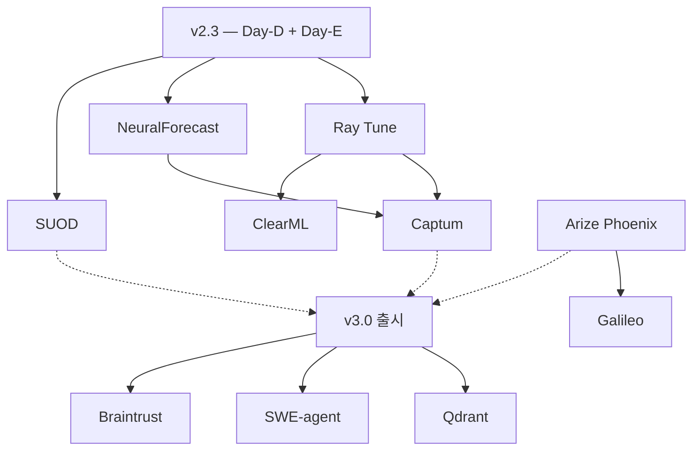

# ADA v3 백로그 — 중기·장기 도구 도입 명세

> 작성일: 2026-05-19 (v2.3)
> 권위: `TOOL_CATALOG_2026.md` §10 의 🟢 중기 5종 + ⚪ 장기 5종 = **10개 도구**의 도입 명세.
> 본 문서는 v3.0 (중기) / v3.1+ (장기) 스프린트의 작업지시서 기초.

---

## 0. 개요

ADA v2.2 (감사 보강) + v2.3 (즉시·단기 도구 도입) 완료 후 다음 단계로 진행할 10개 도구의 도입 우선순위·전제조건·산출물·위험을 정리한다.

---

## A. 🟢 중기 5종 (v3.0)

성능 최적화 + 설명 가능성 강화. v3.0 의 핵심.

### A.1 Ray Tune — 분산 HPO

- **선택 이유**: Optuna 단일 워커 → 분산 워커. Multi-trial 병렬, ASHA/PBT 스케줄러.
- **전제조건**: GPU 노드 ≥ 2개 또는 CPU 노드 ≥ 4개. Ray 클러스터(Ray on K8s 또는 docker-compose ray-head/worker).
- **산출물**:
  - `docker/ray-head/`, `docker/ray-worker/` 컨테이너
  - `agents/tuner_ray.py` — Ray Tune 백엔드 (FLAML 의 분산 모드 활용 가능)
  - `pipelines/training/ray_executor.py` — TrainingExecutor 분산 모드
- **통합**: Day08 TrainingExecutor 가 `ray_executor.is_available()` 시 자동 전환, 미가용 시 단일 워커 폴백.
- **위험**: Ray 버전 → PyTorch 버전 호환. 클러스터 셋업 학습 곡선. 시리얼라이즈 오류 빈번.
- **연계 룰**: R-1101 — 학습 시간 > 10분 예상 시 자동 Ray Tune 분산 모드 권고.

### A.2 NeuralForecast — 딥러닝 시계열 40+

- **선택 이유**: NHITS·TiDE·TimesNet 등 최신 모델. TRANSFORMER_REGISTRY 확장.
- **전제조건**: GPU. PyTorch Lightning 호환.
- **산출물**:
  - `pipelines/timeseries/neuralforecast_models.py` — 40+ 모델 등록
  - `TRANSFORMER_REGISTRY["timeseries"]` 확장 → 8 → 15+ 모델
- **통합**: Day12 TRANSFORMER_REGISTRY 에 NHITS·TiDE·TimesNet 추가. ModelSelectionAgent 가 데이터 크기·계절성에 따라 자동 추천.
- **위험**: 라이브러리 의존성 충돌 (pytorch-forecasting, neuralforecast, gluonts 동시 사용 시).
- **연계 룰**: R-1102 — TimeseriesPipeline 의 딥러닝 후보는 NeuralForecast 우선 (단일 진입점).

### A.3 Captum — PyTorch 해석성

- **선택 이유**: TabTransformer / FTTransformer / Informer / TFT 등 PyTorch 모델 attention/IG 시각화.
- **전제조건**: 모델이 PyTorch nn.Module 이어야 함.
- **산출물**:
  - `agents/explainability_captum.py` — TreeExplainer / KernelExplainer 대안 경로
  - `reports/dashboard/attention_viz.py` — Plotly 기반 attention heatmap
- **통합**: Day11 ExplainabilityAgent 가 모델 타입에 따라 SHAP(트리) vs Captum(트랜스포머) 자동 분기.
- **위험**: Captum 의 일부 알고리즘은 매우 느림(수십 분). 샘플링 전략 필수.
- **연계 룰**: R-1103 — PyTorch 트랜스포머 모델 해석은 Captum 우선.

### A.4 Arize Phoenix — 임베딩 드리프트 + RAG 품질

- **선택 이유**: Langfuse 와 보완. RAG 청크 품질·임베딩 드리프트 시각화.
- **전제조건**: OTel 인스트루멘테이션 (Day-D Langfuse 와 동일 인프라).
- **산출물**:
  - `docker-compose.phoenix.yml`
  - `monitoring/phoenix/dashboards.json`
  - SelfLearningAgent 가 Phoenix 에 임베딩 export
- **통합**: Day19 SelfLearning 의 dataset_embeddings → Phoenix UMAP 시각화. 신규 잡 임베딩이 기존 군집에서 벗어나면 drift 알람.
- **위험**: Langfuse 와 기능 일부 중복 — Phoenix 는 임베딩·RAG 전문 / Langfuse 는 비용·트레이스 전문 분리.
- **연계 룰**: R-1104 — pgvector 임베딩 분포 변화 > 임계 시 Phoenix 알람 + audit_log.

### A.5 SUOD — 대규모 이상탐지 가속화

- **선택 이유**: PyOD 다중 탐지기 병렬 + 근사 예측. 100만 행+ 데이터 OK.
- **전제조건**: Day-D 의 PyOD v3 도입 완료.
- **산출물**:
  - `pipelines/anomaly/suod_wrapper.py`
  - 데이터 크기 ≥ 100,000 행 시 자동 SUOD 전환
- **통합**: Day12 AnomalyPipeline 에 SUOD 백엔드 옵션. Celery training 큐 부하 감소.
- **위험**: PyOD 버전 호환성.
- **연계 룰**: R-1105 — 데이터 ≥ 100k 행 + anomaly_detection 카테고리 시 SUOD 자동 활성화.

---

## B. ⚪ 장기 5종 (v3.1+)

인프라 전환 또는 운영 단계 필요. v3.1 이후 검토.

### B.1 Qdrant — 전용 벡터 DB

- **선택 이유**: pgvector 한계(고차원·대용량·필터링). HNSW + 페이로드 필터 + 하이브리드.
- **전제조건**: pgvector 사용량 한계 도달 시점 (예: 임베딩 ≥ 10M 행 또는 검색 p95 > 200ms).
- **마이그레이션**: pgvector → Qdrant 듀얼 라이트 → 검증 → 컷오버.
- **산출물**: `docker/qdrant/`, `shared/vector/qdrant_client.py`, 마이그레이션 스크립트.
- **위험**: 이중 운영 비용 (Postgres + Qdrant 둘 다 백업·DR 필요). 마이그레이션 중 데이터 불일치.
- **결정 기준**: 검색 p95 > 200ms 또는 임베딩 > 10M 시 도입 검토.

### B.2 ClearML — 실험·데이터·파이프라인 통합

- **선택 이유**: MLflow 가 실험 추적 위주 → ClearML 은 데이터 버전·파이프라인까지.
- **전제조건**: 데이터 버전 관리 요구 명확화 (현재는 OpenLineage Day08 보강만).
- **산출물**: ClearML 서버 컨테이너 + 클라이언트 통합 + MLflow 와 책임 분리 매트릭스.
- **위험**: MLflow 와 책임 영역 중복 → 한쪽 폐지 또는 명확 분리 결정 필요.
- **결정 기준**: 데이터 버전 분쟁(model A 가 학습한 정확한 데이터셋이 뭐였나) 발생 시.

### B.3 SWE-agent — 자동 코드 패치 에이전트

- **선택 이유**: Day16 AutoErrorHandler 의 ‘read-only’ 한계 → 자율 코드 수정.
- **전제조건**: pending_patches 인간 검토 프로세스가 매우 안정적이고, 자동 패치 거버넌스 정책이 명확할 때.
- **산출물**: SWE-agent 컨테이너 + ‘Sandbox PR’ 자동 생성 + 인간 리뷰 큐.
- **위험**: 자율 코드 변경은 ADA 의 보안 정책(R-601, R-602)과 정면 충돌. 매우 신중한 도입 + 100% 인간 검토 유지.
- **결정 기준**: 30일 운영 후 pending_patches 큐가 안정적이고, 자동 패치 적용 성공률 > 80% 일 때.

### B.4 Braintrust — LLM 평가·회귀

- **선택 이유**: 27 에이전트 프롬프트 변경 시 회귀 자동 감지.
- **전제조건**: Day-E Guardrails 통합 + 평가 데이터셋 200건+ 준비.
- **산출물**: Braintrust 워크스페이스 + CI 통합 + 회귀 임계값 정책.
- **위험**: 데이터 외부 전송 (Braintrust SaaS). 사내 정책 검토 필수. OSS 옵션도 평가.
- **결정 기준**: 27 에이전트 운영 90일 후 프롬프트 회귀 사고 1건+ 발생 시.

### B.5 Galileo — 할루시네이션 모니터링

- **선택 이유**: InsightAgent 출력 품질 + RAG 신뢰도 자동 평가.
- **전제조건**: 사용자 피드백 라벨링 데이터셋 100건+.
- **산출물**: Galileo 워크스페이스 + InsightAgent 응답 자동 스코어링.
- **위험**: SaaS 의 데이터 전송 정책. Arize Phoenix 와 기능 중복 — 두 도구 책임 분리 매트릭스 필요.
- **결정 기준**: 사용자가 InsightAgent 결과를 ‘쓸 만한가’ 라벨링 시작 가능할 때.

---

## C. 도입 순서 및 의존성

---

## D. 결정 기록 (ADR 권고 주제)

본 백로그의 각 도구 도입 시 ADR(Architecture Decision Record) 작성 권고:

- ADR-1101: Ray Tune 도입 시 GPU 노드 수와 비용 분석
- ADR-1102: NeuralForecast vs 기존 TRANSFORMER_REGISTRY 책임 분리
- ADR-1103: Captum vs SHAP 어떤 모델에 어떤 도구 사용
- ADR-1104: Langfuse vs Arize Phoenix 책임 분리 매트릭스
- ADR-1105: SUOD 활성화 임계 (100k 행이 최적인가)
- ADR-1106: pgvector → Qdrant 마이그레이션 컷오버 시점
- ADR-1107: MLflow vs ClearML 책임 분리
- ADR-1108: SWE-agent 자동 패치 거버넌스 정책
- ADR-1109: Braintrust SaaS 데이터 전송 정책 (또는 OSS 대안)
- ADR-1110: Galileo vs Arize 책임 분리

---

## E. 비용·라이선스 요약 (장기 운영 기준)

| 도구 | 운영 비용/월 | 라이선스 | 데이터 외부 전송 |
|---|---|---|---|
| Ray Tune | $0 (셀프호스트) + GPU 비용 | Apache 2 | ✗ |
| NeuralForecast | $0 + GPU 비용 | Apache 2 | ✗ |
| Captum | $0 + GPU 비용 | BSD | ✗ |
| Arize Phoenix | $0 (OSS, 셀프호스트) | Apache 2 (Elastic 일부) | ✗ |
| SUOD | $0 | BSD | ✗ |
| Qdrant | $0 (OSS) 또는 Cloud 유료 | Apache 2 | OSS 셀프호스트 시 ✗ |
| ClearML | $0 (OSS) 또는 Hosted 유료 | Apache 2 | 셀프호스트 시 ✗ |
| SWE-agent | LLM 호출 비용 (높음) | MIT | API 호출 시 LLM 공급자에 코드 전송 |
| Braintrust | 유료 $$$ | Commercial (일부 OSS) | ✓ |
| Galileo | 유료 $$$ | Commercial | ✓ |

OSS 셀프호스트 가능한 도구를 우선. SaaS(Braintrust, Galileo)는 사내 데이터 거버넌스 정책 검토 후 도입.

---

## F. v3 백로그가 v2.3 명세에 미치는 영향

- v2.3 의 Day-D / Day-E 산출물은 v3 도입을 위한 ‘진입점’ 역할:
  - Langfuse (Day-D) → Arize Phoenix(v3) 호환 (둘 다 OTel)
  - PyOD v3 (Day-D) → SUOD(v3) 호환 (PyOD 기반)
  - FLAML (Day-E) → Ray Tune(v3) 호환 (FLAML 분산 모드)
  - StatsForecast (Day-E) → NeuralForecast(v3) 호환 (같은 Nixtla 생태계)
- 따라서 v2.3 통합이 v3 백로그 진입을 자연스럽게 만든다 — 추가 마이그레이션 비용 없음.
