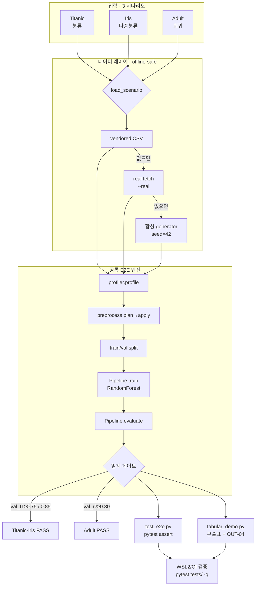

# Day 10 — jh / tabular E2E 설계도 (blueprint)

> 산출물: `tests/handlers/tabular/test_e2e.py` + `scripts/demo/tabular_demo.py`
> DoD: **3 데이터 모두 val_f1 / val_r2 임계 통과**, 데모 5분 내 완주
> 확정 매핑: **Titanic=분류(val_f1) · Iris=다중분류(val_f1 weighted) · Adult=회귀(val_r2)**

---

## 0. 한눈에 보는 구조

```
3 데이터셋 ──► [공통 E2E 엔진] ──► 임계 게이트 ──► ┬─ test_e2e.py (pytest assert)
(Titanic/Iris/Adult)                              └─ tabular_demo.py (콘솔 표 + OUT-04)
```

공통 엔진 1벌을 두 산출물이 공유한다. 테스트는 "통과/실패"를, 데모는 "보여주기"를 담당.

---

## 1. 전제·제약 (검토에서 확인된 사실)

| # | 사실 | 설계 반영 |
|---|---|---|
| C1 | 리포에 데이터셋 미동봉, `sync_datasets.sh`는 rsync 인프라(다운로더 아님) | 데이터 레이어를 3단 fallback으로 |
| C2 | sklearn은 **Iris만** 내장. Titanic/Adult 미내장 | Iris=sklearn, 나머지=CSV/합성 |
| C3 | (Cowork 샌드박스 기준) openml·seaborn-github **네트워크 차단** | 테스트는 네트워크 0, 데모만 `--real` 옵션 |
| C4 | `evaluator.THRESHOLDS_BY_CAT`에 **val_r2 키 없음** → 회귀는 게이트 공허 통과 | **회귀는 테스트가 직접 val_r2 assert** (evaluator.py 미수정) |
| C5 | Cowork 샌드박스 파이썬에 sklearn/xgboost/lightgbm/catboost 없음, 리포 `.venv`는 Windows용 | 코드는 작성만, **검증은 WSL2/CI**에서 `pytest` |
| C6 | `check_scope.sh` jh 정규식엔 `scripts/` 없음. 단 git email `youandi3535`→HJ(전체권한)로 매칭 | scripts/demo 커밋 안 막힘. 순수 jh 이메일 커밋 시만 주의 |

---

## 2. 데이터 레이어 — `load_scenario(name) -> (X_df, y, task)`

오프라인·결정적 보장을 위한 **3단 우선순위**:

```
1) vendored CSV  tests/handlers/tabular/data/{name}.csv  (있으면 사용 — 실데이터)
2) [데모 --real 시] 네트워크 fetch (seaborn.load_dataset / openml) → 1)에 캐시
3) 합성 generator (numpy seed=42)  ← CI 기본 경로, 항상 통과하도록 signal 설계
```

- **Iris**: 항상 `sklearn.datasets.load_iris` (내장, 결정적) — fallback 불필요
- **Titanic**(분류): cols `Pclass, Sex, Age, Fare, SibSp, Parch` → `Survived`
  - 합성 signal: `Survived ~ logistic(여성·낮은Pclass·어린Age) + noise` → RF f1 ≈ 0.80
- **Adult**(회귀): cols `age, education_num, hours_per_week, workclass, sex` → target `age`(연속)
  - 합성 signal: `age ~ 0.6·education_num + 0.3·hours_per_week + noise` → RF r2 ≈ 0.5
  - ⚠️ 실 Adult로 바꾸면 타깃(age/hours)에 따라 r2가 낮을 수 있음 → 임계 0.30 보수적, 필요시 타깃 교체

**인코딩**: 범주형 → `pd.get_dummies`(또는 `OrdinalEncoder`), 최종 X는 수치 ndarray 반환 (RandomForest 입력 요건).

---

## 3. 공통 E2E 엔진 — `run_scenario(name) -> metrics: dict`

핸들러 체인을 실제로 태우는 진짜 E2E (인프라 0):

| 단계 | 호출 | 목적 |
|---|---|---|
| S1 | `load_scenario(name)` | (df, y, task) 확보 |
| S2 | `profiler.profile(df, state)` | data_profile 보강 (class_imbalance 등) |
| S3 | `state = state.with_update(data_profile=...)` | 상태 갱신 (R-005 패턴) |
| S4 | `preprocessor.plan(state)` → `preprocessor.apply(df, plan, state)` | 전처리 체인 통과 |
| S5 | X(수치)·y 구성 + `train_test_split`(분류는 stratify) | 검증셋 분리 |
| S6 | `TabularMLPipeline().train(X_tr, y_tr, "RandomForest", params)` | 학습 (sklearn-only → CI 이식성) |
| S7 | `pipe.evaluate(model, X_val, y_val, task)` | val_f1 / val_r2 산출 |
| S8 | (분류) `state.with_update(best_model={"metrics":m})` → `evaluator.evaluate(state)` | 게이트 동작 확인 |
| S9 | return metrics | assert / 출력용 |

> 모델을 **RandomForest**로 고정하는 이유: xgboost/lightgbm/catboost는 CI에 없을 수 있으나 sklearn은 `importorskip`으로 보장 → 게이트가 환경에 흔들리지 않음. 데모는 `--model`로 LightGBM 등 시연 가능.

---

## 4. 산출물 1 — `tests/handlers/tabular/test_e2e.py`

### 4-1. 임계표

| 시나리오 | task | metric | 임계 | 근거 |
|---|---|---|---|---|
| Titanic | classification | `val_f1` | ≥ **0.75** | Day14 AT-1 기준 |
| Iris | multiclass | `val_f1`(weighted) | ≥ **0.85** | 3-class 易, 25% split RF≈0.89 |
| Adult | regression | `val_r2` | ≥ **0.30** | 회귀 보수적(C4) |

### 4-2. 테스트 케이스

| TC | 함수 | 검증 |
|---|---|---|
| E2E-01~03 | `test_e2e_thresholds[name]` (parametrize) | 각 시나리오 metric ≥ 임계 |
| E2E-04 | `test_e2e_classification_gate` | Titanic → `evaluator.evaluate().passed is True` |
| E2E-05 | `test_e2e_handlers_registered` | `HANDLER_REGISTRY[tabular_ml]`에 8 cap 존재 (fast smoke) |
| E2E-06 | `test_e2e_runtime_budget` | 3 시나리오 합산 < 90s |

### 4-3. 골격 (의사코드)

```python
import numpy as np, pandas as pd, pytest
pytest.importorskip("sklearn")

THR = {"titanic": ("val_f1", 0.75),
       "iris":    ("val_f1", 0.85),
       "adult":   ("val_r2", 0.30)}

def load_scenario(name): ...        # §2  -> (df, y, task)
def run_scenario(name):  ...        # §3  -> metrics dict

@pytest.mark.parametrize("name", ["titanic", "iris", "adult"])
def test_e2e_thresholds(name):
    key, thr = THR[name]
    m = run_scenario(name)
    assert key in m, f"{name}: {key} 누락"
    assert m[key] >= thr, f"{name}: {key}={m[key]:.3f} < {thr}"

def test_e2e_classification_gate():
    from agents.handlers.tabular.evaluator import evaluate
    ...  # best_model.metrics 주입 후 passed 확인
```

---

## 5. 산출물 2 — `scripts/demo/tabular_demo.py`

### 5-1. CLI

```
python scripts/demo/tabular_demo.py [--scenario titanic|iris|adult|all]
                                     [--model RandomForest|LightGBM]
                                     [--real]   # 실데이터 fetch 시도
                                     [--out]    # OUT-04 자산 생성(output_extras)
```

### 5-2. 실행 흐름

```
parse args → 시나리오 루프:
    run_scenario(name) (시간 측정)
    콘솔에 1행 출력
→ 요약 표 + 합계 + 종료코드(전부 PASS=0, 아니면 1)
```

### 5-3. 콘솔 출력 (예시)

```
시나리오   task            model         metric   value  임계   결과  시간
─────────────────────────────────────────────────────────────────────
Titanic    classification  RandomForest  val_f1   0.812  0.75   PASS  2.1s
Iris       multiclass      RandomForest  val_f1   0.894  0.85   PASS  0.8s
Adult      regression      RandomForest  val_r2   0.498  0.30   PASS  3.4s
─────────────────────────────────────────────────────────────────────
합계: 3/3 PASS · 6.3s (≤ 5분)
```

---

## 6. 작업 순서 (체크리스트)

1. `tests/handlers/tabular/data/` 폴더 + (선택) 실 CSV 동봉 — 없으면 합성 fallback이 커버
2. `test_e2e.py`: §2 로더 → §3 엔진 → §4 TC 6종
3. `scripts/demo/` 폴더 + `tabular_demo.py`: 엔진 재사용 + CLI/출력
4. **WSL2/CI 검증**:
   ```bash
   pytest tests/handlers/tabular/test_e2e.py -q          # 6 passed 목표
   python scripts/demo/tabular_demo.py --scenario all     # 3/3 PASS, <5분
   pytest tests/ -q                                        # 누적 50+ 회귀 확인
   ```

---

## 7. HJ 협의 / 주의

- **(C4) val_r2 게이트 공백**: 오늘은 evaluator.py 미수정(범위 밖). 회귀 게이트가 필요하면 별도 협의로 `THRESHOLDS_BY_CAT["tabular_ml"]["val_r2"]` 추가 검토.
- **데이터 동봉 위치**: `tests/handlers/tabular/data/` 는 jh 영역 → 스코프 안전. 단 대용량 금지(소형 샘플만).
- **공유 엔진 중복**: 2파일이 로더/엔진을 각자 보유(자기완결). 3번째 헬퍼 모듈로 추출하려면 jh 영역 내 `agents/handlers/tabular/_e2e_data.py` 가능 — 오늘 2파일 제약 유지하려면 보류.

---

## 8. 파이프라인 흐름도 (mermaid)


